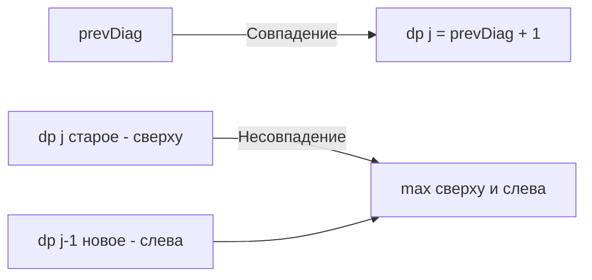

Задача Longest Common Subsequence (LCS) (LeetCode 1143) — это краеугольный камень строкового динамического программирования. Если в [[2. LCS и edit distance]] мы обсуждали теоретическую связь с редакционным расстоянием, то теперь мы спустимся на уровень железа и идиом Go, чтобы выжать максимум из этого алгоритма.

**Условие:** Даны две строки `text1` и `text2`. Вернуть длину их наибольшей общей подпоследовательности. Подпоследовательность — это последовательность символов, идущих в том же порядке, но не обязательно подряд.

В бэкенде LCS — это фундамент алгоритмов сравнения версий (diff), систем слияния веток кода и антиплагиата.

## Классический 2D DP (O(M\*N) памяти)

Логика проста: мы строим матрицу `dp`, где `dp[i][j]` — это LCS для префиксов `text1[0..i-1]` и `text2[0..j-1]`.
- Если символы совпадают: `dp[i][j] = dp[i-1][j-1] + 1`
- Если нет: `dp[i][j] = max(dp[i-1][j], dp[i][j-1])`

Наивная реализация с выделением `[][]int` размером $M \times N$ для строк в 1000 символов потребует слайса на 1 миллион элементов. Это около 8 МБ памяти в куче и серьезная работа для Garbage Collector. Для high-load сервисов, сравнивающих длинные логи или конфиги, такие аллокации на каждый запрос — приговор.

## Идиоматичный Go: O(min(M,N)) памяти

Мы можем сжать матрицу до одного 1D слайса, как обсуждалось в [[1. Теория. DP на строках]]. Главное правило оптимизации DP-памяти: **делайте 1D слайс по меньшему измерению**.

Если мы сделаем слайс по длине короткой строки (пусть $N$), то независимо от длины длинной строки ($M$), память будет $O(N)$. Кроме того, процессор будет обходить короткий слайс в кэше L1, что радикально ускорит работу.

```go
func longestCommonSubsequence(text1 string, text2 string) int {
    // Оптимизация: text1 всегда длиннее, слайс делаем по text2
    if len(text1) < len(text2) {
        text1, text2 = text2, text1
    }
    
    m, n := len(text1), len(text2)
    
    // dp[j] хранит значение для текущей строки i и столбца j
    dp := make([]int, n+1)
    
    for i := 1; i <= m; i++ {
        prevDiag := dp[0] // Хранит dp[i-1][j-1]
        for j := 1; j <= n; j++ {
            temp := dp[j] // Сохраняем старое dp[i-1][j] до перезаписи
            
            if text1[i-1] == text2[j-1] {
                dp[j] = prevDiag + 1
            } else {
                // dp[j] (старое) - значение сверху
                // dp[j-1] (новое) - значение слева
                if dp[j-1] > dp[j] {
                    dp[j] = dp[j-1]
                }
            }
            prevDiag = temp // На следующем шаге temp станет диагональю
        }
    }
    
    return dp[n]
}
```



> [!warning] Ловушка / Gotcha
> Главный враг при сжатии 2D матрицы до 1D — потеря диагонального значения `dp[i-1][j-1]`. Когда мы вычисляем `dp[j]`, предыдущее значение `dp[j-1]` уже обновлено (это новая строка), а старое `dp[j]` вот-вот будет перезаписано. Переменная `prevDiag` — это мостик, передающий значение по диагонали из прошлой итерации. Если вы забудете `temp := dp[j]` и `prevDiag = temp`, алгоритм начнет использовать мусорные данные.

## Mechanical Sympathy: Доступ к строкам и Кэш

Внутри цикла мы делаем `text1[i-1] == text2[j-1]`. В Go строки — это неизменяемые массивы байт. Индексация `s[i]` — это просто чтение по адресу `Data + i`. 

Поскольку мы итерируемся по `i` во внешнем цикле, а по `j` во внутреннем, доступ к `text2[j-1]` строго последователен. Процессор увидит линейное чтение памяти и начнет подгружать данные `text2` в L1 кэш гигантскими кусками (по 64 байта — размеру кэш-линии). Доступ к `text1[i-1]` внутри внутреннего цикла — это чтение одного и того же байта, который просто "зависнет" в регистре процессора. Это максимально эффективный паттерн доступа к памяти.

> [!info] Под капотом
> Условие LeetCode гарантирует, что строки состоят из строчных английских букв. Это позволяет нам сравнивать байты напрямую. 
> Если бы строка содержала Unicode (например, кириллицу или эмодзи), `len(string)` вернул бы количество байт, а не символов, и `text1[i-1]` мог бы вернуть лишь половину UTF-8 символа. В реальном бэкенде, сравнивая конфиги или имена пользователей, всегда нужно сначала конвертировать строки в `[]rune`, иначе LCS будет считать байты, а не символы. Конвертация требует $O(M+N)$ аллокаций, но без неё результат будет некорректным.

## System Design: Восстановление LCS (Hirschberg's Algorithm)

Часто бэкенду нужна не просто длина совпадения, а сама последовательность (например, подсветить совпадающие строки в UI мерж-реквеста).

С 1D слайсом мы стерли историю. Если мы вернем 2D матрицу, мы сможем восстановить путь обратным ходом от `dp[m][n]` к `dp[0][0]` за $O(M+N)$. Но это требует $O(M \cdot N)$ памяти.

Как быть, если файлы огромные? На помощь приходит **Алгоритм Хиршберга (Hirschberg's Algorithm)**.

Идея Хиршберга — комбинация DP и парадигмы "Divide and Conquer" (Разделяй и властвуй):
1. Мы делим `text1` пополам.
2. Запускаем прямой 1D DP для первой половины `text1` и обратный 1D DP для второй половины.
3. Находим такой индекс `j` в `text2`, где сумма прямого и обратного DP максимальна (это точка "раскола" пути).
4. Рекурсивно применяем алгоритм к левой и правой частям.

Этот алгоритм находит точный путь (саму LCS) за то же время $O(M \cdot N)$, но использует **строго $O(min(M,N))$ памяти**. Именно этот алгоритм лежит в основе утилиты `diff` в Unix-системах, когда память ограничена.

> [!tip] Собеседование
> Если вы решили задачу с 1D слайсом, интервьюер спросит: *"А как получить саму подпоследовательность?"*
> Ваш ответ должен продемонстрировать инженерный подход:
> *"Для коротких строк я бы сохранил полную 2D матрицу и сделал backtracking. Для production-системы с большими текстами я бы использовал алгоритм Хиршберга. Он комбинирует 1D DP и Divide & Conquer, позволяя восстановить путь за O(M*N) времени и всего O(min(M,N)) памяти, что критически важно для избежания OOM на сервере."*

## Итог

1. **Сжатие размерности:** LCS легко сжимается до 1D слайса. Главное — выбрать меньшую строку для размера слайса.
2. **Переменная `prevDiag`:** Ключ к сжатию 2D матрицы. Без неё вы потеряете диагональные зависимости.
3. **Строки в Go:** Для ASCII алгоритм работает с нулевыми аллокациями в куче. Для Unicode обязательна конвертация в `[]rune`.
4. **Алгоритм Хиршберга:** Если вам нужен не только размер, но и состав LCS при ограниченной памяти, Хиршберга — единственный правильный архитектурный выбор.

В следующей статье мы разберем еще одну классическую задачу строкового DP, где нужно считать количество способов составить строку: [[4. Distinct Subsequences]].