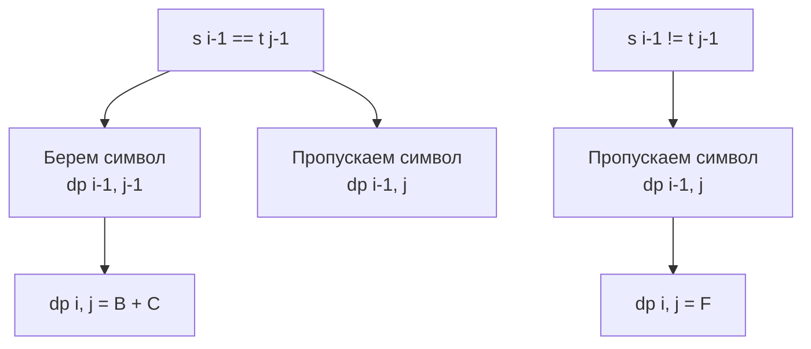

Задача Distinct Subsequences (LeetCode 115) переводит строковое DP из плоскости поиска совпадений в плоскость комбинаторики. Если в [[3. Longest Common Subsequence]] мы искали *длину* наибольшей подпоследовательности, то теперь нам нужно посчитать *количество способов* собрать строку `t` из символов строки `s`, удаляя часть символов (но не меняя порядок оставшихся).

**Условие:** Даны строки `s` и `t`. Вернуть количество различных подпоследовательностей `s`, которые равны `t`.

В бэкенде этот паттерн применяется в системах анализа потоков данных: например, сколько различных путей в логах микросервисов могли привести к конкретной ошибке, если часть промежуточных событий могла быть потеряна (log sampling).

## Формулировка DP: Выбор — брать или пропускать

Мы создаем матрицу `dp`, где `dp[i][j]` — это количество способов собрать префикс `t[0..j-1]` из префикса `s[0..i-1]`.

**База:**
- `dp[i][0] = 1`: Существует ровно 1 способ собрать пустую строку `t` из любой строки `s` — удалить все символы.
- `dp[0][j] = 0` (при `j > 0`): Невозможно собрать непустую строку `t` из пустой строки `s`.

**Переход:**
Для каждого символа `s[i-1]` у нас есть выбор:
1. **Пропустить:** Мы игнорируем `s[i-1]`. Тогда количество способов остается тем же, что и для `s[0..i-2]`: `dp[i-1][j]`.
2. **Взять (Match):** Если `s[i-1] == t[j-1]`, мы можем использовать этот символ. Тогда количество способов равно количеству способов собрать префиксы без этих символов: `dp[i-1][j-1]`.

Итоговая формула:
- Если `s[i-1] == t[j-1]`: `dp[i][j] = dp[i-1][j] + dp[i-1][j-1]`
- Иначе: `dp[i][j] = dp[i-1][j]`



> [!warning] Ловушка / Gotcha
> Кандидаты часто путают базовый случай. Почему `dp[i][0] = 1`, а не `0`? Пустая строка — это валидный результат. В математике существует ровно одна подпоследовательность длины 0 — пустое множество. Если вы инициализируете `dp[i][0] = 0`, вы обнулите все последующие сложения.

## Идиоматичный Go: Обратный обход (O(N) памяти)

Как и в LCS, мы можем сжать матрицу до 1D слайса `dp[j]`. Однако здесь нас ждет проблема: для вычисления `dp[j] = dp[j] + dp[j-1]` нам нужны значения с *предыдущей итерации внешнего цикла* (`dp[i-1][j]` и `dp[i-1][j-1]`).

Если мы пойдем стандартным путем (слева направо), обновив `dp[j-1]`, мы затрем значение `dp[i-1][j-1]`, которое понадобится для вычисления `dp[j]`.

В отличие от LCS, где мы вводили переменную `prevDiag`, здесь есть более элегантный трюк. Достаточно просто **изменить направление обхода внутреннего цикла на обратное** (справа налево, от `n` до `1`).

При обходе справа налево:
- `dp[j]` — это старое значение с прошлой строки (сверху), которое мы еще не успели перезаписать.
- `dp[j-1]` — это значение, которое было обновлено на *текущей* строке. Но так как `dp[i-1][j-1]` и `dp[i][j-1]` математически равны для нашей формулы (сдвиг по `i` не меняет суть, если мы идем справа), логика сохраняется.

```go
func numDistinct(s string, t string) int {
    m, n := len(s), len(t)
    
    // Оптимизация: если t длиннее s, собрать невозможно
    if n > m {
        return 0
    }
    
    // Используем int64 во избежание переполнения
    dp := make([]int64, n+1)
    
    // База: 1 способ собрать пустую строку
    dp[0] = 1
    
    for i := 1; i <= m; i++ {
        // ОБРАТНЫЙ обход! Критически важно для корректности in-place DP
        for j := n; j >= 1; j-- {
            if s[i-1] == t[j-1] {
                dp[j] = dp[j] + dp[j-1]
            }
            // Если не совпадает, dp[j] остается неизменным (эквивалент dp[i-1][j])
        }
    }
    
    return int(dp[n])
}
```

## Mechanical Sympathy: Переполнение и выбор типов

Задача Distinct Subsequences печально известна огромными промежуточными значениями. Для строк `s = "aaaaa..."` и `t = "aaa..."` количество комбинаций растет комбинаторно (числа Стирлинга, факториалы).

В Go тип `int` на 64-битных системах — это `int64`. Максимальное значение `int64` — около $9.2 \times 10^{18}$. На LeetCode есть тесты, которые могут переполнить даже `int64`! 

> [!info] Под капотом
> В распределенных системах (System Design) при подсчете кардинальностей или количества путей часто используют **Modulo Arithmetic** (взятие по модулю $10^9 + 7$). Если вы пишете микросервис для подсчета вероятностей маршрутов, всегда договаривайтесь о модульной арифметике в API контракте. В коде это выглядит как `dp[j] = (dp[j] + dp[j-1]) % MOD`. Это не только предотвращает overflow, но и делает время выполнения операций предсказуемым (отсутствие инструкций деления с плавающей точкой при переполнении).

## Обратный обход и Кэш процессора

Почему обратный обход так важен для CPU?

Представьте слайс `dp` в памяти. При обходе *слева направо* процессор читает `dp[j-1]`, который был только что записан. Он находится в текущей кэш-линии L1. Это быстро.

При обходе *справа налево* процессор также идет по памяти последовательно (просто в обратном направлении). Prefetcher в современных процессорах x86_64 отлично справляется с предсказанием обратного хода. Разница в производительности между прямым и обратным проходом по непрерывному слайсу минимальна (в пределах погрешности), но экономия на аллокациях (отсутствие `prevDiag` и матрицы) колоссальна.

## System Design: Маршрутизация событий

Как этот паттерн映射 (maps) в реальную инфраструктуру?

Представьте Distributed Tracing (OpenTelemetry). У вас есть жестко заданный паттерн аномалии `t` (например, "Timeout -> Retry -> 500 Internal Error"). И у вас есть сырой поток спанов от микросервиса `s`, где между этими событиями могли произойти тысячи других спанов (логи, метрики, промежуточные вызовы).

Алгоритм Distinct Subsequences позволяет за $O(M \cdot N)$ посчитать, сколько различных путей в графе вызовов могло привести к этому паттерну. Это используется для ранжирования алертов: если аномалия имеет только 1 путь (уникальная последовательность), это может быть разовым багом. Если путей 100 000 — это системная проблема архитектуры.

> [!tip] Собеседование
> Если вы пишете решение с обратным циклом, обязательно вслух прокомментируйте: *"Я обхожу массив справа налево, чтобы избежать перезаписи значения dp[j-1], которое понадобится для вычисления dp[j]. Это стандартный трюк для инлайн-оптимизации 2D DP, где dp[i][j] зависит от dp[i-1][j-1]"*. Это покажет интервьюеру, что вы понимаете механику состояний, а не просто запомнили код.

## Итог

1. **Комбинаторика:** Мы не ищем совпадения, мы суммируем количество способов (Skip + Take).
2. **База:** Пустая строка собирается ровно 1 способом. Ошибка здесь ломает всё.
3. **Обратный обход:** Чтобы сжать 2D матрицу до 1D слайса без дополнительных переменных (`prevDiag`), меняйте направление внутреннего цикла на обратное.
4. **Переполнение:** В задачах на подсчет способов используйте `int64` и операцию взятия по модулю, так как промежуточные числа могут превышать лимиты `int`.

В следующей статье мы перейдем к одной из самых сложных задач строкового DP, где появляется недетерминированный конечный автомат (НКА): [[5. Regular Expression Matching]].