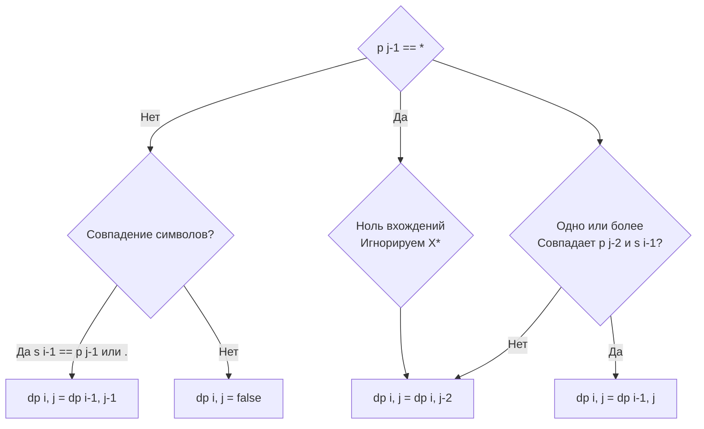

Задача Regular Expression Matching (LeetCode 10) — это Эверест строкового динамического программирования. Если в [[4. Distinct Subsequences]] мы просто считали комбинации, то здесь мы моделируем работу недетерминированного конечного автомата (НКА), обрабатывая квантификаторы (`*` — ноль или более вхождений).

**Условие:** Даны строки `s` и шаблон `p`. Реализовать поддержку `.` (один любой символ) и `*` (ноль или более предыдущего символа). Строка должна совпадать с шаблоном полностью.

В бэкенде эта задача — основа библиотек маршрутизации (роутеров вроде `gorilla/mux` или `chi`), валидации входящих конфигураций и систем парсинга логов. Понимание того, как работают регулярки под капотом, отличает Senior-разработчика от того, кто просто вызывает `regexp.MatchString`.

## Формулировка DP: Матрица состояний НКА

Мы создаем матрицу `dp`, где `dp[i][j]` означает: совпадает ли префикс строки `s[0..i-1]` с префиксом паттерна `p[0..j-1]`.

**База:**
- `dp[0][0] = true`: Пустая строка совпадает с пустым паттерном.
- `dp[i][0] = false`: Непустая строка не совпадает с пустым паттерном.
- `dp[0][j]`: Пустая строка может совпасть с паттерном, если он состоит из пар вида `X*` (которые могут отматывать себя до нуля). Например, `a*b*` совпадет с пустой строкой.

**Переходы:**
1. **Прямое совпадение или точка (`.`):** Если `p[j-1] == s[i-1]` или `p[j-1] == '.'`, то состояние наследуется по диагонали: `dp[i][j] = dp[i-1][j-1]`.
2. **Звездочка (`*`):** Она всегда идет в паре с предыдущим символом (`p[j-2]`). У нас есть два выбора:
   - **Ноль вхождений (Ignore):** Мы игнорируем пару `X*`. Тогда `dp[i][j] = dp[i][j-2]`.
   - **Одно или более вхождений (Consume):** Если `p[j-2]` совпадает с `s[i-1]` (или это `.`), мы "съедаем" символ из `s`, но паттерн остается на месте (звездочка может съесть еще): `dp[i][j] = dp[i-1][j]`.



## Идиоматичный Go: Два слайса вместо матрицы

При $M, N \le 20$ (типичные лимиты LeetCode) полная матрица `[][]bool` займет всего 400 байт. Но в реальных системах (например, проверка HTTP-заголовков по сложному паттерну) длина может достигать тысяч символов.

Мы можем сжать 2D матрицу до двух 1D слайсов (`prev` и `curr`), снизив память с $O(M \cdot N)$ до $O(N)$. Особенность перехода со звездочкой в том, что `dp[i][j-2]` ссылается на ту же строку `i` (то есть на уже вычисленный `curr[j-2]`), а `dp[i-1][j]` — на предыдущую строку (`prev[j]`). Это делает сжатие очень естественным.

```go
func isMatch(s string, p string) bool {
    m, n := len(s), len(p)
    
    prev := make([]bool, n+1)
    curr := make([]bool, n+1)
    
    // База: пустая строка и пустой паттерн
    prev[0] = true
    
    // База: пустая строка и паттерн вида a*b*c*
    for j := 2; j <= n; j++ {
        if p[j-1] == '*' {
            prev[j] = prev[j-2]
        }
    }
    
    for i := 1; i <= m; i++ {
        // Непустая строка не совпадает с пустым паттерном
        curr[0] = false 
        
        for j := 1; j <= n; j++ {
            if p[j-1] == '*' {
                // Вариант 1: ноль вхождений (откатываем паттерн на 2 символа)
                curr[j] = curr[j-2]
                
                // Вариант 2: одно или более вхождений 
                // (если предыдущий символ паттерна совпадает с текущим символом строки)
                if p[j-2] == '.' || p[j-2] == s[i-1] {
                    curr[j] = curr[j] || prev[j]
                }
            } else {
                // Прямое совпадение
                if p[j-1] == '.' || p[j-1] == s[i-1] {
                    curr[j] = prev[j-1]
                } else {
                    curr[j] = false
                }
            }
        }
        
        // Сдвигаем строки (swap)
        prev, curr = curr, prev
    }
    
    return prev[n]
}
```

> [!warning] Ловушка / Gotcha
> При использовании `swap` для сдвига строк (`prev, curr = curr, prev`), внутреннее содержимое слайса `curr` из предыдущей итерации никуда не девается, мы просто перезаписываем его нулевым индексом (`curr[0] = false`) и затем значениями по мере вычисления `j`. Это работает быстро, так как мы не аллоцируем новую память на каждой строке, а переиспользуем один и тот же буфер. В Go swap слайсов меняет местами только их заголовки (указатель, длина, capacity), что стоит ровно 3 присваивания.

## Mechanical Sympathy: Ветвления и Branch Misprediction

Алгоритм насыщен условиями `if p[j-1] == '*'`. Если паттерн содержит много звездочек вперемешку с обычными символами, предсказатель ветвлений (Branch Predictor) процессора будет страдать.

В отличие от простых строковых DP, где доступ к памяти линейный, здесь логика ветвится. Современные компиляторы (включая Go compiler) пытаются конвертировать такие `if-else` в инструкции `CMOV` (Conditional Move), чтобы избежать сброса конвейера (Pipeline Flush). Однако, если логика сложная (как случай с `*` и двумя зависимостями), компилятор может не смочь оптимизировать код, и задержка будет определяться количеством Branch Mispredictions.

> [!info] Под капотом
> Почему мы сравниваем `p[j-1] == '*'`, а не смотрим вперед? Потому что DP заполняется слева направо. Звездочка модифицирует состояние *предыдущего* символа. Анализ назад (`j-2`) в рамках вычисления текущей ячейки — это классический паттерн для регулярных выражений в DP, так как мы не знаем, будет ли текущий символ модифицирован звездочкой, пока не дойдем до нее.

## System Design: Почему Go regex безопасен (RE2)

Если вы придете на собеседование по System Design и вас спросят, как реализовать сервис валидации пользовательского ввода по регуляркам, ваш ответ должен учитывать уязвимость **ReDoS (Regular Expression Denial of Service)**.

В языках с поддержкой PCRE (Perl Compatible Regular Expressions — PHP, Python, Node.js) используется алгоритм с *обратным слежением (Backtracking)*. Паттерн вроде `(a+)+$` на строке `aaaaaaaaaaaaab` заставит интерпретатор перебирать миллионы комбинаций, забивая CPU на часы. Это классическая DDoS-атака на бэкенд.

Go использует библиотеку **RE2** (разработанную Google). RE2 основана на НКА (Недетерминированных конечных автоматах) без обратного слежения — по сути, на том же DP, который мы только что написали, или на Thompson NFA. 
Время работы RE2 *всегда* линейно зависит от длины строки ($O(M \cdot N)$). В Go невозможно написать регулярку, которая уйдет в экспоненциальный бэкtracking. За это Go платит отсутствием поддержки "жадных" lookahead/lookbehind assertions (операций `(?=...)`), которые требуют бэктрекинга.

> [!tip] Собеседование
> Решив задачу, добавьте: *"Этот алгоритм работает за O(M*N), что гарантированно защищает от ReDoS-атак. Именно так работает стандартный пакет regexp в Go — он использует Thompson NFA, отказываясь от бэктрекинга ради безопасности бэкенда. В высоконагруженных системах мы никогда не используем PCRE-библиотеки для парсинга внешнего ввода"*.

## Итог

1. **Моделирование автомата:** Звездочка (`*`) требует анализа двух вариантов: отбросить пару `X*` (взять значение `dp[i][j-2]`) или "съесть" символ (взять `dp[i-1][j]`).
2. **База с пустой строкой:** Пустая строка может совпадать с паттерном `a*b*`, это нужно инициализировать перед основным циклом.
3. **Сжатие памяти:** Мы можем использовать два 1D слайса и swap, так как зависимости текущей строки (`curr[j-2]`) и предыдущей (`prev[j]`) легко удовлетворяются.
4. **RE2 против PCRE:** Понимание того, что алгоритм DP/НКА защищает от ReDoS, — это прямой билет на Senior/Lead позицию, где безопасность инфраструктуры важнее синтаксического сахара.

В следующей статье мы разберем упрощенную версию этой задачи — шаблоны с `?` и `*` без экранирования предыдущего символа: [[6. Wildcard Matching]].