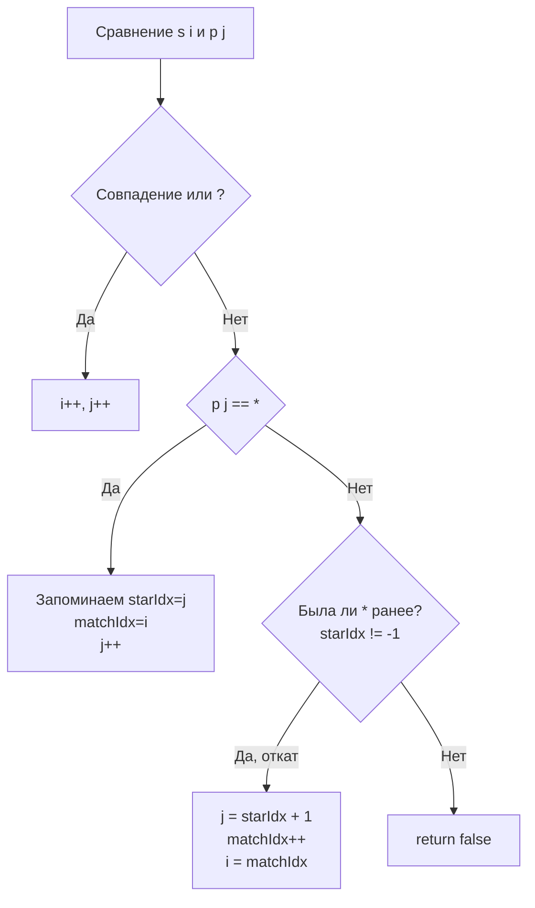

Задача Wildcard Matching (LeetCode 44) — это сестра задачи [[5. Regular Expression Matching]], но с другой философией. Если в регулярных выражениях звездочка `*` модифицирует предыдущий символ, то в глоббинге (wildcards) звездочка `*` — это самостоятельный символ, обозначающий **любую последовательность символов (включая пустую)**, а `?` — ровно один любой символ.

Для бэкенд-инженера это не абстрактная задача. Именно этот алгоритм лежит в основе маршрутизации запросов в API Gateway (например, роуты вида `/api/v1/*`), систем контроля доступа (IAM политики с wildcard-ами) и WAF (Web Application Firewall).

## Подход 1: DP (O(M*N) времени и памяти)

Как и в предыдущей задаче, мы можем построить матрицу `dp[i][j]`, где `dp[i][j]` означает, совпадает ли `s[0..i-1]` с `p[0..j-1]`.

**Переходы:**
1. Совпадение символов или `?`: `dp[i][j] = dp[i-1][j-1]`
2. Встречаем `*` в паттерне: у нас есть выбор. Либо `*` заменяет пустую строку (`dp[i][j-1]`), либо `*` поглощает текущий символ `s[i-1]` и остается на месте для поглощения следующих (`dp[i-1][j]`).
   Итого: `dp[i][j] = dp[i][j-1] || dp[i-1][j]`

Этот подход работает, но для строк длиной 10 000 символов матрица займет 100 миллионов булевых значений (100 МБ). Для высоконагруженного HTTP-роутера, который должен обрабатывать тысячи запросов в секунду, аллокация таких объемов на каждый запрос — это гарантированный OOM и деградация latency.

## Подход 2: Жадный алгоритм с откатом (O(M+N) времени, O(1) памяти)

Ключевое архитектурное отличие Wildcard Matching от Regex Matching в том, что `*` не привязана к предыдущему символу. Это позволяет нам использовать жадный подход (Greedy) с двумя указателями, отказавшись от DP вообще.

**Алгоритм:**
Мы используем два указателя: `i` для строки `s` и `j` для паттерна `p`. Также нам нужны переменные для сохранения позиции последней звездочки (`starIdx`) и позиции в строке `s`, где мы были, когда встретили эту звездочку (`matchIdx`).

1. Если символы совпадают или `p[j] == '?'`, двигаем оба указателя.
2. Если `p[j] == '*'`, запоминаем позицию звездочки и текущую позицию в `s`. Двигаем указатель паттерна `j`. (Мы *предполагаем*, что звездочка заменяет пустую строку).
3. Если несовпадение, но мы *уже видели звездочку*: это значит, что наше предположение было неверным, и звездочка должна поглотить больше символов. Мы откатываем указатель паттерна `j` к символу после звездочки, а указатель строки `matchIdx` сдвигаем на 1 (звездочка поглощает этот символ). `i` становится равным `matchIdx`.
4. Если несовпадение и звездочки не было — `false`.

```go
func isMatch(s string, p string) bool {
    i, j := 0, 0
    starIdx, matchIdx := -1, 0
    
    for i < len(s) {
        // 1. Прямое совпадение или '?'
        if j < len(p) && (p[j] == '?' || p[j] == s[i]) {
            i++
            j++
        // 2. Встретили звездочку: запоминаем состояние
        } else if j < len(p) && p[j] == '*' {
            starIdx = j
            matchIdx = i
            j++ // Пытаемся считать, что * это пустая строка
        // 3. Несовпадение, но есть звезда для отката
        } else if starIdx != -1 {
            // Откатываемся: звезда поглощает текущий символ s[i]
            j = starIdx + 1
            matchIdx++
            i = matchIdx
        // 4. Несовпадение и отката нет
        } else {
            return false
        }
    }
    
    // Если строка закончилась, паттерн валиден, только если оставшиеся символы - звездочки
    for j < len(p) && p[j] == '*' {
        j++
    }
    
    return j == len(p)
}
```



## Mechanical Sympathy: Стек и регистры против Кучи

Сравним подходы на уровне железа.

**DP подход:** Требует аллокации слайса (или матрицы) в куче (Heap). Заполнение матрицы вызывает хаотичные Cache Miss при переходе между строками. Garbage Collector должен сканировать и очищать эту память после каждого вызова функции.

**Greedy подход:** Переменные `i`, `j`, `starIdx` и `matchIdx` — это примитивные типы `int`. Компилятор Go (через Escape Analysis) разместит их **на стеке горутины** или даже в аппаратных регистрах процессора.
- Нет аллокаций в куче (Zero Allocations).
- Нет работы для GC.
- Доступ к регистрам занимает 0 тактов.
- Последовательный проход по строкам `s` и `p` вызывает идеальный Prefetching в L1/L2 кэше процессора.

Для API Gateway, обрабатывающего 50,000 RPS, разница между аллокацией 100 МБ на каждый запрос (DP) и нулевой аллокацией (Greedy) — это разница между работающим кластером и OOM Kill.

> [!info] Под капотом
> Почему жадный алгоритм работает для Wildcard, но не работает для Regex (где `*` модифицирует предыдущий символ)?
> В Regex паттерн `a*` может быть частью `a*ab`. Если мы жадно "съедим" все буквы 'a' строкой `a*`, то для `ab` символов не останется. Нам придется делать backtracking по самой строке.
> В Wildcard `*` не привязана к символу. Если мы нашли `*`, мы знаем, что она может сожрать всё до конца строки. Если последующий паттерн не совпал, мы просто откатываемся к `*` и заставляем её сожрать на один символ больше. Это линейный откат, который гарантированно находит соответствие за $O(M)$ в худшем случае на один блок с `*`.

## System Design: Маршрутизация в API Gateway

В реальных системах (Kong, Traefik, Nginx) роутинг конфигурируется десятками тысяч правил. Если приходит запрос `/users/123/profile`, система не может прогонять его через $O(M \cdot N)$ DP для каждого паттерна `/users/*/profile`, `/users/*`, `/*`.

Архитектурно эта задача решается через **Trie (префиксное дерево)**. Символ `*` в таком дереве представляет собой специальный край (edge), который захватывает весь оставшийся путь (Catch-all parameter).

Жадный алгоритм matching-а применяется только на конечном узле дерева (Node), когда кандидат на маршрут уже найден за $O(K)$, где $K$ — длина URL. Это позволяет сопоставлять URL с wildcard-паттернами за микросекунды.

> [!warning] Ловушка / Gotcha
> В Go встроенный пакет `path.Match` использует именно алгоритм glob matching. Однако он не поддерживает `**` (doublestar) для рекурсивного поиска во всех поддиректориях. Если вы пишете систему файлового мониторинга или продвинутый WAF, вам придется использовать сторонние библиотеки (например, `github.com/bmatcuk/doublestar`), которые реализуют расширенный вариант жадного алгоритма с поддержкой `**`.

## Итог

1. **DP vs Greedy:** Для Wildcard Matching жадный алгоритм с откатом всегда лучше DP в бэкенде. Он снижает сложность по времени до $O(M+N)$ в среднем, а по памяти — до $O(1)$.
2. **Механика отката:** Запоминание позиции `*` и позиции в строке позволяет алгоритму "расширять" действие звездочки только при необходимости (ленивое вычисление через откат).
3. **Zero Allocations:** Отказ от матрицы в пользу указателей на стеке делает алгоритм идеально подходящим для high-load систем без давления на GC.
4. **Архитектура роутинга:** В продакшене matching не применяется в лоб. Он работает в связке с Trie-деревьями для быстрого отсева нерелевантных паттернов.

На этом мы завершаем раздел динамического программирования на строках. Мы увидели, как от простых подпоследовательностей (LCS) мы перешли к комбинаторике (Distinct Subsequences), а затем к моделированию конечных автоматов (Regex и Wildcards). Следующий раздел переносит DP из плоскости массивов и строк в графы и деревья: [[1. Теория. DP на деревьях]].