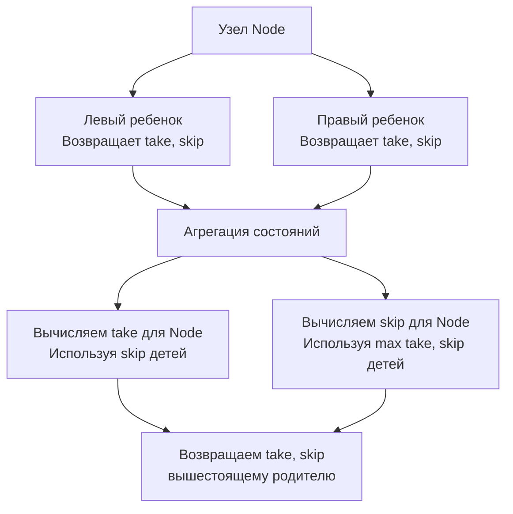

Переход от динамического программирования на массивах и строках к DP на деревьях — это качественный скачок. Если в массивах мы привыкли итерироваться "снизу вверх" (Bottom-Up), заполняя слайсы последовательно, то на деревьях такой подход невозможен. Дерево — это нелинейная структура, и единственный способ элегантно вычислить DP-состояние узла — узнать состояния его потомков.

По сути, **DP на деревьях — это всегда обход в глубину (Post-order DFS)**. Мы опускаемся до листьев (база DP), вычисляем их состояния, а затем "всплываем" наверх, агрегируя результаты (переход DP). 

Для бэкенд-инженера деревья — это повседневность: файловые системы, DOM/XML/HTML парсинг, иерархии сотрудников, каталоги товаров и, самое главное, индексы в базах данных (B-деревья).

## Анатомия DP-обхода: Состояния и Переходы

В задачах на деревьях состояние `dp(node)` редко выражается одним числом. Поскольку узел связан с родителем, наш выбор в текущем узле (например, "брать ли значение узла") влияет на то, что может сделать родитель.

Отсюда возникает **паттерн конечного автомата на узле**, который мы обсуждали в [[2. Базовые паттерны]]. Обычно мы возвращаем из рекурсии два значения:
1. `take`: Оптимальный результат, если мы **включаем** текущий узел в ответ.
2. `skip`: Оптимальный результат, если мы **исключаем** текущий узел.

Родитель, получив эти два значения от детей, принимает решение для себя. Это чистая функция перехода состояний.



## Under the Hood: Стек горутины и отсутствие TCO

В функциональных языках (Haskell, Scala) или в C++ с оптимизацией компилятора часто используется TCO (Tail Call Optimization) — компилятор превращает рекурсию в цикл, не увеличивая стек. 

**В Go нет TCO.** Каждый вызов функции DFS создает новый кадр стека (Stack Frame). Изначально горутина получает стек в 2 КБ (в современных версиях Go 1.21+ — 4 КБ или 8 КБ). 

Если дерево сильно несбалансировано (вырождается в связный список из 100 000 элементов), глубина рекурсии составит 100 000. Рантайм Go будет вынужден многократно вызывать `runtime.morestack`, аллоцировать новый стек в куче (размером до 1 ГБ лимита) и копировать туда старые кадры. Это вызывает **огромные задержки (latency spikes)** и давление на GC.

> [!warning] Ловушка / Gotcha
> На собеседовании всегда уточняйте, сбалансировано ли дерево. Если вы пишете рекурсивный DFS для потенциально несбалансированного дерева в high-load сервисе, вы рискуете получить Stack Overflow или деградацию производительности из-за `morestack`. Для production-кода при работе с неглубокими деревьями используйте итеративный DFS с явным стеком (`[]*TreeNode`).

## Mechanical Sympathy: Pointer Chasing и Кэш-промахи

Деревья в Go (и в C/C++) реализуются через указатели: `Left *TreeNode`, `Right *TreeNode`. Это создает самую страшную проблему для современной архитектуры процессоров — **Pointer Chasing (погоня за указателями)**.

Узлы дерева аллоцируются в куче (Heap) в случайном порядке. Когда процессор читает `node.Left`, он загружает указатель из кэша, затем dereference-ит его и запрашивает совершенно другой участок памяти. Это гарантирует **Cache Miss** на каждом переходе (L1/L2 кэш не помогает, данные приходится тянуть из RAM, что занимает ~100 наносекунд).

> [!info] Под капотом
> Именно из-за Pointer Chasing индексы в базах данных (PostgreSQL, MySQL) реализованы не как бинарные деревья поиска (BST), а как **B-деревья (B-Trees)**. B-Tree имеет огромную ветвистость (до сотен детей в одном узле). Дети упакованы в один непрерывный массив (слайс). Когда процессор читает первый ключ узла B-Tree, он подгружает весь узел в L1 кэш целиком (по 64 байта кэш-линии). Поиск внутри узла происходит со скоростью L1 кэша. Если бы БД использовали BST, производительность упала бы в тысячи раз из-за случайного доступа к памяти.

## Идиоматичный Go: Множественные возвращаемые значения

В C++ или Java для возврата двух состояний DP из функции часто создают `struct` или `Pair`, что приводит к лишним аллокациям в куче. 

Go нативно поддерживает множественные возвращаемые значения. Компилятор Go оптимизирует их передачу через регистры процессора (на архитектуре x86_64 / ARM64), минуя стек или кучу. Это делает паттерн возврата `(take, skip int)` невероятно быстрым и zero-allocation.

```go
// Идиоматичный паттерн DP на деревьях в Go
func dfs(node *TreeNode) (take, skip int) {
    if node == nil {
        return 0, 0 // База
    }
    
    // Рекурсивно получаем состояния детей
    leftTake, leftSkip := dfs(node.Left)
    rightTake, rightSkip := dfs(node.Right)
    
    // Вычисляем состояния текущего узла
    take = node.Val + leftSkip + rightSkip // Если берем узел, дети не могут быть взяты
    skip = max(leftTake, leftSkip) + max(rightTake, rightSkip) // Если пропускаем, берем лучший вариант детей
    
    return take, skip
}
```

> [!tip] Собеседование
> Когда вам дают задачу на дерево, первый вопрос: *"Могу ли я предположить, что дерево сбалансировано?"*.
> Второй шаг: озвучьте, что вы будете использовать Post-order DFS, так как это эквивалент Bottom-Up DP на деревьях.
> Третий шаг: напишите функцию, возвращающую кортеж состояний `(take, skip)`. Это покажет, что вы понимаете суть DP (зависимость от подзадач), а не просто пишете "жадный" обход, который почти всегда ошибочен в таких задачах.

## System Design: Расчет квот и иерархии

В распределенных файловых системах (HDFS, S3) или в системе прав доступа (IAM) иерархии представлены деревьями. 

Представьте задачу: рассчитать общий объем данных в директории (du command) или максимальный размер файла в поддереве. Это чистое DP на деревьях. 

Но в распределенных системах дерево может не помещаться в память одной машины. Тогда Post-order DFS распараллеливается: мы запускаем вычисления на листьях (Map), они возвращают свои состояния, а промежуточные узлы агрегируют их (Reduce). По сути, DP на деревьях лежит в основе парадигмы **MapReduce**, где дерево вычислений динамически строится от листьев к корню.

## Итог

1. **Post-order — это Bottom-Up:** DP на деревьях всегда опирается на результаты детей. Поэтому обход происходит в глубину (DFS), а состояния вычисляются на этапе "всплытия" (Post-order).
2. **Конечный автомат узла:** Одного значения часто недостаточно. Возвращайте состояния `take` и `skip`, чтобы родитель мог корректно принять решение.
3. **Стек горутины:** В Go нет TCO. Глубокая рекурсия на несбалансированных деревьях убьет производительность через `runtime.morestack`. Используйте итеративный обход с явным стеком для production-кода.
4. **Pointer Chasing:** Обход деревьев — это миллионы Cache Miss. В базах данных от BST перешли к B-Tree именно ради локальности кэша.

В следующей статье мы распространим паттерны DP с деревьев на произвольные графы, где появляются новые вызовы — циклы и топологическая сортировка: [[2. DP на графах]].