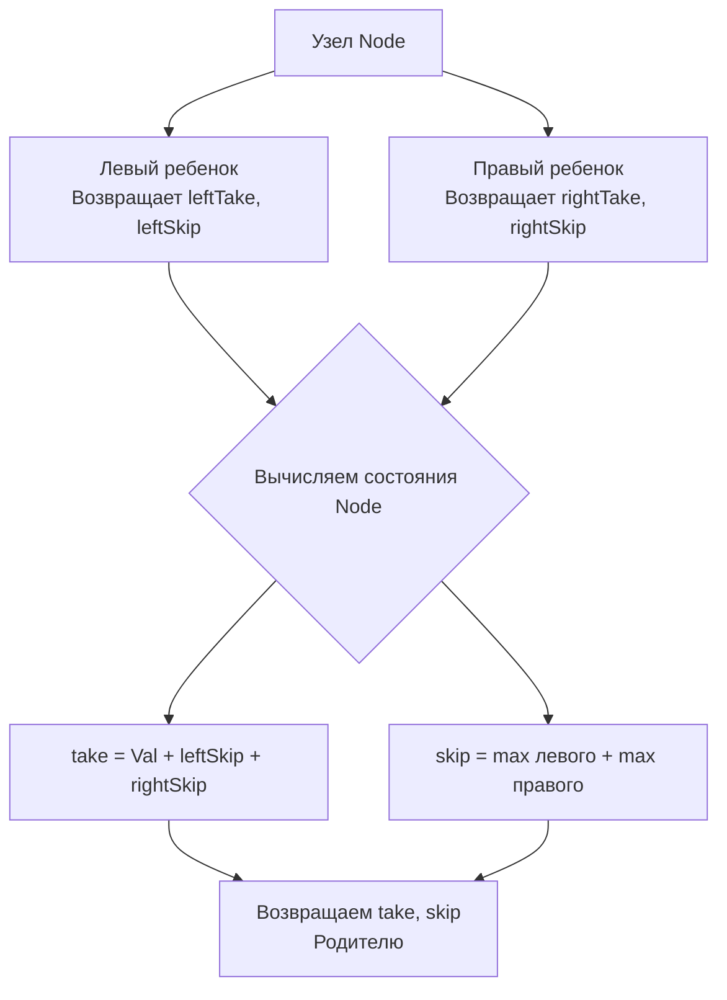

Задача House Robber III (LeetCode 337) — это триумф паттерна, который мы обсуждали в [[1. Теория. DP на деревьях]]. Если в [[4. House Robber]] мы работали с линейным массивом, то теперь дома расположены в бинарном дереве, и мы не можем ограбить два напрямую связанных узла (родителя и ребенка).

Эта задача — идеальный пример того, как слепое применение рекурсии приводит к экспоненциальному краху, а правильный выбор состояния DP (конечный автомат узла) превращает хаос в элегантное линейное решение.

**Условие:** Дано бинарное дерево, представляющее дома. Нельзя грабить два дома, соединенных ребром. Найти максимальную сумму, которую можно украсть.

В бэкенде это моделирует задачу выбора узлов в иерархической системе (например, распределение задач по серверам в rack-топологии), где соседние узлы шарят один и тот же ресурс (блокировку, сетевой интерфейс или БД) и не могут быть активны одновременно.

## Наивный подход: Экспоненциальный кошмар

Первая мысль: напишем DFS, который возвращает максимальную прибыль для поддерева.

```go
// ОШИБОЧНЫЙ И МЕДЛЕННЫЙ ПОДХОД
func robNaive(root *TreeNode) int {
    if root == nil { return 0 }
    
    // Если грабим текущий узел, пропускаем детей, берем внуков
    take := root.Val
    if root.Left != nil {
        take += robNaive(root.Left.Left) + robNaive(root.Left.Right)
    }
    if root.Right != nil {
        take += robNaive(root.Right.Left) + robNaive(root.Right.Right)
    }
    
    // Если не грабим, берем максимум из детей
    skip := robNaive(root.Left) + robNaive(root.Right)
    
    return max(take, skip)
}
```

> [!warning] Ловушка / Gotcha
> Этот код имеет временную сложность $O(N^2)$ в среднем и $O(2^N)$ для вырожденного дерева. Почему? Потому что вызов `robNaive(root.Left)` вычисляет всё поддерево, а затем мы делаем это *снова*, когда запрашиваем `root.Left.Left`. Перекрывающиеся подзадачи вычисляются заново на каждом шаге вверх по дереву. На дереве из 1000 узлов этот алгоритм не завершится за разумное время.

## Идиоматичный Go: Конечный автомат (O(N) времени)

Решение — возвращать из DFS не одно число, а **оба состояния** текущего узла. Как и в 1D DP, мы используем паттерн "Взять/Пропустить" (Take/Skip).

Для каждого узла мы возвращаем два значения:
1. `take`: Максимальная прибыль, если мы **грабим** текущий узел. (Тогда дети гарантированно пропущены, мы берем их `skip`).
2. `skip`: Максимальная прибыль, если мы **пропускаем** текущий узел. (Тогда дети могут быть как ограблены, так и пропущены — берем `max(take, skip)` для каждого ребенка).

Go великолепно подходит для этого паттерна благодаря множественным возвращаемым значениям. Компилятор Go на архитектуре x86_64 передает небольшие кортежи (до нескольких `int`) напрямую через регистры процессора (например, RAX, RBX), минуя стек и кучу.

```go
func rob(root *TreeNode) int {
    take, skip := dfs(root)
    if take > skip {
        return take
    }
    return skip
}

// Возвращаем (take, skip) для поддерева node
func dfs(node *TreeNode) (int, int) {
    if node == nil {
        return 0, 0 // База
    }
    
    leftTake, leftSkip := dfs(node.Left)
    rightTake, rightSkip := dfs(node.Right)
    
    // Если берем текущий узел, дети должны быть пропущены
    take := node.Val + leftSkip + rightSkip
    
    // Если пропускаем текущий узел, выбираем лучший вариант для детей
    var maxLeft, maxRight int
    if leftTake > leftSkip { maxLeft = leftTake } else { maxLeft = leftSkip }
    if rightTake > rightSkip { maxRight = rightTake } else { maxRight = rightSkip }
    skip := maxLeft + maxRight
    
    return take, skip
}
```



## Mechanical Sympathy: Escape Analysis и Куча

Обратите внимание, что мы не создаем структур типа `type State struct { Take, Skip int }`. Мы возвращаем примитивы.

> [!info] Под капотом
> Если бы мы создавали `struct` и возвращали указатель `*State`, компилятор Go был бы обязан аллоцировать объект в куче (Heap), так как указатель покидает область видимости функции. Это привело бы к тысячам аллокаций и колоссальному давлению на Garbage Collector.
> 
> Возвращая два `int` по значению, мы даем компилятору гарантию, что данные не "убегут" (Escape Analysis возвращает `did not escape`). Значения остаются на стеке горутины или в регистрах CPU. Для дерева из 100 000 узлов это разница между работой за 2 мс и работой за 50 мс с паузами GC.

## Pointer Chasing: Проблема пространственной локальности

В отличие от массивов, где `dp[i]` и `dp[i+1]` лежат в памяти рядом (в одной кэш-линии 64 байта), узлы дерева в Go разбросаны по куче. 

Когда мы делаем `node.Left`, процессор загружает указатель (8 байт). По этому указателю он находит структуру `TreeNode`, которая содержит указатели на `Val`, `Left` и `Right`. Это **Pointer Chasing** (погоня за указателями). На каждом переходе процессор с вероятностью 90% промахивается мимо L1/L2 кэша (Cache Miss) и идет в оперативную память (RAM), что стоит ~100 наносекунд.

Именно поэтому рекурсивный DFS на дереве работает медленнее, чем итеративный обход массива, даже если асимптотика одинакова — $O(N)$. Железо просто простаивает в ожидании данных из RAM.

## System Design: Выбор лидера в Rack-топологии

В распределенных системах, таких как Cassandra или Consul, узлы объединяются в топологию дерева (ряды стойки -> стойки -> дата-центры). 

Если вам нужно выбрать узлы для выполнения тяжелой задачи репликации или бэкапа, но узлы в одной стойке (rack) используют общую шину питания или сетевой свитч (и вы не хотите перегружать свитч), вы решаете задачу House Robber на дереве. 
Алгоритм `take/skip` выберет оптимальный набор узлов по всему кластеру, гарантируя, что ни один родительский и дочерний узел (в терминах иерархии топологии) не будут перегружены одновременно.

> [!tip] Собеседование
> Если вы решаете эту задачу, обязательно скажите: *"Наивный DFS с вызовом внуков — это антипаттерн, так как он экспоненциален из-за перекрывающихся подзадач. Я буду возвращать два состояния из каждого узла: взять и пропустить. Это позволяет мне вычислить ответ за один Post-order обход (O(N) времени), и так как я возвращаю значения по значению, а не через указатели на структуру, я избегаю аллокаций в куче и давления на GC."*

## Итог

1. **Двойное состояние:** На деревьях всегда возвращайте из рекурсии все состояния, необходимые родителю для принятия решения. Одного значения недостаточно.
2. **Take/Skip:** Если берем узел, дети пропущены (`skip`). Если пропускаем, дети свободны в выборе (`max(take, skip)`).
3. **Zero Allocations:** Использование множественных возвращаемых значений в Go вместо указателей на структуры позволяет компилятору разместить данные на стеке или в регистрах.
4. **Pointer Chasing:** Обход дерева всегда медленнее обхода массива на уровне железа из-за случайного доступа к памяти.

В следующей статье мы рассмотрим еще одну классическую задачу DP на деревьях, где путь может изгибаться и проходить через корень: [[4. Binary Tree Maximum Path Sum]].