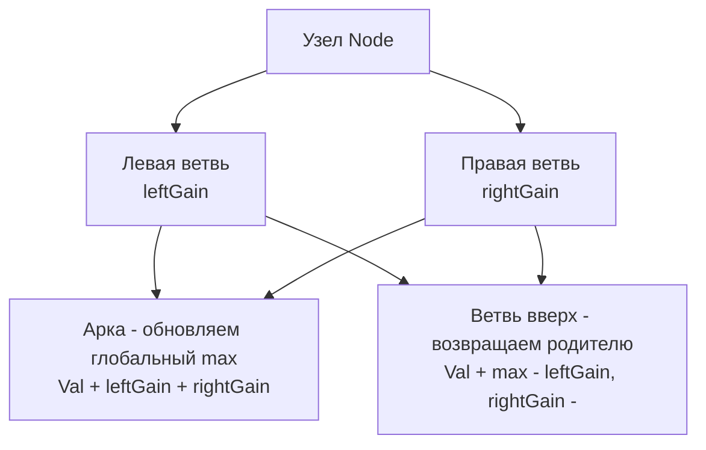

Задача Binary Tree Maximum Path Sum (LeetCode 124) — это вершина сложности DP на деревьях. Если в [[3. House Robber III]] мы просто решали, берем узел или пропускаем, то здесь нам приходится иметь дело с "изгибающимися" путями. Путь в дереве больше не обязан идти строго от корня к листу; он может начаться в левом поддереве, пройти через корень и уйти в правое.

**Условие:** Путь в бинарном дереве — это любая последовательность узлов, где каждые два соседних узла соединены ребром. Путь должен содержать хотя бы один узел. Найти максимальную сумму пути.

В бэкенде эта задача моделирует поиск самого "узкого" места или самой дорогой цепочки зависимостей в иерархической системе, где сбой может распространяться как вверх, так и вниз по топологии (например, каскадные таймауты в дереве вызовов микросервисов).

## Инсайт: Ветвь (Branch) против Арки (Arch)

Главный концептуальный барьер в этой задаче — понять разницу между тем, что мы *возвращаем* родителю, и тем, что мы *обновляем* как глобальный максимум.

1. **Ветвь (Branch):** Это путь, который начинается где-то ниже и идет *строго вверх* через текущий узел к родителю. Родитель может продолжить этот путь. Следовательно, мы можем передать наверх либо `node.Val + leftGain`, либо `node.Val + rightGain`, либо только `node.Val` (если ветви отрицательные).
2. **Арка (Arch):** Это путь, который изгибается в текущем узле. Он идет из левого поддерева через узел в правое поддерево. **Родитель не может продолжить этот путь**, так как путь в дереве не может дважды проходить через один и тот же узел. Поэтому арку мы учитываем в глобальном максимуме, но наверх *не передаем*.



## Идиоматичный Go: Замыкания и Escape Analysis

Для хранения глобального максимума идеально подходят замыкания (closures) в Go. Мы объявляем переменную `maxSum` и используем её внутри локальной функции `dfs`. Это избавляет от необходимости создавать структуру или передавать указатель `*int` через аргументы.

```go
import "math"

func maxPathSum(root *TreeNode) int {
    // Инициализируем минимально возможным значением
    maxSum := math.MinInt32
    
    // Функция dfs возвращает "ветвь" (максимальный增益 gain для родителя)
    var dfs func(node *TreeNode) int
    dfs = func(node *TreeNode) int {
        if node == nil {
            return 0
        }
        
        // Рекурсивно получаем ветви от детей.
        // Если ветвь отрицательная, мы её отбрасываем (берем 0),
        // так как лучше начать путь с текущего узла, чем тянуть вниз убытки.
        leftGain := max(dfs(node.Left), 0)
        rightGain := max(dfs(node.Right), 0)
        
        // 1. Считаем "Арку" (путь через текущий узел)
        archPath := node.Val + leftGain + rightGain
        if archPath > maxSum {
            maxSum = archPath
        }
        
        // 2. Считаем "Ветвь" (путь вверх к родителю)
        // Мы можем передать только одну ветвь!
        branchPath := node.Val + max(leftGain, rightGain)
        
        return branchPath
    }
    
    dfs(root)
    return maxSum
}

func max(a, b int) int {
    if a > b { return a }
    return b
}
```

> [!warning] Ловушка / Gotcha
> Кандидаты часто совершают фатальную ошибку: возвращают `archPath` наверх родителю. Это нарушает определение пути в дереве. Если вы передали арку наверх, вы неявно предполагаете, что родитель может подключиться к узлу, из которого уже вышли две ветви, создавая "ромб" (цикл), что невозможно в дереве. Родителю можно передать строго одну линейную ветвь.

## Under the Hood: Escape Analysis Замыканий

Как компилятор Go обрабатывает переменную `maxSum` внутри `dfs`?

Поскольку анонимная функция `dfs` захватывает переменную `maxSum` из внешней области видимости и модифицирует её, компилятор Go не может разместить `maxSum` на стеке. Если бы она осталась на стеке, она была бы уничтожена после завершения `maxPathSum`, а `dfs` могла бы пережить функцию (например, если бы мы запустили её в горутине).

Поэтому **Escape Analysis принудительно перемещает `maxSum` в кучу (Heap)**.

> [!info] Под капотом
> Компилятор Go создает скрытую структуру (closure struct), содержащую указатель на `maxSum`, и передает указатель на эту структуру в `dfs` неявным аргументом. Каждое обновление `maxSum` внутри DFS — это запись в кучу (Write to Heap). Это медленнее, чем работа с регистрами/стеком, но для одного указателя влияние на GC минимально. Если бы мы реализовали это через аргумент `*int`, поведение Escape Analysis было бы идентичным.

## Mechanical Sympathy: Отбрасывание отрицательных ветвей

Строка `max(dfs(node.Left), 0)` — это не просто трюк для прохождения тестов LeetCode. Это глубокий архитектурный принцип.

В системном дизайне отрицательная ветвь — это каскадный сбой (Cascading Failure). Если микросервис A вызывает B, а B возвращает таймаут (отрицательный вклад в общую надежность), A не должен "протаскивать" этот таймаут выше, блокируя потоки. A должен изолировать сбой (Circuit Breaker) и вернуть свой собственный статус (0), либо обработать деградацию локально.

В контексте процессора вычисление `max(x, 0)` компилируется в инструкции `CMOV` (Conditional Move) или `TEST/JNS`, что исключает тяжелые ветвления (Branch Mispredictions) и работает за 1-2 такта на современных CPU.

## System Design: Топология вызовов и Trace Analytics

Представьте, что у вас есть дерево вызовов микросервисов (Distributed Trace). Каждый узел — это сервис, а `Val` — это время его ответа (latency) в миллисекундах. 

Вы хотите найти самый долгий сквозной путь (End-to-End latency) в вашей системе, учитывая, что запрос может параллелиться (fork-join). Алгоритм Maximum Path Sum находит "арку" — путь через общего предка, где два параллельных запроса суммируют свое время ожидания, создавая максимальную задержку для пользователя. Это помогает выявить архитектурные узкие места (bottlenecks), которые не видны при простом усреднении метрик.

> [!tip] Собеседование
> Если вы быстро решили задачу, интервьюер обязательно спросит: *"А что если значения в узлах могут быть любыми целыми числами?"*
> В нашей реализации `maxSum := math.MinInt32` может переполниться, если узлы содержат `math.MinInt64`. Всегда инициализируйте `maxSum` значением корня: `maxSum := root.Val`, либо используйте `math.MinInt64` (в Go 1.17+ можно `math.MinInt`). Это покажет ваше внимание к краевым случаям (Edge Cases) и переполнениям.

## Итог

1. **Ветвь против Арки:** Ветвь можно передать родителю (одна линия). Арка изгибается через узел и наверх не передается.
2. **Обрезка отрицательных весов:** `max(gain, 0)` — это Circuit Breaker в мире алгоритмов. Никогда не тяните вверх отрицательный вклад.
3. **Замыкания:** Использование локальных функций и захваченных переменных — идиоматичный способ хранения глобального состояния в DFS на деревьях в Go.
4. **Escape Analysis:** Компилятору придется вынести захваченную переменную в кучу. Для одного `int` это приемлемо, но не стоит захватывать целые слайсы в горячих путях.

В следующей статье мы разберем задачу, где паттерн префиксных сумм переносится на деревья, требуя совершенно нового подхода к поиску путей: [[5. Path Sum III]].