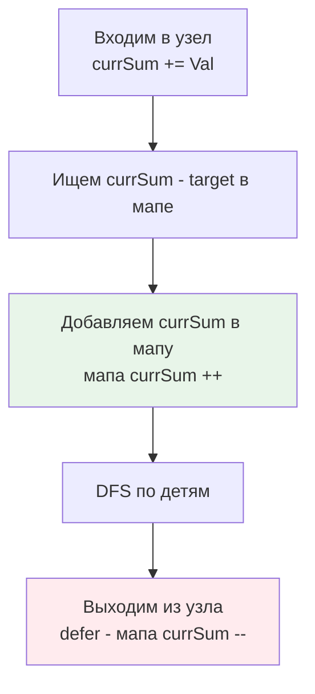

Задача Path Sum III (LeetCode 437) — это блестящий финал нашего раздела по DP на деревьях. Она объединяет концепцию из [[4. Binary Tree Maximum Path Sum]] (путь может начинаться и заканчиваться где угодно) с математическим паттерном из [[4. Subarray Sum Equals K]] (префиксные суммы). 

Это идеальный тест на то, понимает ли кандидат, как переносить алгоритмы из линейного мира (массивов) в нелинейный (деревья), и умеет ли он управлять состоянием при обходе в глубину.

**Условие:** Дано бинарное дерево и целое число `targetSum`. Найти количество путей, сумма значений узлов которых равна `targetSum`. Путь должен идти строго вниз (от родителя к потомку), но может начинаться и заканчиваться на любом узле дерева.

## Наивный подход: Двойной DFS (O(N^2))

Первая мысль — для каждого узла дерева запустить DFS, который считает сумму вниз. Это даст $O(N^2)$ времени. Для вырожденного дерева (связного списка) из 10 000 узлов это 100 миллионов операций. В high-load бэкенде, где каждый запрос может требовать обхода иерархии, квадратичная сложность — это приговор.

## Оптимальный подход: Префиксные суммы на дереве (O(N))

В массивах мы решали эту задачу за $O(N)$ с помощью хеш-таблицы префиксных сумм. Мы искали `currentSum - targetSum` в истории. 

Можем ли мы применить это к дереву? Да! При обходе DFS мы идем от корня к листу. В любой момент времени наш путь от корня до текущего узла — это тот же самый линейный массив! 

**Инсайт:** Если на пути от корня до текущего узла сумма стала `currSum`, и где-то выше на этом пути уже была сумма `currSum - targetSum`, значит, отрезок между тем прошлым узлом и текущим имеет сумму `targetSum`.

Но есть критическое отличие дерева от массива: **в дереве есть ветвления**. Когда мы переходим из левого поддерева в правое, префиксные суммы левого поддерева больше не имеют смысла для правого. Нам нужен механизм **отката состояния (Backtracking)**.

## Идиоматичный Go: Мутация мапы и `defer`

Реализация этого алгоритма в Go — это шоу навыков управления состоянием. Мы используем замыкание, мапу префиксных сумм и элегантный трюк с `defer` для отката состояния.

```go
func pathSum(root *TreeNode, targetSum int) int {
    // Мапа: префиксная сумма -> сколько раз она встретилась на пути от корня
    prefixSums := make(map[int64]int)
    // База: пустой префикс (сумма 0) встретился 1 раз до начала
    prefixSums[0] = 1 
    
    count := 0
    
    var dfs func(node *TreeNode, currSum int64)
    dfs = func(node *TreeNode, currSum int64) {
        if node == nil {
            return
        }
        
        // Обновляем текущую префиксную сумму
        currSum += int64(node.Val)
        
        // Проверяем, есть ли нужный префикс в истории текущей ветки
        count += prefixSums[currSum-int64(targetSum)]
        
        // Добавляем текущую сумму в историю (идем вниз)
        prefixSums[currSum]++
        
        // Идиоматичный трюк Go: откатываем изменение при выходе из рекурсии
        // Это гарантирует, что когда мы вернемся из левого поддерева 
        // и пойдем в правое, левая история не загрязнит правое.
        defer func() {
            prefixSums[currSum]--
        }()
        
        dfs(node.Left, currSum)
        dfs(node.Right, currSum)
    }
    
    dfs(root, 0)
    return count
}
```

> [!info] Под капотом
> Почему `defer` здесь — это гениально?
> Без `defer` вам пришлось бы писать `prefixSums[currSum]--` после каждого вызова `dfs(node.Left, ...)` и `dfs(node.Right, ...)`. Если в будущем вы добавите ранний выход из функции (например, `if someCondition { return }`), вы легко забудете сделать откат мапы, сломав логику. `defer` выполняется *гарантированно* при выходе из функции, что делает очистку состояния атомарной и безопасной. С точки зрения ассемблера, `defer` в Go 1.21+ инлайнится и стоит всего пару тактов, так что оверхода на горячем пути нет.



## Mechanical Sympathy: Копирование мапы vs Мутация

На интервью часто спрашивают: *"Зачем этот сложный откат (`defer`)? Почему бы просто не передавать копию мапы в каждый вызов DFS?"*

Давайте подумаем на уровне железа.
Если мы напишем `newMap := copyMap(prefixSums)`, мы аллоцируем новый объект в куче на *каждый узел дерева*. Для дерева из 100 000 узлов это 100 000 аллокаций мап в куче. Каждая аллокация — это работа для Garbage Collector. Кроме того, копирование содержимого мапы занимает $O(K)$ времени (где $K$ — глубина дерева), что делает общую сложность $O(N \cdot K)$ и создает колоссальное давление на память.

Мутируя одну и ту же мапу и делая откат, мы используем **строго $O(N)$ памяти** (размер мапы не превысит глубины дерева) и $O(1)$ времени на обновление состояния. Это классический пример Space-Time Tradeoff, где интеллектуальное управление состоянием побеждает грубое копирование.

> [!warning] Ловушка / Gotcha
> Использование `int64` для `currSum` критически важно. В условии LeetCode значения узлов могут быть до $10^9$, а количество узлов до $10^3$. Максимальная сумма составит $10^{12}$, что легко переполняет `int` на 32-битных системах (и является плохой практикой даже на 64-битных, если явно не контролировать тип). Если вы используете `int`, на скрытых тестах с большими значениями алгоритм начнет считать мусор из-за overflow.

## System Design: Трассировка и Бюджет ошибок

В распределенных системах (OpenTelemetry) запрос проходит через каскад микросервисов, образуя дерево (DAG). 

Представьте, что `targetSum` — это бюджет задержки (latency budget) в 500 мс. Каждый узел дерева добавляет свою задержку. Вы хотите узнать, сколько различных под-путей в графе вызовов превышают или исчерпывают этот бюджет. 

Алгоритм Path Sum III с префиксными суммами позволяет за один проход по дереву трейсов найти все такие под-пути. При этом мутация состояния с откатом моделирует изоляцию скоупов (contexts) в распределенной трассировке: контекст левого запроса не должен "утекать" в правый параллельный запрос.

## Итог

1. **Линейный паттерн в нелинейном мире:** Префиксные суммы отлично работают на деревьях, если путь имеет строгое направление (вниз).
2. **Backtracking состояния:** Ветвления требуют отката. Идиоматичный способ в Go — `defer` для декремента мапы.
3. **Мутация против Копирования:** Никогда не копируйте мапы на каждом шагу DFS в Go. Это убийственно для GC. Мутируйте и откатывайте.
4. **Переполнение:** Сумма на пути дерева легко выходит за пределы `int`. Всегда используйте `int64` для сумм.

На этом мы завершаем раздел динамического программирования на деревьях. Мы увидели, как от простых конечных автоматов (House Robber III) мы перешли к изгибающимся путям (Maximum Path Sum) и, наконец, научились переносить мощь префиксных сумм на ветвящиеся структуры с управлением состоянием.

В следующем разделе мы опустимся на самый низкий уровень — уровень битов и процессорных регистров. Начнем с основ: [[1. Теория. Битовые операции]].