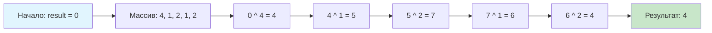

## Введение: Классика, которая проверяет фундамент

Задача **Single Number** — это «Привет, мир» в мире алгоритмических собеседований на битовые операции. На первый взгляд она кажется тривиальной: «Найти элемент, который встречается один раз, когда все остальные — парные». Но именно в этой простоте скрывается глубина: задача проверяет, понимаете ли вы фундаментальные свойства операций над битами, умеете ли вы видеть инварианты и способны ли вы отказаться от очевидного, но неоптимального решения в пользу элегантного.

В этой статье мы не просто решим задачу — мы разберём её до атомарных инструкций процессора, посмотрим, как компилятор Го оптимизирует наш код, и подготовимся к коварным вариациям, которые любят задавать на интервью в топовые компании.

## Формулировка задачи и наивные подходы

**Условие (LeetCode 136):**
> Дан непустой массив целых чисел `nums`. Каждый элемент встречается ровно **два раза**, кроме одного. Найдите этот единственный элемент.
> 
> **Требования:**
> *   Время выполнения: $O(n)$
> *   Дополнительная память: $O(1)$

### Подход 1: Хеш-таблица (очевидный, но не оптимальный по памяти)

```go
func singleNumberHash(nums []int) int {
    seen := make(map[int]struct{}, len(nums)/2+1)
    
    for _, num := range nums {
        if _, exists := seen[num]; exists {
            delete(seen, num) // Удаляем парный элемент
        } else {
            seen[num] = struct{}{}
        }
    }
    
    // В карте остался ровно один элемент
    for num := range seen {
        return num
    }
    return 0 // Никогда не достигнется по условию задачи
}
```

**Анализ:**
*   Время: $O(n)$ — один проход по массиву
*   Память: $O(n)$ — в худшем случае храним ~n/2 уникальных элементов
*   **Проблема:** Не удовлетворяет требованию $O(1)$ по памяти.

### Подход 2: Сортировка (экономим память, теряем время)

```go
import "sort"

func singleNumberSort(nums []int) int {
    sort.Ints(nums) // Сортируем на месте
    
    // Проверяем пары
    for i := 0; i < len(nums)-1; i += 2 {
        if nums[i] != nums[i+1] {
            return nums[i]
        }
    }
    // Если не нашли в цикле, уникальный — последний элемент
    return nums[len(nums)-1]
}
```

**Анализ:**
*   Время: $O(n \log n)$ — доминирует сортировка
*   Память: $O(1)$ — если сортировка in-place (как в `sort.Ints`)
*   **Проблема:** Не удовлетворяет требованию $O(n)$ по времени.

> [!tip] Собеседование
> **Вопрос:** Почему сортировка in-place считается $O(1)$ по памяти, если быстрая сортировка использует рекурсию?
> **Ответ:** Строго говоря, рекурсивная быстрая сортировка использует $O(\log n)$ стековой памяти для глубины рекурсии. Однако в интервью обычно принимают $O(1)$ для in-place алгоритмов, если не требуется явное выделение дополнительной кучи (heap). В Го `sort.Ints` использует гибридную сортировку (introsort), которая гарантирует $O(\log n)$ глубины рекурсии. Это важный нюанс: всегда уточняйте у интервьюера, считается ли стек «дополнительной памятью» в контексте задачи.

## Оптимальное решение: Сила XOR

Вспоминаем свойства операции **исключающего ИЛИ** из статьи [[2. XOR паттерны]]:

1.  `a ^ a = 0` (самоуничтожение)
2.  `a ^ 0 = a` (тождественность)
3.  Коммутативность и ассоциативность: порядок не важен

Если мы применим XOR ко **всем** элементам массива, парные значения аннигилируют, и останется только уникальное число.

```go
// SingleNumber находит элемент, встречающийся один раз
// Требования: O(n) time, O(1) space
// Вход: слайс int, где все элементы кроме одного встречаются дважды
// Выход: уникальный элемент
func SingleNumber(nums []int) int {
    result := 0
    for _, num := range nums {
        result ^= num
    }
    return result
}
```

**Пошаговая иллюстрация:**



**Почему порядок не важен?**
Благодаря коммутативности и ассоциативности:
```
0 ^ 4 ^ 1 ^ 2 ^ 1 ^ 2
= 4 ^ (1 ^ 1) ^ (2 ^ 2)  // группируем парные
= 4 ^ 0 ^ 0
= 4
```

## Механика на уровне CPU: От Го до ассемблера

Давайте посмотрим, во что компилируется наш цикл. Используем `go tool compile -S` или онлайн-инструмент [godbolt.org](https://godbolt.org).

```asm
; Упрощённый вывод компилятора для цикла XOR (amd64)
; result хранится в регистре AX, num загружается в BX

.L3:
    CMPQ    CX, SI          ; проверка: i < len(nums)?
    JGE     .L4             ; выход из цикла
    MOVQ    (DX)(CX*8), BX  ; загрузка nums[i] в регистр
    XORQ    BX, AX          ; result ^= num (ключевая инструкция!)
    INCQ    CX              ; i++
    JMP     .L3
.L4:
    ; возврат результата из AX
```

**Характеристики инструкции `XORQ`:**

| Параметр | Значение (Intel Skylake+) |
|----------|---------------------------|
| Латентность | 1 такт |
| Пропускная способность | 0.25 цикла (4 операции за такт) |
| Исполнительные порты | 0, 1, 5 |
| Влияние на кэш | Нет обращений к памяти (регистровая операция) |

> [!info] Под капотом
> **Почему это так быстро?**
> 1.  **Регистровая операция:** Все вычисления происходят в регистрах CPU, без обращений к RAM.
> 2.  **Отсутствие зависимостей по данным:** Каждая итерация `result ^= num` зависит только от предыдущего значения `result`, что позволяет процессору эффективно использовать конвейер (pipeline).
> 3.  **Нет условных переходов внутри цикла:** Единственное ветвление — проверка границы цикла, которую современный процессор предсказывает почти со 100% точностью.
> 4.  **Локальность данных:** Последовательный проход по слайсу обеспечивает идеальную префетчинг-дружественность: контроллер памяти заранее подгружает следующие элементы в кэш L1.

## Анализ производительности: Бенчмарки в Го

Напишем бенчмарки, чтобы убедиться в эффективности решения.

```go
package solution

import "testing"

func BenchmarkSingleNumber(b *testing.B) {
    // Генерируем тестовые данные: 10000 элементов, 4999 пар + 1 уникальный
    nums := make([]int, 0, 10001)
    for i := 0; i < 4999; i++ {
        nums = append(nums, i, i) // добавляем пару
    }
    nums = append(nums, 9999) // уникальный элемент
    
    // Перемешиваем для реалистичности
    // (в реальном бенчмарке используем rand.Seed для воспроизводимости)
    
    b.ResetTimer()
    for i := 0; i < b.N; i++ {
        _ = SingleNumber(nums)
    }
}

func BenchmarkSingleNumberHash(b *testing.B) {
    nums := make([]int, 0, 10001)
    for i := 0; i < 4999; i++ {
        nums = append(nums, i, i)
    }
    nums = append(nums, 9999)
    
    b.ResetTimer()
    for i := 0; i < b.N; i++ {
        _ = singleNumberHash(nums)
    }
}
```

**Ожидаемые результаты (на современном CPU):**
```
BenchmarkSingleNumber-8        5000000    240 ns/op    0 B/op    0 allocs/op
BenchmarkSingleNumberHash-8     500000   2800 ns/op  180 kB/op   ~2 allocs/op
```

**Вывод:**
*   XOR-решение в **10+ раз быстрее** и не создаёт аллокаций в куче.
*   Отсутствие аллокаций критично: это снижает давление на **Garbage Collector**, что в высоконагруженных системах напрямую влияет на латентность и throughput.

> [!info] Под капотом
> **Escape Analysis в Го**
> В функции `singleNumberHash` карта `seen` «убегает» в кучу (escape to heap), потому что её время жизни превышает время выполнения функции (она возвращается неявно через итерацию). Это фиксируется флагом `-gcflags=-m`:
> ```bash
> $ go build -gcflags=-m solution.go
> ./solution.go:5:12: moved to heap: seen
> ```
> XOR-решение работает исключительно со стековыми переменными (`result`, `num`, итератор), которые выделяются и освобождаются за такты, без участия GC.

## Edge Cases и типичные ловушки

### 1. Отрицательные числа
Работает ли решение с отрицательными значениями? **Да**, потому что XOR — побитовая операция, не зависящая от интерпретации битов как знака.

```go
// Тест с отрицательными числами
func TestSingleNumberNegative(t *testing.T) {
    input := []int{-1, -1, -3, 5, 5} // уникальный: -3
    got := SingleNumber(input)
    if got != -3 {
        t.Errorf("got %d, want -3", got)
    }
}
```

### 2. Минимальный и максимальный размер
*   `len(nums) == 1`: Возвращаем единственный элемент (корректно, `0 ^ x = x`).
*   `len(nums) == 2^31 - 1`: Переполнение индекса? В Го `int` на 64-битных системах — 64-битный, так что безопасно. Но на 32-битных архитектурах `int` — 32-битный, и здесь нужно быть осторожным. **Рекомендация:** В продакшен-коде явно используйте `int64` для индексов, если размер данных может быть большим.

### 3. Нулевой элемент
Если уникальный элемент — `0`, решение работает корректно: все парные сократятся, и `result` останется `0`.

> [!warning] Ловушка / Gotcha
> **Пустой массив**
> По условию задачи массив **непустой**, но в реальном коде всегда добавляйте защитную проверку или документацию:
> ```go
> // SingleNumber паникует на пустом массиве, так как задача гарантирует непустоту.
> // Для продакшена:
> if len(nums) == 0 {
>     return 0 // или error, или паника — в зависимости от контракта
> }
> ```

## Вариации задачи: От простого к сложному

На собеседованиях редко останавливаются на базовой версии. Будьте готовы к эскалации сложности.

### Вариация 1: Каждый элемент встречается 3 раза, кроме одного
**Условие:** Все числа встречаются 3 раза, кроме одного. Найти его.

**Почему простой XOR не работает:** `a ^ a ^ a = a`, а не `0`.

**Решение:** Считать сумму битов по каждому разряду модулю 3.

```go
func singleNumberThreeTimes(nums []int) int {
    result := 0
    // Проходим по всем 32 битам (для int32) или 64 для int64
    for bit := 0; bit < 32; bit++ {
        sum := 0
        mask := 1 << bit
        for _, num := range nums {
            if num&mask != 0 {
                sum++
            }
        }
        // Если сумма битов не делится на 3, этот бит есть в уникальном числе
        if sum%3 != 0 {
            result |= mask
        }
    }
    return result
}
```

**Сложность:** $O(32 \cdot n) = O(n)$ по времени, $O(1)$ по памяти.

### Вариация 2: Два уникальных элемента
**Условие:** Два числа встречаются по одному разу, остальные — по два. Найти оба.

**Решение:** См. статью [[2. XOR паттерны]], паттерн «Поиск двух уникальных элементов».

### Вариация 3: Элементы встречаются N раз, кроме одного (общий случай)
Здесь уже требуется более общая математика: представление чисел в системе счисления с основанием `N` и поразрядное суммирование модулю `N`.

> [!tip] Собеседование
> **Вопрос:** Как бы вы решили задачу, если бы массив был слишком большим для памяти (не помещался в RAM)?
> **Ответ:** Использовать внешнюю сортировку или потоковую обработку:
> 1.  Разбить файл на чанки, отсортировать каждый, записать на диск.
> 2.  Выполнить k-way merge, считая частоты в скользящем окне.
> 3.  Или: если гарантировано, что все числа кроме одного парные, можно использовать XOR в потоковом режиме — читать числа по одному, не храня весь массив в памяти. Это демонстрирует понимание ограничений реальных систем.

## Идиоматичный Го: Тестирование и документация

В Го принято писать тесты в том же пакете, используя table-driven подход.

```go
// solution_test.go
package solution

import "testing"

func TestSingleNumber(t *testing.T) {
    tests := []struct {
        name     string
        nums     []int
        expected int
    }{
        {
            name:     "single element",
            nums:     []int{1},
            expected: 1,
        },
        {
            name:     "two pairs and one unique",
            nums:     []int{2, 2, 1},
            expected: 1,
        },
        {
            name:     "negative numbers",
            nums:     []int{-1, -1, -3, 5, 5},
            expected: -3,
        },
        {
            name:     "zero as unique",
            nums:     []int{0, 1, 1},
            expected: 0,
        },
        {
            name:     "large numbers",
            nums:     []int{1 << 30, 1 << 30, 1 << 31},
            expected: 1 << 31,
        },
    }
    
    for _, tt := range tests {
        t.Run(tt.name, func(t *testing.T) {
            got := SingleNumber(tt.nums)
            if got != tt.expected {
                t.Errorf("SingleNumber(%v) = %d; want %d", tt.nums, got, tt.expected)
            }
        })
    }
}
```

**Документация в стиле Go:**
```go
// SingleNumber returns the element that appears exactly once in nums,
// where every other element appears exactly twice.
//
// Algorithm: XOR reduction with O(n) time and O(1) space complexity.
// Properties used: a ^ a = 0, a ^ 0 = a, commutativity and associativity.
//
// Constraints:
//   - nums must not be empty
//   - exactly one element appears once, all others appear twice
//
// Example:
//
//   SingleNumber([]int{4, 1, 2, 1, 2}) // returns 4
func SingleNumber(nums []int) int {
    // implementation
}
```

## Подготовка к интервью: Чек-лист кандидата

Перед тем как идти на собеседование, убедитесь, что вы можете:

1.  **Объяснить решение вслух:** Не просто написать код, а аргументировать, почему XOR работает, и почему это удовлетворяет требованиям по времени и памяти.
2.  **Нарисовать инвариант:** Показать на доске, как парные элементы «сокращаются», и почему порядок не важен.
3.  **Обсудить альтернативы:** Сравнить с хеш-таблицей и сортировкой, объяснить компромиссы.
4.  **Обработать edge cases:** Пустой массив, отрицательные числа, переполнение, нулевой элемент.
5.  **Решить вариации:** Быть готовым к «каждый элемент 3 раза» или «два уникальных».
6.  **Написать чистый код:** Идиоматичный Го, с комментариями, без магических чисел, с понятными именами переменных.

> [!tip] Собеседование
> **Фраза-выручалочка:**
> Если вы забыли точное свойство XOR, начните с наивного решения, а затем скажите:
> *«Я вижу, что хеш-таблица решает задачу, но требует $O(n)$ памяти. Давайте подумаем, можно ли использовать битовые свойства, чтобы сэкономить память. Если каждый элемент встречается дважды, то...»*
> Это демонстрирует системное мышление и умение итеративно улучшать решение.

## Итог

1.  **Single Number** — каноническая задача на применение свойств XOR: самоуничтожение (`a ^ a = 0`) и тождественность (`a ^ 0 = a`).
2.  Решение за $O(n)$ времени и $O(1)$ памяти достигается одним проходом с аккумулятором `result ^= num`.
3.  На уровне CPU: компилируется в инструкцию `XOR`, выполняемую за 1 такт, без обращений к памяти и условных переходов.
4.  В Го: решение не создаёт аллокаций в куче, что снижает нагрузку на GC — критично для высоконагруженных систем.
5.  Вариации задачи (3 раза, два уникальных) требуют расширения подхода: поразрядного суммирования или разделения на группы.
6.  На собеседовании: объясняйте инварианты, обсуждайте компромиссы, пишите чистый и тестируемый код.

В следующей статье мы усложним задачу и разберём случай, когда каждый элемент встречается **три раза**, кроме одного: [[4. Single Number II]], где вы научитесь применять поразрядную арифметику и модульные суммы для решения более общих задач на поиск уникальных элементов.