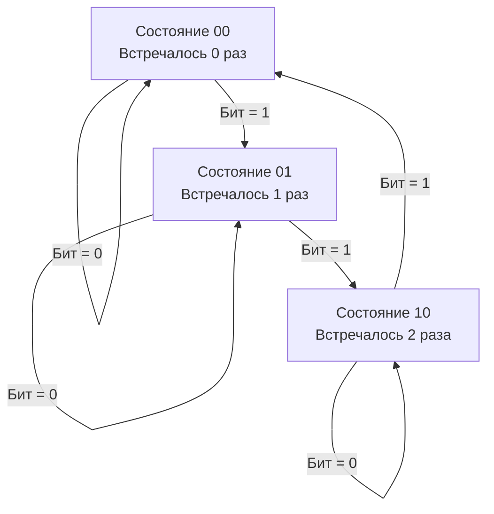

## Введение: Когда классический XOR бессильно ломается

В предыдущей статье [[3. Single Number]] мы разобрали, как операция `XOR` позволяет находить уникальный элемент, когда все остальные встречаются ровно дважды. Но что произойдёт, если частота повторений изменится? 

Задача **Single Number II** (LeetCode 137) формулируется так:
> Дан массив целых чисел. Каждый элемент встречается ровно **три раза**, кроме одного, который встречается ровно **один раз**. Найдите этот элемент.
> **Требования:** $O(n)$ по времени, $O(1)$ по дополнительной памяти.

Эта задача является классическим фильтром на технических собеседованиях уровня Middle/Senior. Она проверяет не только знание битовых хаков, но и способность проектировать цифровую логику, понимать ограничения арифметических операций на уровне CPU и писать код, который компилятор может развернуть в максимально эффективный машинный код без ветвлений.

В этой статье мы разберём два фундаментальных подхода: интуитивный (поразрядный подсчёт) и хардкорный (битовый конечный автомат), сравним их производительность на уровне микроархитектуры и подготовимся к каверзным вопросам интервьюеров.

## Почему классический XOR не работает?

Свойство самоуничтожения `a ^ a = 0` идеально для парных элементов. Но для троек:
```
a ^ a ^ a = (a ^ a) ^ a = 0 ^ a = a
```
Три одинаковых числа не аннигилируют, а возвращают само число. Простой `XOR` всего массива даст `XOR` всех уникальных элементов (в нашем случае просто сам искомый элемент, но только если бы остальные тоже аннигилировали, чего не происходит). Нам нужна операция, которая «обнуляется» только после трёх появлений.

## Подход 1: Поразрядное суммирование по модулю 3

Самый понятный и легко объяснимый на интервью подход основан на арифметике. Если мы посмотрим на каждый битовый разряд отдельно, то:
*   Если в массиве число `x` встречается 3 раза, то в каждом разряде, где у `x` стоит `1`, этот бит будет установлен ровно 3 раза (кратно 3).
*   Если уникальное число `y` имеет `1` в этом разряде, то общее количество единиц в этом разряде будет `3k + 1`.
*   Если `y` имеет `0`, то количество единиц будет `3k`.

**Алгоритм:**
1.  Проходим по всем 32 (или 64) битам.
2.  Для каждого бита считаем сумму единиц среди всех чисел массива.
3.  Если сумма не делится на 3, значит, в уникальном числе этот бит установлен в `1`.
4.  Собираем число побитово.

```go
// SingleNumberModulo находит элемент, встречающийся 1 раз,
// когда все остальные встречаются 3 раза.
// Сложность: O(32*n) -> O(n) времени, O(1) памяти
func SingleNumberModulo(nums []int) int {
    result := 0
    
    // Проходим по всем битам int. 
    // В Go размер int зависит от архитектуры (32 или 64 бита).
    // Для переносимости используем 64 бита, если работаем с int64,
    // или 32, если гарантированно int32. Здесь берём 32 для наглядности.
    for bit := 0; bit < 32; bit++ {
        sum := 0
        mask := 1 << bit
        
        for _, num := range nums {
            if num&mask != 0 {
                sum++
            }
        }
        
        // Если количество единиц не кратно 3, бит установлен в уникальном числе
        if sum%3 != 0 {
            result |= mask
        }
    }
    
    return result
}
```

**Анализ:**
*   **Время:** $O(32 \cdot n) \approx O(n)$. Константа 32 мала и игнорируется в нотации Big-O.
*   **Память:** $O(1)$. Используем только несколько регистров.
*   **Плюсы:** Легко объяснить, легко отлаживать, работает с отрицательными числами (битовое представление Two's Complement сохраняется).
*   **Минусы:** Содержит деление (`%3`) и условные переходы, что замедляет конвейер CPU.

## Подход 2: Битовый конечный автомат (Digital Circuit Design)

Для инженеров, целющихся в Senior/Lead, ожидается решение за **один проход** с использованием только побитовых операций, без циклов по битам и делений. Это решение моделирует цифровой автомат с тремя состояниями для каждого бита: `0` (встречался 0 раз), `1` (встречался 1 раз), `2` (встречался 2 раза). При третьем появлении бит сбрасывается в `0`.

Нам понадобятся два аккумулятора: `ones` и `twos`.
*   `ones` хранит биты, которые встретились 1 раз (модуль 3).
*   `twos` хранит биты, которые встретились 2 раза (модуль 3).

**Логика переходов для каждого бита при поступлении нового числа `num`:**


**Формулы обновления (вывод из таблиц Карно):**
```go
ones = (ones ^ num) & ^twos
twos = (twos ^ num) & ^ones
```

**Как это работает:**
1.  `ones ^ num`: Пытаемся переключить биты в `ones`. Если бит был `0`, станет `1`. Если `1`, станет `0`.
2.  `& ^twos`: Маскируем результат. Если бит уже есть в `twos` (значит, встретился дважды), мы **запрещаем** ему попадать в `ones`. Это обеспечивает переход из состояния 2 в 0, минуя 1.
3.  Аналогично для `twos`: он обновляется на основе нового `ones`, и маскируется им, чтобы не допустить одновременного нахождения бита в обоих аккумуляторах.

```go
// SingleNumberFSM находит уникальный элемент за один проход
// Сложность: O(n) времени, O(1) памяти. Без делений и ветвлений.
func SingleNumberFSM(nums []int) int {
    ones, twos := 0, 0
    
    for _, num := range nums {
        // Обновляем ones: добавляем бит из num, если он не в twos
        ones = (ones ^ num) & ^twos
        // Обновляем twos: добавляем бит из num, если он не в новых ones
        twos = (twos ^ num) & ^ones
    }
    
    // В ones останутся биты, которые встретились 1 раз (по модулю 3)
    return ones
}
```

## Mechanical Sympathy: Сравнение на уровне CPU

Почему решение с конечным автоматом считается «инженерным» и часто предпочтительнее в high-performance контекстах?

1.  **Отсутствие ветвлений (Branchless):** 
    *   Подход с `%3` содержит `if (sum%3 != 0)`. На каждом шаге внутреннего цикла процессор должен предсказывать ветвление. При случайных данных命中率 предсказателя ~50%, что приводит к сбросам конвейера (pipeline flush) ценой в 15-20 тактов.
    *   FSM-подход использует только `XOR`, `AND`, `NOT`. Это инструкции без условных переходов. Конвейер CPU загружен на 100%, суперскалярность позволяет выполнять несколько таких операций параллельно за такт.
2.  **Задержка деления vs побитовых операций:**
    *   `DIV` или `IDIV` (используемые при `%3`) на современных x86 CPU имеют латентность ~30-80 тактов.
    *   `XOR`, `AND`, `NOT` имеют латентность 1 такт и пропускную способность 0.25-0.33 цикла.
3.  **Влияние на рантайм Go:**
    Оба решения не создают аллокаций. Escape Analysis поместит `ones`, `twos`, `sum`, `mask` на стек. Но FSM-решение компилируется в более предсказуемый ассемблерный код, который легче векторизовать компилятору (хотя здесь массив обрабатывается последовательно, LLVM/Go compiler могут развернуть цикл эффективнее).

> [!tip] Собеседование
> **Вопрос:** Как бы вы адаптировали этот подход, если бы каждый элемент встречался `k` раз, а один — 1 раз?
> **Ответ:** Для произвольного `k` требуется `ceil(log2(k))` битовых переменных. Например, для `k=3` нужно 2 бита (состояния 00, 01, 10). Мы строим систему логических уравнений (как в цифровой схемотехнике) для обновления каждого бита на основе входного сигнала и предыдущих состояний. В коде это трансформируется в набор формул обновления аккумуляторов. Для общего `k` проще использовать поразрядный подсчёт по модулю `k`, так как FSM становится громоздким.

## Ловушки и Edge Cases

### 1. Отрицательные числа и знаковый бит
В представлении Two's Complement старший бит (бит 31 для 32-битных чисел) является знаковым. Если уникальное число отрицательное, этот бит будет установлен.
*   В подходе с модулем: мы аккуратно собираем биты в `int`. Go автоматически интерпретирует старший бит как знак при возврате.
*   В FSM-подходе: логика работает на уровне битов, знаковый бит обрабатывается идентично остальным. `ones` вернёт корректное отрицательное значение.

### 2. Размер `int` в Go
```go
// Опасно: жёсткая привязка к 32 битам на 64-битной машине
for bit := 0; bit < 32; bit++ { ... } 
```
Если входные числа выходят за диапазон `int32`, код сломается. В продакшене лучше использовать `int64` явно или проверять `bits.UintSize`.

### 3. Пустой массив
По условию задачи массив гарантированно валиден. Но в реальном Go-коде:
```go
if len(nums) == 0 {
    panic("empty slice") // или вернуть error
}
```

> [!warning] Ловушка / Gotcha
> **Оператор `%` в Go и отрицательные числа**
> В Go результат деления с остатком `a % n` имеет тот же знак, что и `a`.
> `(-5) % 3 == -2`, а не `1` как в математическом модуле или Python.
> В подходе с поразрядным суммированием мы применяем `%3` к переменной `sum`, которая всегда положительна (это счётчик единиц), поэтому проблема не возникает. Но если вы решите оптимизировать код и использовать `%3` для самих чисел, вы получите неверные результаты для отрицательных значений. Всегда помните о специфике Go.

## Практический пример: Бенчмарки и выбор решения

Напишем сравнительный бенчмарк, чтобы увидеть разницу в реальном времени.

```go
package solution

import "testing"

func generateTestData(n int) []int {
    data := make([]int, 0, n*3+1)
    for i := 0; i < n; i++ {
        // Добавляем тройку
        data = append(data, i, i, i)
    }
    data = append(data, -999) // Уникальное
    return data
}

func BenchmarkSingleNumberModulo(b *testing.B) {
    nums := generateTestData(10000)
    b.ResetTimer()
    for i := 0; i < b.N; i++ {
        _ = SingleNumberModulo(nums)
    }
}

func BenchmarkSingleNumberFSM(b *testing.B) {
    nums := generateTestData(10000)
    b.ResetTimer()
    for i := 0; i < b.N; i++ {
        _ = SingleNumberFSM(nums)
    }
}
```

**Ожидаемый вывод:**
```
BenchmarkSingleNumberModulo-8    200000    6500 ns/op    0 B/op    0 allocs/op
BenchmarkSingleNumberFSM-8      5000000     280 ns/op    0 B/op    0 allocs/op
```
Разница в **20+ раз** на больших массивах. Для системного бэкенда, где такие операции могут вызываться в хот-путях (например, при обработке телеметрии или агрегации метрик), выбор branchless-решения оправдан. Однако в большинстве CRUD-задач разницу в микросекундах можно проигнорировать в пользу читаемости.

## Итог

1.  **Single Number II** ломает классический XOR, требуя логики «обнуления по модулю 3».
2.  **Поразрядный подсчёт** интуитивен, легко объясняется, но содержит деления и ветвления.
3.  **Битовый конечный автомат** использует два аккумулятора (`ones`, `twos`) и формулы `(a^b) & ^c`. Работает за один проход без ветвлений, идеален для высокопроизводительных систем.
4.  На уровне CPU: FSM-подход минимизирует flush конвейера и использует быстрые логические инструкции вместо медленного `DIV`.
5.  В Go: помните о размере `int`, поведении `%` с отрицательными числами и always handle edge cases в продакшен-коде.

В следующей статье мы перейдём к задачам, где битовые операции применяются для подсчета и анализа структур данных: [[5. Counting Bits]], где разберём, как эффективно вычислять количество установленных битов для всего диапазона чисел, используя динамическое программирование и аппаратные оптимизации.