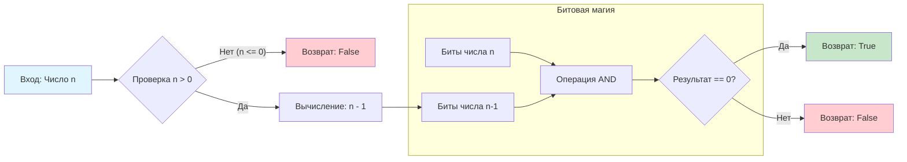

## Введение: Операция за один такт

Задача **Power of Two** (LeetCode 231) кажется элементарной: «Проверить, является ли число $n$ степенью двойки». Новички пишут цикл с делением или логарифмы, не задумываясь, что процессор способен дать ответ быстрее, чем вы успеете прочитать условие.

Для Senior/Lead инженера эта задача — тест на знание двоичной арифметики, понимание особенностей хранения знаковых чисел (Two's Complement) и умение избегать избыточных ветвлений (branching) в критических секциях кода.

В этой статье мы разберём классический битовый хак, посмотрим, как он транслируется в машинный код, обсудим ловушки с переполнением `MinInt` и применим этот паттерн для более сложных проверок (например, степени четвёрки).

## Математика двоичного представления

Любая степень двойки в двоичной системе счисления имеет **ровно один установленный бит** (единицу), стоящий на позиции $k$ (считая с нуля).

*   $2^0 = 1 = \dots 0001_2$
*   $2^1 = 2 = \dots 0010_2$
*   $2^2 = 4 = \dots 0100_2$
*   $2^3 = 8 = \dots 1000_2$

Все остальные биты равны нулю. Это фундаментальное свойство лежит в основе решения.

## Магия выражения `n & (n - 1)`

Рассмотрим, что происходит, если вычесть единицу из степени двойки.
Бит, равный 1, превращается в 0, а все нули справа от него становятся единицами.

**Пример для числа 8 (`1000`):**
1.  `n` = `1000` (8)
2.  `n - 1` = `0111` (7)

Если мы применим побитовое И (`AND`) к этим числам:
```text
  1000  (n)
& 0111  (n - 1)
------
  0000  (0)
```
**Результат всегда будет 0**, если число было степенью двойки.

Если же число **не** было степенью двойки (например, 6 = `0110`):
```text
  0110  (n)
& 0101  (n - 1)
------
  0100  (4 != 0)
```
Результат не обнулится, так как в числе есть другие единицы, которые не затрагиваются вычитанием из младшего разряда.

> [!info] Под капотом
> Это свойство также известно как **алгоритм Брайана Кернигана**. Он часто используется для эффективного подсчёта единичных битов (Population Count):
> ```go
> for n > 0 {
>     n = n & (n - 1) // Сбрасывает младшую единицу
>     count++
> }
> ```
> Цикл выполняется ровно столько раз, сколько единиц в числе. Для $2^{60}$ это будет всего 1 итерация, а для $2^{60} - 1$ — 60 итераций.

## Идиоматичное решение в Go

Нам нужно учесть два условия:
1.  Число должно быть положительным ($n > 0$), так как степени двойки ($2^0, 2^1...$) всегда положительные. Ноль и отрицательные числа не подходят.
2.  Побитовая проверка `n & (n - 1) == 0`.

```go
// IsPowerOfTwo проверяет, является ли n степенью двойки
// Сложность: O(1) время, O(1) память
func IsPowerOfTwo(n int) bool {
    return n > 0 && (n & (n - 1)) == 0
}
```

### Почему скобки важны?
В Go приоритет битовых операций (`&`) выше, чем операций сравнения (`==`).
Запись `n & (n - 1) == 0` без скобок была бы ошибкой компиляции или логической ошибкой (в зависимости от языка, но в Go это синтаксическая ошибка, так как результат `&` имеет тип int, а результат `==` — bool, и их нельзя смешивать без скобок).
**Правильно:** `(n & (n - 1)) == 0`.

## Механика на уровне CPU: Инструкции и флаги

Давайте посмотрим, во что превращается наш код на архитектуре x86-64.

```asm
; n передается в регистре AX
; Сравнение n > 0
CMPQ    $0, AX          ; Сравнить n с 0
JLE     .L_not_power    ; Если Less or Equal (<=), прыгаем на выход (false)

; Вычисление n - 1
MOVQ    AX, BX          ; Копируем n в BX
SUBQ    $1, BX          ; BX = n - 1

; Проверка (n & (n-1)) == 0
ANDQ    BX, AX          ; AX = n & (n-1)
TESTQ   AX, AX          ; Проверяем, равен ли результат нулю (ставит флаг ZF)
JNE     .L_not_power    ; Если Not Equal (ZF=0), прыгаем (false)

; Если дошли сюда — true
MOVQ    $1, AX
RET

.L_not_power:
MOVQ    $0, AX
RET
```

### Оптимизация процессора (Branchless Execution)
Современные компиляторы могут генерировать код без условных переходов (`JMP`), используя инструкции установки флагов (`SETcc`).

```asm
CMPQ    $0, AX
SETG    CL              ; CL = 1, если n > 0, иначе 0
MOVQ    AX, BX
SUBQ    $1, BX
ANDQ    BX, AX
TESTQ   AX, AX
SETZ    DL              ; DL = 1, если (n & (n-1)) == 0, иначе 0
ANDL    DL, CL          ; CL = CL & DL
MOVZBL  CL, AX          ; Возвращаем результат как int (0 или 1)
```

Такой код исполняется линейно, без сброса конвейера предсказателя ветвлений (Branch Predictor), что делает его предсказуемым по времени исполнения, независимо от входных данных.

## Ловушки и Corner Cases

### 1. Ноль и Отрицательные числа
*   **`n = 0`:** Выражение `0 & (0 - 1)` равно `0 & -1`, что равно `0`. Без проверки `n > 0` функция вернёт `true` для нуля, что математически неверно.
*   **`n < 0`:** Отрицательные числа в Two's Complement имеют старший бит равным 1.
    *   Пример: `-2` (`111...10`). `n-1` = `-3` (`111...01`). `AND` не будет нулём.
    *   Но есть особый случай: **`MinInt`**.

### 2. Ловушка `MinInt`
В 64-битной системе `MinInt` = $-2^{63}$ (двоичный вид `1000...000`).
Это число выглядит как степень двойки (один бит установлен), но оно отрицательное.
*   Вычисление `n - 1`: В Two's Complement $-2^{63} - 1 = 2^{63} - 1$ (`MaxInt` или `0111...111`).
*   Вычисление `n & (n - 1)`: `1000...000 & 0111...111` = `0000...000`.
*   **Результат:** Выражение `n & (n - 1) == 0` возвращает `true`!

> [!warning] Ловушка / Gotcha
> Если вы забудете проверку `n > 0`, то `IsPowerOfTwo(MinInt)` вернёт `true`.
> Это классический баг, который может проявиться в криптографии или при работе с размерами буферов (где отрицательные значения могут интерпретироваться как огромные беззнаковые числа).

### 3. Переполнение при вычитании
В языках вроде C/C++ вычитание из `MinInt` (для знаковых типов) вызывает **Undefined Behavior (UB)**. В Go переполнение целых чисел определено чётко (wrap-around по модулю $2^W$), поэтому `n - 1` безопасно, но проверка знака остаётся критичной.

## Диаграмма работы алгоритма

Визуализация битовых операций для проверки степени двойки.



## Подготовка к собеседованию: Усложнения

На интервью часто просят решить вариации этой задачи, чтобы отсеять кандидатов, знающих только один хак.

### 1. Степень Четвёрки (Power of Four)
**Задача:** Проверить, является ли число степенью четвёрки ($4^0=1, 4^1=4, 4^2=16...$).
Числа $4^k$ в двоичной записи имеют единицу только на **чётных** позициях (0, 2, 4...), если считать с нуля справа.
`1` (`1`), `4` (`100`), `16` (`10000`), `64` (`1000000`).

**Решение:**
1.  Число должно быть степенью двойки.
2.  Единица должна стоять на правильной позиции. Для этого используем маску `0x55555555` (в двоичной `0101...0101`), у которой установлены все биты на нечётных позициях (1, 3, 5...). Если наше число (у которого единица на чётной позиции) наложить через `AND` с этой маской, результат должен быть **не равен 0** (так как биты "встретятся").
    *   *Correction:* Подождите.
    *   `4` = `100`. Позиция 2 (чётная).
    *   Маска `0x5555` = `0101`. Биты на 0 и 2 позициях (если считать 1-based) или 1 и 3 (0-based)?
    *   Давайте точнее: $4^k = 2^{2k}$. Степень двойки — чётная.
    *   Маска `0x5555...` имеет 1 на позициях $0, 2, 4...$ (если $1 = 2^0$).
    *   $1 = 2^0$ — это $4^0$. Позиция 0. Маска `0x5555` имеет 1 на позиции 0. `1 & 0x5555 = 1`.
    *   $2 = 2^1$. Позиция 1. Маска `0x5555` имеет 0 на позиции 1. `2 & 0x5555 = 0`.
    *   $4 = 2^2$. Позиция 2. Маска имеет 1. `4 & 0x5555 != 0`.

**Формула:** `n > 0 && (n & (n-1)) == 0 && (n & 0x55555555) != 0`.

### 2. Степень Тройки (Power of Three)
Битовый трюк тут не работает напрямую, так как $3^k$ не имеет простого двоичного паттерна.
Здесь нужно использовать математику: `log3(n)` должно быть целым. Или деление в цикле.

## Практический пример: Выравнивание памяти

Почему это важно в Go? Многие низкоуровневые операции требуют выравнивания памяти (alignment) по степени двойки.
Например, если вы хотите выделить блок памяти размером `n`, выровненный по границе 4 КБ (4096 = $2^{12}$):

```go
func alignMemory(n, alignment int) int {
    // Проверка, что alignment — степень двойки
    if alignment <= 0 || (alignment & (alignment - 1)) != 0 {
        panic("alignment must be a power of two")
    }
    // Магия выравнивания: (n + alignment - 1) &^ (alignment - 1)
    // &^ это операция AND NOT
    return (n + alignment - 1) &^ (alignment - 1)
}
```
Этот код работает **только** потому, что `alignment` является степенью двойки, и его вычитание единицы даёт маску всех единиц младших разрядов (`...000111`).

## Итог

1.  **Битовый хак:** Число $n$ — степень двойки $\iff n > 0$ и `(n & (n - 1)) == 0`.
2.  **Механика:** Вычитание единицы инвертирует все биты справа от младшей единицы, что при наложении через `AND` обнуляет число.
3.  **Edge Cases:** Всегда проверяйте `n > 0`. Особое внимание на `MinInt` — он имеет один бит, но является отрицательным.
4.  **Go specifics:** В Go переполнение безопасно, но логика `int` vs `uint` важна. Для `uint` проверка `n > 0` не обязательна (так как `0` обрабатывается `n-1` -> `MaxInt`, `MaxInt & 0 != 0`? Нет, `0 & ... = 0`. Для `uint` нужно явно `n != 0`).
5.  **Интервью:** Будьте готовы к вариациям (Power of 4) и вопросам про производительность (Branchless код).

В следующей статье мы разберём одну из самых популярных задач на алгоритмическую смекалку, которая часто решается через XOR, но требует понимания арифметики прогрессий: [[7. Missing Number]], где вы узнаете, как найти потерянное число в массиве за линейное время и константную память.