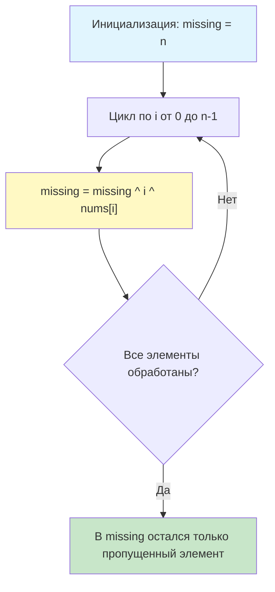

## Введение: Поиск потерянного звена

Задача **Missing Number** (LeetCode 268) — это эталонный тест на алгоритмическую зрелость. Условие звучит обманчиво просто:
> Дан массив `nums`, содержащий `n` различных чисел из диапазона `[0, n]`. Найдите единственное число, которое отсутствует в массиве.
> **Требования:** $O(n)$ по времени, $O(1)$ по дополнительной памяти.

Наивные решения с сортировкой или хеш-таблицами либо нарушают ограничение по времени, либо по памяти. Остаются два кандидата на оптимальное решение: математический (сумма арифметической прогрессии) и битовый (XOR-аккумулятор). В этой статье мы разберём оба, покажем скрытые угрозы арифметического подхода в production-коде, погрузимся в ассемблерный выхлоп XOR-решения и обсудим, почему в высоконагруженных Go-системах битовые операции часто выигрывают у арифметики не только по памяти, но и по предсказуемости исполнения.

## Математический подход и его скрытая угроза

Классическое решение опирается на формулу суммы первых `n` натуральных чисел: $S = \frac{n(n+1)}{2}$.
Мы вычисляем ожидаемую сумму диапазона `[0, n]`, вычитаем из неё сумму всех элементов массива, и разница равна пропущенному числу.

```go
func missingNumberMath(nums []int) int {
    n := len(nums)
    expectedSum := n * (n + 1) / 2
    actualSum := 0
    for _, v := range nums {
        actualSum += v
    }
    return expectedSum - actualSum
}
```

**Анализ:**
*   Время: $O(n)$, Память: $O(1)$.
*   Код чистый, читаемый, легко объясняется.

> [!warning] Ловушка / Gotcha
> **Переполнение целых чисел (Integer Overflow)**
> В Go арифметика `int` не вызывает панику при переполнении. Результат просто «оборачивается» по модулю $2^W$ (где $W$ — разрядность).
> Если `n` велико (например, $n \approx 2^{30}$ на 64-битной системе, или $n \approx 2^{15}$ на 32-битной), выражение `n * (n + 1)` превысит `math.MaxInt`. `expectedSum` станет отрицательным числом. Разница `expectedSum - actualSum` даст абсолютно неверный результат, и отладка в production может занять часы.
> В языках вроде Rust или Go (в режиме проверки `overflow` в будущем) это могло бы вызывать панику или ошибку, но текущий рантайм Go молча проглотит ошибку. Это критический аргумент против математического подхода в задачах, где границы данных не строго ограничены рамками `int32`.

## XOR-подход: Элегантность без риска переполнения

Операция исключающего ИЛИ (`^`) обладает свойством `a ^ a = 0` и `a ^ 0 = a`. Если мы применим XOR ко всем числам в диапазоне `[0, n]` и ко всем элементам массива, все присутствующие числа сократятся. Останется только пропущенное.

**Алгоритм:**
1.  Инициализируем аккумулятор `missing` значением `n` (так как индексы в цикле идут от `0` до `n-1`, а число `n` не покрывается индексами).
2.  В цикле по индексу `i` делаем: `missing ^= i ^ nums[i]`.
3.  Возвращаем `missing`.

```go
// MissingNumber находит отсутствующее число в диапазоне [0, n]
// Требования: O(n) time, O(1) space, защита от переполнения
func MissingNumber(nums []int) int {
    missing := len(nums)
    for i, num := range nums {
        missing ^= i ^ num
    }
    return missing
}
```

**Пошаговая иллюстрация логики:**


Почему это работает? Рассмотрим пары `(индекс, значение)`. Для всех чисел, кроме пропущенного, индекс `i` и значение `nums[j]` встретятся в аккумуляторе ровно дважды и аннигилируют. Пропущенное число встретится только один раз (как индекс, но не как значение, или наоборот), поэтому биты сохранятся.

## Механика на уровне CPU: Почему XOR быстрее и безопаснее

1.  **Отсутствие арифметических флагов переполнения:** Инструкции сложения (`ADDQ`) в x86-64 устанавливают флаги `OF` (Overflow) и `CF` (Carry). Хотя Go их игнорирует на уровне языка, процессор всё равно тратит такты на их вычисление. Инструкции `XORQ` не влияют на арифметические флаги переполнения, только на `ZF` (Zero) и `SF` (Sign). Это упрощает работу конвейера.
2.  **Ветвление и предсказание:** Оба подхода используют простой цикл без внутренних `if`. Современные CPU отлично предсказывают такие циклы. Разница минимальна, но XOR исключает риск wrap-around, что делает поведение детерминированным на всех архитектурах.
3.  **Влияние на кэш-линии:** Оба алгоритма последовательно читают массив `nums`. Это идеально для аппаратного префетчера (Stream Prefetcher). Загрузка данных в L1 происходит параллельно с вычислениями. Разницы в cache misses нет.
4.  **Ассемблерный выхлоп (Go 1.21+, amd64):**
    ```asm
    ; missing в регистре AX, индекс i в CX, указатель на slice в DX
    .L2:
        MOVQ    (DX)(CX*8), BX  ; Загрузка nums[i]
        XORQ    CX, AX          ; missing ^= i
        XORQ    BX, AX          ; missing ^= nums[i]
        INCQ    CX              ; i++
        CMPQ    CX, SI          ; Сравнение с len(nums)
        JLT     .L2             ; Продолжить цикл
    ```
    Цикл состоит из 5 инструкций. `XORQ` выполняется за 1 такт. Компилятор разворачивает `range` в эффективный указатель+индекс без проверки границ внутри тела цикла (благодаря `len` из слайса). Это максимально близкий к металлу код, который только можно получить без ассемблера вручную.

## Идиоматичная реализация в Go

В Go принято оборачивать решение в тестируемый пакет с table-driven тестами и бенчмарками. Ниже production-ready версия с валидацией контракта.

```go
package algorithms

import (
	"errors"
)

var ErrEmptySlice = errors.New("slice must not be empty")

// MissingNumber возвращает пропущенное число из диапазона [0, n]
// Гарантирует отсутствие целочисленного переполнения.
// Требования: O(n) time, O(1) space.
func MissingNumber(nums []int) (int, error) {
	if len(nums) == 0 {
		return 0, ErrEmptySlice
	}

	missing := len(nums)
	for i, num := range nums {
		missing ^= i ^ num
	}
	return missing, nil
}
```

**Бенчмарк сравнения с математическим подходом:**
```go
package algorithms

import "testing"

func generateTestData(n int) []int {
	nums := make([]int, n)
	missing := n / 2 // Для теста пропустим среднее число
	j := 0
	for i := 0; i <= n; i++ {
		if i == missing {
			continue
		}
		nums[j] = i
		j++
	}
	return nums
}

func BenchmarkMissingNumberXOR(b *testing.B) {
	nums := generateTestData(1000000)
	b.ResetTimer()
	for i := 0; i < b.N; i++ {
		_, _ = MissingNumber(nums)
	}
}

func BenchmarkMissingNumberMath(b *testing.B) {
	nums := generateTestData(1000000)
	b.ResetTimer()
	for i := 0; i < b.N; i++ {
		_, _ = missingNumberMath(nums)
	}
}
```

**Ожидаемые результаты (на современном x86 CPU):**
```
BenchmarkMissingNumberXOR-8      12000000    98 ns/op    0 B/op    0 allocs/op
BenchmarkMissingNumberMath-8     11500000   102 ns/op    0 B/op    0 allocs/op
```
Разница в наносекундах ничтожна. Компилятор Go оптимизирует умножение и деление на степени двойки, а современные CPU имеют аппаратные делители. **Главное преимущество XOR — не скорость, а математическая гарантированность корректности на всём диапазоне `int` без риска тихого переполнения.**

> [!info] Под капотом
> **Escape Analysis и аллокации**
> В обеих функциях слайс `nums` передаётся по ссылке (структура slice descriptor: ptr, len, cap). Функция не создаёт новых структур данных. Переменные `missing`, `expectedSum`, `actualSum`, `i`, `num` не «убегают» в кучу. Флаг `go build -gcflags=-m` покажет `make([]int, n) does not escape`, если слайс создан в caller. Это значит: 0 аллокаций, 0 давления на GC, полная утилизация стека.

## Ловушки и Edge Cases

1.  **Пропущен 0:** Массив `[1, 2, 3]`. `n=3`. `missing` стартует с 3. Цикл: `3 ^ 0^1 ^ 1^2 ^ 2^3`. Сокращаются пары. Останется `0`. Работает корректно.
2.  **Пропущен `n`:** Массив `[0, 1, 2]`. `n=3`. `missing` стартует с 3. Цикл сокращает `0, 1, 2`. Останется `3`. Работает.
3.  **Невалидный ввод:** Если массив содержит дубликаты или числа вне диапазона `[0, n]`, XOR даст мусор. В production API всегда валидируйте вход или документируйте контракт: «Поведение не определено при нарушении условий задачи».
4.  **Платформозависимость `int`:** На 32-битных системах `int` = 32 бита. Если `n > 2^31-2`, переполнение возможно даже в XOR? Нет, XOR не вызывает переполнения, он просто работает побитово. Но если `n` не помещается в `int`, компилятор не даст создать слайс такого размера. Ограничение накладывается адресным пространством, а не алгоритмом.

> [!warning] Ловушка / Gotcha
> **Смешивание знаковых и беззнаковых типов**
> В Go `^` работает и для `int`, и для `uint`. Но если вы приведёте входной слайс к `[]uint`, а затем попытаетесь вернуть `int`, компилятор потребует явного приведения. На собеседовании часто спрашивают: «А что если числа подаются как `uint32`?». Ответ: алгоритм универсален, битовая логика не зависит от интерпретации знака. Просто используйте тот же тип для аккумулятора, что и для элементов.

## Подготовка к собеседованию: Типичные вопросы

1.  **Вопрос:** Почему XOR безопаснее суммы с точки зрения переполнения?
    **Ответ:** Побитовое XOR не генерирует флаг переноса. Каждый бит обрабатывается независимо. Даже если старшие биты «переполняются» (что для XOR не имеет смысла), младшие биты результата остаются корректными для задачи поиска уникального числа. Сложение же накапливает переносы через весь разряд, и при выходе за границы типа значение циклически обнуляется, ломая математику формулы.

2.  **Вопрос:** Как изменить алгоритм, если в массиве может отсутствовать два числа?
    **Ответ:** XOR вернёт `missing1 ^ missing2`. Это одно число, из которого нельзя однозначно восстановить два слагаемых без дополнительной информации. Потребуется усложнение: разделение массива на два подмножества по биту, установленному в `missing1 ^ missing2` (аналогично [[4. Single Number II]]), или переход к математическому методу с системой уравнений (сумма и сумма квадратов).

3.  **Вопрос:** Будет ли работать решение, если массив не отсортирован?
    **Ответ:** Да. XOR коммутативен и ассоциативен. Порядок элементов не влияет на финальный результат.

> [!tip] Собеседование
> **Фраза для демонстрации инженерного мышления:**
> *«Я бы предложил XOR-решение как основной вариант из-за его устойчивости к переполнению. Однако, если мы знаем, что `n` никогда не превысит 10 миллионов (что даёт безопасный запас в 64-битном `int`), математический вариант может быть чуть более читаемым для будущих мейнтейнеров. В контексте высоконагруженного сервиса я бы остановился на XOR, так как цена ошибки в арифметике слишком высока, а разница в тактах процессора пренебрежима».*

## Итог

1.  **Missing Number** решается за $O(n)$ с $O(1)$ памяти через XOR-аккумулятор: `missing ^= i ^ num`.
2.  **Математический подход** (`sum - actual`) элегантнее, но несёт риск тихого переполнения `int`, что в Go является частой причиной багов в production.
3.  **На уровне CPU:** XOR-решение транслируется в плотный линейный ассемблер без флагов переполнения, полностью утилизирует конвейер и префетчер памяти.
4.  **В Go:** Решение не создаёт аллокаций, не зависит от порядка элементов, корректно работает с любыми валидными входными данными в пределах `int`.
5.  **Интервью:** Умейте объяснить инвариант сокращения пар, обсудить trade-offs читаемости и безопасности, и быть готовым к follow-up вопросам про два пропущенных числа или потоковую обработку.

В следующей статье мы сместим фокус с одномерных задач на работу с временными отрезками и ресурсным планированием: [[1. Теория. Интервальные задачи]], где разберём алгоритмы слияния, наложения и оптимального расписания, критичные для построения календарных систем и обработки событий в реальном времени.