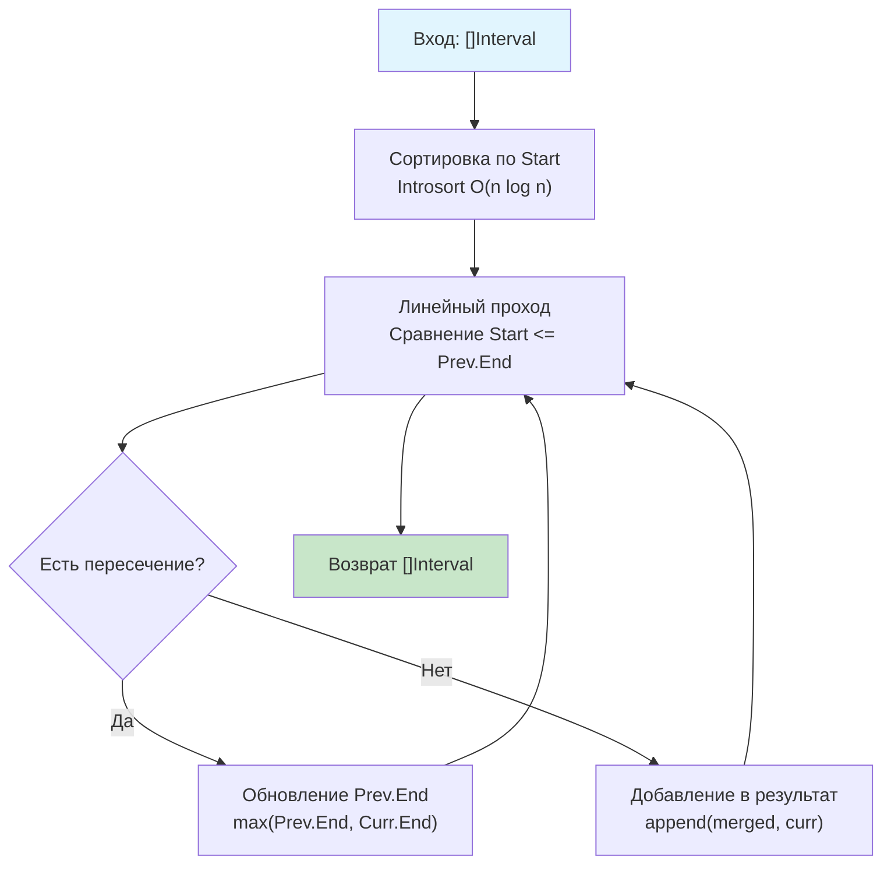

## Введение: Интервалы как фундамент планирования

Интервальные задачи лежат в основе огромного пласта реальных бэкенд-систем: планировщики встреч, системы бронирования ресурсов (от номеров в отелях до вычислительных нод в Kubernetes), тарификация облачных сервисов, окна репликации в базах данных и анализ временных рядов. 

На алгоритмических собеседованиях этот класс задач проверяет не только умение писать циклы, но и способность моделировать временные сущности, работать с границами диапазонов и выбирать между жадными стратегиями и методами сканирования событий (Sweep Line). В этой статье мы разберём фундаментальные паттерны решения интервальных задач, их реализацию в Go с учётом особенностей работы с памятью и CPU, а также подготовимся к каверзным follow-up вопросам, которые отличают Middle от Senior инженера.

## Представление данных в памяти: Структуры и выравнивание

В Go интервалы естественно моделируются через структуру:

```go
// Interval представляет отрезок на числовой прямой.
// По умолчанию считаем границы включительными [Start, End].
type Interval struct {
    Start int
    End   int
}
```

> [!info] Под капотом
> **Макет памяти и кэш-локальность**
> На 64-битных архитектурах `int` занимает 8 байт. Структура `Interval` весит ровно 16 байт и не требует выравнивания (padding). Это означает, что слайс из 4 интервалов (`64 байта`) идеально помещается в одну кэш-линию CPU.
> При последовательном проходе по `[]Interval` контроллер памяти эффективно подгружает данные в L1/L2 кэш. Это даёт значительный выигрыш по сравнению с использованием разрозненных слайсов `starts []int` и `ends []int` (структура SoA), где доступ к памяти будет менее предсказуемым для аппаратного префетчера, хотя SoA иногда выгоднее для векторизации (SIMD), которая в Go недоступна без ручной ассемблерной оптимизации.

## Фундаментальные алгоритмические паттерны

В основе 90% интервальных задач лежат два подхода: жадное слияние после сортировки и метод разделяющей прямой (Sweep Line).

### 1. Паттерн: Сортировка и жадное слияние
Используется, когда нужно объединить перекрывающиеся интервалы или найти свободные окна. Ключевая идея: после сортировки по времени начала мы можем обрабатывать интервалы линейно, сравнивая каждый только с последним добавленным в результат.

```go
// mergeIntervals базовая реализация паттерна
func mergeIntervals(intervals []Interval) []Interval {
    if len(intervals) <= 1 {
        return intervals
    }

    // Сортировка по времени начала
    sort.Slice(intervals, func(i, j int) bool {
        return intervals[i].Start < intervals[j].Start
    })

    // Предвыделение памяти: в худшем случае результат = входной слайс
    merged := make([]Interval, 0, len(intervals))
    merged = append(merged, intervals[0])

    for i := 1; i < len(intervals); i++ {
        last := &merged[len(merged)-1] // Указатель для модификации без копирования
        
        // Если текущий начинается раньше или ровно в момент окончания предыдущего -> пересечение
        if intervals[i].Start <= last.End {
            // Объединяем: берём максимум из концов
            if intervals[i].End > last.End {
                last.End = intervals[i].End
            }
            // Если intervals[i].End <= last.End, он полностью вложен в last -> игнорируем
        } else {
            merged = append(merged, intervals[i])
        }
    }

    return merged
}
```

### 2. Паттерн: Sweep Line (Метод разделяющей прямой)
Используется, когда нужно найти максимальное количество одновременных интервалов, проверить корректность расписания или построить календарь занятости. Идея: разбить каждый интервал на два события (начало и конец), отсортировать все события по времени и пройтись по ним, поддерживая счётчик активных интервалов.

```go
// Event представляет точку на временной оси
type Event struct {
    Time int
    Type int // +1 для начала, -1 для конца
}

// maxConcurrentIntervals находит максимум одновременно активных интервалов
func maxConcurrentIntervals(intervals []Interval) int {
    if len(intervals) == 0 {
        return 0
    }

    events := make([]Event, 0, len(intervals)*2)
    for _, iv := range intervals {
        events = append(events, Event{Time: iv.Start, Type: 1})
        events = append(events, Event{Time: iv.End, Type: -1})
    }

    // Сортировка событий. При равенстве Time сначала обрабатываем конец (-1),
    // чтобы корректно считать касания границ [1,2] и [2,3] как неперекрывающиеся.
    sort.Slice(events, func(i, j int) bool {
        if events[i].Time == events[j].Time {
            return events[i].Type < events[j].Type
        }
        return events[i].Time < events[j].Time
    })

    maxOverlap, currentOverlap := 0, 0
    for _, ev := range events {
        currentOverlap += ev.Type
        if currentOverlap > maxOverlap {
            maxOverlap = currentOverlap
        }
    }

    return maxOverlap
}
```

> [!info] Под капотом
> **Как работает `sort.Slice` в Go**
> Компилятор генерирует замыкание, которое передаётся в `sort.Slice`. Под капстом используется **Introsort** (гибрид Quicksort, Heapsort и Insertion Sort). 
> *   Quicksort обеспечивает среднее $O(n \log n)$.
> *   Если глубина рекурсии превышает $2 \log n$, алгоритм переключается на Heapsort, гарантируя худший случай $O(n \log n)$ и защиту от DoS-атак специально подобранными данными.
> *   Insertion Sort применяется для мелких подмассивов (<12 элементов), где он эффективнее из-за локальности данных.
> Сортировка происходит **in-place** для слайса, но замыкание может «убежать» в кучу (escape analysis), если компилятор не сможет доказать его кратковременность. Для горячих путей лучше использовать `sort.Slice` с `//go:noinline` или кастомный тип с методом `Len/Less/Swap`, что генерирует более предсказуемый машинный код.

## Механика производительности: Кэш, ветвления и GC

### Ветвления и предсказание
В цикле слияния условие `intervals[i].Start <= last.End` после сортировки становится **высокопредсказуемым**. Пока интервалы перекрываются, ветка `true` выполняется подряд. Когда перекрытий нет, срабатывает `false`. Современный Branch Predictor (PHT/BTB в Intel/AMD) угадывает такие паттерны с точностью >99%, минимизируя штрафы за сброс конвейера (15-20 тактов).

### Управление памятью и Escape Analysis
В примере выше `merged := make([]Interval, 0, len(intervals))` гарантирует:
1.  **Одну аллокацию** вместо потенциальных $O(\log n)$ ресайзов.
2.  `last := &merged[...]` — взятие адреса элемента слайса внутри той же функции. Escape Analysis видит, что указатель не покидает область видимости функции, и размещает `merged` **на стеке**, если общий размер `< ~64 КБ` (зависит от `GOMAXPROCS` и лимита стека). Это полностью исключает нагрузку на Garbage Collector.
3.  Если вернуть `merged` наружу, слайс уйдёт в кучу. Для high-load систем, где интервалы обрабатываются транзитно, рассмотрите инъекцию буфера: `func Merge(dst, src []Interval) []Interval`.



## Ловушки и Edge Cases

### 1. Касание границ: `[1, 2]` и `[2, 3]`
Это самый частый источник багов. Нужно ли их объединять?
*   Если интервалы **включительные** `[start, end]`, точка `2` принадлежит обоим -> объединяем.
*   Если интервалы **полуоткрытые** `[start, end)` (как часто бывает в календарях и таймсериях), `2` не входит в первый интервал -> не объединяем.
*   **Решение:** Всегда уточняйте у интервьюера или используйте явно заданные правила сравнения (`<` vs `<=`). В Sweep Line это регулируется порядком сортировки событий при равных `Time`.

### 2. Вложенность: `[1, 10]` и `[2, 5]`
После сортировки `[1, 10]` идёт первым. При обработке `[2, 5]` условие `2 <= 10` истинно, но `5 > 10` ложно. Алгоритм должен **не обновлять** `End`, если новый интервал полностью вложен. Ошибка `last.End = intervals[i].End` без `max` сломает логику.

### 3. Переполнение при вычислении длительности
`duration := end - start` безопасно для `int`, если разность помещается в диапазон. Но при работе с `time.Time` или микросекундами лучше использовать `int64` и явно проверять `end < start`, так как отрицательная длительность часто сигнализирует о баге валидации входных данных.

> [!warning] Ловушка / Gotcha
> **Несортированный вход**
> В 80% задач на LeetCode и реальных API интервалы приходят в произвольном порядке. Попытка применить линейный проход без предварительной сортировки (`O(n)`) приведёт к неверному результату на кейсах вроде `[2,3], [4,5], [1,6]`. Всегда явно сортируйте или используйте Sweep Line. Если интервьюер скажет «Вход уже отсортирован», это сигнал, что ожидаемое решение должно быть строго $O(n)$.

## Подготовка к собеседованию: Типичные вопросы

1.  **Вопрос:** Как изменить алгоритм слияния, чтобы использовать $O(1)$ дополнительной памяти (модифицировать входной слайс)?
    **Ответ:** Использовать два указателя в исходном массиве. `writeIdx` будет указывать на позицию, куда записывается последний объединённый интервал. При слиянии обновляем `intervals[writeIdx]`. При отсутствии пересечения инкрементируем `writeIdx` и копируем туда текущий. В конце возвращаем `intervals[:writeIdx+1]`. Это паттерн «in-place compacting».

2.  **Вопрос:** Что если интервалы динамически добавляются, и нужно часто запрашивать статус занятости?
    **Ответ:** Статическая сортировка не подходит. Требуется структура данных, поддерживающая вставки и запросы: **Дерево отрезков (Segment Tree)** или **Сбалансированное BST** (в Go нет встроенного, используются `github.com/emirpasic/gods/trees/redblacktree`), либо кэширование префиксных сумм для Sweep Line, если изменения редкие.

3.  **Вопрос:** Почему в Sweep Line мы сортируем события, а не просто сканируем массив интервалов?
    **Ответ:** Сортировка событий превращает задачу 2D-наложения в 1D-обработку точек. Это унифицирует логику поиска пиков, пустот и свободных окон в одном проходе за $O(n \log n)$, избегая вложенных циклов $O(n^2)$.

> [!tip] Собеседование
> **Как объяснить сложность вслух:**
> *«Мы сортируем массив за $O(n \log n)$, что доминирует над линейным проходом $O(n)$. Итоговая сложность $O(n \log n)$ по времени. По памяти мы используем $O(n)$ для результирующего слайса. Если разрешат модификацию входа, память можно снизить до $O(1)$ extra space, перемещая элементы в начало массива двумя указателями».*

## Итог

1.  **Интервальные задачи** решаются двумя фундаментальными подходами: жадным слиянием (после сортировки) и Sweep Line (преобразование в события).
2.  **Производительность в Go:** Предвыделение слайсов, понимание `sort.Slice` (Introsort) и управление Escape Analysis критичны для hot-path кода. 16-байтовые структуры идеально ложатся в кэш-линии CPU.
3.  **Ловушки:** Касания границ (`[1,2]` vs `[2,3]`), вложенные интервалы, отсутствие гарантии сортировки на входе, переполнение длительностей.
4.  **Интервью:** Умейте переключаться между подходами, обсуждать trade-offs $O(n)$ памяти vs $O(1)$ in-place, и аргументировать выбор `<` vs `<=` на границах.
5.  **Production:** Для календарей и бронирований всегда используйте полуоткрытые интервалы `[start, end)`, это устраняет коллизии на границах и упрощает математику объединения.

В следующей статье мы детально разберём каноническую задачу на применение паттерна жадного слияния: [[2. Merge intervals]], где реализуем решение с поддержкой in-place оптимизации, напишем table-driven тесты и проанализируем ассемблерный выхлоп цикла слияния.