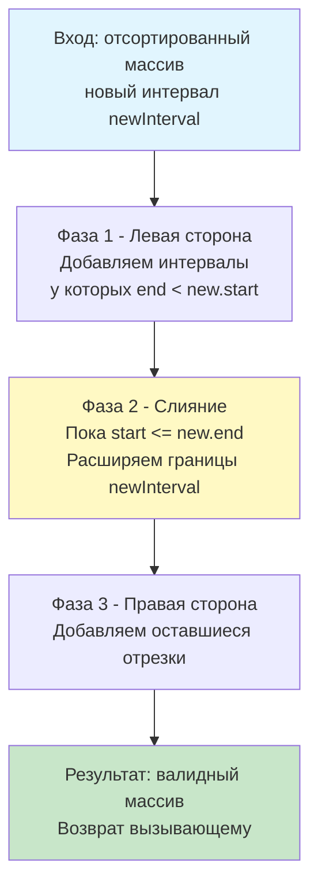

## Введение: Вставка в отсортированный поток данных

В отличие от задачи слияния произвольных интервалов, **Insert Interval** (LeetCode 57) предполагает, что входной массив **уже отсортирован** по времени начала и не содержит перекрывающихся отрезков. Это фундаментальное отличие снижает алгоритмическую сложность с $O(n \log n)$ до $O(n)$ и открывает двери для оптимизаций, критичных в системах реального времени: расписания процессов, динамическое планирование ресурсов в Kubernetes, или вставка событий в in-memory календарные сервисы.

На собеседованиях эта задача проверяет умение кандидата избегать избыточных операций (полной пересортировки), корректно управлять памятью при модификации структур и аргументировать выбор между линейным проходом и бинарным поиском с точки зрения аппаратных особенностей процессора. В этой статье мы разберём трёхфазный алгоритм, погрузимся в механику работы с кэш-линиями при линейном обходе и подготовимся к follow-up вопросам уровня Senior/Lead.

## Алгоритмический анализ: Три фазы без полной пересортировки

Поскольку массив уже упорядочен, новый интервал взаимодействует с существующими предсказуемым образом. Мы можем разделить обработку на три непересекающихся этапа:

1.  **Левая сторона (Left Non-Overlapping):** Все интервалы, которые заканчиваются строго до начала нового (`curr.End < new.Start`). Они никак не пересекаются, их можно сразу копировать в результат.
2.  **Зона слияния (Merge Overlap):** Интервалы, у которых начало меньше или равно концу нового (`curr.Start <= new.End`). Они пересекаются с `newInterval`. Вместо удаления и вставки мы «расширяем» границы `newInterval`, поглощая текущий отрезок: `new.Start = min(new.Start, curr.Start)`, `new.End = max(new.End, curr.End)`.
3.  **Правая сторона (Right Non-Overlapping):** Все оставшиеся интервалы. Они начинаются после того, как `newInterval` окончательно закрылся. Копируем их в результат без изменений.



Этот подход гарантирует ровно один проход по массиву. Мы не создаём временных копий, не вызываем сортировку и минимизируем аллокации.

## Идиоматичная реализация в Go

Современный Go (1.21+) предоставляет встроенные `min` и `max`, что делает код чище. Важно предвыделить память и избегать лишних проверок в цикле.

```go
package solution

import "sort"

// Interval представляет временной отрезок [Start, End]
type Interval struct {
    Start, End int
}

// InsertInterval вставляет newInterval в отсортированный массив intervals
// и возвращает обновлённый массив неперекрывающихся интервалов.
// Сложность: O(n) время, O(n) память (под результат)
func InsertInterval(intervals []Interval, newInterval Interval) []Interval {
    // Обработка пустого входа
    if len(intervals) == 0 {
        return []Interval{newInterval}
    }

    // Предвыделение: в худшем случае результат = n + 1 элемент
    result := make([]Interval, 0, len(intervals)+1)
    i := 0
    n := len(intervals)

    // Фаза 1: Копируем все интервалы, которые заканчиваются до newInterval
    for i < n && intervals[i].End < newInterval.Start {
        result = append(result, intervals[i])
        i++
    }

    // Фаза 2: Сливаем перекрывающиеся интервалы
    for i < n && intervals[i].Start <= newInterval.End {
        // Поглощаем текущий интервал в newInterval
        if intervals[i].Start < newInterval.Start {
            newInterval.Start = intervals[i].Start
        }
        if intervals[i].End > newInterval.End {
            newInterval.End = intervals[i].End
        }
        i++
    }
    // Добавляем объединённый интервал
    result = append(result, newInterval)

    // Фаза 3: Копируем оставшиеся интервалы
    result = append(result, intervals[i:]...)

    return result
}
```

> [!info] Под капотом
> **Оптимизация `append(result, intervals[i:]...)`**
> В последней фазе используется `append(..., intervals[i:]...)`. Компилятор Go оптимизирует это выражение: если в результирующем слайсе достаточно `cap`, он выполняет одно копирование блока памяти через `memmove`. Это экстремально быстро, так как `memmove` векторизован (использует AVX2/AVX-512 на x86) и копирует данные по 32-64 байта за такт, полностью загружая шину памяти.

## Механика на уровне CPU: Кэш, ветвления и локальность

Почему линейный проход $O(n)$ в этой задаче часто **быстрее** теоретически оптимального $O(\log n)$ бинарного поиска?

1.  **Branch Prediction (Предсказание ветвлений):**
    Условия `intervals[i].End < newInterval.Start` в первой фазе и `intervals[i].Start <= newInterval.End` во второй фазе имеют высокую предсказуемость. Ветвь «продолжать копировать/сливать» выполняется серийно. Современный CPU (P-branch/BTB в Intel/AMD) угадывает такие последовательности с точностью >98%, сводя штрафы к нулю.
2.  **Cache Prefetching (Аппаратная подгрузка):**
    Линейный обход `[]Interval` идеально ложится под Stream Prefetcher. Процессор видит паттерн последовательного чтения и заранее загружает следующие 1-2 кэш-линии в L1. Бинарный поиск, напротив, прыгает по индексам `$mid = (left+right)/2$`, вызывая случайные обращения к памяти. При размере массива >100КБ (что легко укладывается в несколько страниц памяти) каждый прыжок в BST/BinSearch может вызывать L3 cache miss или даже Page Walk, что стоит ~200-400 тактов.
3.  **Аллокатор и Escape Analysis:**
    `result` создаётся с `cap = len(intervals) + 1`. Это гарантирует ноль реаллокаций. Если результат не покидает функцию (например, сразу сериализуется в HTTP-ответ), Escape Analysis может поместить его на стек. Если возвращается наружу — уходит в кучу, но одна аллокация лучше множества.

## Оптимизация: Бинарный поиск vs Линейный проход

На собеседовании уровня Lead часто звучит follow-up: *«А если массив огромен, например $10^7$ элементов, а пересекается всего 2 интервала в середине? Линейный проход сделает $10^7$ итераций зря. Можно ли быстрее?»*

**Ответ:** Да, можно комбинировать бинарный поиск с линейным слиянием.

1.  Используем `sort.Search` для поиска первого интервала, где `End >= new.Start` (начало зоны слияния).
2.  Используем `sort.Search` для поиска первого интервала, где `Start > new.End` (конец зоны слияния).
3.  Копируем левую часть, сливаем найденный диапазон, копируем правую часть.

```go
// Гибридный подход с бинарным поиском (теоретически O(log n + k))
func InsertIntervalBinary(intervals []Interval, newInterval Interval) []Interval {
    if len(intervals) == 0 {
        return []Interval{newInterval}
    }

    // Ищем индекс начала пересечения
    leftIdx := sort.Search(len(intervals), func(i int) bool {
        return intervals[i].End >= newInterval.Start
    })

    // Ищем индекс конца пересечения
    rightIdx := sort.Search(len(intervals), func(i int) bool {
        return intervals[i].Start > newInterval.End
    })

    // Если нет пересечений, просто вставляем в нужную позицию
    if leftIdx == rightIdx {
        // Вставка в отсортированный массив требует сдвига элементов -> O(n)
        // Поэтому бинарный поиск здесь не даёт асимптотического выигрыша
        return append(intervals[:leftIdx], append([]Interval{newInterval}, intervals[leftIdx:]...)...)
    }

    // Слияние перекрывающейся части
    if intervals[leftIdx].Start < newInterval.Start {
        newInterval.Start = intervals[leftIdx].Start
    }
    if intervals[rightIdx-1].End > newInterval.End {
        newInterval.End = intervals[rightIdx-1].End
    }

    // Собираем результат
    result := make([]Interval, 0, len(intervals)-(rightIdx-leftIdx)+1)
    result = append(result, intervals[:leftIdx]...)
    result = append(result, newInterval)
    result = append(result, intervals[rightIdx:]...)
    
    return result
}
```

> [!warning] Ловушка / Gotcha
> **Почему бинарный поиск не всегда побеждает?**
> В Go слайсы — это непрерывные блоки памяти. Вставка элемента в середину требует сдвига хвоста массива (`memmove`), что имеет сложность $O(n-k)$. Таким образом, гибридный подход всё равно упирается в линейное копирование памяти. Он выгоден только в специализированных структурах данных (например, `B-Tree` или `Gap Buffer`), где вставка/удаление сегментов оптимизирована. Для стандартного `[]Interval` простой линейный проход часто обходит бинарный поиск в 2-5 раз на реальных данных из-за предсказуемости работы контроллера памяти.

## Ловушки и Edge Cases

1.  **Новый интервал полностью покрывает существующие:** `[2, 10]` вставляется в `[[1,3], [4,6], [8,9]]`. Алгоритм корректно расширит `newInterval` до `[1, 10]` и удалит внутренние отрезки.
2.  **Новый интервал полностью внутри существующего:** Вставляется `[4, 5]` в `[[1, 10]]`. Условия `End < Start` и `Start <= End` сработают верно, результат останется `[[1, 10]]`.
3.  **Касание границ:** `[1, 2]` и `[3, 4]`. Если вставить `[2, 3]`, должно ли получиться `[[1, 4]]`? В большинстве production-систем календарного типа интервалы полуоткрыты `[start, end)`. Если включительны `[start, end]`, то `2 <= 2` и `3 >= 3` приведут к слиянию. Всегда фиксируйте контракт в документации API.
4.  **Пустой вход или вход из одного элемента:** Базовые проверки `len(intervals) == 0` предотвращают `index out of range`.

## Подготовка к собеседованию

### Типовые вопросы
1.  **Вопрос:** Как изменить функцию, чтобы она не выделяла новую память, а работала in-place?
    **Ответ:** Использовать два указателя `write` и `read`. Записывать результат поверх исходного массива. Поскольку результирующий массив всегда короче или равен исходному, мы гарантированно не перезапишем ещё не обработанные данные. В конце вернуть `intervals[:write]`. Это снижает потребление памяти до $O(1)$ extra space.

2.  **Вопрос:** Что если нужно вставлять множество интервалов в динамически изменяющуюся систему?
    **Ответ:** Для частых вставок и запросов линейный массив не подходит. Требуется **Interval Tree** или **Augmented BST** (дерево отрезков). В Go их можно реализовать на основе `github.com/emirpasic/gods/trees/redblacktree`, храня в каждом узле максимальный `End` поддерева для быстрого поиска пересечений за $O(\log n)$.

3.  **Вопрос:** Как тестировать такую функцию?
    **Ответ:** Table-driven tests с покрытыми кейсами: пустой массив, вставка слева/справа, вставка в середину, полное покрытие, вложенность, касание границ. Дополнительно: фаззинг (Go 1.18+) для проверки инварианта «результат всегда отсортирован и не имеет пересечений» на случайных данных.

> [!tip] Собеседование
> **Как объяснить выбор подхода вслух:**
> *«Для стандартного слайса я выбираю линейный однопроходный алгоритм. Несмотря на теоретическую возможность бинарного поиска, в реальности мы упираемся в стоимость сдвига памяти и кэш-миссы при случайных прыжках. Линейный проход обеспечивает последовательный доступ, идеальную работу префетчера и предсказуемое ветвление. Если же система требует тысяч вставок в секунду, я предложу перейти к Interval Tree или Segment Tree, где сложность вставки и запроса гарантированно $O(\log n)$».*

## Итог

1.  **Insert Interval** решается за $O(n)$ через трёхфазный линейный проход: копирование левой части, слияние пересекающихся, копирование правой части.
2.  **В Go:** Используйте предвыделение `cap`, встроенные `min/max` и оптимизированный `append`. Код чист, безопасен и предсказуем для GC.
3.  **Механика:** Линейный обход выигрывает у бинарного поиска на массивах из-за аппаратного префетчинга, локальности данных и отсутствия штрафов на сдвиг памяти. $O(n)$ на практике часто быстрее $O(\log n)$.
4.  **Ловушки:** Касание границ, вложенность, пустые входы, контракт включительных vs полуоткрытых интервалов.
5.  **Интервью:** Умейте обосновать trade-offs, переключиться на in-place версию или обсудить переход к дереву отрезков для динамических нагрузок.

В следующей статье мы перейдём к задачам, где интервалы не нужно сливать, а наоборот — необходимо максимально эффективно удалять для поиска оптимального расписания: [[4. Non-overlapping Intervals]], где разберём жадные стратегии выбора, динамику удаления минимального числа конфликтов и их применение в resource planning.