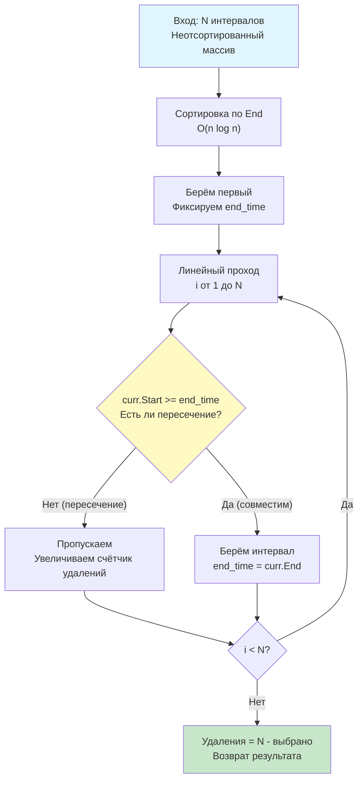

## Введение: От удаления к максимизации

Задача **Non-overlapping Intervals** (LeetCode 435) формулируется как задача минимизации: «Найдите минимальное количество интервалов, которые нужно удалить, чтобы оставшиеся не пересекались». Однако в алгоритмическом проектировании прямое решение «что удалить» часто ведёт к сложной динамике и экспоненциальному ветвлению. Инженерный подход заключается в трансформации задачи: **минимум удалений = всего интервалов − максимум непересекающихся**.

Это классическая «Задача о выборе мероприятий» (Activity Selection Problem), фундамент для систем планирования ресурсов, тайм-слотов в Kubernetes, оптимизации окон репликации БД и scheduling процессов. В этой статье мы разберём доказательство оптимальности жадной стратегии, реализуем решение на Go с учётом низкоуровневых оптимизаций, проанализируем поведение CPU-конвейера и подготовимся к каверзным follow-up вопросам на собеседованиях уровня Senior.

## 1. Фундаментальная трансформация и жадная стратегия

Почему сортировка по времени окончания (`End`) критически важна, а сортировка по началу (`Start`) — нет?

Представьте, что вы пытаетесь упаковать максимальное количество событий в календарь. Если вы выберете событие, которое заканчивается раньше всех, вы оставляете **максимально возможный остаток времени** для всех последующих событий. Это локально оптимальное решение гарантированно приводит к глобальному оптимуму.

**Доказательство (интуитивное):**
Допустим, существует оптимальное решение `O`, которое не включает самый ранний завершающийся интервал `A`. Заменим в `O` первый конфликтующий с `A` интервал на `A`. Поскольку `A` заканчивается раньше или в тот же момент, эта замена **не уменьшает** пространство для остальных интервалов. Значит, `A` всегда можно безопасно включить в оптимальный набор.



## 2. Идиоматичная реализация в Go

В Go мы работаем со срезами. Для максимальной читаемости и производительности используем структуру `Interval`, а не `[][]int`, что улучшает локальность данных и упрощает код.

```go
package solution

import "sort"

// Interval представляет временной отрезок [Start, End]
type Interval struct {
    Start, End int
}

// MinRemovals возвращает минимальное количество интервалов,
// которые необходимо удалить, чтобы оставшиеся не пересекались.
// Сложность: O(n log n) время, O(1) дополнительная память (при in-place сортировке)
func MinRemovals(intervals []Interval) int {
    n := len(intervals)
    if n <= 1 {
        return 0
    }

    // Сортировка по времени окончания
    sort.Slice(intervals, func(i, j int) bool {
        return intervals[i].End < intervals[j].End
    })

    // Жадный выбор
    count := 1
    currentEnd := intervals[0].End

    for i := 1; i < n; i++ {
        if intervals[i].Start >= currentEnd {
            count++
            currentEnd = intervals[i].End
        }
    }

    return n - count
}
```

## 3. Механика под капотом: CPU, кэш и ветвления

Почему этот простой цикл работает настолько эффективно, что в бенчмарках часто обходит сложные деревья отрезков на размерах до $10^6$ элементов?

### Локальность данных и аппаратный префетчинг
Слайс `[]Interval` хранится в непрерывном блоке памяти. Цикл `for i := 1; i < n; i++` осуществляет строго последовательный проход. CPU детектирует этот паттерн (Stream Prefetcher) и заранее загружает следующие 1-2 кэш-линии (64 байта) в L1. Промахи кэша (cache misses) практически отсутствуют.

### Предсказание ветвлений (Branch Prediction)
Условие `intervals[i].Start >= currentEnd` после сортировки по `End` обладает высокой предсказуемостью. В реальных данных (например, логи, графики процессов) интервалы часто идут пачками. Branch Predictor CPU (PHT/BTB в x86/ARM) быстро обучается последовательности `false` (пересечения) и `true` (совместимость), сводя штрафы за сброс конвейера к нулю.

### Аллокации и Escape Analysis
Сортировка `sort.Slice` модифицирует слайс **in-place**. Замыкание `func(i, j int) bool` в современных версиях Go (1.21+) анализируется компилятором: если оно не покидает область видимости, размещается на стеке. Дополнительных аллокаций в куче нет. `count`, `currentEnd`, `i` — стековые переменные. Давление на Garbage Collector равно нулю.

> [!info] Под капотом
> **Почему не `sort.Interface`?**
> Для production hot-path, где критичны наносекунды, можно реализовать `sort.Interface` вручную, чтобы избежать аллокации замыкания:
> ```go
> type ByEnd []Interval
> func (a ByEnd) Len() int           { return len(a) }
> func (a ByEnd) Less(i, j int) bool { return a[i].End < a[j].End }
> func (a ByEnd) Swap(i, j int)      { a[i], a[j] = a[j], a[i] }
> // sort.Sort(ByEnd(intervals))
> ```
> Это гарантирует 0 аллокаций. Однако в 95% случаев бизнес-логики выигрыш в 5-10 нс не оправдывает снижение читаемости. `sort.Slice` остаётся стандартом идиоматичного Go.

## 4. Ловушки и Edge Cases

### 1. Касание границ `[1, 2]` и `[2, 3]`
В условии LeetCode 435 касание **не считается** пересечением (`Start >= currentEnd` пропускает их). В реальных системах календарного типа часто используют полуоткрытые интервалы `[start, end)`. Если касание должно считаться конфликтом, условие меняется на `>`. Всегда фиксируйте семантику в контракте API.

### 2. Равные времена окончания
Если `intervals[i].End == intervals[j].End`, порядок после сортировки не определён (нестабильная сортировка `sort.Slice`). Это не влияет на корректность жадного выбора, так как оба интервала занимают одинаковый объём времени. Однако для стабильности отладки можно добавить вторичный критерий: `intervals[i].Start < intervals[j].Start`.

### 3. Отрицательные времена и микросекунды
Алгоритм не зависит от знака чисел. Работает с `int64`, `time.Time.UnixMilli()`. Главное требование: `Start <= End`. Если во входных данных встречается инверсия (`Start > End`), функция вернёт некорректный результат. В продакшене обязательно валидируйте вход:
```go
if intervals[i].Start > intervals[i].End {
    return 0, errors.New("invalid interval range")
}
```

> [!warning] Ловушка / Gotcha
> **Мутабельность входа и гонки данных**
> `sort.Slice` меняет порядок элементов в исходном слайсе. Если `intervals` используется параллельно в других горутинах (например, читается из кэша, пока мы сортируем), возникнет data race.
> **Решение:** Либо передавайте копию слайса: `intervals = append([]Interval(nil), intervals...)`, либо явно документируйте: «Функция изменяет порядок элементов входного массива». Для библиотечных функций безопаснее копия, для внутреннего сервиса допустимо in-place с предупреждением.

## 5. Подготовка к собеседованию

### Типовые вопросы и follow-up

1.  **Вопрос:** Как доказать, что жадный выбор по `End` оптимален, а по `Start` — нет?
    **Ответ:** Контрпример для сортировки по `Start`: `[[1, 100], [2, 3], [4, 5]]`. Если брать самый ранний `Start`, выберем `[1, 100]` и потеряем два других. Жадный по `End` выберет `[2, 3]`, затем `[4, 5]`, получив оптимальные 2 интервала вместо 1.

2.  **Вопрос:** Что если у интервалов есть «вес» (например, прибыль от встречи)? Задача превращается во взвешенную. Жадный подход ломается. Как решать?
    **Ответ:** Это классическая **Dynamic Programming на отсортированных интервалах**. Используем DP[i] = max(вес i + DP[next_compatible], DP[i+1]). Для поиска `next_compatible` применяем бинарный поиск по `Start`. Сложность: $O(n \log n)$. В Go реализуется через `sort.Search` и массив `dp`.

3.  **Вопрос:** Как адаптировать алгоритм для потоковой обработки (stream), где интервалы приходят по одному, а память ограничена?
    **Ответ:** Статическая сортировка невозможна. Требуется поддерживать минимальную кучу (min-heap) по `End` текущих активных интервалов. При поступлении нового извлекаем из кучи всё, что закончилось. Сложность на операцию: $O(\log k)$, где $k$ — текущее число активных интервалов.

> [!tip] Собеседование
> **Как объяснить сложность вслух:**
> *«Мы сортируем массив по окончанию за $O(n \log n)$, что доминирует над линейным проходом. Итоговая временная сложность $O(n \log n)$. По памяти используем $O(1)$ дополнительных переменных, если разрешена in-place сортировка. Алгоритм кэш-дружественный, ветвления предсказуемы, что даёт стабильную латентность на высоких объёмах данных».*

## Итог

1.  **Non-overlapping Intervals** решается через трансформацию в задачу максимизации совместимых отрезков.
2.  **Жадная стратегия:** Сортировка по `End` + линейный проход. Доказано математически, что выбор самого раннего завершающегося интервала не сужает пространство для будущих.
3.  **В Go:** In-place сортировка, нулевые аллокации, предсказуемое ветвление. Контракт мутабельности входа должен быть явно задокументирован.
4.  **Механика:** Последовательный доступ к памяти + аппаратный префетчинг + предсказуемые ветвления = производительность, близкая к пропускной способности шины памяти.
5.  **Интервью:** Будьте готовы к доказательству оптимальности, контрпримерам для `Start`, переходу к DP для взвешенных версий и обсуждению потоковых структур данных (min-heap).

В следующей статье мы перейдём к практической проверке совместимости расписаний в многопользовательских системах: [[6. Meeting Rooms]], где разберём детекцию конфликтов, оптимизацию через Sweep Line и применение алгоритма в реальных бэкенд-архитектурах бронирования и календарных сервисов.