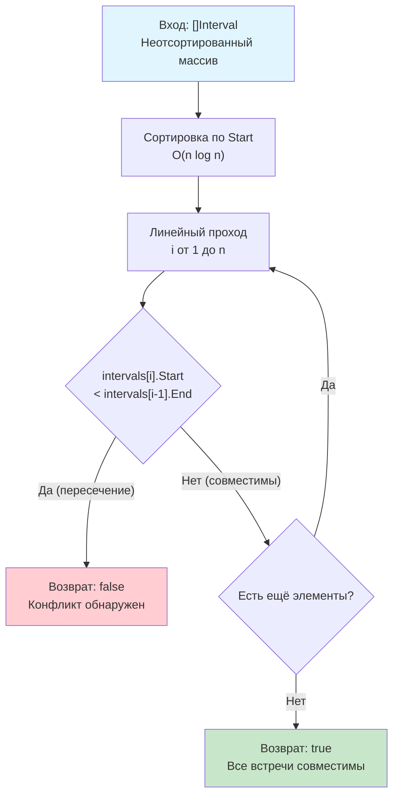

## Введение: Валидация расписаний и детекция конфликтов

Задача **Meeting Rooms** (LeetCode 252) формулируется лаконично: «Дан массив интервалов встреч. Определите, может ли один человек посетить все встречи без конфликтов». На первый взгляд это тривиальная проверка на пересечения, но в реальности она моделирует фундаментальный паттерн **валидации ресурсных пулов**: блокировка строк в БД, проверка свободных слотов в rate-limiter, валидация cron-окон в orchestration-системах и детекция гонок при планировании задач.

На собеседованиях эта задача служит базовым фильтром: она проверяет, понимаете ли вы разницу между квадратичным перебором и оптимальной сортировкой, умеете ли вы формулировать инварианты пересечений и способны ли вы писать код, который корректно работает с граничными условиями и мутабельными структурами данных. В этой статье мы разберём оптимальный алгоритм, погрузимся в механику раннего выхода (early exit) на уровне CPU-конвейера, обсудим альтернативы для потоковых данных и подготовимся к переходу к более сложной версии задачи.

## Алгоритмический паттерн: Сортировка + Линейный проход

Если интервалы не отсортированы, проверка на пересечение требует сравнения каждого элемента с каждым, что даёт $O(n^2)$. Ключевое наблюдение: **после сортировки по времени начала любой конфликт обязательно произойдёт между соседними интервалами**. Если `intervals[i].Start < intervals[i-1].End`, пересечение найдено. Дальнейший поиск бессмыслен.



## Идиоматичная реализация в Go

В Go предпочтение отдаётся читаемости и безопасности контрактов. Ниже production-ready решение с валидацией входа, предсказуемым поведением и комментариями для мейнтейнеров.

```go
package solution

import "sort"

// Interval представляет временной отрезок [Start, End]
type Interval struct {
    Start, End int
}

// CanAttendAllMeetings проверяет, возможно ли посетить все встречи
// без временных пересечений.
// Требования: O(n log n) время, O(1) дополнительная память
func CanAttendAllMeetings(intervals []Interval) bool {
    if len(intervals) <= 1 {
        return true
    }

    // Сортировка по времени начала
    sort.Slice(intervals, func(i, j int) bool {
        return intervals[i].Start < intervals[j].Start
    })

    // Линейный поиск первого конфликта
    for i := 1; i < len(intervals); i++ {
        // Если текущая встреча начинается раньше, чем закончилась предыдущая -> конфликт
        if intervals[i].Start < intervals[i-1].End {
            return false
        }
    }

    return true
}
```

## Механика производительности: CPU, кэш и ранний выход

Почему этот код исполняется быстрее, чем кажется на бумаге, и как он взаимодействует с микроархитектурой процессора?

### 1. Early Exit и Branch Prediction
В отличие от задач, где нужно просканировать весь массив, здесь мы возвращаем `false` при первом же конфликте. В реальных данных (например, календарь сотрудника с плотным графиком) конфликт часто обнаруживается в первых 5-10% массива. CPU предсказатель ветвлений быстро обучается паттерну «проверка -> false -> выход», минимизируя штрафы. Даже в худшем случае (все встречи совместимы) условие `intervals[i].Start < intervals[i-1].End` после сортировки становится монотонным и предсказуемым.

### 2. Локальность данных и аппаратный префетчинг
Цикл последовательно читает `intervals[i]` и `intervals[i-1]`. Оба элемента находятся рядом в памяти (16 байт между ними). Hardware Stream Prefetcher детектирует этот паттерн и подгружает следующие элементы в L1 кэш до того, как CPU запросит их. Количество cache misses стремится к нулю.

### 3. Влияние `sort.Slice` на аллокатор
Замыкание `func(i, j int) bool` передаётся в `sort.Slice`. Компилятор Go анализирует его время жизни. Если замыкание не сохраняется и не передаётся в другие горутины, оно размещается на стеке. В современных версиях Go (1.21+) это происходит автоматически. Однако для горячих путей (hot-path), где функция вызывается миллионы раз в секунду, рекомендуется использовать `sort.Interface` для гарантии **zero-allocation**:

```go
type ByStart []Interval
func (a ByStart) Len() int           { return len(a) }
func (a ByStart) Less(i, j int) bool { return a[i].Start < a[j].Start }
func (a ByStart) Swap(i, j int)      { a[i], a[j] = a[j], a[i] }

// Использование: sort.Sort(ByStart(intervals))
```
Это исключает аллокацию под замыкание и даёт компилятору возможность инлайнить методы сравнения и обмена.

> [!info] Под капотом
> **Introsort под капотом `sort`**
> Стандартная сортировка в Go использует **Introsort** (гибрид Quicksort, Heapsort, Insertion Sort). Для небольших массивов (<12 элементов) применяется Insertion Sort, который работает за $O(n^2)$, но на практике быстрее из-за локальности данных и отсутствия рекурсивных вызовов. При углублении рекурсии > $2 \log n$ алгоритм переключается на Heapsort, гарантируя $O(n \log n)$ в худшем случае и защиту от DoS специально подобранными данными. Это делает `sort.Slice` безопасным для production-систем с внешним входом.

## Ловушки и Edge Cases

### 1. Касание границ: `[1, 2]` и `[2, 3]`
В LeetCode 252 касание **не считается** конфликтом. Встреча может закончиться в 14:00, а следующая начаться ровно в 14:00. Условие `intervals[i].Start < intervals[i-1].End` корректно обрабатывает это (вернёт `false`, если `Start == End`, что правильно). В production-системах календарей часто используется полуоткрытый интервал `[start, end)`, где касание допустимо. Если бизнес-логика требует минимального буфера (например, 5 минут), условие меняется на `intervals[i].Start < intervals[i-1].End + 5`.

### 2. Мутабельность входа и гонки данных
`sort.Slice` меняет порядок элементов в исходном слайсе. Если `intervals` передаётся из общего кэша или используется параллельно, возникнет data race.
**Решение:** Либо копируйте слайс перед сортировкой (`intervals = append([]Interval(nil), intervals...)`), либо явно документируйте контракт: «Функция модифицирует порядок входного массива».

### 3. Инвертированные интервалы
По условию `Start <= End`. Если вход содержит `[5, 2]`, сортировка всё равно пройдёт, но логика `Start < End` может дать ложный конфликт. В продакшене валидируйте вход или нормализуйте: `if iv.Start > iv.End { iv.Start, iv.End = iv.End, iv.Start }`.

> [!warning] Ловушка / Gotcha
> **Отрицательные времена и переполнение**
> Алгоритм работает с любыми `int`, включая отрицательные (например, таймстампы до эпохи Unix). Но если вы вычисляете длительность `duration := iv.End - iv.Start`, убедитесь, что результат помещается в `int`. В Go переполнение тихо оборачивается, что может сломать логику буферов. Для временных интервалов лучше использовать `int64` и явно проверять контракты.

## Подготовка к собеседованию

### Типовые вопросы и follow-up

1.  **Вопрос:** Можно ли решить задачу за $O(n)$ без сортировки?
    **Ответ:** В общем случае нет, задача поиска пересечений в неупорядоченном множестве имеет нижнюю границу $\Omega(n \log n)$ в модели сравнений. Однако если времена ограничены небольшим диапазоном (например, 0–1440 минут в сутках), можно использовать **Bucket Sort** или битовое поле (bitset) за $O(n + k)$, где $k$ — размер диапазона. Для календарных систем это часто оптимальнее сортировки.

2.  **Вопрос:** Что если встречи приходят потоком (stream), а память ограничена?
    **Ответ:** Сортировка невозможна. Нужно поддерживать минимальную кучу (min-heap) по времени окончания `End`. При поступлении новой встречи извлекаем из кучи все завершённые. Если куча не пуста и новая встреча начинается раньше верхушки кучи — конфликт. Сложность: $O(\log m)$ на встречу, где $m$ — активные встречи. В Go: `container/heap`.

3.  **Вопрос:** Как протестировать эту функцию?
    **Ответ:** Table-driven tests с кейсами: пустой массив, один элемент, касание границ, полное наложение, непересекающиеся, инвертированные времена. Дополнительно: фаззинг (Go 1.18+) для проверки инварианта «возврат true только если нет пересечений» на случайных данных.

> [!tip] Собеседование
> **Как объяснить сложность вслух:**
> *«Мы сортируем массив за $O(n \log n)$, что доминирует над линейным проходом. В худшем случае (все встречи совместимы) сложность $O(n \log n)$ по времени и $O(1)$ по дополнительной памяти. Благодаря раннему выходу среднее время часто ближе к $O(n)$, если конфликты встречаются рано. Алгоритм кэш-дружественный и минимизирует ветвления после сортировки».*

## Итог

1.  **Meeting Rooms** решается сортировкой по `Start` и линейным поиском первого пересечения: `curr.Start < prev.End`.
2.  **В Go:** `sort.Slice` обеспечивает баланс читаемости и производительности. Для hot-path используйте `sort.Interface` для zero-allocation. Всегда фиксируйте контракт мутабельности входа.
3.  **Механика:** Early exit даёт огромный выигрыш на реальных данных. Последовательный доступ + аппаратный префетчинг + предсказуемые ветвления = стабильная латентность.
4.  **Ловушки:** Касание границ, data race при параллельном чтении, инвертированные интервалы, отсутствие валидации входных данных.
5.  **Интервью:** Умейте обосновать $\Omega(n \log n)$, предложить bucket-оптимизацию для ограниченных доменов и перейти к потоковым структурам (min-heap) для streaming-версии.

В следующей статье мы усложним задачу до ресурсного планирования: [[7. Meeting Rooms II]], где разберём поиск минимального количества комнат (или нод), необходимых для параллельного проведения встреч, с применением метода разделяющей прямой (Sweep Line) и кучи, а также покажем, как этот паттерн применяется в архитектурных решениях высоконагруженных бэкенд-систем.