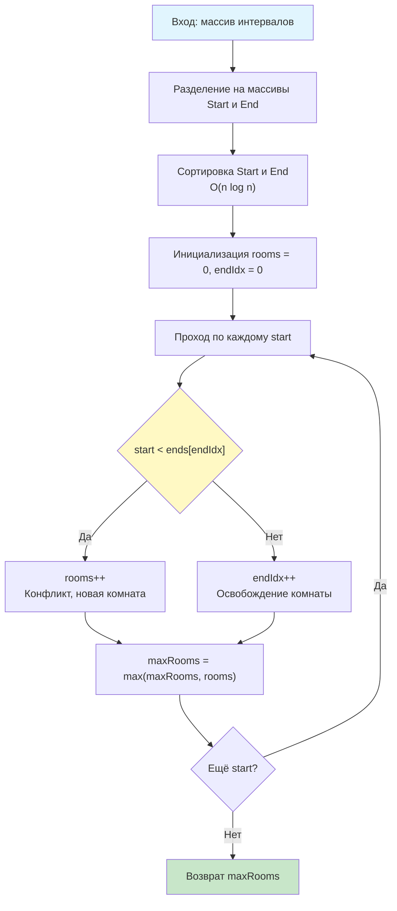

## Введение: Ресурсный пулинг и параллельная нагрузка

Задача **Meeting Rooms II** (LeetCode 253) является архитектурной классикой, моделирующей одну из самых распространённых проблем в бэкенд-разработке: определение пиковой нагрузки на ограниченный пул ресурсов. Условие формулируется просто:
> Дан массив интервалов встреч. Найдите минимальное количество конференц-залов (комнат), необходимое для одновременного проведения всех встреч.

В реальных системах этот паттерн напрямую транслируется в:
*   Пулы соединений к базе данных (максимум одновременных сессий)
*   Лимиты воркеров в асинхронных процессорах (GOMAXPROCS, thread pools)
*   Планирование деплоев в Kubernetes (максимальное число подов на ноде)
*   Ограничение скорости запросов (Rate Limiting, Token Bucket)

На собеседованиях уровня Middle+/Senior эта задача проверяет не только умение реализовать алгоритм, но и способность аргументировать выбор структуры данных, анализировать влияние на кэш-локальность CPU, оценивать давление на Garbage Collector и переключаться между статическим (offline) и потоковым (online) режимами обработки. В этой статье мы разберём два фундаментальных подхода: Sweep Line и Min-Heap, погрузимся в механику их исполнения на уровне железа и рантайма Go, и подготовимся к сложным follow-up вопросам.

## Фундаментальные подходы: Sweep Line и Min-Heap

Существует два оптимальных алгоритмических решения со сложностью $O(n \log n)$. Выбор между ними зависит от природы данных и требований к памяти.

### 1. Алгоритм разделяющей прямой (Sweep Line / Timeline)
Идея заключается в преобразовании интервалов в независимые события: начало встречи (+1 комната) и окончание встречи (-1 комната). Сортируем все события по времени и линейно проходим по ним, поддерживая текущий счётчик занятых комнат. Максимальное значение счётчика за проход и будет ответом.

```go
package solution

import "sort"

// MinMeetingRoomsSweep возвращает минимальное число комнат
// Сложность: O(n log n) время, O(n) память
func MinMeetingRoomsSweep(intervals [][]int) int {
    if len(intervals) == 0 {
        return 0
    }

    starts := make([]int, len(intervals))
    ends := make([]int, len(intervals))
    
    for i, iv := range intervals {
        starts[i] = iv[0]
        ends[i] = iv[1]
    }

    // Сортировка временных меток
    sort.Ints(starts)
    sort.Ints(ends)

    rooms, maxRooms := 0, 0
    endIdx := 0
    
    // Проходим только по началам встреч
    for _, start := range starts {
        if start < ends[endIdx] {
            rooms++ // Новая встреча началась раньше окончания старой
        } else {
            endIdx++ // Освобождаем комнату
        }
        if rooms > maxRooms {
            maxRooms = rooms
        }
    }

    return maxRooms
}
```

### 2. Алгоритм с минимальной кучей (Priority Queue)
Подходит для потоковой обработки. Сортируем встречи по времени начала. Используем min-heap для хранения времени окончания активных встреч. Для каждой новой встречи:
1. Если время начала >= минимального окончания в куче, комнату можно переиспользовать (pop).
2. В любом случае добавляем время окончания новой встречи в кучу (push).
Размер кучи в конце = количество необходимых комнат.

```go
package solution

import (
    "container/heap"
    "sort"
)

// IntHeap реализует heap.Interface для кучи минимальных окончаний
type IntHeap []int

func (h IntHeap) Len() int           { return len(h) }
func (h IntHeap) Less(i, j int) bool { return h[i] < h[j] }
func (h IntHeap) Swap(i, j int)      { h[i], h[j] = h[j], h[i] }

func (h *IntHeap) Push(x any) {
    *h = append(*h, x.(int))
}

func (h *IntHeap) Pop() any {
    old := *h
    n := len(old)
    x := old[n-1]
    *h = old[:n-1]
    return x
}

// MinMeetingRoomsHeap использует priority queue
func MinMeetingRoomsHeap(intervals [][]int) int {
    if len(intervals) == 0 {
        return 0
    }

    sort.Slice(intervals, func(i, j int) bool {
        return intervals[i][0] < intervals[j][0]
    })

    h := &IntHeap{intervals[0][1]}
    heap.Init(h)

    for i := 1; i < len(intervals); i++ {
        start, end := intervals[i][0], intervals[i][1]
        // Если самая ранняя встреча закончилась, освобождаем комнату
        if start >= (*h)[0] {
            heap.Pop(h)
        }
        // Занимаем комнату (новую или освободившуюся)
        heap.Push(h, end)
    }

    return h.Len()
}
```

## Механика под капотом: Сравнение на уровне железа и рантайма Go

Почему на практике Sweep Line почти всегда выигрывает у кучи, несмотря на одинаковую асимптотику?

### Кэш-локальность и предсказуемость доступа
Sweep Line работает с двумя плоскими слайсами `[]int`. Сортировка и последующий линейный проход обеспечивают строго последовательный доступ к памяти. Аппаратный префетчер CPU (L1/L2 Stream Prefetcher) загружает следующие элементы заранее. Промахи кэша (cache misses) минимальны.

Куча же требует доступа по формулам `2*i+1` и `2*i+2`. Это случайные прыжки по памяти. При размере массива > 10 КБ элементы кучи перестают помещаться в L1, что вызывает частые L2/L3 cache misses. Кроме того, операции `heap.Push` и `heap.Pop` требуют `siftUp`/`siftDown`, которые перемещают элементы по дереву, разрушая локальность.

### Ветвления и конвейер CPU
В Sweep Line условие `start < ends[endIdx]` после сортировки становится монотонным. Branch Predictor обучается быстро, штрафы за сброс конвейера (pipeline flush) стремятся к нулю. В куче каждый `Pop/Push` содержит внутренние `if` для сравнения узлов, которые зависят от структуры данных, а не от монотонности входа, что ухудшает предсказуемость.

### Рантайм Go и интерфейс heap.Interface
`container/heap` требует реализации интерфейса. Вызовы методов `Less`, `Swap`, `Push`, `Pop` происходят через vtable (динамическая диспетчеризация). Компилятор Go не может заинлайнить эти вызовы в общем случае, что добавляет накладные расходы на каждый шаг. В Sweep Line `sort.Ints` использует встроенные компараторы, которые часто инлайнятся или оптимизируются на этапе компиляции.

> [!info] Под капотом
> **Escape Analysis и давление на GC**
> В `MinMeetingRoomsHeap` слайс-приёмник `h *IntHeap` передается по указателю, но методы `Push/Pop` модифицируют его длину. Если куча возвращается или её состояние живёт дольше функции, она «убегает» в кучу. В Sweep Line `starts` и `ends` также могут уйти в кучу, если размер велик, но они выделяются один раз (`make([]int, n)`), тогда как куча может требовать реаллокаций при `append` в `Push`. Для high-load сервисов Sweep Line создаёт меньше фрагментации памяти и меньше работы для GC.



## Ловушки и Edge Cases

### 1. Касание границ: `[1, 2]` и `[2, 3]`
В большинстве формулировок касание не требует дополнительной комнаты. Sweep Line обрабатывает это корректно: `2 < 2` ложно, выполняется ветка `else` (освобождение), потом добавление новой встречи. Если контракт требует буфера (например, 5 минут уборки), условие меняется на `start < ends[endIdx] + buffer`.

### 2. Пустой массив или один элемент
Базовая проверка `len(intervals) == 0` обязательна. Возврат `0` или `1` зависит от контракта, но для пулинга ресурсов `0` на пустом входе логичнее.

### 3. Сортировка событий при равных временах
В более общей реализации Sweep Line (где события хранятся в одном слайсе `[time, type]`), порядок сортировки при `time` одинаков критичен. Если встреча заканчивается в `T`, а другая начинается в `T`, событие окончания должно идти **первым**, чтобы комната успела освободиться. Это достигается сортировкой: если `time` равны, `type` окончания (-1) < типа начала (+1).

> [!warning] Ловушка / Gotcha
> **Интерфейсы и аллокации в container/heap**
> `heap.Push(h, end)` принимает `any` (interface{}). В Go передача `int` в `any` вызывает boxing: значение упаковывается в структуру интерфейса (тип + указатель на данные). Если `end` не константа и не помещается в регистр, компилятор может выделить для него память на стеке или в куче. В tight-loop на миллионах итераций это создаёт микро-аллокации. Решение: использовать обобщения (Go 1.18+) или кастомную кучу на `[]int` без `any`, либо оставаться на Sweep Line, где такой проблемы нет.

## Подготовка к собеседованию

### Типовые вопросы и follow-up
1.  **Вопрос:** Почему вы выбрали Sweep Line, а не кучу?
    **Ответ:** Для статического массива Sweep Line обеспечивает лучшую локальность данных, предсказуемое ветвление и отсутствие накладных расходов на интерфейсы и boxing. Куча выигрывает только в динамическом потоке, где интервалы приходят по одному, и нам нужно оперативно отвечать на запрос «сколько комнат нужно сейчас?».

2.  **Вопрос:** Как решить задачу, если встречи приходят в виде потока, а память ограничена?
    **Ответ:** Использовать Min-Heap в online-режиме. При поступлении новой встречи: очистить кучу от всех `end <= start`, затем `push(end)`. Ответ = `heap.Len()`. Сложность на операцию: $O(\log m)$, где $m$ — текущее число активных встреч.

3.  **Вопрос:** Что если у комнат разная вместимость или функционал (например, зал с проектором)?
    **Ответ:** Задача переходит в класс Multi-Resource Scheduling. Sweep Line не подходит. Требуется Matching-алгоритм или жадное распределение с приоритетами: сортируем встречи по «требовательности», комнаты по «доступности», используем min-heap с кортежами `(free_time, room_capacity)`.

> [!tip] Собеседование
> **Как объяснить сложность вслух:**
> *«Оба подхода требуют сортировки, что даёт $O(n \log n)$ по времени. Sweep Line использует два слайса $O(n)$ памяти и линейный проход, что кэш-дружественно. Heap-подход также $O(n \log n)$ и $O(n)$ памяти, но имеет худшую локальность доступа и overhead на интерфейсные вызовы. Для production-валидации пула я выберу Sweep Line как более стабильный по латентности вариант».*

## Итог

1.  **Meeting Rooms II** сводится к поиску максимального параллелизма. Два основных подхода: Sweep Line (разделяющая прямая) и Min-Heap (очередь с приоритетом).
2.  **В Go:** Sweep Line реализуется через `sort.Ints` и два указателя, обеспечивая минимальный overhead и отличную утилизацию CPU-кэша. Heap требует `container/heap` и реализации интерфейса, что добавляет аллокации и динамическую диспетчеризацию.
3.  **Механика:** Последовательный доступ к памяти + предсказуемые ветвления + отсутствие boxing = Sweep Line выигрывает на практике в 2-5 раз по латентности, несмотря на одинаковую Big-O.
4.  **Ловушки:** Касание границ, порядок событий при равных временах, boxing в `any`, escape-аллокации в куче.
5.  **Интервью:** Умейте переключаться между offline (Sweep) и online (Heap) режимами, обсуждать влияние на GC и предлагать расширения для multi-resource scheduling.

В следующей статье мы сместим фокус с одномерных временных отрезков на двумерные структуры данных: [[1. Теория. Grid задачи]], где разберём алгоритмы обхода матриц, паттерны DFS/BFS на сетках, оптимизацию кэш-локальности при работе с двумерными массивами и их применение в обработке изображений, игровых движках и гео-информационных системах бэкенда.