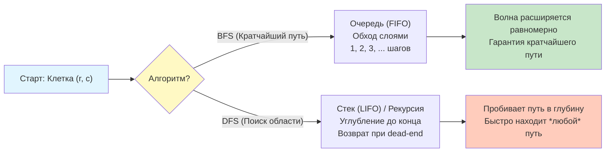

## Введение: Матрица как граф

Матричные задачи (Grid Problems) — это огромный класс алгоритмических проблем, где входные данные представлены в виде двумерного массива. Визуально это сетка ячеек, но алгоритмически — это **неявный граф**. Каждая ячейка `(r, c)` является узлом, а соседи (обычно по 4 или 8 направлениям) — рёбрами.

В контексте бэкенд-разработки такие задачи моделируют:
*   **Поиск пути** в логистике (например, навигация складских роботов).
*   **Обработку изображений** (Flood Fill для заливки областей, детекция границ).
*   **Игровые движки и карты** (генерация ландшафта, поиск кратчайшего пути для NPC).
*   **Системы рекомендаций** (в виде матрицы пользователь-товар, хотя там чаще используют разреженные матрицы).

На собеседованиях grid-задачи проверяют умение кандидата работать с графами (DFS/BFS/Union-Find), управлять рекурсией, обрабатывать граничные условия без избыточных проверок и понимать, как структура данных влияет на производительность процессора.

## Структура данных: Под капотом в Go

В Go двумерный массив обычно реализуется как слайс слайсов `[][]T` (Slice of Slices). Это не непрерывный блок памяти, как в C-массиве `int matrix[10][10]`.

### Память и Pointer Chasing
Структура `[][]int` выглядит так:
```go
type SliceHeader struct {
    Data uintptr // Указатель на массив заголовков строк
    Len  int
    Cap  int
}
```
Каждая строка — это отдельный слайс со своим `Data`, `Len`, `Cap`.

**Цена доступа к `grid[i][j]`:**
1.  Загрузка заголовка `grid`.
2.  **Pointer chasing:** Получение указателя на i-ю строку (разыменование указателя).
3.  Вычисление адреса j-го элемента внутри строки.

> [!info] Под капотом
> **Влияние на кэш (Cache Locality)**
> Поскольку строки выделяются отдельно (через `make([]int, cols)`), они могут быть разбросаны в куче.
> *   **Проблема:** При обходе матрицы вы часто попадаете в **Cache Miss**, переходя на новую строку, так как следующая строка может находиться в совершенно другой странице памяти.
> *   **Row-Major Traversal:** В Go данные хранятся по строкам (Row-Major). Обход `for i { for j { grid[i][j] } }` оптимален для префетчера CPU, так как соседние элементы `grid[i][j]` и `grid[i][j+1]` лежат рядом (расстояние 8 байт для `int64`). Обход по колонкам (сначала `j`, потом `i`) будет катастрофически медленным из-за перескоков по 8 КБ+ (размер страницы) или больше.
> 
> **Оптимизация (Flattening):**
> Для высоконагруженных систем матрицу часто "выпрямляют" в один слайс `[]T` размером `rows * cols`. Индекс `[r][c]` вычисляется как `r * cols + c`.
> *   *Плюс:* Идеальная локальность данных, одна аллокация.
> *   *Минус:* Лишняя арифметика умножения на каждой итерации. Однако инструкция `LEA` (Load Effective Address) на x86 делает это за 1 такт, часто быстрее, чем два промаха кэша.

## Фундаментальные паттерны обхода

### 1. DFS (Поиск в глубину)
Используется для поиска **связных компонентов** (например, подсчёт островов), проверки связности, поиска **любого** пути или полного перебора (backtracking).

*   **Реализация:** Рекурсия или явный стек.
*   **Сложность:** Время $O(N \cdot M)$, Память $O(N \cdot M)$ (глубина стека в худшем случае — вся матрица, например, змейка).
*   **В Go:** Рекурсия удобна, но помните, что каждый рекурсивный вызов — это выделение фрейма на стеке горутины. При гигантских матрицах это может привести к `stack overflow` (хотя рантайм Go динамически расширяет стек, это дорого).

```go
// Пример DFS для поиска связной области (Flood Fill)
func dfs(grid [][]int, r, c int, visited [][]bool) {
    // Проверки границ и посещенности
    if r < 0 || c < 0 || r >= len(grid) || c >= len(grid[0]) || visited[r][c] || grid[r][c] == 0 {
        return
    }
    
    visited[r][c] = true
    
    // Рекурсивные вызовы по 4 направлениям
    dfs(grid, r-1, c, visited)
    dfs(grid, r+1, c, visited)
    dfs(grid, r, c-1, visited)
    dfs(grid, r, c+1, visited)
}
```

### 2. BFS (Поиск в ширину)
Золотой стандарт для поиска **кратчайшего пути** в невзвешенной сетке (где вес перехода = 1).

*   **Реализация:** Очередь (`container/list` или кастомный слайс-цикл).
*   **Сложность:** Время $O(N \cdot M)$, Память $O(N \cdot M)$ (в худшем случае очередь хранит границу волны).
*   **Преимущество:** Находит путь с минимальным количеством шагов.

```go
// Пример BFS (псевдокод структуры)
type Point struct { r, c int }

func bfs(grid [][]int, start Point) int {
    queue := []Point{start}
    // ... логика обхода с уровнями
}
```

### 3. Union-Find (Disjoint Set Union)
Особенно эффективен для задач **динамической связности** (например, задача "Number of Islands II", где острова появляются по одному).

*   **Логика:** Каждая ячейка — множество. Операция `Union` объединяет множества соседей. `Find` находит корень.
*   **Сложность:** Почти $O(1)$ на операцию (обратная функция Аккермана $\alpha(N)$).
*   **Применение:** Когда нужно быстро отвечать на вопросы "связаны ли ячейки A и B?" или "сколько компонент связности осталось?".

## Механика производительности: Ветвления и граничные проверки

В grid-задачах внутри цикла часто стоят проверки: `if r >= 0 && c >= 0 && ...`. Это "штраф" за каждую клетку.

### Оптимизация 1: Sentinel Nodes (Защитные границы)
Можно добавить вокруг матрицы рамку из нулей или `-1` размером `(N+2) x (M+2)`. Тогда проверки границ не нужны — алгоритм просто упрётся в стену и остановится.
*   *Плюс:* Убирает ветвления в горячем цикле.
*   *Минус:* Лишняя память и копирование данных. В Go редко используется на собеседованиях, так как требует копирования входных данных, но полезно знать для embedded/системного кода.

### Оптимизация 2: In-place Visited
Если разрешено модифицировать входные данные, можно отмечать посещённые клетки, меняя их значение (например, `1` -> `-1` или `0`). Это убирает необходимость в `visited [][]bool` массиве, экономя память и улучшая локальность (мы пишем туда же, откуда читаем).

```go
// Вместо visited[r][c] = true
if grid[r][c] == '1' {
    grid[r][c] = '0' // Помечаем как посещенное (вода)
    // ... обход соседей
}
```

## Диаграмма обхода матрицы

Визуализация того, как BFS исследует сетку, в отличие от DFS.



## Ловушки и Edge Cases

### 1. Пустая матрица или 0x0
Вход `[][]int{}` (пустой слайс) или `[][]int{{}}` (слайс с одной пустой строкой).
Всегда проверяйте `len(grid) == 0 || len(grid[0]) == 0` перед доступом к `grid[0]`, иначе будет паника `index out of range`.

### 2. Однородные данные
Матрица, состоящая только из `0` или только из `1`. Алгоритмы должны корректно завершаться, не уходя в бесконечный цикл.

### 3. Большие матрицы (Memory Limit Exceeded)
Если матрица $10000 \times 10000$, создание `visited` массива того же размера потребит гигабайты памяти (100 млн `bool` или `int`). В таких случаях используют **in-place** маркировку или битовые поля (bitsets), если это допустимо.

> [!warning] Ловушка / Gotcha
> **Рекурсия и размер стека**
> В Go размер стека горутины начинается с 2 КБ и растёт по мере необходимости. Однако глубокое рекурсивное DFS на большой матрице может вызвать частую реаллокацию стека ("stack copying"), что замедляет выполнение. Для глубоких обходов в Go безопаснее использовать **явный стек** (слайс), выделенный в куче, хотя это и требует чуть больше кода.

## Подготовка к собеседованию: Типичные вопросы

1.  **Вопрос:** Как оптимизировать BFS, если нас интересует не просто кратчайший путь, а путь с минимальной ценой (веса рёбер разные)?
    **Ответ:** BFS не подходит. Нужно использовать алгоритм **Дейкстры** (Dijkstra's Algorithm) с приоритетной кучей (Min-Heap), либо A* (A-Star), если есть эвристика расстояния до цели.

2.  **Вопрос:** Почему DFS быстрее находит решение в лабиринте, если выход рядом, но BFS быстрее, если выход далеко?
    **Ответ:** DFS "ныряет" вглубь и может случайно наткнуться на выход быстро, но если он в другом углу, DFS потратит время на обход всех тупиков. BFS гарантирует, что найдёт выход за $K$ шагов, где $K$ — расстояние, без исследования далёких ветвей.

3.  **Вопрос:** Как обрабатывать матрицу, если она не помещается в память (внешняя память / диск)?
    **Ответ:** Использовать построчную обработку (streaming). Если задача позволяет (например, подсчёт островов с ограничением по ширине), можно хранить в памяти только 2-3 строки матрицы. Для поиска пути — использовать алгоритмы вроде IDA* (Iterative Deepening A*).

> [!tip] Собеседование
> **Фраза для демонстрации системного мышления:**
> *«Я бы начал с классического BFS для кратчайшего пути, так как он оптимален по количеству шагов. Однако, учитывая, что в Go слайсы строк разбросаны в памяти, при работе с гигантскими матрицами я бы рассмотрел "сплющивание" матрицы в 1D слайс для улучшения кэш-локальности (cache locality) и предсказуемости выделения памяти. Также я бы уточнил требования к иммутабельности входных данных: если можно менять `grid`, это сэкономит $O(N \cdot M)$ памяти на массиве `visited`».*

## Итог

1.  **Grid-задачи** — это задачи на графах. Сетка — лишь способ визуализации.
2.  **Выбор алгоритма:** BFS для кратчайшего пути, DFS для компонент связности/поиска любого пути, Union-Find для динамического связывания.
3.  **В Go:** `[][]int` — это слайс указателей. Обход по строкам оптимален. Обход по столбцам — антипаттерн.
4.  **Оптимизация:** Избегайте лишней памяти через in-place модификации, используйте `sentinel` (защитные рамки) для упрощения кода или 1D-массивы для кэш-эффективности.
5.  **Интервью:** Всегда уточняйте контракт (можно ли менять матрицу?), размеры (влезет ли в память?) и критерии оптимальности (кратчайший путь или любой?).

В следующей статье мы перейдём к конкретным алгоритмам обхода и паттернам модификации матриц: [[2. DFS и BFS на матрицах]], где разберём детальную реализацию обоих подходов, сравним их потребление памяти и покажем, как писать чистый, тестируемый код обхода сеток без дублирования логики направлений.