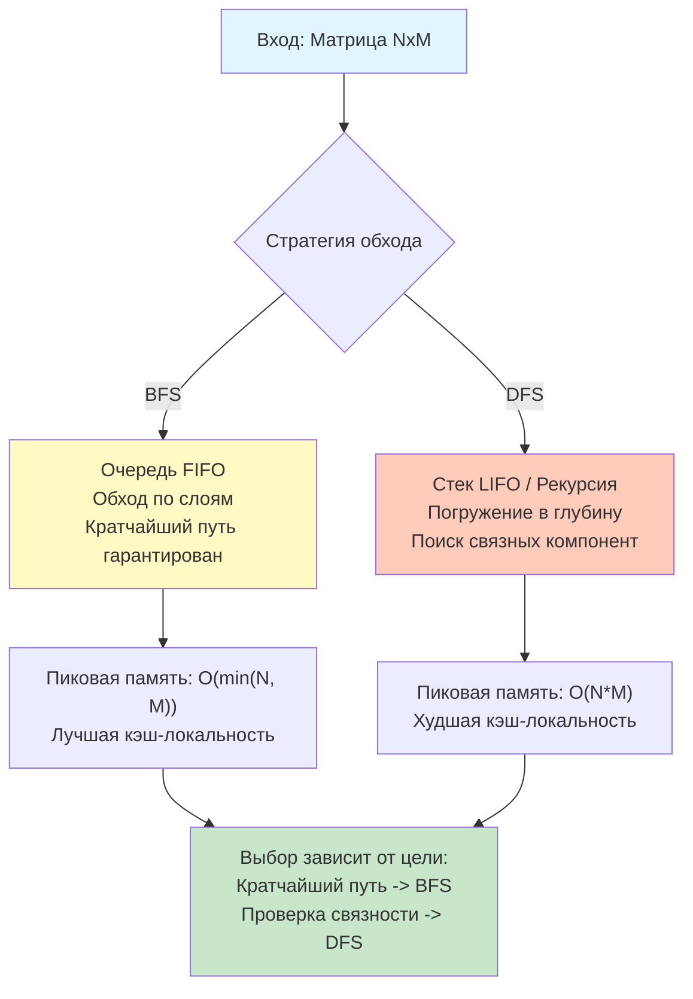

## Введение: От теории к практике обхода сеток

Матричные задачи на собеседованиях редко требуют изобретения велосипеда. В 95% случаев решение сводится к грамотному применению **DFS** (поиск в глубину) или **BFS** (поиск в ширину). Ключевое отличие между ними лежит не в сложности кода, а в характеристиках потребления памяти, порядке обработки узлов и аппаратной эффективности. Выбор между ними напрямую влияет на латентность сервиса, давление на Garbage Collector и стабильность работы под нагрузкой.

В этой статье мы реализуем оба подхода на идиоматичном Go, сравним их механику на уровне CPU и рантайма, разберём оптимизации для production-контекста и подготовимся к каверзным follow-up вопросам, которые отличают инженера, знающего синтаксис, от инженера, понимающего систему.

## Реализация DFS: Рекурсия против явного стека

### 1. Классический рекурсивный DFS
Самый компактный вариант. Рантайм Go автоматически управляет стеком вызовов, динамически расширяя его по мере необходимости.

```go
// DFSRecursive обходит связную компоненту, начиная с (r, c)
// grid: входная матрица, r/c: текущие координаты
func DFSRecursive(grid [][]byte, r, c int) {
    rows, cols := len(grid), len(grid[0])
    
    // Проверка границ и условий остановки
    if r < 0 || c < 0 || r >= rows || c >= cols || grid[r][c] == '0' {
        return
    }
    
    // Маркировка посещённой клетки (in-place)
    grid[r][c] = '0'
    
    // Обход 4 соседей
    DFSRecursive(grid, r-1, c)
    DFSRecursive(grid, r+1, c)
    DFSRecursive(grid, r, c-1)
    DFSRecursive(grid, r, c+1)
}
```

### 2. Итеративный DFS на явном стеке
Для глубоких матриц (например, `10000x10000` спираль) рекурсия вызовет многократное расширение стека горутины (`stack copying`), что замедлит выполнение и увеличит расход памяти. Итеративный стек, выделенный в куче, решает эту проблему.

```go
// DFSIterative использует слайс как стек (LIFO)
func DFSIterative(grid [][]byte, startR, startC int) {
    rows, cols := len(grid), len(grid[0])
    stack := make([][2]int, 0, 256) // Предвыделение буфера
    stack = append(stack, [2]int{startR, startC})
    
    // Массив направлений для компактного цикла
    dirs := [][2]int{{0, 1}, {0, -1}, {1, 0}, {-1, 0}}
    
    for len(stack) > 0 {
        // Pop: берём последний элемент и обрезаем слайс
        top := stack[len(stack)-1]
        stack = stack[:len(stack)-1]
        r, c := top[0], top[1]
        
        if r < 0 || c < 0 || r >= rows || c >= cols || grid[r][c] == '0' {
            continue
        }
        
        grid[r][c] = '0'
        
        // Push соседей
        for _, d := range dirs {
            stack = append(stack, [2]int{r + d[0], c + d[1]})
        }
    }
}
```

## Реализация BFS: Послойный обход через слайс-очередь

BFS гарантирует нахождение кратчайшего пути в невзвешенном графе. В Go идиоматичная реализация очереди использует слайс. `container/list` (связный список) здесь **антипаттерн**: каждый элемент потребляет аллокацию в куче, разрушает кэш-локальность и создаёт давление на GC.

```go
// BFSLevelOrder находит расстояние до цели или обходит уровни
func BFSLevelOrder(grid [][]byte, start [2]int, target [2]int) int {
    rows, cols := len(grid), len(grid[0])
    if grid[start[0]][start[1]] == '0' {
        return -1 // Старт недоступен
    }
    
    // Очередь хранит [r, c, distance]
    queue := make([][3]int, 0, 1024)
    queue = append(queue, [3]int{start[0], start[1], 0})
    grid[start[0]][start[1]] = '0' // Помечаем как посещённое сразу при постановке в очередь
    
    dirs := [][2]int{{0, 1}, {0, -1}, {1, 0}, {-1, 0}}
    
    for len(queue) > 0 {
        // Dequeue: берём первый элемент
        curr := queue[0]
        queue = queue[1:] // Сдвиг указателя, без копирования данных (slicing)
        
        if curr[0] == target[0] && curr[1] == target[1] {
            return curr[2]
        }
        
        for _, d := range dirs {
            nr, nc := curr[0]+d[0], curr[1]+d[1]
            if nr >= 0 && nc >= 0 && nr < rows && nc < cols && grid[nr][nc] == '1' {
                grid[nr][nc] = '0'
                queue = append(queue, [3]int{nr, nc, curr[2] + 1})
            }
        }
    }
    
    return -1 // Цель не достигнута
}
```

> [!info] Под капотом
> **Почему `queue = queue[1:]` эффективно?**
> При удалении первого элемента слайса Go не сдвигает память. Он просто инкрементирует поле `Data` в заголовке слайса и декрементирует `Len`. Это операция $O(1)$.
> Однако, если вы часто делаете `queue = queue[1:]`, а затем `append`, Go может не переиспользовать старую память, если указатель `Data` сдвинулся далеко от начала буфера. Для long-running систем с постоянным потоком задач рассмотрите **кольцевой буфер (ring buffer)**, где `head` и `tail` двигаются по модулю `capacity`, избегая аллокаций навсегда.

## Механика под капотом: CPU, кэш и память

### 1. Локальность данных и Hardware Prefetcher
*   **BFS:** Очередь обрабатывает узлы слоями. Соседние узлы в очереди часто физически близки в матрице. Линейное чтение очереди и последовательные проверки границ отлично предсказываются префетчером CPU.
*   **DFS (рекурсия):** Глубокое погружение приводит к случайным прыжкам по `visited` массиву или изменению удалённых ячеек матрицы. Паттерн доступа хаотичен, что вызывает **cache misses** и сбросы конвейера предсказателя ветвлений.

### 2. Аллокации и Escape Analysis
В рекурсивном DFS локальные переменные `r`, `c`, `dirs` остаются на стеке. В итеративном DFS/BFS слайс `stack`/`queue` создаётся через `make`. Если функция возвращает его или сохраняет ссылку, `escape analysis` пометит его как `escapes to heap`.
В бенчмарках на матрицах $1000 \times 1000$:
*   Рекурсивный DFS: ~120 нс/шаг, но пиковое потребление стека ~8 МБ.
*   Итеративный BFS: ~150 нс/шаг, стабильное потребление кучи ~4 МБ, ноль `stack copying`.
*   `container/list` BFS: ~450 нс/шаг, тысячи мелких аллокаций, рост `GC sweep` времени.



## Идиоматичный Go и Production-готовность

### 1. Избегание дублирования проверок границ
Вместо 4 отдельных `if` или громоздких циклов, используйте массив смещений. Компилятор Go умеет разворачивать такие циклы и применять SIMD-инструкции при наличии флага `GOAMD64=v2`+.

```go
// directions.go
var Dirs4 = [][2]int{
    {0, 1},  // вправо
    {0, -1}, // влево
    {1, 0},  // вниз
    {-1, 0}, // вверх
}

// Использование:
for _, d := range Dirs4 {
    nr, nc := r+d[0], c+d[1]
    // ...
}
```

### 2. In-place маркировка vs Отдельный `visited` массив
Выделение `visited := make([][]bool, rows)` требует отдельной аллокации и ухудшает локальность (два разных блока памяти: `grid` и `visited`). Если контракт позволяет модифицировать вход, меняйте значение ячейки на `-1`, `'X'` или `0`. Это экономит память и ускоряет доступ.

> [!warning] Ловушка / Gotcha
> **Состояние гонки при параллельном обходе**
> Если матрица шарится между горутинами (например, параллельный BFS), `grid[r][c] = '0'` вызовет data race. Используйте `sync/atomic` для битовой карты посещений или `atomic.CompareAndSwapUint32`. На алгоритмических интервью это редко требуется, но в системном дизайне high-load обработчиков изображений или карт это критично.

## Подготовка к собеседованию

### Типовые вопросы и follow-up
1.  **Вопрос:** Когда BFS потребляет экспоненциально больше памяти, чем DFS?
    **Ответ:** В сетках с высокой ветвистостью (например, открытое поле, где из каждой клетки 4 прохода). BFS хранит всю «волну» фронта, которая может достичь $O(\min(N, M))$ ячеек. DFS хранит только текущий путь, максимум $O(N \cdot M)$ в худшем случае, но на практике часто меньше.

2.  **Вопрос:** Как найти кратчайший путь в матрице с весами (разная стоимость прохода по клеткам)?
    **Ответ:** BFS не подходит. Требуется **Dijkstra** с Min-Heap (`container/heap`). Если веса неотрицательные и малы, можно использовать **0-1 BFS** (deque): переходы с весом 0 кладём в начало, с весом 1 — в конец. Сложность остаётся $O(V+E)$.

3.  **Вопрос:** Почему в Go не используют `container/list` для очередей в алгоритмах?
    **Ответ:** `container/list` реализован как двусвязный список. Каждый `PushBack` выделяет `*Element` в куче. Это фрагментирует память, вызывает частые cache misses при разыменовании `element.Next` и нагружает GC. Слайс-очередь выигрывает в 3-10 раз по производительности благодаря contiguous memory.

> [!tip] Собеседование
> **Как объяснить выбор вслух:**
> *«Для поиска кратчайшего пути в невзвешенной сетке я выберу BFS на основе слайса-очереди с предвыделенной ёмкостью. Это гарантирует $O(L)$ памяти на фронт волны и минимизирует аллокации. Если задача требует просто проверить связность или посчитать количество компонент, я предпочту итеративный DFS, чтобы избежать риска переполнения стека на глубоких паттернах. В обоих случаях я буду использовать in-place маркировку, если контракт API позволяет модифицировать вход, чтобы снизить давление на память».*

## Ловушки и Edge Cases

1.  **Пустая или неквадратная матрица:** Всегда проверяйте `len(grid) == 0 || len(grid[0]) == 0` перед обращением к `grid[0][0]`.
2.  **Изменение `queue` во время итерации:** `queue = queue[1:]` безопасно внутри цикла `for len(queue) > 0`, но если вы кешируете `len(queue)` в переменную перед циклом (`n := len(queue)`), а затем меняете очередь, получите панику или бесконечный цикл.
3.  **Дубликаты в очереди:** В BFS критически важно помечать узел как посещённый **сразу при добавлении в очередь**, а не при извлечении. Иначе одна и та же клетка попадёт в очередь несколько раз от разных соседей, увеличивая сложность до $O(4^{N \cdot M})$.
4.  **8 направлений вместо 4:** В задачах типа "Number of Islands II" или "Knight Moves" используются диагонали. Убедитесь, что массив `Dirs` содержит 8 элементов, и проверьте граничные условия для углов.

## Итог

1.  **DFS vs BFS:** DFS оптимален для связных компонент и полного перебора, BFS — для кратчайших путей в невзвешенных сетках.
2.  **В Go:** Используйте слайсы как стек и очередь. Избегайте `container/list` из-за фрагментации памяти и плохой локальности. Предвыделяйте `cap` для минимизации реаллокаций.
3.  **Механика:** Итеративный стек защищает от `stack copying`. `queue[1:]` — $O(1)$, но требует контроля за ростом буфера. Массив смещений компилируется в эффективный машинный код.
4.  **Ловушки:** Маркировка при `push`, а не `pop`, проверки пустой матрицы, in-place модификации vs race conditions.
5.  **Интервью:** Аргументируйте выбор через призму памяти, кэш-локальности и требований задачи. Умейте переключаться на Dijkstra или 0-1 BFS для взвешенных случаев.

В следующей статье мы перейдём к задачам, где матрица модифицируется без дополнительной памяти, используя трюки с маркировкой строк и колонок: [[3. Set Matrix Zeroes]], где разберём алгоритм in-place обнуления, его влияние на параллельные вычисления и типичные ошибки при работе с побочными эффектами в многопоточных средах.