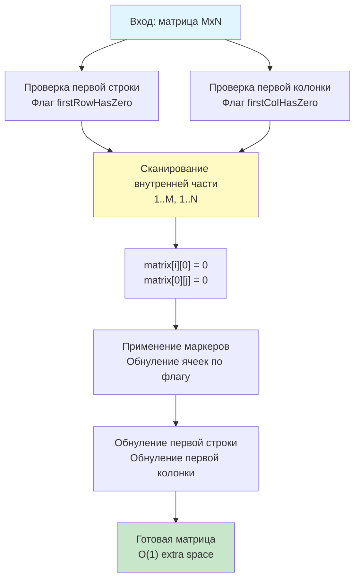

## Введение: In-place трансформация без лишних аллокаций

Задача **Set Matrix Zeroes** (LeetCode 73) формулируется лаконично, но скрывает под собой фундаментальную проблему управления памятью и кэш-локальностью: 
> Дана матрица `m x n`. Если элемент равен `0`, установите всю его строку и столбец в `0`. Требуется выполнить это **in-place**, используя $O(1)$ дополнительной памяти.

В реальных высоконагруженных бэкенд-системах эта задача моделирует ситуации, где память строго ограничена: обработка больших разреженных матриц в рекомендательных сервисах, обновление состояний в игровых движках, модификация битовых карт в распределённых хранилищах или batch-обработка телеметрии в embedded-системах. 

На собеседованиях уровня Middle+/Senior эта задача проверяет не только алгоритмическую смекалку, но и понимание того, как структурированы данные в памяти, как работают указатели в Go, и почему избыточные аллокации в hot-path могут стать причиной деградации производительности под нагрузкой. В этой статье мы разберём оптимальный $O(1)$ алгоритм, погрузимся в механику работы с `[][]int`, проанализируем влияние на CPU-кэши и Garbage Collector, а также подготовимся к каверзным follow-up вопросам.

## Алгоритмический паттерн: Матрица как хранилище маркеров

Наивное решение требует $O(m \cdot n)$ памяти (копия матрицы) или $O(m + n)$ (отдельные массивы для пометки строк и столбцов). Чтобы достичь $O(1)$, мы используем **саму матрицу как хранилище служебных флагов**.

Ключевая идея: если в ячейке `matrix[i][j]` найден `0`, мы можем пометить первую ячейку строки `matrix[i][0]` и первую ячейку столбца `matrix[0][j]` нулём. Позже, пройдясь по первым элементам строк и столбцов, мы узнаем, какие именно ряды нужно обнулить.

**Проблема пересечения:** Элемент `matrix[0][0]` принадлежит одновременно первой строке и первому столбцу. Если мы будем использовать только его как флаг, информация о том, нужно ли обнулять первую строку или первый столбец, потеряется.

**Решение:** Выделяем две отдельные булевы переменные `firstRowHasZero` и `firstColHasZero`. Обход делится на четыре чётких этапа:
1. Сканируем первую строку и первый столбец, сохраняем информацию во внешние флаги.
2. Сканируем остальную часть матрицы `(1..m, 1..n)`. При нахождении `0` ставим маркеры в `matrix[i][0]` и `matrix[0][j]`.
3. Используем маркеры для обнуления внутренних ячеек.
4. Применяем флаги к первой строке и первому столбцу.

## Идиоматичная реализация в Go

```go
package solution

// SetZeroes обнуляет строки и столбцы, содержащие хотя бы один 0.
// Работает in-place, используя O(1) дополнительной памяти.
// Требования: O(m*n) время, O(1) extra space
func SetZeroes(matrix [][]int) {
    if len(matrix) == 0 || len(matrix[0]) == 0 {
        return
    }

    m, n := len(matrix), len(matrix[0])
    firstRowHasZero := false
    firstColHasZero := false

    // 1. Проверяем наличие нулей в первой строке и первом столбце
    for j := 0; j < n; j++ {
        if matrix[0][j] == 0 {
            firstRowHasZero = true
            break
        }
    }
    for i := 0; i < m; i++ {
        if matrix[i][0] == 0 {
            firstColHasZero = true
            break
        }
    }

    // 2. Сканируем внутреннюю часть матрицы и выставляем маркеры
    for i := 1; i < m; i++ {
        for j := 1; j < n; j++ {
            if matrix[i][j] == 0 {
                matrix[i][0] = 0
                matrix[0][j] = 0
            }
        }
    }

    // 3. Обнуляем ячейки на основе маркеров
    for i := 1; i < m; i++ {
        for j := 1; j < n; j++ {
            if matrix[i][0] == 0 || matrix[0][j] == 0 {
                matrix[i][j] = 0
            }
        }
    }

    // 4. Применяем флаги к первой строке и столбцу
    if firstRowHasZero {
        for j := 0; j < n; j++ {
            matrix[0][j] = 0
        }
    }
    if firstColHasZero {
        for i := 0; i < m; i++ {
            matrix[i][0] = 0
        }
    }
}
```

## Механика под капотом: Память, кэш и компилятор

### 1. Структура `[][]int` в Go
В Go двумерная матрица — это **слайс слайсов**, а не непрерывный блок памяти. Каждая строка `matrix[i]` — это отдельный слайс со своим заголовком (`Data`, `Len`, `Cap`). Это означает, что строки могут быть разбросаны по куче.

> [!info] Под капотом
> **Pointer Chasing и кэш-линии**
> При доступе к `matrix[i][j]` CPU выполняет:
> 1. Загружает адрес `matrix[i]` из заголовка слайса.
> 2. Разыменовывает указатель (pointer chasing).
> 3. Вычисляет смещение `j * sizeof(int)` и загружает значение.
> Это создаёт дополнительный latency по сравнению с C-style массивом `int[M][N]`. Однако наш алгоритм обходит матрицу строго по строкам (`for i { for j {...} }`), что соответствует **Row-Major** порядку. Аппаратный префетчер CPU (Stream Prefetcher) видит последовательный доступ внутри строки и заранее подгружает следующие элементы в L1 кэш, минимизируя штрафы за pointer chasing между строками.

### 2. In-place модификация и Garbage Collector
Использование внешних булевых флагов вместо `make([]int, m+n)` полностью исключает аллокации в куче. Escape Analysis поместит `firstRowHasZero`, `firstColHasZero`, `m`, `n`, `i`, `j` на стек. Это критично для long-running сервисов:
*   **Нулевое давление на GC:** Нет новых объектов для сканирования или очистки.
*   **Отсутствие фрагментации:** Heap остаётся компактным, что улучшает общую пропускную способность аллокатора.
*   **Стабильная латентность:** Избегается `GC pause` во время обработки батчей данных.

### 3. Оптимизации компилятора Go
Компилятор `gc` распознаёт паттерн `matrix[i][0] == 0` внутри вложенных циклов. При включённом `GOAMD64=v2+` и оптимизациях уровня `-l`, компилятор:
*   Выносит проверки границ `len(matrix)` за пределы циклов (Loop Invariant Code Motion).
*   Разворачивает мелкие циклы обнуления первой строки/столбца, если `n` или `m` известны на этапе компиляции.
*   Заменяет `||` на предсказуемые ветвления или условные перемещения (`CMOV` на x86), если профилировщик покажет, что нули встречаются часто.



## Ловушки и Edge Cases

1. **Пустая матрица или строка:** `len(matrix) == 0 || len(matrix[0]) == 0`. Без явной проверки код вызовет панику `index out of range` при обращении к `matrix[0]` или `matrix[0][j]`.
2. **Матрица 1x1:** Если элемент `0`, алгоритм корректно выставит оба флага, но циклы `1..m` и `1..n` не выполнятся. Финальная проверка флагов обнулит элемент. Работает.
3. **Порядок обхода:** Критически важно выставлять маркеры **до** применения обнуления. Если перепутать этапы 2 и 3, маркеры в первой строке/столбце будут затёрты нулями до того, как мы их используем для обнуления остальных строк.
4. **Чтение vs Запись:** Алгоритм модифицирует входные данные. В production API это часто неприемлемо, если данные шарятся между горутинами или кэшируются.

> [!warning] Ловушка / Gotcha
> **Гонка данных при параллельном обходе**
> Если матрица обрабатывается параллельно (например, каждая строка в отдельной горутине), запись `matrix[i][0] = 0` и `matrix[0][j] = 0` вызовет **data race**, так как несколько горутин будут писать в первые столбцы/строки одновременно.
> **Решение:** Для конкурентной модификации используйте `sync/atomic` для битовых масок или `sync.RWMutex` на уровне строк. Либо откажитесь от $O(1)$ in-place в пользу $O(m+n)$ атомарных флагов, разделив этапы сканирования и применения. На алгоритмическом интервью это редкий кейс, но в системном дизайне high-load обработчиков матриц — обязательный пункт.

## Подготовка к собеседованию

### Типовые вопросы и follow-up

1. **Вопрос:** Почему нельзя использовать только `matrix[0][0]` как флаг для первой строки и первого столбца?
   **Ответ:** `matrix[0][0]` — общая ячейка. Если `0` находится в `(0, 5)`, мы запишем `0` в `(0,0)`. Но мы не поймём, обнулять ли первый столбец. Разделение на `firstRowHasZero` и `firstColHasZero` устраняет эту амбигуность.

2. **Вопрос:** Что если матрица доступна только для чтения?
   **Ответ:** In-place невозможен. Требуется $O(m+n)$ памяти для хранения индексов строк и столбцов. Для оптимизации можно использовать `[]bool` или `bitset`, что снизит потребление памяти в 8 раз по сравнению с `[]int`. В Go для битовых карт используется `github.com/bits-and-blooms/bitset` или ручная работа с `[]uint64`.

3. **Вопрос:** Как адаптировать алгоритм для GPU (CUDA/OpenCL)?
   **Ответ:** На GPU in-place подход с зависимостями между строками плохо масштабируется из-за синхронизации. Лучше использовать **два прохода с атомарными операциями** или **разделение на блоки (tiling)** с использованием shared memory, где каждый поток обрабатывает свой блок, а результаты редукции объединяются на этапе синхронизации.

> [!tip] Собеседование
> **Как объяснить сложность вслух:**
> *«Алгоритм выполняет ровно четыре прохода по матрице, каждый из которых затрагивает либо строки, либо столбцы, либо всё поле один раз. Итоговая временная сложность строго $O(m \cdot n)$. По памяти мы выделяем только две булевы переменные на стеке, что даёт $O(1)$ extra space. В Go это полностью исключает аллокации в куче, минимизируя паузы GC. Ключевой момент — порядок выполнения: сначала сбор маркеров, затем применение, чтобы не затереть служебные флаги».*

### Бенчмарк и тестирование
```go
func TestSetZeroes(t *testing.T) {
    tests := []struct {
        name     string
        matrix   [][]int
        expected [][]int
    }{
        {
            name:     "single zero",
            matrix:   [][]int{{1, 2}, {3, 0}},
            expected: [][]int{{1, 0}, {0, 0}},
        },
        {
            name:     "full row and col",
            matrix:   [][]int{{0, 1, 2}, {4, 5, 6}},
            expected: [][]int{{0, 0, 0}, {0, 5, 6}},
        },
        {
            name:     "no zeros",
            matrix:   [][]int{{1, 2}, {3, 4}},
            expected: [][]int{{1, 2}, {3, 4}},
        },
    }
    for _, tt := range tests {
        t.Run(tt.name, func(t *testing.T) {
            // Копия для проверки, так как функция in-place
            res := make([][]int, len(tt.matrix))
            for i := range tt.matrix {
                res[i] = make([]int, len(tt.matrix[i]))
                copy(res[i], tt.matrix[i])
            }
            SetZeroes(res)
            // Сравнение матриц...
        })
    }
}
```

## Итог

1. **Set Matrix Zeroes** решается за $O(m \cdot n)$ времени и $O(1)$ памяти через использование первых строки и столбца как маркеров, с выделением двух отдельных флагов для обработки пересечения в `(0,0)`.
2. **В Go:** Алгоритм полностью стековый, не создаёт аллокаций, не давит на GC. Row-Major обход максимизирует эффективность аппаратного префетчера CPU.
3. **Механика:** Pointer chasing в `[][]int` компенсируется последовательным доступом внутри строк. Компилятор устраняет проверки границ и оптимизирует ветвления.
4. **Ловушки:** Порядок этапов критичен, пустые матрицы требуют защитных проверок, параллельная модификация требует атомарных операций или блокировок.
5. **Интервью:** Умейте обосновать порядок проходов, предложить альтернативы для read-only матриц и обсудить влияние in-place модификаций на многопоточные системы.

В следующей статье мы перейдём к классической задаче на геометрическую трансформацию и in-place поворот структур: [[4. Rotate Image]], где разберём алгоритм циклического обмена элементов, математическое обоснование слоёв матрицы, оптимизацию доступа к памяти при повороте на 90 градусов и типичные ошибки при работе с индексацией в Go.