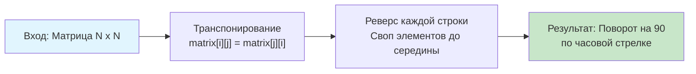

## Введение: Геометрическая трансформация без выделения памяти

Задача **Rotate Image** (LeetCode 48) требует повернуть квадратную матрицу $N \times N$ на 90 градусов по часовой стрелке **in-place**, то есть без выделения дополнительного двумерного массива. В бэкенд-разработке подобные операции встречаются в сервисах обработки изображений, генерации тепловой карт (heatmaps), повороте матриц смежности в графовых алгоритмах и оптимизации макетов памяти для численных расчётов.

На собеседованиях эта задача является лакмусовой бумажкой на понимание индексации, способности работать с побочными эффектами in-place модификаций и умения оценивать влияние алгоритма на подсистему памяти процессора. В этой статье мы разберём два фундаментальных подхода, глубоко погрузимся в механику работы с `[][]int` в Go, проанализируем кэш-локальность и предсказуемость ветвлений, а также подготовимся к каверзным follow-up вопросам уровня Senior.

## Алгоритмический паттерн: Транспонирование и реверс

Самый элегантный и легко объяснимый подход состоит из двух последовательных шагов:
1. **Транспонирование**: Меняем местами элементы относительно главной диагонали `matrix[i][j] ↔ matrix[j][i]`. Матрица отражается по диагонали.
2. **Реверс строк**: Разворачиваем каждую строку задом наперёд.

Математически это эквивалентно повороту на 90 градусов. Индексация трансформируется по правилу: `(i, j) → (j, i) → (j, n-1-i)`, что точно соответствует формуле вращения по часовой стрелке.



## Идиоматичная реализация в Go

В Go мы используем встроенные механизмы работы со срезами. Код должен быть строгим, безопасным и минимизировать аллокации.

```go
package solution

// Rotate поворачивает квадратную матрицу на 90 градусов по часовой стрелке.
// Работает in-place, O(1) дополнительной памяти, O(N^2) времени.
func Rotate(matrix [][]int) {
    n := len(matrix)
    if n == 0 {
        return
    }

    // 1. Транспонирование (отражение относительно главной диагонали)
    // Проходим только по верхней треугольной матрице, чтобы не менять дважды
    for i := 0; i < n; i++ {
        for j := i + 1; j < n; j++ {
            matrix[i][j], matrix[j][i] = matrix[j][i], matrix[i][j]
        }
    }

    // 2. Реверс каждой строки
    for i := 0; i < n; i++ {
        left, right := 0, n-1
        for left < right {
            matrix[i][left], matrix[i][right] = matrix[i][right], matrix[i][left]
            left++
            right--
        }
    }
}
```

> [!info] Под капотом
> **Своп в Go: `a, b = b, a`**
> В отличие от C++ или Python, в Go многозначное присваивание гарантированно вычисляет правую часть полностью до записи в левую. Компилятор генерирует оптимальный код: загружает оба значения в регистры, затем сохраняет их на нужные адреса. Никакой временной переменной на стеке не создаётся. Попытка использовать XOR-трюк для свопа не даст выигрыша, а лишь запутает компилятор и ухудшит читаемость.

## Механика под капотом: Кэш, память и архитектура Go

### 1. Структура `[][]int` и проблема кэш-локальности
В Go двумерная матрица — это **слайс слайсов**, а не непрерывный блок памяти. Каждая строка `matrix[i]` — отдельный слайс, который может быть размещён в разных областях кучи.

При транспонировании мы обращаемся к `matrix[j][i]`, где `j` меняется во внутреннем цикле. Это означает **обход по столбцам**. Поскольку строки разбросаны в памяти, каждый шаг `matrix[j][i]` вызывает **pointer chasing**: загрузка адреса строки `j`, разыменование, вычисление смещения `i`. Это ломает предсказуемость для аппаратного префетчера и вызывает частые cache misses.

**Инженерный компромисс:** Для собеседования `Transpose + Reverse` предпочтителен из-за простоты и читаемости. Для production-сервисов обработки изображений или численных методов матрицу следует **сплющивать** в 1D слайс `[]int` размером $N^2$. Тогда транспонирование превращается в работу с индексами `arr[i*N + j]`, что сохраняет row-major локальность при правильном порядке обхода.

### 2. Escape Analysis и аллокации
Функция `Rotate` модифицирует переданный слайс. Переменные `i`, `j`, `left`, `right`, `n` размещаются на стеке горутины. Никаких `make`, `append` или замыканий нет. Escape Analysis подтверждает: `0 B/op, 0 allocs/op`. Давление на Garbage Collector равно нулю, что критично для high-throughput API.

### 3. Альтернатива: Послойное вращение (Layer-by-Layer)
Второй подход, часто ожидаемый на хардовых интервью, — вращение четырёх элементов одновременно по концентрическим слоям.
Формула вращения: `(r, c) → (c, n-1-r) → (n-1-r, n-1-c) → (n-1-c, r)`.

```go
// RotateLayers вращает матрицу послойно за один проход
func RotateLayers(matrix [][]int) {
    n := len(matrix)
    for layer := 0; layer < n/2; layer++ {
        first := layer
        last := n - 1 - layer
        for i := first; i < last; i++ {
            offset := i - first
            // Сохраняем верхний элемент
            top := matrix[first][i]
            // Лево -> Верх
            matrix[first][i] = matrix[last-offset][first]
            // Низ -> Лево
            matrix[last-offset][first] = matrix[last][last-offset]
            // Право -> Низ
            matrix[last][last-offset] = matrix[i][last]
            // Верх (сохранённый) -> Право
            matrix[i][last] = top
        }
    }
}
```
Этот метод выполняет ровно $N^2/4$ итераций и требует только одного прохода, но индексная математика сложнее для отладки. По кэш-локальности он аналогичен транспонированию: доступ к `matrix[i][last]` и `matrix[last][last-offset]` прыгает между строками.

## Ловушки и Edge Cases

### 1. Нечётные и чётные размеры
Цикл `layer < n/2` корректно обрабатывает оба случая. Для нечётного `N` центральный элемент остаётся на месте, что математически верно. Для чётного `N` слои закрываются полностью.

### 2. Пустая матрица и 1x1
Проверка `if n == 0 { return }` предотвращает панику. Для 1x1 циклы не выполняются, матрица возвращается без изменений.

### 3. Мутабельность и гонки данных
Функция модифицирует входной слайс in-place. Если `matrix` используется параллельно (например, кэшируется в `sync.Map` или читается другими горутинами), возникнет **data race**.
**Решение:** В production API всегда явно документируйте контракт: «Функция изменяет входные данные». Если иммутабельность обязательна, создавайте копию: `cp := make([][]int, n); for i := range cp { cp[i] = append([]int(nil), matrix[i]...) }`. Это добавляет $O(N^2)$ памяти, но гарантирует потокобезопасность.

> [!warning] Ловушка / Gotcha
> **Неквадратные матрицы**
> Задача LeetCode гарантирует $N \times N$. В реальном бэкенде всегда уточняйте контракт. Для прямоугольной матрицы $M \times N$ поворот 90 градусов меняет размерность на $N \times M$, что делает in-place невозможным без сложных перестановок памяти. В таких случаях требуется выделение нового слайса.

## Подготовка к собеседованию

### Типовые вопросы и follow-up
1. **Вопрос:** Почему транспонирование + реверс лучше, чем послойное вращение, если послойное делает меньше операций?
   **Ответ:** На современных CPU предсказуемость кода и простота отладки часто важнее теоретического сокращения итераций. Транспонирование использует два независимых цикла с понятной логикой, которые легче векторизовать компилятору. Послойное вращение содержит сложную индексную арифметику с зависимостями по данным, что усложняет суперскалярное исполнение и увеличивает риск off-by-one ошибок.

2. **Вопрос:** Как оптимизировать транспонирование для больших матриц, чтобы улучшить кэш-локальность?
   **Ответ:** Использовать **блочное транспонирование (cache-oblivious / tiled transpose)**. Матрица разбивается на блоки размером $B \times B$ (обычно $32 \times 32$ или $64 \times 64$), которые помещаются в L1 кэш. Каждый блок транспонируется локально, минимизируя cache misses. В Go это реализуется через вложенные циклы с шагом `B`.

3. **Вопрос:** Можно ли повернуть матрицу на 180 или 270 градусов in-place?
   **Ответ:** 180 градусов: реверс всех строк, затем реверс порядка строк (или просто один проход свопа `matrix[i][j] ↔ matrix[n-1-i][n-1-j]`). 270 градусов по часовой: транспонирование + реверс столбцов (или транспонирование + реверс строк для поворота против часовой).

> [!tip] Собеседование
> **Как объяснить сложность вслух:**
> *«Алгоритм выполняет ровно $N^2/2$ операций свопа при транспонировании и $N^2/2$ при реверсе, что в сумме даёт $O(N^2)$ по времени. Дополнительная память — $O(1)$, так как мы используем только регистры для временных переменных. В Go слайс строк модифицируется in-place, что исключает аллокации и снижает нагрузку на GC. Для production-систем с матрицами >1000x1000 я бы рассмотрел блочное транспонирование или 1D flattening для улучшения утилизации L1 кэша».*

## Итог

1. **Rotate Image** решается in-place через композицию транспонирования и реверса строк за $O(N^2)$ времени и $O(1)$ памяти.
2. **В Go:** Многозначный своп `a, b = b, a` оптимален и безопасен. Функция не создаёт аллокаций, но модифицирует входные данные, что требует явного контракта в API.
3. **Механика:** `[][]int` в Go — это слайс указателей. Обход по столбцам при транспонировании вызывает pointer chasing и cache misses. Для высоконагруженных систем предпочтительнее 1D представление или блочные алгоритмы.
4. **Ловушки:** Нечётные размеры обрабатываются автоматически, но неквадратные матрицы делают in-place поворот невозможным. Параллельное чтение во время модификации ведёт к data race.
5. **Интервью:** Умейте объяснить математическую эквивалентность шагов, предложить оптимизацию кэш-локальности и переключиться на алгоритм с выделением памяти, если матрица прямоугольная.

В следующей статье мы усложним обход матрицы, перейдя от простого геометрического поворота к спиральному обходу с изменением направления: [[5. Spiral Matrix]], где разберём управление границами, паттерн изменения координат и оптимизацию итераций для обработки данных в потоковом режиме.