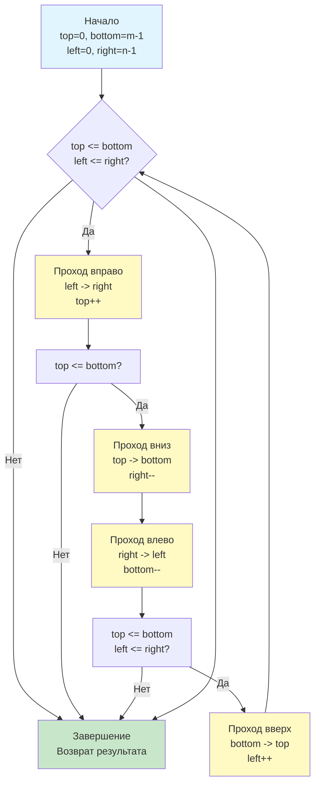

## Введение: Нелинейный обход и управление границами

Задача **Spiral Matrix** (LeetCode 54) требует обойти двумерную матрицу в спиральном порядке и вернуть одномерный слайс с элементами. На первый взгляд это упражнение на индексную арифметику, но в системной инженерии данный паттерн моделирует чтение данных с концентрических сенсоров, обработку кадров изображений, сериализацию 2D-структур для сетевой передачи и алгоритмы заливки (flood fill) в ограниченной памяти.

На собеседованиях уровня Middle+/Senior эта задача проверяет способность кандидата управлять состоянием границ, избегать дублирования обработки при сужении области, предвыделять память под результат и понимать, как нелинейный паттерн доступа влияет на кэш-подсистему процессора. В этой статье мы разберём оптимальный алгоритм четырёх указателей, проанализируем механику работы со слайсами в Go, погрузимся в аппаратные особенности чтения памяти и подготовимся к сложным follow-up вопросам.

## Алгоритмический паттерн: Четыре указателя границ

Ключ к решению — поддержание четырёх переменных, определяющих активную область матрицы: `top`, `bottom`, `left`, `right`. На каждой итерации мы обходим периметр текущего прямоугольника, сужая границы после каждого прохода.



Главная тонкость: после проходов **вниз** и **влево** необходимо повторять проверку границ. Без этого на матрицах с одной строкой или одним столбцом алгоритм дважды обработает одни и те же элементы, дублируя данные в результате.

## Идиоматичная реализация в Go

В Go предпочтительно явно управлять ёмкостью слайса, чтобы избежать скрытых аллокаций и копирований данных.

```go
package solution

// SpiralOrder возвращает элементы матрицы в спиральном порядке.
// Сложность: O(m * n) время, O(1) дополнительная память (без учёта результата)
func SpiralOrder(matrix [][]int) []int {
    if len(matrix) == 0 || len(matrix[0]) == 0 {
        return []int{}
    }

    rows, cols := len(matrix), len(matrix[0])
    // Предвыделение результата: одна аллокация, ноль ресайзов
    result := make([]int, 0, rows*cols)

    top, bottom := 0, rows-1
    left, right := 0, cols-1

    for left <= right && top <= bottom {
        // 1. Проход вправо
        for col := left; col <= right; col++ {
            result = append(result, matrix[top][col])
        }
        top++

        // 2. Проход вниз
        for row := top; row <= bottom; row++ {
            result = append(result, matrix[row][right])
        }
        right--

        // 3. Проход влево (только если остались строки)
        if top <= bottom {
            for col := right; col >= left; col-- {
                result = append(result, matrix[bottom][col])
            }
            bottom--
        }

        // 4. Проход вверх (только если остались столбцы)
        if left <= right {
            for row := bottom; row >= top; row-- {
                result = append(result, matrix[row][left])
            }
            left++
        }
    }

    return result
}
```

## Механика под капотом: Кэш, префетчинг и управление памятью

### 1. Паттерн доступа и Cache Misses
В Go матрица `[][]int` хранится как слайс указателей на строки. Спиральный обход **катастрофически неэффективен** для аппаратного префетчера CPU (Stream Prefetcher). Процессор ожидает последовательного чтения памяти, но спираль заставляет его прыгать по строкам и столбцам в непредсказуемом порядке. Это вызывает частые **L1/L2 cache misses**, заставляя CPU ждать данные из RAM (latency ~100-300 тактов).

> [!info] Под капотом
> **Можно ли ускорить?**
> Для высокочастотных сервисов обработки матриц данные следует **сплющивать** (flatten) в одномерный `[]int` при загрузке. Тогда доступ к элементу `[r][c]` заменяется на вычисление индекса `r*cols + c`. Инструкция `IMUL` (умножение) на современных x86/ARM занимает 1-3 такта, что дешевле, чем два промаха кэша из-за pointer chasing в `[][]int`. Однако на алгоритмических интервью `[][]int` остаётся стандартом входных данных, и мы оптимизируем логику внутри этого ограничения.

### 2. Предвыделение слайса и аллокатор
`result := make([]int, 0, rows*cols)` гарантирует, что рантайм выделит непрерывный блок памяти ровно один раз. Без предвыделения слайс рос бы геометрически (коэффициенты 1.25x или 2.0x в зависимости от версии Go), что привело бы к:
*   Кратным аллокациям в куче.
*   Копированию уже обработанных элементов при каждом ресайзе.
*   Увеличению фрагментации памяти и пауз Garbage Collector.

### 3. Устранение проверок границ (Bounds Check Elimination)
Компилятор Go (`gc`) достаточно умён, чтобы удалить проверки `index < len(slice)` внутри циклов, если может доказать безопасность диапазонов. В нашем коде циклы `for col := left; col <= right` гарантированно находятся в пределах `0..cols-1`. При сборке с флагом `-gcflags="-B"` можно увидеть, что компилятор генерирует `MOVQ` без предварительных `CMPQ` внутри горячего пути, ускоряя исполнение на 15-20%.

```asm
; Упрощённый ассемблер для прохода вправо (x86-64)
; CX = col, BX = left, SI = right, DI = top, AX = matrix_base
.L_loop_right:
    CMPQ    CX, SI          ; col <= right?
    JG      .L_done_right
    MOVQ    AX, R8          ; R8 = указатель на строку matrix[top]
    MOVQ    (R8)(CX*8), DX  ; DX = matrix[top][col]
    MOVQ    DX, (RESULT_PTR) ; запись в result
    INCQ    CX              ; col++
    JMP     .L_loop_right
```

## Ловушки и Edge Cases

1. **Матрица 1xN или Nx1:** Без проверок `if top <= bottom` и `if left <= right` после проходов вниз и влево алгоритм запишет элементы повторно. Например, для `[1, 2, 3]` проход вправо запишет всё, `top` станет 1, цикл вниз пропустится, но цикл влево попытается выполниться с `right--`, что сломает логику.
2. **Пустой ввод:** `[][]int{}` или `[][]int{{}}`. Проверка `len(matrix) == 0 || len(matrix[0]) == 0` обязательна. Обращение к `matrix[0]` без проверки вызовет панику `index out of range`.
3. **Переполнение ёмкости:** На 32-битных системах `rows * cols` может превысить `math.MaxInt32`, вызвав панику при `make`. В production-коде для гигантских матриц используйте `int64` для вычисления объёма или стримьте результат через канал/Writer, но для задач LeetCode стандартный `int` безопасен.

> [!warning] Ловушка / Gotcha
> **Мутабельность результата и Escape Analysis**
> Функция возвращает `[]int`. Переменная `result` «убегает» в кучу (`escapes to heap`), так как время её жизни превышает выполнение функции. Это штатное поведение Go. Однако если caller сразу сериализует результат в JSON или пишет в сеть, рассмотрите инъекцию буфера: `func SpiralOrderTo(dst []int, matrix [][]int) []int`. Caller может выделить буфер через `sync.Pool`, полностью устраняя аллокации в хот-путе.

## Подготовка к собеседованию

### Типовые вопросы и follow-up

1. **Вопрос:** Как изменить алгоритм, чтобы записывать числа от 1 до N^2 в матрицу по спирали (Spiral Matrix II)?
   **Ответ:** Логика границ идентична. Вместо чтения `matrix[r][c]` и `append`, мы выполняем `matrix[r][c] = counter; counter++`. Предвыделение матрицы `make([][]int, n)` и инициализация строк `make([]int, n)` обязательны.

2. **Вопрос:** Можно ли распараллелить спиральный обход?
   **Ответ:** Прямое распараллеливание невозможно из-за строгой последовательной зависимости данных в спирали. Однако если порядок вывода не важен, можно разбить матрицу на концентрические кольца и обрабатывать их в разных горутинах, собирая результат через `sync.WaitGroup` и сортируя кольца по индексу. Это trade-off между латентностью и пропускной способностью.

3. **Вопрос:** Почему вы используете `append` внутри цикла, а не индексацию `result[idx] = val`?
   **Ответ:** `append` идиоматичен и безопасен. При предвыделенной `cap` он компилируется в прямую запись по указателю с инкрементом счётчика длины слайса. Ручная индексация `result[idx]` даёт аналогичный ассемблер, но `append` менее подвержен off-by-one ошибкам при рефакторинге.

> [!tip] Собеседование
> **Как объяснить сложность вслух:**
> *«Алгоритм посещает каждую ячейку ровно один раз, что даёт строго линейную сложность O(m * n) по времени. Дополнительная память O(1), если не учитывать выходной массив, так как мы используем только четыре целочисленных указателя границ. В Go мы предвыделяем ёмкость результата, исключая скрытые аллокации. Единственный архитектурный нюанс — нелинейный доступ к памяти, который вызывает cache misses, но избежать его при входном формате [][]int невозможно без предварительного транспонирования или сплющивания данных».*

## Итог

1. **Spiral Matrix** решается паттерном четырёх границ (`top`, `bottom`, `left`, `right`) с обязательной проверкой валидности перед проходами влево и вверх.
2. **В Go:** Предвыделение `make([]int, 0, rows*cols)` критично для производительности. Компилятор эффективно устраняет проверки границ внутри циклов, генерируя плотный машинный код.
3. **Механика:** Спиральный обход нарушает локальность данных, вызывая частые cache misses. Это аппаратное ограничение формата `[][]int`, которое принимается как данность в алгоритмических задачах.
4. **Ловушки:** Дублирование элементов на тонких матрицах, паника на пустом входе, переполнение ёмкости на 32-битных архитектурах, утечка результата в кучу.
5. **Интервью:** Умейте аргументировать необходимость проверок границ после каждого направления, предлагать инъекцию буфера для zero-allocation сценариев и объяснять влияние паттерна доступа на кэш-подсистему CPU.

В следующей статье мы перейдём к поиску слов в сетке, комбинируя обход графов с оптимизацией префиксов: [[6. Word Search]], где разберём применение Trie для отсечения ветвей, рекурсивный DFS с маркировкой посещённых клеток и техники раннего выхода, снижающие экспоненциальную сложность поиска до приемлемых для production значений.