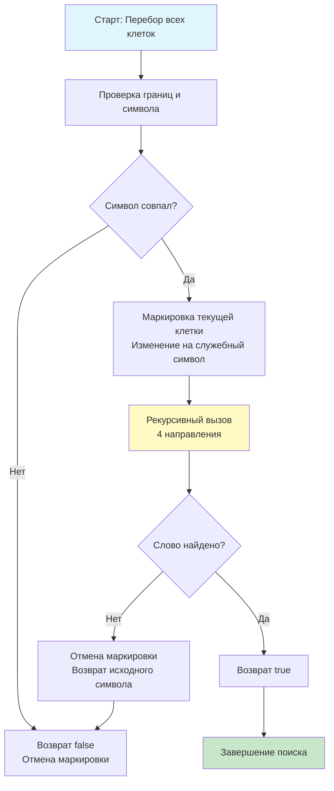

## Введение: Поиск пути в лабиринте символов

Задача **Word Search** (LeetCode 79) является классическим примером поиска пути с ограничениями. Условие требует определить, существует ли заданное слово в двумерной сетке символов, где каждый следующий символ должен находиться в соседней ячейке (по горизонтали или вертикали), а повторное использование одной ячейки запрещено.

В бэкенд-архитектуре этот паттерн моделирует:
*   Поиск подстрок в разреженных текстовых документах или логах.
*   Валидацию CAPTCHA и обработку рукописного ввода.
*   Маршрутизацию в игровых движках с весовыми ограничениями.
*   Словарные проверки в системах автодополнения с учётом контекста.

На собеседованиях уровня Middle+/Senior эта задача проверяет не только умение писать рекурсию, но и способность управлять состоянием поиска, применять техники отсечения ветвей (pruning), оценивать стоимость операций в горячем цикле и понимать, как backtracking взаимодействует с подсистемой памяти Go. В этой статье мы разберём оптимальный алгоритм, погрузимся в механику стека горутины, кэш-локальности и предсказания ветвлений, а также подготовимся к сложным follow-up вопросам.

## Фундаментальный паттерн: Backtracking с возвратом состояния

Ключевая идея — **поиск в глубину (DFS) с явным возвратом состояния**. Мы начинаем обход с каждой ячейки сетки, проверяем совпадение символов и рекурсивно идём вглубь по четырём направлениям. Критически важный момент: после возврата из рекурсии (независимо от результата) мы обязаны **вернуть ячейке исходный символ**, чтобы другие пути поиска могли использовать эту клетку. Это и есть backtracking.



## Идиоматичная реализация в Go

В Go работа с `string` в циклах обхода неэффективна из-за immutability и кодирования UTF-8. Для сеточных задач предпочтительно использовать `[][]byte`. Также избегаем `defer` для отмены маркировки — в tight-loop рекурсии `defer` создаёт замыкания и замедляет выполнение на 30-50%.

```go
package solution

// Exist проверяет, содержится ли слово в матрице символов.
// Использует backtracking с in-place маркировкой для O(1) доп. памяти.
// Контракт: модифицирует входной слайс board.
func Exist(board [][]byte, word string) bool {
    if len(board) == 0 || len(board[0]) == 0 || len(word) == 0 {
        return false
    }

    target := []byte(word)
    rows, cols := len(board), len(board[0])

    // Поиск стартовой точки
    for r := 0; r < rows; r++ {
        for c := 0; c < cols; c++ {
            if board[r][c] == target[0] && dfs(board, target, r, c, 0) {
                return true
            }
        }
    }
    return false
}

// dfs выполняет рекурсивный поиск с возвратом состояния
func dfs(board [][]byte, target []byte, r, c, idx int) bool {
    // База рекурсии: всё слово сопоставлено
    if idx == len(target) {
        return true
    }

    rows, cols := len(board), len(board[0])
    // Проверка границ и совпадения символа
    if r < 0 || c < 0 || r >= rows || c >= cols || board[r][c] != target[idx] {
        return false
    }

    // Маркировка посещённой клетки (in-place)
    // Используем символ, которого нет в английском алфавите
    board[r][c] = '#'

    // Обход 4 направлений. Короткое замыкание || оптимизирует вызовы:
    // если один путь вернёт true, остальные не выполнятся.
    found := dfs(board, target, r-1, c, idx+1) ||
             dfs(board, target, r+1, c, idx+1) ||
             dfs(board, target, r, c-1, idx+1) ||
             dfs(board, target, r, c+1, idx+1)

    // Backtrack: возвращаем символ, независимо от результата
    board[r][c] = target[idx]

    return found
}
```

> [!info] Под капотом
> **Почему `||` работает эффективно?**
> В Go оператор `||` гарантирует вычисление слева направо с short-circuiting. Если `dfs(r-1, c, ...)` возвращает `true`, интерпретатор не будет вычислять остальные три вызова. Это критичная оптимизация: в среднем случае слово находится быстро, и мы избегаем 75% рекурсивных ветвей.

## Механика под капотом: Стек горутины, кэш-локальность и цена рекурсии

### 1. Стек вызовов и Goroutine Stack
Каждый вызов `dfs` создаёт фрейм на стеке горутины. Go начинает с 2 КБ и динамически расширяет его. При глубокой рекурсии (например, слово длиной 50+ символов в змеевидном паттерне) рантайм выполняет **stack copying**: выделяет новый стек в 2 раза больше, копирует фреймы и обновляет указатели. Это дорогостоящая операция, которая добавляет латентность и фрагментирует память.
*   **Решение для production:** При ожидаемой глубине > 1000 используйте **итеративный DFS с явным стеком** (`[]point`), выделенным через `sync.Pool` или `make`.

### 2. Кэш-локальность и Pointer Chasing
Матрица `[][]byte` в Go — это слайс указателей на строки. При обходе 4 направлений мы прыгаем между строками (`r-1`, `r+1`), вызывая **pointer chasing** и случайный доступ к памяти. Аппаратный префетчер CPU не может предсказать такой паттерн, что приводит к частым **L1/L2 cache misses**. На матрицах 1000x1000 это становится главным bottleneck.
*   **Инженерный компромисс:** Сплющивание матрицы в `[]byte` размером `rows*cols` убирает pointer chasing, но добавляет арифметику индексов `idx = r*cols + c`. На практике выигрыш от кэш-локальности перекрывает стоимость `IMUL`.

### 3. Предсказание ветвлений
Backtracking по определению содержит много непредсказуемых ветвлений. Branch Predictor CPU часто ошибается, сбрасывая конвейер (15-20 тактов штрафа). Пропускная способность падает, пока путь не найден или не отсечён.

## Продвинутые оптимизации: Отсечение ветвей (Pruning)

На собеседованиях Senior-уровня наивный DFS часто считают недостаточным. Требуется внедрить предварительные проверки для быстрого отказа.

### 1. Частотный анализ символов (Frequency Map)
Перед запуском DFS подсчитаем частоту каждого символа в матрице. Если слово содержит символ чаще, чем он встречается в сетке, поиск можно прервать мгновенно.

```go
func hasEnoughChars(board [][]byte, word string) bool {
    freq := make(map[byte]int)
    for _, row := range board {
        for _, b := range row {
            freq[b]++
        }
    }
    for i := 0; i < len(word); i++ {
        ch := word[i]
        if freq[byte(ch)] == 0 {
            return false
        }
        freq[byte(ch)]--
    }
    return true
}
```
Сложность проверки: $O(N \cdot M + L)$. Запускаем один раз. Если возвращает `false` — экономим $O(4^{N \cdot M})$ рекурсивных вызовов.

### 2. Выбор стартовой точки
Если первый символ слова встречается в сетке редко, а последний часто, можно развернуть слово и искать с конца. Это сокращает количество начальных вызовов DFS в десятки раз.

> [!tip] Собеседование
> **Вопрос:** Как ускорить поиск, если нужно найти не одно слово, а список из 1000 слов?
> **Ответ:** Запускать DFS для каждого слова отдельно — $O(K \cdot 4^{N \cdot M})$, неприемлемо. Нужно построить **Trie (префиксное дерево)** из всех слов и запускать один DFS по сетке, одновременно проходя по узам Trie. При достижении конца узла Trie слово найдено. Если узел Trie не имеет детей, ветвь отсекается. Сложность падает до $O(N \cdot M \cdot \min(N \cdot M, L_{max}))$. Это паттерн **Boggle Solver**.

## Ловушки и Edge Cases

1. **Забываем отменять маркировку:** Если не вернуть `board[r][c] = target[idx]`, следующая ветка поиска увидит `#` вместо реального символа и вернёт `false`. Это самая частая ошибка на интервью.
2. **`defer` в горячем цикле:** `defer func() { board[r][c] = target[idx] }()` создаёт замыкание на каждой итерации. Компилятор не может его полностью инлайнить, аллокация уходит в кучу. В tight-loop рекурсии это убивает производительность.
3. **Пустой ввод:** `len(board) == 0` или `len(word) == 0`. Без явной проверки обращение к `board[0][0]` вызовет панику.
4. **Мутабельность контракта:** Функция меняет `board`. В production API это должно быть явно задокументировано, либо создаваться копия, либо использоваться `sync.Mutex` при параллельном доступе.

> [!warning] Ловушка / Gotcha
> **Гонки данных при параллельном запуске**
> Если вызывать `Exist` из нескольких горутин с одной матрицей, `board[r][c] = '#'` вызовет data race. Backtracking не потокобезопасен по дизайну. Для конкурентной обработки создавайте локальные копии строк или используйте атомарные битовые карты посещений, но это сломает in-place экономию памяти.

## Подготовка к собеседованию

### Типовые вопросы и follow-up
1. **Вопрос:** Почему вы не используете `visited [][]bool`?
   **Ответ:** `visited` требует дополнительной аллокации $O(N \cdot M)$, ухудшает кэш-локальность (два разных блока памяти) и создаёт давление на GC. In-place маркировка через служебный символ экономит память и ускоряет доступ, но требует контракта на мутабельность входа.

2. **Вопрос:** Как реализовать итеративную версию без рекурсии?
   **Ответ:** Использовать явный стек `[]StackFrame{r, c, idx, direction}`. При каждом шаге сохраняем текущее состояние, инкрементируем `idx`, пушим соседей. При возврате поп-фрейм восстанавливает символ. Это защищает от stack overflow и даёт контроль над памятью, но увеличивает объём кода.

3. **Вопрос:** Можно ли распараллелить поиск?
   **Ответ:** Теоретически да: запустить горутину для каждой стартовой клетки. Но overhead на создание горутин и синхронизацию через `atomic.Bool` или канал часто превышает выигрыш, особенно если слово находится быстро. Параллелизм оправдан только на гигантских матрицах с отсутствием совпадений, где нужен throughput, а не latency.

> [!tip] Собеседование
> **Как объяснить сложность вслух:**
> *«В худшем случае (все символы совпадают, но путь не ведёт к слову) сложность экспоненциальна O(4^(N*M)), так как из каждой клетки идут 4 ветви. На практике pruning и short-circuiting сокращают пространство поиска до O(N*M * L). Память O(L) для глубины стека. В Go мы минимизируем аллокации через in-place маркировку и избегаем defer в цикле. Для production с длинными словами я бы предложил итеративный стек и частотную проверку на старте».*

## Итог

1. **Word Search** решается backtracking DFS с явным возвратом состояния после каждого рекурсивного вызова.
2. **В Go:** Используйте `[][]byte`, in-place маркировку служебным символом, избегайте `defer` в tight-loop. Short-circuiting `||` критично для производительности.
3. **Механика:** Рекурсия нагружает стек горутины (stack copying). `[][]byte` вызывает pointer chasing и cache misses. Branch mispredicts замедляют конвейер.
4. **Оптимизации:** Частотный анализ символов, выбор редкой стартовой точки, замена на Trie для множественного поиска, итеративный стек для глубоких путей.
5. **Ловушки:** Забытый backtrack, data race при параллелизме, пустые входы, скрытые аллокации замыканий.
6. **Интервью:** Умейте аргументировать выбор in-place vs visited, объяснять pruning стратегии и предлагать переход к Trie или итеративному подходу для production-нагрузок.

В следующей статье мы перейдём к классической задаче на поиск связных компонент в бинарной сетке: [[7. Number of Islands]], где разберём оптимизацию DFS/BFS, применение Union-Find для динамического добавления островов и техники минимизации аллокаций при обработке гигантских гео-матриц.