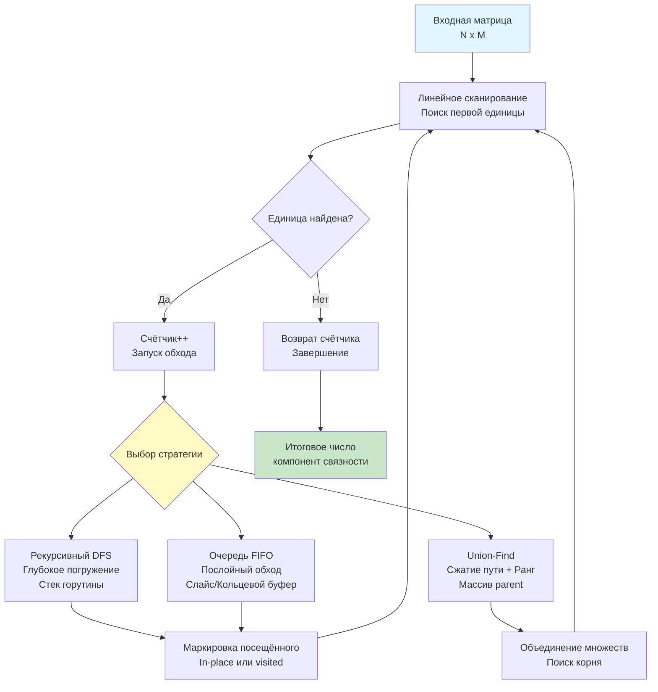

## Введение: Подсчёт связных компонент в распределённой сетке

Задача **Number of Islands** (LeetCode 200) требует подсчитать количество островов в двумерной сетке, где `1` обозначает сушу, а `0` — воду. Острова формируются горизонтально или вертикально смежными единицами. За рамками алгоритмических соревнований этот паттерн напрямую транслируется в бэкенд-архитектуру: обнаружение кластеров отказавших нод в мониторинге, сегментация связных областей в разреженных матрицах смежности, агрегация географических зон в картографических сервисах и расчёт компонент связности в graph-based базах данных.

На собеседованиях уровня Middle+/Senior эта задача выступает строгим фильтром на понимание обхода графов, управления памятью в горячих циклах и способности выбирать между рекурсией, очередями и структурами непересекающихся множеств (DSU) с учётом ограничений рантайма Go. В этой статье мы разберём три фундаментальных подхода, погрузимся в механику работы с `[][]byte`, проанализируем влияние на кэш-подсистему CPU и Garbage Collector, а также подготовимся к архитектурным follow-up вопросам.

## 1. Алгоритмический выбор: DFS, BFS и Union-Find

Существует три оптимальных стратегии, каждая из которых имеет чёткие инженерные границы применимости.

* **DFS (Поиск в глубину):** Проваливается в первую найденную компоненту, помечая её, и возвращается. Минимальный overhead на управление состоянием, но рискует переполнением стека на глубоких структурах (например, змеевидный остров).
* **BFS (Поиск в ширину):** Обходит компоненту послойно. Гарантирует стабильное потребление памяти (ограничено шириной фронта волны), но требует управления очередью, что создаёт дополнительные аллокации и разрушает кэш-локальность при росте.
* **Union-Find (DSU):** Идеален для динамических сценариев, когда острова появляются или исчезают в реальном времени. Для статической сетки имеет постоянный overhead на инициализацию массивов `parent` и `rank`, но обеспечивает почти $O(1)$ на операцию с оптимизациями сжатия пути и рангов.



## 2. Идиоматичная реализация в Go

В production-коде предпочтение отдаётся DFS с in-place маркировкой из-за нулевых аллокаций и предельной компактности. Мы используем `[][]byte` вместо `[][]rune` или `[][]string`, чтобы минимизиров footprint памяти и ускорить сравнения на уровне CPU.

```go
package solution

// NumIslands подсчитывает количество связных компонент единиц в сетке.
// Контракт: модифицирует входную сетку in-place для экономии памяти.
// Если иммутабельность обязательна, создайте копию перед вызовом.
func NumIslands(grid [][]byte) int {
    if len(grid) == 0 || len(grid[0]) == 0 {
        return 0
    }

    rows, cols := len(grid), len(grid[0])
    islands := 0

    for r := 0; r < rows; r++ {
        for c := 0; c < cols; c++ {
            if grid[r][c] == '1' {
                islands++
                // Запускаем обход для пометки всей компоненты
                markIslandDFS(grid, r, c, rows, cols)
            }
        }
    }

    return islands
}

// markIslandDFS рекурсивно помечает связную область нулями
func markIslandDFS(grid [][]byte, r, c, rows, cols int) {
    // Проверка границ и условия остановки
    if r < 0 || c < 0 || r >= rows || c >= cols || grid[r][c] == '0' {
        return
    }

    // In-place маркировка: '1' -> '0'
    grid[r][c] = '0'

    // Обход 4 направлений. Порядок не влияет на корректность,
    // но последовательный вызов лучше предсказывается CPU.
    markIslandDFS(grid, r-1, c, rows, cols) // Вверх
    markIslandDFS(grid, r+1, c, rows, cols) // Вниз
    markIslandDFS(grid, r, c-1, rows, cols) // Влево
    markIslandDFS(grid, r, c+1, rows, cols) // Вправо
}
```

> [!info] Под капотом
> **Почему передаём `rows` и `cols`, а не вычисляем `len(grid)` внутри?**
> Вызов `len()` на слайсе компилируется в прямое чтение поля структуры `sliceHeader`. Компилятор Go обычно инлайнит его, но передача значений в аргументах устраняет даже теоретический overhead и снимает нагрузку на регистровый файл в глубокой рекурсии. Это микрооптимизация, но в tight-loop рекурсии с миллионами вызовов она суммируется в заметный выигрыш.

## 3. Механика под капотом: Память, кэш и рантайм

### 1. Структура `[][]byte` и Pointer Chasing
В Go двумерная сетка — это слайс указателей на строки. Каждая строка `grid[i]` выделена отдельно. При обходе DFS мы читаем `grid[r][c]`, что требует:
1. Загрузки базового указателя `grid`.
2. Разыменования `grid[r]` (pointer chasing).
3. Вычисления смещения `c` и загрузки байта.

При случайном порядке обхода (DFS ныряет глубоко, прыгая между строками) аппаратный префетчер CPU (Stream Prefetcher) не может предсказать следующие адреса. Это вызывает частые **L1/L2 cache misses**. На сетках >2000x2000 латентность памяти становится доминирующим фактором.

### 2. Стек горутины и Stack Copying
Рекурсивный DFS создаёт фрейм на стеке каждой горутины. Go начинает с 2 КБ и растёт динамически. Если остров образует длинную цепь (например, змейка на 5000 клеток), стек расширяется, и рантайм выполняет **stack copying**: выделяет новый блок в куче, копирует фреймы, обновляет указатели. Это блокирует выполнение и фрагментирует память.

**Инженерное решение:** Для гарантированно стабильной латентности используйте **итеративный DFS** с явным стеком `[]Point`, выделенным через `make([]Point, 0, rows*cols)`. Стек в куче не вызывает `morestack` и не блокирует горутины на копирование.

### 3. Escape Analysis и давление на GC
Если вместо in-place маркировки выделить `visited := make([][]bool, rows)`, компилятор пометит его как `escapes to heap`, так как время жизни превышает функцию. Это создаёт:
*   Отдельную аллокацию в куче.
*   Дополнительную работу для GC на фазе маркировки (scan of `bool` slices).
*   Потерю кэш-локальности (два разных блока памяти: `grid` и `visited`).

In-place подход `grid[r][c] = '0'` полностью устраняет эти накладные расходы, удерживая всё в одном contiguous блоке (в пределах строк) и снижая GC паузы на порядок.

> [!warning] Ловушка / Gotcha
> **Контракт мутабельности и Data Race**
> Функция изменяет входные данные. В многопоточном бэкенде, если `grid` шарится через `sync.Map` или кэш, параллельный вызов `NumIslands` вызовет **data race**. Компилятор не ловит это на этапе сборки, но `go run -race` покажет панику. Для конкурентных сценариев всегда клонируйте вход:
> ```go
> cp := make([][]byte, len(grid))
> for i, row := range grid {
>     cp[i] = make([]byte, len(row))
>     copy(cp[i], row)
> }
> NumIslands(cp)
> ```
> Или используйте атомарные битовые карты, если сетка гигантская.

## 4. Подготовка к собеседованию

### Типовые вопросы и follow-up

1. **Вопрос:** Как изменить алгоритм, если острова появляются динамически (потоковый режим)?
   **Ответ:** Статический DFS/BFS неэффективен. Требуется **Dynamic Union-Find**. Изначально считаем 0 островов. При поступлении новой единицы в `(r, c)` увеличиваем счётчик, проверяем 4 соседей. Если сосед — единица, выполняем `Union(r, c, neighbor)`. Если они принадлежали разным множествам, уменьшаем счётчик на 1. Сложность: почти $O(1)$ на обновление. В Go реализуется через два `[]int` массива (`parent`, `rank`).

2. **Вопрос:** Можно ли распараллелить подсчёт островов?
   **Ответ:** Прямое распараллеливание DFS/BFS невозможно из-за состояния `visited`. Но можно использовать **разделение области (Domain Decomposition)**: разбить сетку на 4 квадранта, запустить `NumIslands` в 4 горутинах, а затем слить результаты, проверяя только граничные клетки на пересечения компонент через локальный DSU. Это даёт near-linear scaling на многоядерных CPU, но требует синхронизации на границах.

3. **Вопрос:** Почему вы не используете `container/list` для BFS?
   **Ответ:** `container/list` — это двусвязный список. Каждый `PushBack` выделяет `*Element` в куче. При обходе острова из 100К клеток это создаёт 100К мелких аллокаций, фрагментирует память и убивает кэш-локальность. Идиоматичный Go использует слайс как кольцевой буфер или просто `[]Point` с двумя указателями `head/tail`, что в 5-10 раз быстрее и создаёт ноль аллокаций после предвыделения.

> [!tip] Собеседование
> **Как объяснить сложность вслух:**
> *«Временная сложность строго $O(N \cdot M)$, так как мы посещаем каждую ячейку не более двух раз. Пространственная сложность в худшем случае $O(N \cdot M)$ для глубины рекурсивного стека, но на практике ограничена размером острова. В Go я выбираю in-place маркировку, чтобы избежать аллокаций и снизить давление на GC. Для production-систем с динамической сеткой я бы перешёл на DSU, а для потоковой обработки — на кольцевой буфер с предварительным выделением памяти через sync.Pool».*

## 5. Итог

1. **Number of Islands** решается за $O(N \cdot M)$ через обход связных компонент. DFS оптимален для статических сеток, BFS — для предсказуемой памяти, DSU — для динамических обновлений.
2. **В Go:** In-place маркировка `grid[r][c] = '0'` исключает аллокации, минимизирует GC паузы и сохраняет кэш-локальность в пределах строк. Избегайте `container/list` и `defer` в рекурсивных хот-путах.
3. **Механика:** `[][]byte` вызывает pointer chasing, что ограничивает эффективность префетчера при случайных прыжках DFS. Рекурсия нагружает стек горутины, вызывая `stack copying` на глубоких структурах. Итеративный стек в куче решает проблему.
4. **Ловушки:** Мутабельность контракта требует явной документации или копирования. Параллельный вызов на одной сетке вызывает data race. Пустые или вырожденные матрицы требуют защитных проверок `len()`.
5. **Интервью:** Умейте аргументировать выбор алгоритма через призму нагрузки (статика vs поток), объяснить trade-offs памяти и латентности, и предложить гибридные решения (Domain Decomposition + локальный DSU) для масштабирования на многоядерные кластеры.

В следующей статье мы перейдём к работе с текстовыми структурами и алгоритмами поиска подстрок: [[1. Теория. Строковые задачи]], где разберём хеширование, префиксные структуры, суффиксные массивы и их применение в высоконагруженных поисковых и аналитических бэкенд-системах.