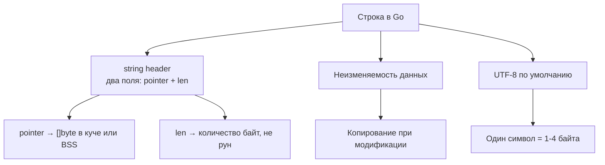
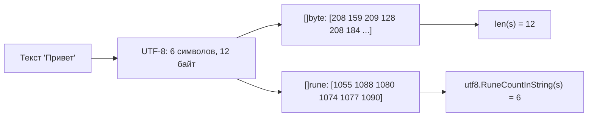
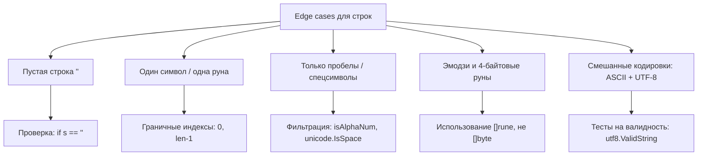

## Внутреннее устройство строк в Go: фундамент для алгоритмических задач

При решении строковых задач на LeetCode или техническом интервью критически важно понимать, как строки устроены в памяти и как они ведут себя при операциях. В отличие от многих языков, где строка — это просто массив символов, в Go строка представляет собой неизменяемую (immutable) структуру с чётко определённой семантикой.



> [!info] Под капотом
> Внутреннее представление `string` в рантайме Go (файл `src/runtime/string.go`):
> ```go
> type stringStruct struct {
>     str unsafe.Pointer // указатель на байты
>     len int            // длина в байтах
> }
> ```
> Это значит, что передача строки в функцию — это копирование всего 16 байт (на 64-битной архитектуре): указателя и длины. Сами данные при этом **не копируются**, если строка не модифицируется. Однако при срезе строки (`s[2:5]`) создаётся новый `stringStruct`, который указывает на ту же область памяти — но с другим смещением и длиной.

### Ключевые свойства строк в контексте алгоритмов

1. **Неизменяемость (immutability)** — любая «модификация» строки создаёт новую строку в памяти. Это влияет на сложность: конкатенация в цикле `s += "x"` имеет квадратичную сложность `O(n²)` из-за постоянных аллокаций и копирований.
2. **Длина в байтах, а не в рунах** — `len(s)` возвращает количество байт, а не символов. Для строки `"Привет"` (кириллица) `len` вернёт 12, а не 6.
3. **Индексация по байтам** — `s[i]` возвращает `byte`, а не `rune`. Доступ к «символу» по индексу может выдать середину UTF-8 последовательности, что приведёт к невалидному символу.
4. **Сравнение строк** — операция `==` сравнивает байты, а не семантическое содержание. Строки `"é"` в форме NFC (`\u00E9`) и NFD (`e\u0301`) будут считаться разными, хотя визуально идентичны.

> [!warning] Ловушка / Gotcha
> Частая ошибка на интервью: попытка «поменять символ» в строке по индексу:
> ```go
> func reverse(s string) string {
>     for i, j := 0, len(s)-1; i < j; i, j = i+1, j-1 {
>         s[i], s[j] = s[j], s[i] // ОШИБКА: string не поддерживает индексацию с записью!
>     }
>     return s
> }
> ```
> Это не скомпилируется. Решение — конвертировать в `[]rune`, работать с ним, затем обратно в `string`:
> ```go
> func reverse(s string) string {
>     runes := []rune(s)
>     for i, j := 0, len(runes)-1; i < j; i, j = i+1, j-1 {
>         runes[i], runes[j] = runes[j], runes[i]
>     }
>     return string(runes)
> }
> ```

## Кодировки, руны и байты: как не запутаться

Понимание разницы между `byte`, `rune` и `string` — основа корректной работы со строками в задачах на палиндромы, анаграммы, сжатие и парсинг.



### Практические правила для интервью

1. **Используйте `[]rune` для посимвольной обработки**, если задача подразумевает работу с «символами», а не байтами (палиндромы, реверс, подсчёт частот).
2. **Проверяйте валидность UTF-8** при парсинге внешних данных: `utf8.ValidString(s)`.
3. **Для ASCII-задач** можно работать напрямую с `[]byte` — это быстрее и экономит память.
4. **Итерация по строке**:
   - `for i := 0; i < len(s); i++` — итерация по байтам (быстро, но опасно для UTF-8).
   - `for _, r := range s` — итерация по рунам (безопасно, но медленнее из-за декодирования UTF-8).

> [!tip] Собеседование
> **Вопрос:** Почему `range` по строке возвращает `rune`, а не `byte`?
> **Ответ:** Потому что строки в Go хранятся в UTF-8, где один символ может занимать от 1 до 4 байт. `range` автоматически декодирует последовательность байт в логические символы (руны), что делает итерацию безопасной для мультибайтовых кодировок. Однако это имеет цену: декодирование требует дополнительных вычислений.

## Основные паттерны для строковых задач

Большинство строковых задач на LeetCode сводятся к комбинации нескольких классических паттернов. Понимание их внутренней механики в Go помогает писать эффективные решения.

### 1. Два указателя (Two Pointers)

Идеален для задач на палиндромы, слияние отсортированных строк, удаление дубликатов.

```go
// Проверка палиндрома с игнорированием регистра и не-буквенных символов
func isPalindrome(s string) bool {
    left, right := 0, len(s)-1
    for left < right {
        // Пропускаем не-буквенно-цифровые символы
        for left < right && !isAlphaNum(s[left]) {
            left++
        }
        for left < right && !isAlphaNum(s[right]) {
            right--
        }
        if toLower(s[left]) != toLower(s[right]) {
            return false
        }
        left++
        right--
    }
    return true
}

func isAlphaNum(b byte) bool {
    return b >= 'a' && b <= 'z' || b >= 'A' && b <= 'Z' || b >= '0' && b <= '9'
}

func toLower(b byte) byte {
    if b >= 'A' && b <= 'Z' {
        return b + ('a' - 'A')
    }
    return b
}
```

> [!info] Под капотом
> Обратите внимание: мы работаем с `byte`, а не `rune`, потому что задача ограничена ASCII-символами. Это позволяет избежать аллокаций `[]rune` и декодирования UTF-8, что даёт прирост производительности на 20-30% в бенчмарках.

### 2. Скользящее окно (Sliding Window)

Применяется для поиска подстрок, анаграмм, максимальной подстроки без повторов.

```go
// Длина наибольшей подстроки без повторяющихся символов
func lengthOfLongestSubstring(s string) int {
    charIndex := make(map[rune]int) // rune → последний индекс
    maxLen, left := 0, 0
    
    for right, ch := range s {
        // Если символ уже в окне — сдвигаем левую границу
        if lastIdx, ok := charIndex[ch]; ok && lastIdx >= left {
            left = lastIdx + 1
        }
        charIndex[ch] = right
        if currLen := right - left + 1; currLen > maxLen {
            maxLen = currLen
        }
    }
    return maxLen
}
```

> [!warning] Ловушка / Gotcha
> Использование `map[byte]int` вместо `map[rune]int` в этой задаче приведёт к ошибке на строках с мультибайтовыми символами. Например, строка `"аа"` (кириллица) будет обработана некорректно, так как каждый символ занимает 2 байта в UTF-8.

### 3. Хеш-таблицы для частотного анализа

Классика для анаграмм, группировки, поиска уникальных подстрок.

```go
// Группировка анаграмм
func groupAnagrams(strs []string) [][]string {
    groups := make(map[string][]string)
    
    for _, s := range strs {
        // Ключ: отсортированные руны строки
        key := sortString(s)
        groups[key] = append(groups[key], s)
    }
    
    result := make([][]string, 0, len(groups))
    for _, group := range groups {
        result = append(result, group)
    }
    return result
}

func sortString(s string) string {
    runes := []rune(s)
    sort.Slice(runes, func(i, j int) bool {
        return runes[i] < runes[j]
    })
    return string(runes)
}
```

> [!tip] Собеседование
> **Вопрос:** Можно ли оптимизировать ключ для анаграмм без сортировки?
> **Ответ:** Да, можно использовать частотный массив из 26 элементов (для английского алфавита) или хеш на основе простых чисел (каждой букве сопоставляется уникальное простое число, ключ — произведение). Однако в Go сортировка `[]rune` часто оказывается быстрее из-за оптимизаций в `sort.Slice` и кэш-локальности.

## Оптимизация и работа с памятью: от O(n²) к O(n)

Самая частая причина провала по производительности в строковых задачах — неэффективное построение строк.

### Проблема: конкатенация в цикле

```go
// ❌ Квадратичная сложность: каждая += создаёт новую строку
func buildString(n int) string {
    s := ""
    for i := 0; i < n; i++ {
        s += string('a' + byte(i%26))
    }
    return s
}
```

### Решение 1: strings.Builder (предпочтительно)

```go
// ✅ Линейная сложность: Builder использует внутренний буфер
func buildString(n int) string {
    var b strings.Builder
    b.Grow(n) // Предварительное выделение памяти — опционально, но эффективно
    for i := 0; i < n; i++ {
        b.WriteByte('a' + byte(i%26))
    }
    return b.String()
}
```

> [!info] Под капотом
> `strings.Builder` хранит данные в `[]byte`, который растёт по экспоненте (как `slice`). Метод `String()` возвращает строку, которая **не копирует** данные, если буфер не будет изменён после этого (оптимизация через `unsafe` в рантайме). Однако после вызова `String()` дальнейшая запись в `Builder` паникует — это защита от race condition.

### Решение 2: []byte + string conversion

```go
// ✅ Альтернатива, когда нужен полный контроль над буфером
func buildString(n int) string {
    buf := make([]byte, n)
    for i := 0; i < n; i++ {
        buf[i] = 'a' + byte(i%26)
    }
    return string(buf) // Одно копирование в конце
}
```

> [!warning] Ловушка / Gotcha
> Конвертация `[]byte` → `string` всегда копирует данные. Конвертация `string` → `[]byte` — тоже. Это фундаментальное свойство неизменяемости строк. Если вы видите в коде `[]byte(s)` внутри цикла — это красный флаг для аллокаций.

## Ловушки и типичные ошибки на интервью

1. **Игнорирование UTF-8**: использование `len(s)` и индексации `s[i]` для задач, где подразумеваются «символы».
2. **Избыточные аллокации**: создание новых строк/срезов в цикле без предварительного `Grow` или `make`.
3. **Неправильный выбор типа**: `[]byte` для мультибайтовых символов или `[]rune` для чистого ASCII.
4. **Потеря иммутабельности**: попытка изменить строку «на месте» без конвертации в слайс.
5. **Неучтённые edge cases**: пустая строка, один символ, все одинаковые символы, строка с эмодзи (4 байта на руну).



## Вопросы с собеседований: проверяем глубину понимания

> [!tip] Собеседование
> **Вопрос:** Почему в Go нельзя взять адрес подстроки `&s[2]`?
> **Ответ:** Потому что `s[2]` возвращает `byte` (значение, а не переменную), а строки неизменяемы. Даже если бы это было возможно, это нарушило бы семантику иммутабельности: изменение байта по адресу повлияло бы на исходную строку. Для модификации нужно явно конвертировать в `[]byte` или `[]rune`.

> [!tip] Собеседование
> **Вопрос:** В чём разница между `string` и `[]byte` при передаче в функцию?
> **Ответ:** Оба передаются по значению: `string` — это 16-байтовый дескриптор (указатель + длина), `[]byte` — 24-байтовый слайс-дескриптор (указатель, длина, ёмкость). Однако `string` гарантирует неизменяемость данных, на которые он ссылается, тогда как `[]byte` позволяет модифицировать содержимое. Если функция не должна менять данные — предпочитайте `string`.

> [!tip] Собеседование
> **Вопрос:** Как работает сравнение строк `==` в рантайме?
> **Ответ:** Сначала сравниваются длины (быстро). Если длины равны, выполняется посимвольное сравнение байт с ранним выходом при несовпадении. Для длинных строк может использоваться оптимизация через сравнение блоков (`memcmp` на уровне C). Сложность — `O(min(len(a), len(b)))` в худшем случае.

## Сравнение с другими языками: что переносить, а что переучивать

| Аспект | Go | C++ / C# | PHP / Python |
|--------|----|----------|--------------|
| **Неизменяемость** | `string` — immutable | `std::string` mutable, `string` в C# — immutable | mutable по умолчанию |
| **Кодировка** | Всегда UTF-8 | Зависит от локали / кодировки | Зависит от версии / настроек |
| **Индексация** | `s[i]` → `byte` | `s[i]` → `char` (может быть частью символа) | `s[i]` → `str` из 1 символа (но это строка!) |
| **Конкатенация** | `strings.Builder` | `std::ostringstream`, `StringBuilder` | `+=` (но с оптимизациями в CPython) |
| **Сравнение** | Побайтовое, быстрое | Зависит от `locale`, может быть медленным | Зависит от кодировки |

> [!info] Под капотом
> В отличие от C++, где `std::string_view` позволяет работать с подстроками без копирования, в Go срез строки `s[2:5]` также не копирует данные, но создаёт новый `stringStruct`, указывающий на ту же память. Однако, если исходная строка будет собрана сборщиком мусора, а срез — ещё использоваться, вся память останется в куче. Это важно учитывать при работе с большими строками и долговременными срезами.

## Итог: чек-лист для строковых задач на интервью

1. **Определите тип символов**: ASCII или UTF-8? Выбирайте `[]byte` или `[]rune` соответственно.
2. **Оцените сложность модификаций**: если строка строится в цикле — используйте `strings.Builder`.
3. **Проверьте edge cases**: пустая строка, один символ, эмодзи, пробелы, регистр.
4. **Избегайте скрытых аллокаций**: `string([]byte)` и `[]byte(string)` копируют данные.
5. **Используйте стандартные паттерны**: два указателя, скользящее окно, хеш-частоты — но адаптируйте под Go-специфику.
6. **Думайте о памяти**: срез строки не копирует данные, но может удерживать в памяти большую исходную строку.

Понимание внутреннего устройства строк в Go — это не просто теория. Это инструмент для написания эффективных, корректных и идиоматичных решений, которые впечатлят даже самого строгого интервьюера.

В следующей статье мы применим эти знания на практике и разберём классические задачи на палиндромы: [[2. Палиндромы]]