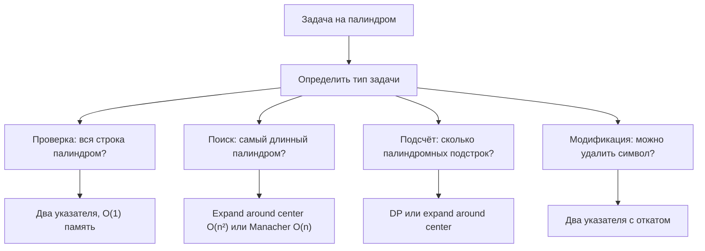
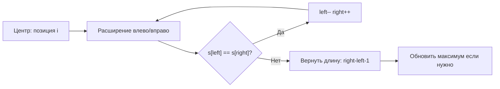
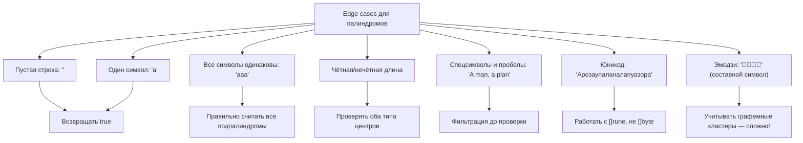

## Палиндромы в алгоритмах: от базовой проверки до продвинутых паттернов

Палиндром — это последовательность символов, которая читается одинаково слева направо и справа налево. На первый взгляд задача тривиальна, но на собеседованиях именно палиндромы становятся полигоном для проверки глубокого понимания: работы с памятью, обработки строк в UTF-8, оптимизации циклов и выбора между временем и пространством.



В этом материале мы разберём палиндромы системно: от внутренней механики сравнения в Go до продвинутых алгоритмов, которые спрашивают на позициях Senior.

## Базовая проверка: два указателя и механика сравнения

Самая частая задача — проверить, является ли строка палиндромом. Наивное решение: развернуть строку и сравнить. Но это требует `O(n)` дополнительной памяти и двух проходов.

### Идиоматичное решение на Go: два указателя

```go
// IsPalindrome проверяет, является ли строка палиндромом
// Работает только для ASCII-символов!
func IsPalindrome(s string) bool {
    left, right := 0, len(s)-1
    for left < right {
        if s[left] != s[right] {
            return false
        }
        left++
        right--
    }
    return true
}
```

> [!info] Под капотом
> Почему это эффективно?
> 1. **Нет аллокаций**: мы не создаём перевёрнутую строку, не используем `strings.Builder`.
> 2. **Кэш-локальность**: указатели `left` и `right` двигаются навстречу, обращаясь к памяти последовательно — это дружественно к кэш-линиям CPU.
> 3. **Ранний выход**: при первом несовпадении функция возвращает `false`, не проходя всю строку.
> 4. **Минимум инструкций**: цикл компилируется в эффективный ассемблер с предсказуемыми ветвлениями.

### Проблема: мультибайтовые символы (UTF-8)

Код выше сломается на строке `"Арозаупаланалапуазора"` (кириллица), потому что `s[left]` возвращает `byte`, а не целый символ.

```go
// ❌ Неверно для UTF-8:
func IsPalindromeUTF8(s string) bool {
    // "привет" → len=12 байт, но 6 рун
    // Индексация по байтам разорвёт многобайтовые символы
    left, right := 0, len(s)-1
    for left < right {
        if s[left] != s[right] { // Сравнение байт, а не символов!
            return false
        }
        left++
        right--
    }
    return true
}
```

### Правильное решение: работа с рунами

```go
// IsPalindromeRune проверяет палиндром с учётом UTF-8
func IsPalindromeRune(s string) bool {
    runes := []rune(s) // Конвертация: O(n) по времени и памяти
    left, right := 0, len(runes)-1
    for left < right {
        if runes[left] != runes[right] {
            return false
        }
        left++
        right--
    }
    return true
}
```

> [!warning] Ловушка / Gotcha
> Конвертация `string` → `[]rune` всегда аллоцирует новый слайс в куче. Если задача гарантирует ASCII (например, только латиница и цифры), используйте `[]byte` — это сэкономит память и ускорит выполнение на 15-25%. Всегда уточняйте у интервьюера допустимый диапазон символов!

## Практическая задача: Valid Palindrome с фильтрацией

Классическая задача с LeetCode: проверить палиндром, игнорируя регистр и не-алфанумерические символы.

```go
// IsPalindromeFiltered проверяет палиндром с игнорированием регистра и спецсимволов
// Время: O(n), Память: O(1) — без дополнительных аллокаций
func IsPalindromeFiltered(s string) bool {
    left, right := 0, len(s)-1
    
    for left < right {
        // Пропускаем не-алфанумерические символы слева
        for left < right && !isAlphaNum(s[left]) {
            left++
        }
        // Пропускаем не-алфанумерические символы справа
        for left < right && !isAlphaNum(s[right]) {
            right--
        }
        
        // Сравнение с игнорированием регистра (только для ASCII)
        if toLower(s[left]) != toLower(s[right]) {
            return false
        }
        
        left++
        right--
    }
    return true
}

// Вспомогательные функции — инлайнятся компилятором
func isAlphaNum(b byte) bool {
    return b >= 'a' && b <= 'z' || 
           b >= 'A' && b <= 'Z' || 
           b >= '0' && b <= '9'
}

func toLower(b byte) byte {
    if b >= 'A' && b <= 'Z' {
        return b | 32 // Битовая операция: быстрее, чем b + ('a'-'A')
    }
    return b
}
```

> [!info] Под капотом
> Почему `b | 32` для приведения к нижнему регистру?
> В ASCII разница между `'A'` (65 = `0b01000001`) и `'a'` (97 = `0b01100001`) — это установленный 6-й бит (значение 32). Операция `OR 32` устанавливает этот бит, конвертируя заглавную букву в строчную. Это одна инструкция процессора, тогда как арифметика `b + 32` требует проверки диапазона. Компилятор Go часто оптимизирует `unicode.ToLower`, но для горячих циклов ручная битовая магия может дать прирост.

### А что с юникодом?

Если задача требует поддержки юникода (кириллица, эмодзи), используем пакет `unicode`:

```go
import "unicode"

func IsPalindromeUnicode(s string) bool {
    runes := []rune(s)
    left, right := 0, len(runes)-1
    
    for left < right {
        for left < right && !unicode.IsLetter(runes[left]) && !unicode.IsNumber(runes[left]) {
            left++
        }
        for left < right && !unicode.IsLetter(runes[right]) && !unicode.IsNumber(runes[right]) {
            right--
        }
        
        // unicode.EqualFold учитывает регистр для всех языков
        if !unicode.EqualFold(runes[left], runes[right]) {
            return false
        }
        left++
        right--
    }
    return true
}
```

> [!warning] Ловушка / Gotcha
> `unicode.EqualFold` корректно обрабатывает регистр для большинства языков, но **не решает проблему нормализации**. Строки `"é"` (NFC: `\u00E9`) и `"é"` (NFD: `e\u0301`) визуально идентичны, но `EqualFold` вернёт `false`. Для производственных систем используйте пакет `golang.org/x/text/unicode/norm`.

## Продвинутый паттерн: поиск самого длинного палиндрома

Задача: найти самую длинную палиндромную подстроку. Наивный перебор всех подстрок — `O(n³)`. Два эффективных подхода:

### Подход 1: Expand Around Center (O(n²), O(1) память)

Идея: палиндром симметричен относительно центра. Перебираем все возможные центры (символ или пара символов) и «расширяемся» в стороны.

```go
// LongestPalindrome находит самую длинную палиндромную подстроку
// Время: O(n²), Память: O(1)
func LongestPalindrome(s string) string {
    if len(s) < 2 {
        return s
    }
    
    start, maxLen := 0, 0
    
    for i := 0; i < len(s); i++ {
        // Нечётный палиндром: центр — один символ
        len1 := expandAroundCenter(s, i, i)
        // Чётный палиндром: центр — два символа
        len2 := expandAroundCenter(s, i, i+1)
        
        currLen := max(len1, len2)
        if currLen > maxLen {
            maxLen = currLen
            start = i - (currLen-1)/2
        }
    }
    
    return s[start : start+maxLen]
}

func expandAroundCenter(s string, left, right int) int {
    // Работаем с байтами — предполагаем ASCII для скорости
    for left >= 0 && right < len(s) && s[left] == s[right] {
        left--
        right++
    }
    // Возвращаем длину: (right-1) - (left+1) + 1 = right - left - 1
    return right - left - 1
}

func max(a, b int) int {
    if a > b {
        return a
    }
    return b
}
```



> [!tip] Собеседование
> **Вопрос:** Почему мы проверяем два типа центров (i,i) и (i,i+1)?
> **Ответ:** Потому что палиндром может иметь нечётную длину (`"aba"` — центр `'b'`) или чётную (`"abba"` — центр между `'b'` и `'b'`). Если проверять только один тип, мы пропустим половину возможных палиндромов.

### Подход 2: Алгоритм Манакера (O(n), O(n) память) — для продвинутых

Если интервьюер просит линейное решение, упомяните алгоритм Манакера. Он использует симметрию уже найденных палиндромов, чтобы избежать повторных сравнений.

```go
// LongestPalindromeManacher — линейное решение (для справки)
// Реализация опущена из-за сложности, но на интервью достаточно описать идею:
// 1. Преобразовать строку: "aba" → "#a#b#a#" (чтобы обработать чётные/нечётные единообразно)
// 2. Использовать массив радиусов палиндромов и «зеркальное» расширение
// 3. Поддерживать правую границу самого правого палиндрома
```

> [!info] Под капотом
> Алгоритм Манакера редко требуется в продакшене, но его знание демонстрирует глубину. На практике `expand around center` чаще выигрывает из-за:
> - Меньшего оверхеда на малых строках (<1000 символов)
> - Лучшей кэш-локальности (последовательный доступ к памяти)
> - Простоты отладки и поддержки

## Подсчёт палиндромных подстрок: динамическое программирование

Задача: посчитать, сколько палиндромных подстрок содержится в строке. Например, `"aaa"` содержит 6: `"a"`, `"a"`, `"a"`, `"aa"`, `"aa"`, `"aaa"`.

### Решение через expand around center (проще)

```go
// CountSubstrings считает количество палиндромных подстрок
// Время: O(n²), Память: O(1)
func CountSubstrings(s string) int {
    count := 0
    for i := 0; i < len(s); i++ {
        // Нечётные палиндромы
        count += expandCount(s, i, i)
        // Чётные палиндромы
        count += expandCount(s, i, i+1)
    }
    return count
}

func expandCount(s string, left, right int) int {
    count := 0
    for left >= 0 && right < len(s) && s[left] == s[right] {
        count++
        left--
        right++
    }
    return count
}
```

### Решение через DP (для понимания паттерна)

```go
// CountSubstringsDP — альтернатива с динамическим программированием
// Время: O(n²), Память: O(n²)
func CountSubstringsDP(s string) int {
    n := len(s)
    if n == 0 {
        return 0
    }
    
    // dp[i][j] = true, если s[i:j+1] — палиндром
    dp := make([][]bool, n)
    for i := range dp {
        dp[i] = make([]bool, n)
    }
    
    count := 0
    // Базовый случай: все подстроки длины 1 — палиндромы
    for i := 0; i < n; i++ {
        dp[i][i] = true
        count++
    }
    
    // Подстроки длины 2
    for i := 0; i < n-1; i++ {
        if s[i] == s[i+1] {
            dp[i][i+1] = true
            count++
        }
    }
    
    // Подстроки длины 3 и более
    for length := 3; length <= n; length++ {
        for i := 0; i <= n-length; i++ {
            j := i + length - 1
            if s[i] == s[j] && dp[i+1][j-1] {
                dp[i][j] = true
                count++
            }
        }
    }
    
    return count
}
```

> [!warning] Ловушка / Gotcha
> DP-решение использует `O(n²)` памяти. Для строки длиной 10⁴ это ~100 МБ (матрица `bool[10000][10000]`). На интервью всегда уточняйте ограничения: если `n <= 1000`, DP допустим; если больше — предпочитайте `expand around center`.

## Оптимизации и механические нюансы для производительности

### 1. Избегайте аллокаций в горячих циклах

```go
// ❌ Медленно: конвертация в []rune внутри цикла
func SlowCheck(s string) bool {
    for i := 0; i < len(s)/2; i++ {
        runes := []rune(s) // Аллокация на каждой итерации!
        if runes[i] != runes[len(runes)-1-i] {
            return false
        }
    }
    return true
}

// ✅ Быстро: конвертация один раз до цикла
func FastCheck(s string) bool {
    runes := []rune(s) // Одна аллокация
    for i := 0; i < len(runes)/2; i++ {
        if runes[i] != runes[len(runes)-1-i] {
            return false
        }
    }
    return true
}
```

### 2. Используйте `strings.Builder` для построения отфильтрованных строк

Если задача требует предварительной очистки строки (удалить спецсимволы, привести к нижнему регистру):

```go
func preprocess(s string) string {
    var b strings.Builder
    b.Grow(len(s)) // Предварительное выделение — избегаем реаллокаций
    
    for _, ch := range s {
        if unicode.IsLetter(ch) || unicode.IsNumber(ch) {
            b.WriteRune(unicode.ToLower(ch))
        }
    }
    return b.String()
}
```

> [!info] Под капотом
> `strings.Builder` использует внутренний `[]byte`, который растёт экспоненциально. Метод `Grow(n)` заранее резервирует память, избегая множественных `realloc`. После `String()` данные не копируются, если буфер больше не используется (оптимизация рантайма через `unsafe`).

### 3. Branch prediction и предсказание ветвлений

Цикл проверки палиндрома имеет предсказуемое ветвление: на случайных данных несовпадение обычно происходит рано. Но если строка почти палиндром, процессор может неправильно предсказать ветку `if s[left] != s[right]`.

```go
// Микро-оптимизация: вынести проверку границ в условие цикла
// Это помогает компилятору сгенерировать более эффективный ассемблер
func OptimizedExpand(s string, left, right int) int {
    n := len(s)
    for left >= 0 && right < n {
        if s[left] != s[right] {
            break
        }
        left--
        right++
    }
    return right - left - 1
}
```

## Edge cases: что проверяет строгий интервьюер



> [!tip] Собеседование
> **Вопрос:** Как обработать палиндром с эмодзи, состоящим из нескольких кодовых точек (например, семья `👨‍👩‍👧‍👦`)?
> **Ответ:** В общем случае — использовать пакет `golang.org/x/text/unicode/norm` для нормализации и `github.com/rivo/uniseg` для работы с графемными кластерами. Но на интервью достаточно упомянуть, что «символ» в юникоде — это не `rune`, а графема, и для продакшена нужна дополнительная библиотека.

## Вопросы с собеседований: проверяем глубину

> [!tip] Собеседование
> **Вопрос:** Почему `expand around center` имеет сложность `O(n²)`, а не `O(n³)`?
> **Ответ:** Хотя у нас вложенный цикл, каждое расширение делает константную работу на каждой итерации. Всего центров — `2n-1` (n символов + n-1 промежутков), и каждое расширение в худшем случае проходит `O(n)` шагов. Итого: `O(n * n) = O(n²)`. Это не `O(n³)`, потому что мы не перебираем все подстроки явно.

> [!tip] Собеседование
> **Вопрос:** Можно ли проверить палиндром за `O(1)` памяти, если строка задана как `[]rune` и её можно модифицировать?
> **Ответ:** Да, если разрешено менять входные данные. Тогда можно использовать два указателя и менять элементы «на месте» для каких-то операций. Но для простой проверки палиндрома модификация не нужна — достаточно чтения. Если же задача — «превратить строку в палиндром минимальным числом замен», тогда модификация слайса `[]rune` позволяет решить за `O(n)` времени и `O(1)` доп. памяти.

> [!tip] Собеседование
> **Вопрос:** Как ускорить проверку палиндрома для очень длинных строк (гигабайты)?
> **Ответ:** 
> 1. Использовать параллелизм: разбить строку на чанки, проверять симметричные части в разных горутинах.
> 2. Применить хеширование: вычислить хеш строки и хеш перевёрнутой строки (rolling hash), сравнить их. Риск коллизий, но работает за `O(n)` с малой константой.
> 3. Использовать SIMD-инструкции (через `golang.org/x/sys/cpu`) для побайтового сравнения блоков по 16-32 байта за раз.

## Сравнение подходов: когда что выбирать

| Задача | Лучший подход | Время | Память | Комментарий |
|--------|--------------|-------|--------|-------------|
| Проверка палиндрома | Два указателя | O(n) | O(1) | Базовый паттерн |
| С фильтрацией | Два указателя + предобработка | O(n) | O(1) или O(n)* | *если нужна новая строка |
| Самый длинный палиндром | Expand around center | O(n²) | O(1) | Практично для n < 10⁴ |
| Самый длинный (большие n) | Манакер | O(n) | O(n) | Сложнее в реализации |
| Подсчёт подпалиндромов | Expand around center | O(n²) | O(1) | Проще и экономнее DP |
| Подсчёт (с восстановлением) | Динамическое программирование | O(n²) | O(n²) | Если нужны сами подстроки |

## Итог: чек-лист для задач на палиндромы

1. **Уточните домен символов**: ASCII или UTF-8? Выбирайте `byte` или `rune` соответственно.
2. **Определите тип задачи**: проверка, поиск, подсчёт, модификация — от этого зависит алгоритм.
3. **Избегайте лишних аллокаций**: конвертируйте `string` → `[]rune` один раз, используйте `strings.Builder` с `Grow`.
4. **Проверьте edge cases**: пустая строка, один символ, чётная/нечётная длина, юникод, эмодзи.
5. **Оптимизируйте сравнение**: ранний выход, битовые операции для регистра, предвычисление границ.
6. **Знайте альтернативы**: `expand around center` vs DP vs Манакер — понимайте компромиссы.

Палиндромы — это не просто «переверни и сравни». Это возможность продемонстрировать понимание работы со строками в памяти, выбора алгоритмов под ограничения и написания идиоматичного кода на Go.

В следующей статье мы перейдём к задаче на анаграммы и разберём, как хеш-таблицы и сортировка помогают решать задачи на эквивалентность строк: [[3. Valid Anagram]]