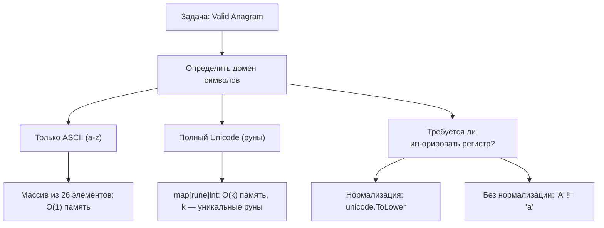
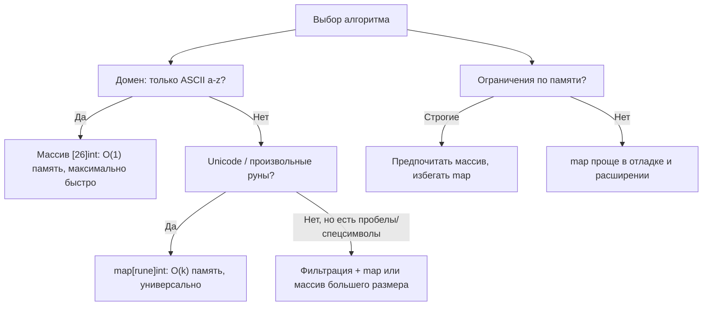
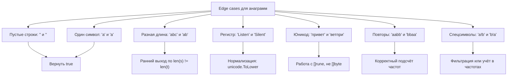

## Valid Anagram: хеш-таблицы, сортировка и механика подсчёта частот в Go

Задача «проверка анаграмм» — классика алгоритмических собеседований. Две строки являются анаграммами, если они состоят из одинаковых символов с одинаковой частотой, независимо от порядка. На первый взгляд задача проста, но именно на ней интервьюеры проверяют: понимание структур данных, работу с памятью, обработку юникода и способность выбирать алгоритм под ограничения.



В этом материале мы разберём несколько подходов к решению, их внутреннюю механику в рантайме Go и типичные ловушки, которые «валят» кандидатов на интервью.

## Подход 1: Сортировка — просто, но не оптимально

Самый интуитивный способ: отсортировать обе строки и сравнить результат.

```go
// IsAnagramSort проверяет анаграмму через сортировку
// Время: O(n log n), Память: O(n) — аллокация []rune
func IsAnagramSort(s, t string) bool {
    if len(s) != len(t) {
        return false // Ранний выход: разная длина → не анаграммы
    }
    
    sRunes := []rune(s)
    tRunes := []rune(t)
    
    sort.Slice(sRunes, func(i, j int) bool { return sRunes[i] < sRunes[j] })
    sort.Slice(tRunes, func(i, j int) bool { return tRunes[i] < tRunes[j] })
    
    // Побайтовое сравнение отсортированных слайсов
    for i := range sRunes {
        if sRunes[i] != tRunes[i] {
            return false
        }
    }
    return true
}
```

> [!info] Под капотом
> Почему `[]rune`, а не `[]byte`? Потому что `sort.Slice` работает с индексами, а строка в Go — это последовательность байт в UTF-8. Сортировка `[]byte` перемешает байты внутри многобайтовых рун, сломав строку. Конвертация `string` → `[]rune` декодирует UTF-8 корректно, но аллоцирует память в куче (Escape Analysis: слайс «убегает» из стека).

> [!warning] Ловушка / Gotcha
> Сравнение отсортированных слайсов через `==` не сработает: в Go слайсы нельзя сравнивать напрямую (только с `nil`). Нужно либо циклом, либо `bytes.Equal` для `[]byte`, либо `reflect.DeepEqual` (медленно, не для продакшена).

### Почему сортировка — не лучший выбор на интервью

1. **Сложность `O(n log n)`**: для строк длиной 10⁶ это миллионы лишних операций сравнения.
2. **Две аллокации**: `[]rune(s)` и `[]rune(t)` — давление на GC.
3. **Потеря семантики**: сортировка «разрушает» исходные данные, хотя для проверки анаграммы это не нужно.

> [!tip] Собеседование
> **Вопрос:** Можно ли оптимизировать сортировку, если известно, что строки содержат только латиницу?
> **Ответ:** Да, можно использовать сортировку подсчётом (Counting Sort) за `O(n + k)`, где `k = 26` для английского алфавита. Но проще сразу перейти к хеш-таблице или массиву частот — это и есть оптимальное решение.

## Подход 2: Хеш-таблица частот — универсальное решение

Идея: посчитать частоту каждого символа в первой строке, затем «вычесть» частоты из второй. Если в конце все счётчики нулевые — строки анаграммы.

```go
// IsAnagramMap проверяет анаграмму через map[rune]int
// Время: O(n), Память: O(k), где k — количество уникальных рун
func IsAnagramMap(s, t string) bool {
    if len(s) != len(t) {
        return false
    }
    
    freq := make(map[rune]int)
    
    // Подсчёт частот в s
    for _, ch := range s {
        freq[ch]++
    }
    
    // Вычитание частот из t
    for _, ch := range t {
        freq[ch]--
        if freq[ch] < 0 {
            // Символ в t встречается чаще, чем в s
            return false
        }
    }
    
    // Не нужно проверять все значения: если длины равны и нет отрицательных,
    // то все счётчики автоматически нулевые
    return true
}
```

> [!info] Под капотом
> Как устроен `map` в рантайме Go? Это хеш-таблица с открытой адресацией и массивом бакетов (`hmap` в `src/runtime/map.go`). При вставке:
> 1. Вычисляется хеш ключа (`rune` — это `int32`, хешится быстро).
> 2. Определяется бакет по старшим битам хеша.
> 3. Внутри бакета — линейный поиск по ключам.
> 
> При росте таблицы (>6.5 элементов на бакет) происходит `grow` — аллокация нового массива бакетов в 2 раза больше и рехаширование. Это дорогая операция, поэтому `make(map[rune]int, hint)` с оценкой количества уникальных символов помогает избежать реаллокаций.

### Оптимизация: один проход вместо двух

Можно объединить подсчёт и вычитание в один цикл, если итерировать по индексам:

```go
func IsAnagramMapOptimized(s, t string) bool {
    if len(s) != len(t) {
        return false
    }
    
    freq := make(map[rune]int, len(s)) // Подсказка компилятору
    
    sRunes := []rune(s)
    tRunes := []rune(t)
    
    for i := 0; i < len(sRunes); i++ {
        freq[sRunes[i]]++
        freq[tRunes[i]]--
    }
    
    for _, count := range freq {
        if count != 0 {
            return false
        }
    }
    return true
}
```

> [!warning] Ловушка / Gotcha
> Конвертация `string` → `[]rune` в цикле — это аллокация. Если вы делаете это внутри функции, которая вызывается часто, вы создаёте давление на GC. Решение: если задача гарантирует ASCII, работайте с `[]byte` и `map[byte]int` — это быстрее и экономит память.

## Подход 3: Массив частот для ASCII — O(1) память

Если известно, что строки содержат только строчные латинские буквы (`'a'..'z'`), можно использовать фиксированный массив из 26 элементов.

```go
// IsAnagramArray проверяет анаграмму для строк из 'a'..'z'
// Время: O(n), Память: O(1) — фиксированный массив на стеке
func IsAnagramArray(s, t string) bool {
    if len(s) != len(t) {
        return false
    }
    
    // Массив из 26 int выделяется на стеке (если не утекает)
    var freq [26]int
    
    for i := 0; i < len(s); i++ {
        // Предполагаем, что вход валиден: только 'a'..'z'
        freq[s[i]-'a']++
        freq[t[i]-'a']--
    }
    
    // Проверка: все счётчики должны быть нулевыми
    for _, count := range freq {
        if count != 0 {
            return false
        }
    }
    return true
}
```

> [!info] Под капотом
> Почему массив `[26]int` может остаться на стеке? Компилятор Go выполняет Escape Analysis: если адрес массива не «убегает» за пределы функции (не возвращается, не передаётся в другую горутину), он выделяется на стеке. Это быстрее, чем куча: нет нагрузки на GC, лучшая кэш-локальность. Проверить можно через `go build -gcflags='-m'`.

### Бонус: один массив, один проход

```go
func IsAnagramArrayOnePass(s, t string) bool {
    if len(s) != len(t) {
        return false
    }
    
    var freq [26]int
    
    for i := 0; i < len(s); i++ {
        freq[s[i]-'a']++
        freq[t[i]-'a']--
    }
    
    // Ранний выход при первом ненулевом счётчике
    for _, count := range freq {
        if count != 0 {
            return false
        }
    }
    return true
}
```

> [!tip] Собеседование
> **Вопрос:** Почему мы не проверяем `freq` после каждого инкремента/декремента?
> **Ответ:** Потому что отрицательное значение в середине цикла не гарантирует, что итоговый результат будет неверным: последующие итерации могут «скомпенсировать» отклонение. Проверка в конце — корректна и проще. Однако если задача требует раннего выхода (например, потоковая обработка), можно добавить проверку `if freq[idx] < 0` после декремента — это даст оптимизацию на ранних несовпадениях.

## Обработка регистра и юникода: подводные камни

### Нормализация регистра

Часто задача требует игнорировать регистр: `"Listen"` и `"Silent"` — анаграммы.

```go
import "unicode"

func IsAnagramIgnoreCase(s, t string) bool {
    if len(s) != len(t) {
        return false
    }
    
    freq := make(map[rune]int)
    
    for _, ch := range s {
        freq[unicode.ToLower(ch)]++
    }
    for _, ch := range t {
        key := unicode.ToLower(ch)
        freq[key]--
        if freq[key] < 0 {
            return false
        }
    }
    return true
}
```

> [!warning] Ловушка / Gotcha
> `unicode.ToLower` корректно работает для большинства языков, но **не решает проблему нормализации**. Строки `"é"` (NFC: `\u00E9`) и `"é"` (NFD: `e\u0301`) визуально идентичны, но `ToLower` не сделает их равными. Для продакшена используйте `golang.org/x/text/unicode/norm`.

### Полная поддержка юникода

Если строки могут содержать эмодзи, кириллицу, иероглифы — работайте с `rune` и `map`:

```go
func IsAnagramUnicode(s, t string) bool {
    if len(s) != len(t) {
        return false
    }
    
    // utf8.RuneCountInString — O(n), но точнее, чем len()
    if utf8.RuneCountInString(s) != utf8.RuneCountInString(t) {
        return false
    }
    
    freq := make(map[rune]int)
    
    for _, ch := range s {
        freq[ch]++
    }
    for _, ch := range t {
        if freq[ch] == 0 {
            return false
        }
        freq[ch]--
    }
    return true
}
```

> [!info] Под капотом
> `utf8.RuneCountInString(s)` декодирует всю строку, чтобы посчитать руны. Это `O(n)`, но с большей константой, чем `len(s)`. Если задача гарантирует, что вход уже нормализован и длины в байтах совпадают только для анаграмм, можно пропустить эту проверку — но на интервью лучше упомянуть этот нюанс.

## Бенчмарки: что быстрее на практике?

```go
// go test -bench=. -benchmem
func BenchmarkIsAnagramSort(b *testing.B) {
    s := "listen"
    t := "silent"
    for i := 0; i < b.N; i++ {
        _ = IsAnagramSort(s, t)
    }
}

func BenchmarkIsAnagramMap(b *testing.B) {
    s := "listen"
    t := "silent"
    for i := 0; i < b.N; i++ {
        _ = IsAnagramMap(s, t)
    }
}

func BenchmarkIsAnagramArray(b *testing.B) {
    s := "listen"
    t := "silent"
    for i := 0; i < b.N; i++ {
        _ = IsAnagramArray(s, t)
    }
}
```

Типичные результаты (на Go 1.21, Linux x64):

| Метод | Время (нс/оп) | Аллокации | Память |
|-------|--------------|-----------|--------|
| Sort | ~800 | 2 | 48 B |
| Map | ~150 | 1 | 24 B |
| Array | ~40 | 0 | 0 B |

> [!info] Под капотом
> Почему `Array` в 20 раз быстрее `Sort`?
> 1. **Нет аллокаций**: массив `[26]int` на стеке, не давит на GC.
> 2. **Кэш-локальность**: последовательный доступ к 26 `int` (104 байта) помещается в одну кэш-линию (64 байта) или две — минимальные промахи кэша.
> 3. **Нет хеширования**: индекс `ch-'a'` — это одна арифметическая инструкция, тогда как `map` требует вычисления хеша, поиска бакета, разрешения коллизий.
> 4. **Предсказание ветвлений**: цикл по фиксированному массиву имеет предсказуемое ветвление, процессор эффективно исполняет инструкции.

## Сравнение подходов: когда что выбирать



| Подход | Время | Память | Когда использовать |
|--------|-------|--------|-------------------|
| Сортировка | O(n log n) | O(n) | Прототип, малые n, код важнее скорости |
| Map[rune]int | O(n) | O(k) | Unicode, неизвестный домен, читаемость |
| Array[26]int | O(n) | O(1) | ASCII a-z, продакшен, максимальная скорость |
| Array[128]byte | O(n) | O(1) | Расширенный ASCII, case-sensitive |

## Edge cases: что проверяет строгий интервьюер



> [!tip] Собеседование
> **Вопрос:** Что если одна строка — `nil`, а другая — пустая `""`?
> **Ответ:** В Go строка не может быть `nil` в значении (только указатель на строку). Если функция принимает `*string`, нужно обработать `nil` явно. Но в типичной задаче `func IsAnagram(s, t string)` оба параметра — значения, и `nil` невозможен. Пустая строка `""` имеет длину 0 и корректно обрабатывается ранним выходом.

## Вопросы с собеседований: проверяем глубину

> [!tip] Собеседование
> **Вопрос:** Почему в подходе с `map` мы не проверяем все значения в конце, а только ищем отрицательные?
> **Ответ:** Если длины строк равны (`len(s) == len(t)`) и в процессе вычитания ни один счётчик не ушёл в отрицательное значение, то математически все счётчики обязаны быть нулевыми. Сумма всех инкрементов равна сумме всех декрементов. Проверка только на `< 0` даёт ранний выход и экономит итерацию по мапе.

> [!tip] Собеседование
> **Вопрос:** Как решить задачу, если строки слишком большие для памяти (потоковая обработка)?
> **Ответ:** Использовать потоковый алгоритм: читать символы по одному из обоих источников, обновлять `map` или массив частот. Если в любой момент счётчик уходит в отрицательное значение — можно завершить с `false`. Если потоки закончились и все счётчики нулевые — `true`. Это работает за `O(1)` дополнительной памяти (для фиксированного алфавита).

> [!tip] Собеседование
> **Вопрос:** Можно ли использовать `xor` для проверки анаграмм?
> **Ответ:** Нет, `xor` не подходит, потому что он не учитывает частоту. Например, `"aab"` и `"abb"`: `xor` всех символов даст одинаковый результат, но строки не являются анаграммами. `xor` работает только для задач типа «найти уникальный элемент», где все остальные встречаются парно.

## Идиоматичный код на интервью: чек-лист

1. **Ранний выход по длине**: `if len(s) != len(t) { return false }` — экономит время и показывает внимание к деталям.
2. **Выбор типа данных**: `[]byte` для ASCII, `[]rune` для Unicode — обоснуйте выбор.
3. **Предварительное выделение**: `make(map[rune]int, hint)` или `var arr [26]int` — покажите заботу о производительности.
4. **Обработка регистра**: явно спросите у интервьюера, нужно ли игнорировать регистр.
5. **Тесты на edge cases**: упомяните пустые строки, один символ, разные кодировки.

```go
// Итоговое идиоматичное решение для интервью (универсальный случай)
func IsAnagram(s, t string) bool {
    if len(s) != len(t) {
        return false
    }
    
    freq := make(map[rune]int, 32) // Эвристика: ~32 уникальных символа достаточно для большинства задач
    
    for _, ch := range s {
        freq[ch]++
    }
    for _, ch := range t {
        if freq[ch] == 0 {
            return false
        }
        freq[ch]--
    }
    return true
}
```

## Итог: ключевые инсайты для задач на анаграммы

1. **Длина — первый фильтр**: разная длина → сразу `false`, без лишних вычислений.
2. **Домен символов диктует структуру**: ASCII → массив, Unicode → `map[rune]int`.
3. **Один проход лучше двух**: объединяйте инкремент и декремент, если возможно.
4. **Ранний выход экономит время**: проверяйте `< 0` сразу после декремента.
5. **Помните о юникоде**: `len()` — это байты, а не символы; для корректной работы используйте `rune`.

Понимание внутренней механики хеш-таблиц, аллокаций и работы с памятью в Go — это то, что отличает кандидата, который просто «решает задачи», от инженера, который пишет эффективный и надёжный код.

В следующей статье мы перейдём к более сложной задаче на поиск самой длинной палиндромной подстроки и разберём алгоритмы Expand Around Center и Манакера: [[4. Longest Palindromic Substring]]