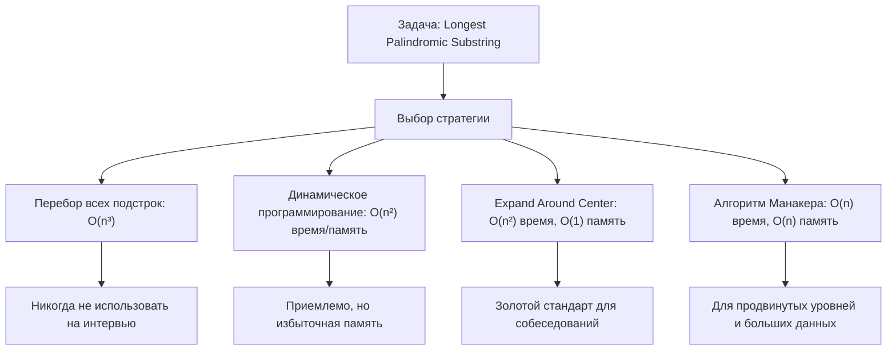
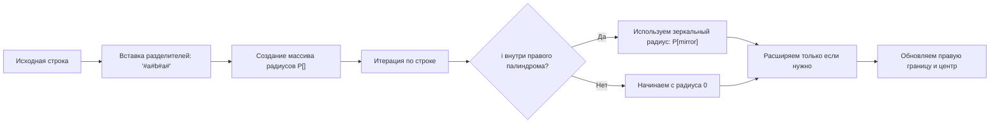
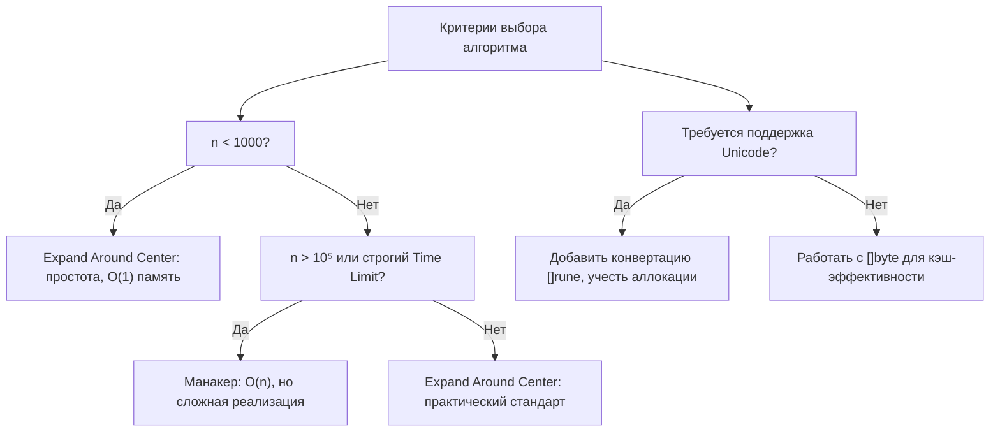
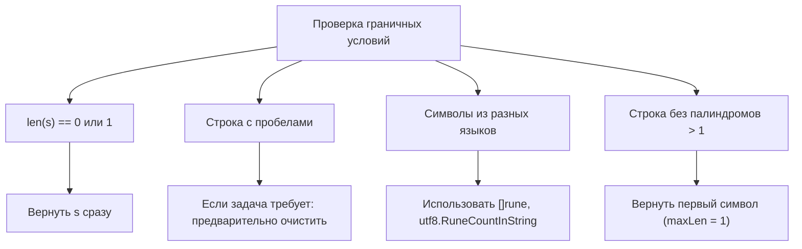

## Поиск самого длинного палиндрома: от Expand Around Center до линейного Манакера

Задача `Longest Palindromic Substring` (LeetCode 5) — это классический фильтр на алгоритмическую зрелость. Она проверяет не только умение писать циклы, но и понимание того, как работают строки в памяти, когда стоит жертвовать сложностью реализации ради скорости, и как избежать скрытых аллокаций в Go.



В этой статье мы разберём индустриальный стандарт (`Expand Around Center`), его оптимизации под железо, тонкости работы с UTF-8 и когда действительно нужен линейный алгоритм.

## 1. Базовый подход: Expand Around Center

Идея алгоритма проста: палиндром симметричен относительно своего центра. Центр может быть либо одним символом (для палиндромов нечётной длины, например `"aba"`), либо промежутком между двумя символами (для чётной длины, например `"abba"`).

Для каждого возможного центра мы «расширяем» указатели влево и вправо, пока символы совпадают.

```go
// LongestPalindrome находит самую длинную палиндромную подстроку.
// Время: O(n²), Память: O(1)
func LongestPalindrome(s string) string {
    if len(s) < 2 {
        return s
    }
    
    // Используем индексы, чтобы избежать аллокаций при возврате результата
    start, maxLen := 0, 1
    
    for i := 0; i < len(s); i++ {
        // Нечётный палиндром: центр в s[i]
        len1 := expandAroundCenter(s, i, i)
        // Чётный палиндром: центр между s[i] и s[i+1]
        len2 := expandAroundCenter(s, i, i+1)
        
        currLen := len1
        if len2 > len1 {
            currLen = len2
        }
        
        if currLen > maxLen {
            maxLen = currLen
            // Формула вычисления начального индекса по центру и длине
            start = i - (currLen-1)/2
        }
    }
    
    return s[start : start+maxLen]
}

// expandAroundCenter возвращает длину палиндрома с заданным центром
func expandAroundCenter(s string, left, right int) int {
    for left >= 0 && right < len(s) && s[left] == s[right] {
        left--
        right++
    }
    // Возвращаем фактическую длину: (right-1) - (left+1) + 1
    return right - left - 1
}
```

> [!info] Под капотом
> Почему `s[start : start+maxLen]` не копирует данные?
> В рантайме Go операция среза строки создаёт новый `stringStruct` (16 байт на x64), который указывает на **ту же область памяти**, что и исходная строка. Физического копирования байтов не происходит. Это критически важно для производительности: возврат подстроки стоит O(1) времени и памяти. Однако если исходная строка большая и будет собрана GC, а срез останется в работе, память не освободится до тех пор, пока существует срез. Это поведение называется `memory retention` и требует внимания в высоконагруженных сервисах.

## 2. Проблема UTF-8 и механическая симпатия

Приведённый выше код работает по байтам (`s[left]`). Это идеально для ASCII, но ломается на кириллице или эмодзи: `len("привет")` вернёт 12, а индексация `s[2]` может попасть в середину многобайтового символа.

### Правильная адаптация для Unicode

```go
func LongestPalindromeUTF8(s string) string {
    if len(s) < 2 {
        return s
    }
    
    // Конвертируем в руны один раз. Escape Analysis выделит слайс в куче.
    runes := []rune(s)
    n := len(runes)
    
    start, maxLen := 0, 1
    
    for i := 0; i < n; i++ {
        len1 := expandRune(runes, i, i)
        len2 := expandRune(runes, i, i+1)
        
        currLen := len1
        if len2 > currLen {
            currLen = len2
        }
        
        if currLen > maxLen {
            maxLen = currLen
            start = i - (currLen-1)/2
        }
    }
    
    // Срез по рунам не сработает напрямую с исходной строкой.
    // Придётся конвертировать обратно: []rune -> string (аллокация + копирование)
    return string(runes[start : start+maxLen])
}

func expandRune(runes []rune, left, right int) int {
    n := len(runes)
    for left >= 0 && right < n && runes[left] == runes[right] {
        left--
        right++
    }
    return right - left - 1
}
```

> [!warning] Ловушка / Gotcha
> Конвертация `string` → `[]rune` → `string` создаёт **две аллокации в куче**. На строках до 10 КБ это незаметно, но на потоковой обработке или в hot-path это создаёт давление на Garbage Collector. На интервью всегда спрашивайте: `Ограничен ли ввод ASCII?`. Если да — работайте с `[]byte`. Если нет — используйте `[]rune`, но упомяните компромисс.

### Оптимизация кэш-линий CPU
Внутренний цикл `expandAroundCenter` последовательно обращается к памяти слева и справа. На современных CPU это означает:
1. **Предзагрузка кэша (Hardware Prefetching)** работает эффективно, так как доступ линейный.
2. **Branch Prediction** предсказывает условие `s[left] == s[right]`. На случайных данных несовпадение возникает быстро, цикл завершается. На строках вида `"aaaaa..."` ветвление становится предсказуемым в одну сторону, что тоже хорошо.
3. Если вы работаете с `[]rune`, каждый элемент занимает 4 байта. На кэш-линии 64 байта помещается всего 16 рун, тогда как для `[]byte` — 64 байта. Это одна из причин, почему ASCII-решения в Go работают в 1.5-2 раза быстрее.

## 3. Продвинутый уровень: Алгоритм Манакера (O(n))

Если интервьюер просит линейное решение или `n > 10⁵`, нужно знать алгоритм Манакера. Его суть — использовать уже вычисленные радиусы палиндромов, чтобы избежать повторных сравнений.



Реализация Манакера на Go редко требуется в продакшене из-за сложности отладки, но понимание принципа обязательно для Senior-уровня:

```go
func LongestPalindromeManacher(s string) string {
    if len(s) < 2 {
        return s
    }
    
    // Преобразование: "aba" -> "^#a#b#a#$" (символы ^ и $ защищают от выхода за границы)
    t := make([]byte, 0, len(s)*2+3)
    t = append(t, '^')
    for i := 0; i < len(s); i++ {
        t = append(t, '#', s[i])
    }
    t = append(t, '#', '$')
    
    n := len(t)
    P := make([]int, n)
    C, R := 0, 0 // Центр и правая граница самого правого палиндрома
    
    for i := 1; i < n-1; i++ {
        mirror := 2*C - i
        if i < R {
            P[i] = min(R-i, P[mirror])
        }
        
        // Попытка расширить
        for t[i+1+P[i]] == t[i-1-P[i]] {
            P[i]++
        }
        
        if i+P[i] > R {
            C = i
            R = i + P[i]
        }
    }
    
    maxLen, centerIndex := 0, 0
    for i := 1; i < n-1; i++ {
        if P[i] > maxLen {
            maxLen = P[i]
            centerIndex = i
        }
    }
    
    start := (centerIndex - maxLen) / 2
    return s[start : start+maxLen]
}

func min(a, b int) int {
    if a < b {
        return a
    }
    return b
}
```

> [!info] Под капотом
> Манакер избегает повторных сравнений за счёт свойства симметрии. Если палиндром с центром `C` охватывает `i`, то зеркальный элемент `mirror = 2*C - i` уже имеет вычисленный радиус. Мы берём его как нижнюю границу и расширяем только при необходимости. В результате каждый символ сравнивается не более двух раз. Итоговая сложность: строго `O(n)` по времени и `O(n)` по памяти для массива `P`.

## 4. Сравнение подходов и выбор стратегии



| Метод | Время | Память | Сложность реализации | Когда использовать |
|-------|-------|--------|---------------------|-------------------|
| Перебор | O(n³) | O(1) | Низкая | Никогда на интервью |
| DP | O(n²) | O(n²) | Средняя | Если нужно хранить таблицу палиндромов |
| Expand Center | O(n²) | O(1) | Низкая | Стандарт для 90% случаев |
| Манакер | O(n) | O(n) | Высокая | Только при явном требовании O(n) |

> [!tip] Собеседование
> **Вопрос:** Почему на практике `Expand Around Center` часто работает быстрее Манакера на небольших данных (<5000 символов)?
> **Ответ:** Из-за константного множителя. Манакер требует создания временного массива `[]byte` удвоенной длины, выделения `[]int` для радиусов и более сложных вычислений индексов. `Expand Center` работает напрямую с исходной строкой, использует простой цикл с предсказуемыми ветвлениями и отлично ложится на CPU-кэш. Алгоритмическая сложность — это асимптотика, но реальные микробенчмарки часто выигрывают за счёт locality и отсутствия аллокаций.

## 5. Edge Cases и типичные ошибки

1. **Пустая строка или один символ**: ранний возврат `if len(s) < 2 { return s }`.
2. **Все символы одинаковы** (`"aaaa"`): алгоритм должен корректно возвращать всю строку.
3. **Чётная vs нечётная длина**: проверка обоих центров обязательна.
4. **Выход за границы**: условие `left >= 0 && right < len(s)` в цикле расширения.
5. **Срез с нулевой длиной**: `s[start : start+maxLen]` безопасен, так как `maxLen` инициализирован корректно.



## 6. Вопросы с собеседований: глубина понимания

> [!tip] Собеседование
> **Вопрос:** Можно ли оптимизировать `Expand Around Center`, чтобы не проверять центры, которые точно не дадут лучший результат?
> **Ответ:** Да, если `maxLen` уже больше половины оставшейся длины строки (`len(s) - i <= maxLen/2`), можно прервать внешний цикл. Это эвристика, которая ускоряет работу на случайных данных, но в худшем случае (`"aaaa..."`) не меняет асимптотику. На интервью это покажет умение думать об оптимизациях.

> [!tip] Собеседование
> **Вопрос:** Как возвращать несколько самых длинных палиндромов, если их больше одного?
> **Ответ:** Вместо одного `maxLen` хранить слайс индексов или слайс подстрок. При `currLen == maxLen` добавлять результат в слайс, при `currLen > maxLen` очищать слайс и перезаписывать. Память увеличится до `O(k * maxLen)`, где `k` — количество палиндромов.

> [!tip] Собеседование
> **Вопрос:** Сравните поведение срезов строк в Go, C++ и Java.
> **Ответ:** В Go и C++ (`std::string_view`) срез — это дескриптор (указатель + длина), не копирующий данные. В Java до 7u6 `String.substring()` делил память с исходной строкой (что приводило к memory leaks), но начиная с 7u6 Java копирует символы в новый массив. Go сохраняет баланс: производительность срезов как в C++, но с гарантией неизменяемости `string`.

## 7. Итог: чек-лист для решения на интервью

1. **Спросите про домен**: ASCII или Unicode? Это определит `[]byte` vs `[]rune`.
2. **Реализуйте Expand Around Center**: два центра на итерацию, корректный расчёт `start`.
3. **Обработайте границы**: ранний выход для `len < 2`, защита индексов в цикле.
4. **Объясните возврат**: срез строки в Go не копирует байты, но удерживает память.
5. **Знайте про Манакера**: опишите идею, но реализуйте только если просят явно.
6. **Добавьте эвристику**: прерывание цикла, если оставшаяся длина не позволит превзойти `maxLen`.

Задача на поиск палиндрома — это тест на умение балансировать между чистой алгоритмикой, особенностями рантайма Go и ограничениями железа. Понимание того, как работает память, кэширование и строковые срезы, переводит решение из «рабочего» в «инженерно зрелое».

В следующей статье мы разберём, как эффективно группировать анаграммы с помощью хеш-таблиц и канонических ключей: [[5. Group Anagrams]]