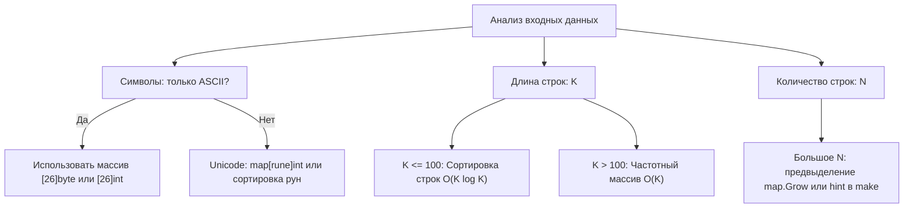
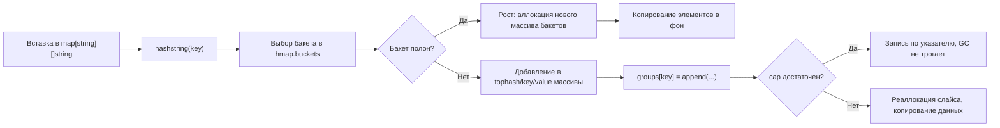

## Группировка анаграмм: стратегии ключей, аллокации и механика map в Go

Задача `Group Anagrams` (LeetCode 49) требует сгруппировать строки так, чтобы в каждой группе оказались слова, состоящие из одинаковых символов с одинаковой частотой. На собеседованиях эта задача служит лакмусовой бумажкой: проверяет не только знание структур данных, но и понимание ограничений рантайма Go, работы с памятью и способности выбирать алгоритм под конкретные ограничения системы.



## Подход 1: Канонический ключ через сортировку

Самый интуитивный способ: привести каждую строку к «каноническому» виду (отсортировать символы) и использовать его как ключ в хеш-таблице.

```go
// GroupAnagramsSort группирует анаграммы через сортировку
// Время: O(N * K log K), Память: O(N * K) для хранения ключей и групп
func GroupAnagramsSort(strs []string) [][]string {
    groups := make(map[string][]string, len(strs)/2+1) // Эвристика для начальной ёмкости
    
    // Буфер переиспользуется для сортировки, чтобы снизить давление на GC
    buf := make([]byte, 0, 256)
    
    for _, s := range strs {
        // Копируем в буфер и сортируем
        buf = append(buf[:0], s...)
        sort.Slice(buf, func(i, j int) bool {
            return buf[i] < buf[j]
        })
        
        key := string(buf) // Конвертация в string: аллокация + копирование
        groups[key] = append(groups[key], s)
    }
    
    // Преобразование map в [][]string
    result := make([][]string, 0, len(groups))
    for _, group := range groups {
        result = append(result, group)
    }
    return result
}
```

> [!info] Под капотом
> Переиспользование `buf` (`append(buf[:0], s...)`) позволяет избежать повторных аллокаций на куче при обработке каждой строки. Однако `sort.Slice` вызывает замыкание, что в Go создаёт объект-контекст на куче (хотя в Go 1.22+ оптимизации замыканий стали лучше). Для чистого `[]byte` можно использовать `slices.Sort` из Go 1.21, который инлайнится и работает быстрее за счёт отсутствия `interface{}`.

## Подход 2: Частотный массив (оптимальный по времени)

Сортировка даёт `O(K log K)`. Если нам важна производительность, мы можем посчитать частоту символов за `O(K)` и превратить частотный массив в строку-ключ.

```go
// GroupAnagramsCount группирует анаграммы через подсчёт частот
// Время: O(N * K), Память: O(N * K)
func GroupAnagramsCount(strs []string) [][]string {
    // make(map[string][]string) выделяет базовый массив бакетов
    groups := make(map[string][]string)
    
    // Частотный массив на стеке (если не утекает)
    var counts [26]int
    
    for _, s := range strs {
        for i := range s {
            counts[s[i]-'a']++
        }
        
        // Формируем ключ из частотного массива
        key := countsToString(&counts)
        
        // Сбрасываем массив для следующей итерации
        for i := range counts {
            counts[i] = 0
        }
        
        groups[key] = append(groups[key], s)
    }
    
    result := make([][]string, 0, len(groups))
    for _, group := range groups {
        result = append(result, group)
    }
    return result
}

// countsToString конвертирует массив частот в строку без лишних аллокаций
func countsToString(c *[26]int) string {
    var b strings.Builder
    b.Grow(26 * 4) // Резервируем место под числа
    for _, v := range c {
        b.WriteString(strconv.Itoa(v))
        b.WriteByte('#') // Разделитель для однозначности
    }
    return b.String()
}
```

> [!warning] Ловушка / Gotcha
> **Критическое ограничение Go:** `map[[]byte]` в языке **запрещён**. Слайсы не являются сравниваемым типом (not comparable), поэтому рантайм не может вычислить хеш или проверить равенство ключей через `==`. Попытка скомпилировать `m := make(map[[]byte]int)` приведёт к ошибке `invalid map key type []byte`. Ключ всегда должен быть преобразован в `string`, что гарантирует неизменяемость и позволяет рантайму безопасно хешировать указатель + длину.

## Под капотом: механика map и влияние на GC

Когда вы вызываете `groups[key] = append(...)`, рантайм Go выполняет несколько скрытых операций:

1. **Хеширование ключа:** Вызывается `hashstring` из рантайма. Для строк используется алгоритм, близкий к `MemHash` или `AES-NI` на поддерживаемых CPU. Он читает байты ключа, вычисляет хеш и выбирает бакет в массиве `hmap.buckets`.
2. **Поиск/Вставка:** Внутри бакета хранятся массивы ключей и значений. Если бакет заполнен (> `loadFactor` ≈ 6.5), происходит `grow` — аллокация нового массива бакетов в 2 раза больше и фоновое перемещение элементов. Это дорого, поэтому `make(map, hint)` с адекватной подсказкой экономит системные вызовы и аллокации.
3. **Append и срезы:** `groups[key] = append(...)` может реаллоцировать внутренний слайс группы. Если `len(group) < cap(group)`, добавление происходит за O(1). Если `cap` превышен, выделяется новый массив (обычно x2), старые данные копируются. Это создаёт «мусор» для GC.



> [!info] Под капотом
> **Escape Analysis и GC давление:** В примере выше `key := string(buf)` вызывает конвертацию, которая копирует байты в новую область кучи. Эти строки-ключи живут до тех пор, пока существует `map`. Если входной массив `strs` огромен (миллионы строк), куча разрастается, и `GOGC` начнёт чаще запускать сборку мусора, вызывая `stop-the-world`. Для высоконагруженных систем это unacceptable. Решение: использовать `sync.Pool` для буферов или кастомную хеш-таблицу с открытой адресацией, но на интервью достаточно упомянуть компромисс и предложить профилирование через `pprof`.

## Оптимизация аллокаций: от O(N*K) к практическому минимуму

1. **Предвыделение результата:** `make([][]string, 0, len(groups))` избегает роста итогового слайса.
2. **`strings.Builder` вместо конкатенации:** `b.WriteString()` пишет в внутренний `[]byte`. `b.Grow()` резервирует память заранее.
3. **Избегание `[]rune` для ASCII:** `len(s)` и индексация `s[i]` работают с байтами. Если вход гарантированно латинский, работа с `[]rune` удваивает/утраивает расход памяти без пользы.
4. **Reuse of slices:** Если группы обрабатываются последовательно, можно переиспользовать один буфер для подсчёта частот, сбрасывая его `memset`-подобным циклом (как в коде выше).

## Unicode и граничные случаи

В реальном продакшене строки редко ограничены `a-z`. Для поддержки Unicode частотный массив `[26]int` не подходит.

```go
func GroupAnagramsUnicode(strs []string) [][]string {
    groups := make(map[string][]string)
    
    for _, s := range strs {
        // map[rune]int — универсально, но медленнее из-за хеширования рун
        freq := make(map[rune]int)
        for _, ch := range s {
            freq[ch]++
        }
        
        // Канонический ключ: отсортированные руны или сериализованная карта
        key := makeFrequencyKey(freq)
        groups[key] = append(groups[key], s)
    }
    // ... преобразование в [][]string
}

func makeFrequencyKey(freq map[rune]int) string {
    // Для Unicode надёжнее использовать отсортированную строку пар rune:count
    // Это сложнее, но гарантирует уникальность и сравнимость
    var b strings.Builder
    // Сортировка ключей карты требует выделения слайса, но это неизбежно
    // В продакшене лучше использовать нормализацию (NFC) + сортировку байт
    return b.String() // Упрощено для примера
}
```

> [!warning] Ловушка / Gotcha
> При работе с Unicode важно помнить о **нормализации**. Строки `"café"` (NFC: `\u00E9`) и `"café"` (NFD: `e\u0301`) состоят из разных байт, но визуально идентичны. Без пакета `golang.org/x/text/unicode/norm` они попадут в разные группы. На собеседовании всегда уточняйте: «Считаем ли мы нормализованные строки одинаковыми?».

## Вопросы с собеседований: глубина понимания

> [!tip] Собеседование
> **Вопрос:** Почему ключ мапы должен быть неизменяемым? Что произойдёт, если Go разрешит изменять строку-ключ после вставки?
> **Ответ:** Хеш-таблица вычисляет хеш ключа при вставке и сохраняет элемент в конкретном бакете. Если ключ изменится, его хеш изменится, но элемент останется в старом бакете. При поиске рантайм посчитает новый хеш, посмотрит в другой бакет и не найдёт элемент. Возникнет «фантомный» ключ и потеря данных. Неизменяемость `string` в Go гарантирует, что хеш остаётся постоянным в течение жизни ключа.

> [!tip] Собеседование
> **Вопрос:** Как оптимизировать задачу, если `N` очень большое, но оперативной памяти мало?
> **Ответ:** Использовать внешнюю сортировку или разделение на чанки с записью на диск. Либо применить вероятностную структуру данных вроде Bloom Filter для предварительной фильтрации, а затем потоковую обработку. В контексте Go: можно использовать `os.CreateTemp()`, записывать пары `hash->index`, сортировать файл с помощью `unix` утилит, и читать обратно. Это trade-off между RAM и I/O latency.

> [!tip] Собеседование
> **Вопрос:** Чем `map[string][]string` отличается от `map[int64][]string` (если хеш строки поместить в `int64`)?
> **Ответ:** Риск коллизий. `hashstring` возвращает `uintptr` (64 бита на x64), но вероятность коллизии при N=10⁶ ненулевая. Если коллизия произойдёт, разные строки попадут в одну группу — это логическая ошибка. Использование полной строки как ключа гарантирует точность, но требует больше памяти. В высоконагруженных системах иногда жертвуют точностью ради скорости, но для алгоритмических задач это неприемлемо.

## Итог: чек-лист для решения на интервью

1. Уточните домен символов (ASCII vs Unicode) и ограничения по памяти.
2. Избегайте `map[[]byte]` — ключ должен быть `string`. Конвертация `string(bytes)` копирует данные, это нормально, но учитывайте в оценке памяти.
3. Для ASCII используйте частотный массив `[26]int` и сериализуйте его в `string` — это `O(K)` против `O(K log K)` у сортировки.
4. Предвыделяйте ёмкость мапы и результирующих слайсов, чтобы снизить `GC pressure` и реаллокации.
5. Помните о нормализации Unicode и неизменяемости строк как фундаментальных свойствах рантайма Go.
6. Используйте `pprof -alloc_objects` для поиска скрытых аллокаций, если решение не проходит по памяти.

Группировка анаграмм — это не просто задача на `map`. Это возможность продемонстрировать понимание того, как рантайм Go управляет хеш-таблицами, обрабатывает строки и взаимодействует со сборщиком мусора. Правильный выбор структуры ключа и контроль аллокаций отличают рабочего кода от инженерного решения.

В следующей статье мы перейдём к задаче на декодирование вложенных строк и разберём применение стека для обработки рекурсивных паттернов: [[6. Decode String]]