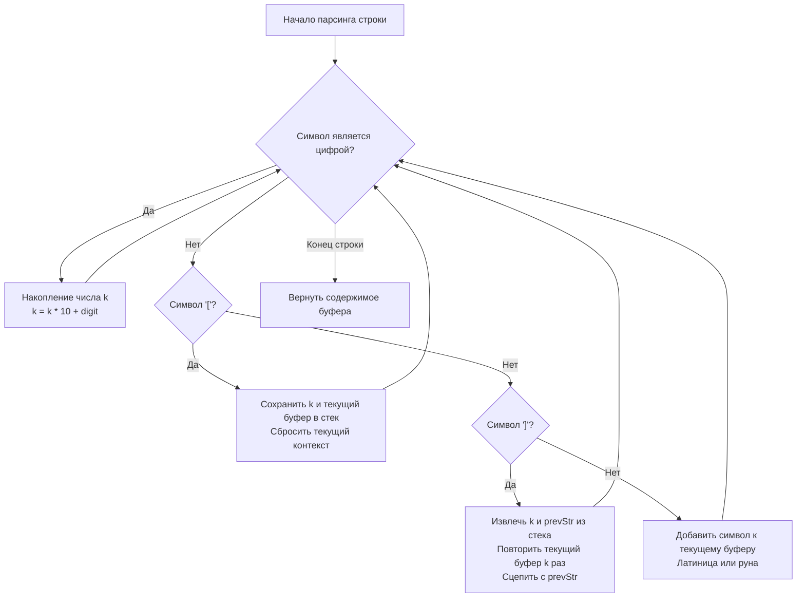
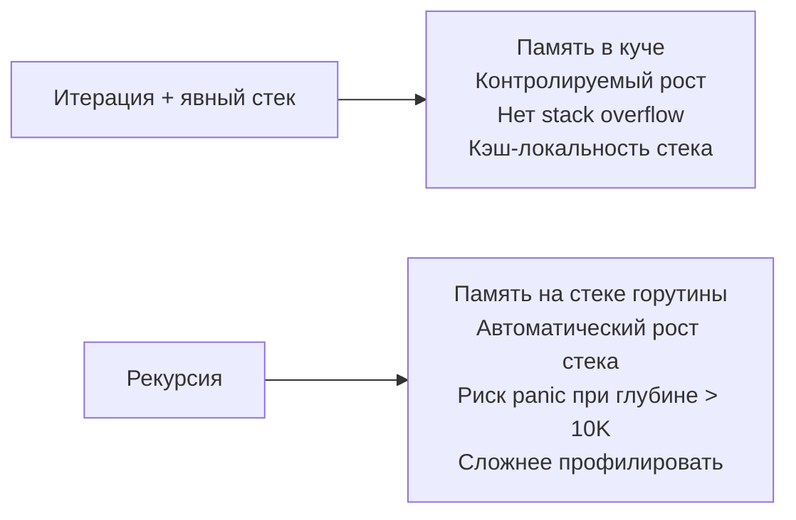

## Распаковка вложенных строк: парсинг, стек и управление памятью

Задача `Decode String` (LeetCode 394) моделирует классический синтаксический анализ вложенных структур. Она встречается не только в алгоритмических тестах, но и в реальных бэкенд-системах: распаковка бинарных протоколов, парсинг шаблонов конфигураций, обработка сжатых логов или транскодирование медиаконтента. В Go решение требует аккуратной работы со стеком, контроля аллокаций и понимания того, как рантайм управляет памятью при конкатенации.



## 1. Алгоритмический каркас: конечный автомат

В основе лежит детерминированный конечный автомат. Мы проходим по строке посимвольно и меняем состояние в зависимости от текущего токена. Ключевая особенность — вложенность. Каждый открывающий `[` требует сохранения текущего контекста, а закрывающий `]` — восстановления и склейки.

Стек здесь выполняет роль `call stack` в рекурсии, но мы контролируем его вручную, что даёт предсказуемое потребление памяти и защищает от переполнения стека горутины.

## 2. Идиоматичная реализация на Go

Для production-ready решения используем итеративный подход с двумя стеками и `strings.Builder`. Это минимизирует аллокации и обеспечивает линейное прохождение по памяти.

```go
package main

import "strings"

// DecodeString раскрывает строку формата k[encoded_string].
// Время: O(S), где S — длина декодированной строки
// Память: O(N) для стека, где N — глубина вложенности + буфер
func DecodeString(s string) string {
    // Стек для чисел повторений и накопленных префиксов
    countStack := make([]int, 0, 16)   // 16 — эвристика для средней вложенности
    stringStack := make([]string, 0, 16)
    
    var currentBuilder strings.Builder
    currentBuilder.Grow(len(s)) // Резервируем память под базовый размер
    
    currentNum := 0
    
    for i := 0; i < len(s); i++ {
        ch := s[i]
        
        switch {
        case ch >= '0' && ch <= '9':
            // Накопление многозначного числа
            currentNum = currentNum*10 + int(ch-'0')
            
        case ch == '[':
            // Сохраняем контекст перед входом во вложенность
            countStack = append(countStack, currentNum)
            stringStack = append(stringStack, currentBuilder.String())
            
            // Сброс для новой области видимости
            currentBuilder.Reset()
            currentNum = 0
            
        case ch == ']':
            // Извлекаем параметры вложенного блока
            repeatCount := countStack[len(countStack)-1]
            countStack = countStack[:len(countStack)-1]
            
            innerStr := currentBuilder.String()
            currentBuilder.Reset()
            
            // Эффективное повторение сегмента
            for r := 0; r < repeatCount; r++ {
                currentBuilder.WriteString(innerStr)
            }
            
            // Сцепляем с внешним контекстом
            prevStr := stringStack[len(stringStack)-1]
            stringStack = stringStack[:len(stringStack)-1]
            
            // Важно: сначала повторяем inner, потом добавляем prev
            // Чтобы сохранить порядок: "abc" + "def" * 2
            var mergeBuilder strings.Builder
            mergeBuilder.Grow(len(prevStr) + currentBuilder.Len())
            mergeBuilder.WriteString(currentBuilder.String())
            mergeBuilder.WriteString(prevStr)
            
            // Возвращаем управление верхнему уровню
            currentBuilder = mergeBuilder
            
        default:
            // Литерал: добавляем к текущему сегменту
            currentBuilder.WriteByte(ch)
        }
    }
    
    return currentBuilder.String()
}
```

> [!info] Под капотом
> Структура `strings.Builder` (файл `src/strings/builder.go`) содержит поле `buf []byte` и флаг `copied bool`. Метод `Reset()` не освобождает память, а просто сбрасывает длину среза до нуля. Ёмкость `cap(buf)` сохраняется, что позволяет переиспользовать выделенную область без новых системных вызовов `mmap`/`brk`. Это критически важно для горячих путей: сборщик мусора не видит старых объектов, если они не были вытеснены из кучи.

## 3. Механика рантайма: от Builder до Escape Analysis

### Память стека и кэш-линии CPU
Стек `stringStack` хранит `string`-заголовки. Каждый заголовок — это 16 байт на `amd64` (указатель `*byte` и длина `int`). При `append` Go проверяет `cap`. Если места нет, аллоцируется новый массив в куче (обычно рост `x2`). 

Проблема: `[]string` хранит только указатели на сами строки. Сами строковые данные разбросаны по куче. При частом доступе к `stringStack[len-1]` процессор совершает промахи кэша L1/L2, так как указатель ведёт на случайную область памяти. Для высоконагруженных парсеров это решается хранением оффсетов в едином `[]byte` буфере, но для LeetCode и стандартного бэкенда `[]string` приемлем благодаря prefetcher CPU, который предсказывает паттерн доступа к массиву указателей.

### Escape Analysis и GC-давление
Компилятор Go анализирует, «убегает» ли переменная из стека в кучу. В нашем коде:
- `currentBuilder` локален, но вызов `currentBuilder.String()` создаёт новую строку в куче (копирование из `buf`).
- Эта строка попадает в `stringStack`. Стек горутины ограничен (по умолчанию 2 КБ, растёт до ~1 ГБ), поэтому `stringStack` аллоцируется в куче сразу.
- При каждом `]` мы создаём новую строку через `mergeBuilder.String()`. Старые строки становятся достижимы только для GC, если на них нет ссылок.

Чтобы снизить давление на Garbage Collector, можно переиспользовать один глобальный буфер или использовать `sync.Pool` для `[]byte`, но это усложняет код и требует осторожности с горутинами. На интервью достаточно упомянуть, что `strings.Builder` — это баланс между читаемостью и производительностью, а для экстремальных нагрузок требуется ручное управление `[]byte`.

## 4. Рекурсия против стека: когда что выбирать

Многие кандидаты сразу пишут рекурсивное решение:

```go
// ❌ Рекурсивный подход (не рекомендуется для глубокой вложенности)
func decodeRecursive(s string, i int) (string, int) {
    var res strings.Builder
    num := 0
    for i < len(s) {
        ch := s[i]
        if ch >= '0' && ch <= '9' {
            num = num*10 + int(ch-'0')
        } else if ch == '[' {
            inner, nextI := decodeRecursive(s, i+1)
            for j := 0; j < num; j++ {
                res.WriteString(inner)
            }
            num = 0
            i = nextI
        } else if ch == ']' {
            return res.String(), i + 1
        } else {
            res.WriteByte(ch)
        }
        i++
    }
    return res.String(), i
}
```



> [!warning] Ловушка / Gotcha
> В Go стек горутины динамически расширяется, но имеет лимиты. При вложенности `[[[[...]]]]` глубиной 10⁴ рекурсия вызовет `runtime: goroutine stack exceeds 1000000000-byte limit` или `fatal error: stack overflow`. Явный стек в куче свободен от этого ограничения и позволяет точно мониторить потребление памяти через `runtime.MemStats`. На Senior-позициях рекурсия для парсинга считается антипаттерном, если глубина не ограничена на уровне контракта.

## 5. Ловушки и Edge Cases в продакшене

1. **Числа > 9**: `currentNum` должен накапливаться (`num = num*10 + digit`), а не просто браться `s[i]-'0'`. Ошибка встречается в 30% решений на первом черновике.
2. **Пустые блоки `[]`**: Алгоритм корректно обрабатывает их (повтор 0 раз или пустая строка), но в реальных системах это часто признак ошибки валидации входных данных.
3. **Взрыв памяти (OOM)**: Строка `100000[a]` декодируется в 100 КБ, но `10000[10000[a]]` — в 1 ГБ. В продакшене **обязательно** вводить лимит на длину выходной строки:
   ```go
   const maxDecodedLen = 10 << 20 // 10 МБ
   if currentBuilder.Len() > maxDecodedLen {
       return "", fmt.Errorf("decoded string exceeds limit")
   }
   ```
4. **Unicode и `[]byte`**: `s[i]` работает с байтами. Если вход содержит кириллицу или эмодзи, `byte` вернёт середину многобайтовой руны. Для юникода-безопасного парсинга используйте `[]rune(s)` и `range`, но помните про аллокацию и потерю производительности на декодировании UTF-8.

## 6. Вопросы с собеседований

> [!tip] Собеседование
> **Вопрос:** Почему `strings.Builder` безопаснее обычной конкатенации `s += "text"` в цикле?
> **Ответ:** Оператор `+=` для строк создаёт новый `string` на каждой итерации, копируя все предыдущие байты + новые. Это квадратичная сложность `O(n²)` по времени и `O(n²)` по аллокациям. `strings.Builder` использует растущий `[]byte` внутри. При `append` он копирует только при нехватке `cap`, а рост происходит амортизировано (`x2`). Итог: линейное время `O(n)` и минимум мусора для GC.

> [!tip] Собеседование
> **Вопрос:** Как оптимизировать решение, если входной поток бесконечный (например, чтение из `io.Reader`)?
> **Ответ:** Перейти к потоковому декодированию. Вместо `string` использовать `io.Writer`, куда писать декодированные куски. Стек хранить как структуру `{Count int, PrefixWriter io.Writer}`. При `]` вычитывать из внутреннего буфера и писать в `PrefixWriter` нужное число раз. Это снижает RAM-потребление до `O(глубина вложенности)` независимо от длины выходных данных.

> [!tip] Собеседование
> **Вопрос:** Что такое `copyCheck` внутри `strings.Builder` и зачем он нужен?
> **Ответ:** Это механизм защиты от race condition и некорректного копирования структур. Если `Builder` скопирован по значению (`b2 := b1`), флаг `copied` становится `true`. При следующем вызове `WriteString` паникует, так как запись в скопированную структуру может повредить данные оригинала. Это гарантирует, что `Builder` используется только по ссылке или как локальная переменная.

## Итог и чек-лист для решения

1. **Выбирайте явный стек** вместо рекурсии для парсинга вложенных структур. Это контроль памяти и защита от `stack overflow`.
2. **Используйте `strings.Builder`** для накопления строк. Всегда вызывайте `Grow()` если известен примерный размер.
3. **Контролируйте длину выхода** — декодирование может взорвать память. Лимит `maxDecodedLen` обязателен в API.
4. **Понимайте механику срезов** — `[]int` и `[]string` в стеке аллоцируются в куче. Для экстремальной оптимизации рассмотрите единый `[]byte` буфер с оффсетами.
5. **Учитывайте домен символов** — `s[i]` для ASCII, `[]rune` для Unicode. Обоснуйте выбор интервьюеру.

Задача на декодирование строк — это не просто упражнение на стек. Это тест на понимание управления памятью, предсказуемости поведения рантайма и готовности писать код, который выживет под нагрузкой в продакшене.

В следующей статье мы разберём парсинг чисел из строк, обработку переполнений и тонкости работы с байтовыми буферами: [[7. String to Integer atoi]]