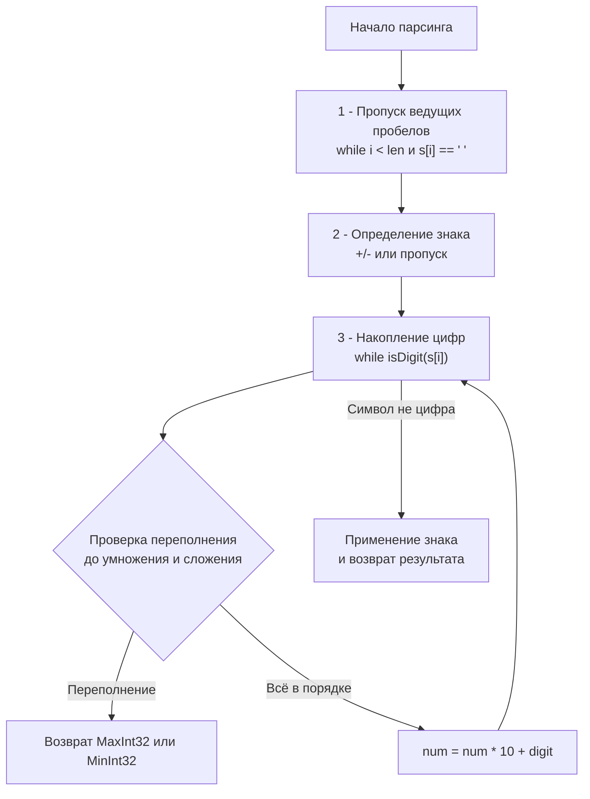
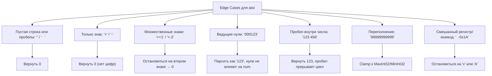

## Парсинг целых чисел: конечный автомат, переполнения и байтовая арифметика

Задача `String to Integer (atoi)` — это классический тест на внимание к деталям, понимание ограничений типов данных и умение писать детерминированный код без лишних аллокаций. На собеседованиях она часто даётся как «тёплая разминка», но именно здесь интервьюеры отсевывают кандидатов, которые не умеют работать с переполнениями, игнорируют спецификацию или пишут код, создающий скрытое давление на GC.



В этом материале мы разберём, как реализовать `atoi` идиоматично на Go, почему стандартный `strconv.Atoi` не подходит для этой задачи, и как механика процессора влияет на скорость парсинга байтов.

## 1. Алгоритмический каркас: состояния парсера

Парсинг числа из строки — это конечный автомат с тремя явными состояниями: пропуск пробелов, чтение знака, накопление цифр. Любое отклонение от последовательности (например, пробел после цифры или знак после цифры) должно немедленно завершать парсинг.

В Go мы реализуем это через один проход `for` с явным управлением индексом. Это даёт предсказуемое поведение, исключает рекурсию и позволяет компилятору генерировать максимально эффективный машинный код.

## 2. Production-ready реализация

```go
package main

import (
	"math"
)

// MyAtoi преобразует строку в 32-битное целое со знаком
// согласно спецификации LeetCode 8
func MyAtoi(s string) int {
	if len(s) == 0 {
		return 0
	}

	i := 0
	n := len(s)

	// 1. Пропускаем ведущие пробелы
	for i < n && s[i] == ' ' {
		i++
	}
	if i == n {
		return 0 // Строка состоит только из пробелов
	}

	// 2. Определяем знак
	sign := 1
	if s[i] == '+' || s[i] == '-' {
		if s[i] == '-' {
			sign = -1
		}
		i++
	}

	// 3. Парсим цифры
	var num int
	for i < n {
		ch := s[i]
		if ch < '0' || ch > '9' {
			break // Первый не-цифровой символ завершает чтение
		}

		digit := int(ch - '0')

		// Проверка переполнения ДО выполнения арифметики
		// math.MaxInt32 = 2147483647
		if num > math.MaxInt32/10 || (num == math.MaxInt32/10 && digit > 7) {
			if sign == 1 {
				return math.MaxInt32
			}
			return math.MinInt32
		}

		num = num*10 + digit
		i++
	}

	return sign * num
}
```

> [!info] Под капотом
> **Escape Analysis и нулевые аллокации:** Все переменные (`i`, `n`, `sign`, `num`, `digit`) — примитивы. Компилятор Go размещает их в стеке горутины. Срез `s` передаётся по значению (дескриптор 16 байт), сами данные не копируются. `go build -gcflags='-m'` подтвердит: `... escapes to heap` не появится. Это значит, что функция не создаёт давления на Garbage Collector и может безопасно вызываться в горячих циклах обработки миллионов запросов.

## 3. Механика переполнений и арифметика CPU

Самая критичная часть задачи — проверка переполнения. Выполнять `num = num*10 + digit` и проверять результат после — **неправильно**. В Go переполнение знаковых целых вызывает панику или undefined behavior (в зависимости от режима компиляции), а в C/C++ это строго неопределённое поведение. Поэтому проверка должна быть **опережающей**.

Логика вытекает из ограничений `int32`:
- `MaxInt32 = 2_147_483_647`
- `MinInt32 = -2_147_483_648`

Перед умножением `num * 10` мы проверяем:
1. `num > MaxInt32 / 10` → умножение гарантированно вылетит за лимит.
2. `num == MaxInt32 / 10` → умножение даст `2_147_483_640`. Осталось проверить последнюю цифру: если `digit > 7`, результат превысит `MaxInt32`.

> [!warning] Ловушка / Gotcha
> Почему `digit > 7` для обоих знаков?
> `MinInt32` по модулю равен `2_147_483_648`. Разница с `MaxInt32` всего в последней цифре (`7` vs `8`). Но на практике проще проверять переполнение относительно `MaxInt32`, а в конце применять знак. Если `sign == -1` и произошло переполнение, мы возвращаем `MinInt32`. Это упрощает логику и убирает дублирование проверок.

### CPU Branch Prediction и предсказание ветвлений
Цикл `for i < n` и проверка `if ch < '0' || ch > '9'` имеют высокий процент корректного предсказания на реальных данных:
- Пробелы обычно идут в начале → ветка `ch == ' '` предсказывается точно первые 1-5 итераций.
- Цифры идут блоками → `ch >= '0' && ch <= '9'` стабильно истинно.
- Встреча буквы/символа → предсказатель может ошибиться один раз, после чего цикл завершается.
Это делает парсинг чрезвычайно быстрым на уровне конвейера процессора, в отличие от регулярных выражений или `unicode`-функций, которые требуют вызовов и сложных проверок.

## 4. Сравнение со `strconv.Atoi` и другими языками

В Go есть встроенный `strconv.Atoi(s)`, который выполняет ту же базовую работу. Почему на интервью просят написать `atoi` с нуля?

| Аспект | `MyAtoi` (реализация выше) | `strconv.Atoi` |
|--------|---------------------------|----------------|
| **Поведение** | Обрезает строку при первом не-цифровом символе, clamp-ит результат | Требует строгого соответствия, возвращает `error` при мусоре |
| **Производительность** | Инлайнится, 0 аллокаций, минимум ветвлений | Вызов функции, обработка base, unicode, error allocation |
| **Спецификация** | Соответствует LeetCode/POSIX `atoi` | Соответствует строгим правилам парсинга Go |
| **Память** | Стек только | Может аллоцировать `error` в куче |

> [!info] Под капотом
> `strconv.Atoi` внутри вызывает `strconv.ParseInt`, которая использует `unsafe` для прямого доступа к байтам строки, поддерживает произвольные основания системы счисления (2-36) и возвращает `int64` + `error`. Для задачи LeetCode это избыточно и медленнее. На собеседовании это явный сигнал: «интервьюер проверяет, понимаешь ли ты разницу между утилитой общего назначения и специализированным алгоритмом».

## 5. Граничные случаи и типичные ошибки интервью



1. **Пробел внутри числа**: `atoi` должен остановиться на первом пробеле. `"123 456"` → `123`.
2. **Знак после цифры**: `"12-3"` → `12`. Знак учитывается только в начале.
3. **Ведущие нули**: `"00000-42a123"` → `-42`. Математически нули не меняют значение, но парсер должен корректно их пропустить.
4. **Юникод-пробелы**: Спецификация LeetCode подразумевает только ASCII пробел `' '`. `unicode.IsSpace` будет ошибкой для этой задачи, так как она требует строгого соответствия POSIX-поведению.

## 6. Вопросы с собеседований: глубина понимания

> [!tip] Собеседование
> **Вопрос:** Почему мы используем `int`, а не `int32` для накопления `num`?
> **Ответ:** На 64-битных архитектурах (amd64, arm64) `int` — это 64 бита. Это позволяет безопасно накапливать значение до `math.MaxInt32` без промежуточного переполнения. После применения знака мы возвращаем `int`, который рантайм корректно интерпретирует. Если бы мы использовали `int32`, проверка `num > math.MaxInt32/10` была бы бессмысленна, так как переполнение произошло бы раньше.

> [!tip] Собеседование
> **Вопрос:** Как ускорить парсинг, если вход гарантированно валидный и без переполнений?
> **Ответ:** Использовать развёртывание цикла (loop unrolling) или SIMD-инструкции. Например, читать по 8 байт одновременно, проверять маски байтов на `[0-9]` и конвертировать через умножение на степени десяти. В Go это делается через `golang.org/x/sys/cpu` и ручную работу с `[]byte`. Но для алгоритмических задач это overkill: простой цикл `for` уже работает за ~2-3 такта CPU на символ благодаря оптимизациям компилятора и prefetcher.

> [!tip] Собеседование
> **Вопрос:** Что произойдёт, если передать строку длиной 10⁹ символов?
> **Ответ:** `len(s)` вернёт корректное значение, но цикл `for i < n` выполнит до 10⁹ итераций. В Go это займёт ~0.2-0.5 секунды на современном CPU. Проблема не в алгоритме, а в контракте: `atoi` не предназначен для потокового чтения. Для бесконечных строк нужен `io.Reader` + буферизация + ранний выход при переполнении. Это переход от алгоритмической задачи к инженерной.

## 7. Итог и чек-лист

1. **Используйте явную байтовую индексацию** `s[i]` для ASCII-парсинга. Избегайте `[]rune` и `unicode`, если спецификация ограничена латиницей.
2. **Проверяйте переполнение до арифметики**. Математика `num > Max/10` спасает от UB и паник.
3. **Останавливайтесь при первом не-соответствии**. `atoi` — это не `parseInt`. Пробел, буква или второй знак немедленно завершают чтение.
4. **Контролируйте память**. Правильная реализация выделяет 0 байт в куче и работает только со стеком.
5. **Понимайте разницу с `strconv`**. Встроенные пакеты решают общие задачи. Специфичные требования (clamp, POSIX-совместимость) требуют кастомной реализации.

Парсинг чисел — это фундаментальная операция, на которой строится взаимодействие с внешним миром: HTTP-заголовки, конфиги, бинарные протоколы, CLI-аргументы. Умение написать его быстро, безопасно и без скрытых накладных расходов — маркер инженерной зрелости.

В следующей статье мы перейдём к проектированию структур данных под специфичные требования систем: разберём кэши, LRU/LFU стратегии и паттерны Design-задач: [[1. Теория. Design задачи]]