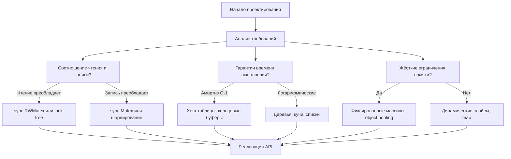
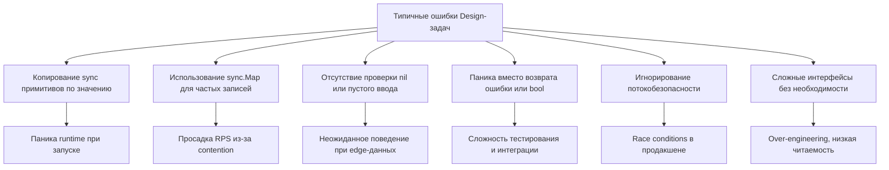

## Теория Design-задач: от API до внутренней механики в Go

Design-задачи (Design & Implement) — это не поиск алгоритмического паттерна, а проверка инженерной зрелости. Здесь интервьюер оценивает способность кандидата проектировать компоненты, выбирать правильные примитивы, гарантировать потокобезопасность и предвидеть компромиссы между скоростью, памятью и сложностью поддержки. В Go такие задачи требуют чёткого понимания работы со структурами, указателями, синхронизацией и сборщиком мусора.



## 1. Философия Design-задач: что проверяет интервьюер

В отличие от чистых алгоритмов, где фокус на асимптотике и обходе графов, Design-задачи требуют баланса между:
- **Чистотой интерфейса:** методы должны иметь понятные сигнатуры, использовать идиоматичные для Go паттерны (например, `ok` idiom, возврат ошибок, а не паники).
- **Выбором структур:** обоснование, почему `map` лучше `slice`, почему `sync.Mutex` предпочтительнее `channel` для защиты состояния.
- **Потокобезопасностью:** большинство задач явно или неявно требуют `concurrent-safe` реализации.
- **Управлением памятью:** предсказуемость аллокаций, отсутствие скрытых утечек, минимизация давления на Garbage Collector.

На позициях Middle+/Senior от вас ждут не просто рабочего кода, а способности аргументировать каждое архитектурное решение и предложить оптимизации под конкретные ограничения.

## 2. Архитектура структуры данных в Go

Go не поддерживает классы, конструкторы или наследование. Вместо этого используется композиция структур, явные конструкторы-фабрики и методы с pointer-receiver.

```go
type MyCache struct {
    mu   sync.RWMutex
    data map[string]*Item
    cap  int
    // дополнительные поля политики вытеснения
}

// NewMyCache — фабричная функция, стандартный паттерн в Go
func NewMyCache(capacity int) *MyCache {
    if capacity <= 0 {
        capacity = 1 // или return nil с ошибкой, зависит от контракта
    }
    return &MyCache{
        data: make(map[string]*Item, capacity),
        cap:  capacity,
    }
}

// Методы используют pointer-receiver, так как изменяют состояние
func (c *MyCache) Get(key string) (*Item, bool) {
    // реализация
}
```

> [!info] Под капотом
> Примитивы синхронизации (`sync.Mutex`, `sync.RWMutex`) **категорически нельзя копировать**. Если передать структуру по значению, внутренний счётчик состояния `state` будет дублирован, что приведёт к неопределённому поведению или панике `fatal error: sync: misuse of Mutex`. Поэтому все методы, работающие с состоянием, должны принимать `*T`. Компилятор Go (`go vet`) автоматически отлавливает такие ошибки, но на интервью это частая причина дисквалификации.

## 3. Выбор примитивов: карта, слайс или кастомная структура

### `map[string]T` vs `[]T` vs Custom Hash Table
- **`map`**: амортизированное `O(1)` для поиска/вставки/удаления. Встроенная реализация рантайма (`hmap`) оптимизирована, но не является потокобезопасной для записи. Идеальна для 95% кэшей и индексаторов.
- **Слайс `[]T`**: `O(n)` поиск, но `O(1)` доступ по индексу и отличная кэш-локальность. Подходит для кольцевых буферов, стеков, очередей, где размер известен или растёт предсказуемо.
- **Кастомная хеш-таблица**: используется только когда требуется детерминированное время без амортизации, точный контроль над аллокациями или lock-free доступ. На собеседованиях реализуется редко, но понимание её принципов (открытая адресация, рехаширование) обязательно.

> [!warning] Ловушка / Gotcha
> **Никогда не используйте `sync.Map` для кэшей с частыми обновлениями.** `sync.Map` оптимизирован под сценарии «write-once, read-many» (например, конфигурации, загруженные при старте). Его внутренняя структура состоит из `read` (оптимистичный путь без блокировок) и `dirty` (для новых ключей). При частых `Load`/`Store`/`Delete` происходит постоянная миграция между ними, что создаёт значительный оверхед. Для динамических данных используйте `map + sync.RWMutex` или шардирование.

## 4. Потокобезопасность и стратегия блокировок

### Гранулярность мьютексов
- **Coarse-grained (`sync.Mutex`)**: один мьютекс на всю структуру. Просто, надёжно, но создаёт contention при высокой конкурентности.
- **Read/Write (`sync.RWMutex`)**: позволяет множественным читателям работать параллельно, но записи блокируют всех. Идеально для read-heavy кэшей.
- **Fine-grained / Sharding**: разделение данных на N сегментов, каждый со своим мьютексом. Снижает contention до `1/N`. Используется в `singleflight`, `freecache`, `ristretto`.

```go
// Пример: RWMutex в действии
func (c *Cache) Get(key string) (*Item, bool) {
    c.mu.RLock()
    defer c.mu.RUnlock()
    
    val, ok := c.data[key]
    return val, ok
}
```

> [!info] Под капотом
> `defer` добавляет небольшой оверхед (сохранение контекста, вызов функции при выходе). В горячих путях с миллионами запросов иногда используют ручное `c.mu.RUnlock()` сразу после чтения. Однако на собеседовании `defer` предпочтительнее: он гарантирует разблокировку при `panic` или раннем `return`, что критично для предотвращения deadlock. Инженерный trade-off между производительностью и безопасностью всегда обсуждается с интервьюером.

## 5. Управление памятью и Escape Analysis

Design-задачи часто оперируют объектами, которые живут дольше вызова метода. Компилятор Go анализирует, «убегает» ли переменная в кучу. Это напрямую влияет на GC.

1. **Предвыделение (`make(map, hint)`, `make([]T, 0, cap)`)**: избегает множественных реаллокаций при росте структур.
2. **`sync.Pool`**: для кратковременных объектов (буферы, сессии, временные структуры). Снижает частоту выделений в куче, но не гарантирует, что объект не будет собран GC между пулами.
3. **Композиция указателей vs значений**: хранение `*Item` в `map` снижает размер записи карты (всегда 8 байт указателя), но создаёт больше мелких объектов в куче. Хранение `Item` (значение) увеличивает размер бакета `map`, но улучшает locality и снижает GC-pressure.

> [!tip] Собеседование
> **Вопрос:** Почему в реализации LRU-кэша часто используют двусвязный список, а не slice?
> **Ответ:** Слайс требует `O(n)` для удаления или вставки в середине из-за сдвига элементов. Двусвязный список обеспечивает `O(1)` удаление/вставку при наличии указателя на узел. В Go это реализуется через структуру `Node { key, value, prev, next *Node }`. Компромисс: список создаёт множество мелких аллокаций в куче, что увеличивает фрагментацию и нагрузку на GC. Для кэшей до ~100k элементов список выигрывает по скорости операций, но для высоконагруженных систем часто используют массивные слайсы с индексами или object pooling.

## 6. Стратегия решения на интервью: пошаговый алгоритм

1. **Уточнение требований**: операции (`Get`, `Put`, `Delete`, `Peek`), асимптотика, потокобезопасность, лимиты памяти, политика вытеснения (LRU, LFU, TTL).
2. **Проектирование API**: сигнатуры методов, использование `bool` для `ok idiom` или возврат `error`, избегание паник в публичных методах.
3. **Выбор структур**: обоснование `map` vs `slice`, выбор мьютекса, оценка потребления памяти.
4. **Реализация**: идиоматичный Go, проверка на `nil`, обработка граничных условий, комментарии к сложным инвариантам.
5. **Дискуссия об ограничениях**: готовность предложить шардирование, lock-free очереди, `sync.Pool`, атомарные операции или переход к распределённой версии (Redis/Memcached).

## 7. Edge Cases и типичные ошибки кандидатов



1. **Пустая ёмкость**: `NewCache(0)` не должна падать. Обычно устанавливают дефолт или возвращают ошибку.
2. **Дубликаты ключей**: поведение `Put` при уже существующем ключе (обновление значения, обновление таймаута, игнорирование).
3. **Указатели и мутации**: если `Get` возвращает `*Item`, вызывающий код может изменить данные без блокировки кэша. Решение: возвращать копию или `readonly` интерфейс, либо явно документировать контракт.
4. **Интерфейсы без нужды**: создание `type Cache interface` для единственной реализации — антипаттерн. В Go интерфейсы определяются потребителем, а не создателем структуры.

## 8. Вопросы с собеседований: глубина понимания

> [!tip] Собеседование
> **Вопрос:** Когда стоит использовать `channel` вместо `Mutex` для защиты состояния?
> **Ответ:** `channel` подходит для передачи данных между горутинами, организации очередей или реализации паттерна fan-in/fan-out. Для защиты простой структуры данных (кэш, счётчик, карта) `Mutex` всегда эффективнее: меньше аллокаций, ниже латентность, проще отладка. Правило Rob Pike остаётся актуальным: «Share memory by communicating» — но только когда архитектура требует координации потоков данных, а не просто защиты критической секции.

> [!tip] Собеседование
> **Вопрос:** Как реализовать lock-free кэш на Go?
> **Ответ:** Чистый lock-free кэш в Go сложен из-за GC и модели памяти. Обычно используют атомарные операции (`sync/atomic`) для указателей на неизменяемые снапшоты состояния (copy-on-write). При чтении загружается текущий указатель атомарно, при записи создаётся новая версия карты, и указатель обновляется `atomic.StorePointer`. Это даёт неблокирующее чтение, но удваивает расход памяти и нагрузку на GC. На практике проще и быстрее использовать `RWMutex` с `defer`.

> [!tip] Собеседование
> **Вопрос:** Как протестировать потокобезопасную структуру данных?
> **Ответ:** Встроенный `go test -race` запускает анализатор data races, но он не гарантирует покрытие всех сценариев. Дополняйте тестами с `sync.WaitGroup` и множеством горутин, выполняющих случайные `Get/Put/Delete`. Используйте `testing.F` для фаззинга или инструменты вроде `goleak` для проверки на утечки горутин.

## 9. Итог: чек-лист для Design-задач

1. **Уточните контракт до кода**: операции, асимптотика, concurrency, memory limits.
2. **Проектируйте API идиоматично**: `ok idiom`, ошибки вместо паник, pointer-receiver для мутаций.
3. **Выбирайте примитивы осознанно**: `map + RWMutex` для кэшей, `sync.Mutex` для простых структур, шардирование для высокой нагрузки.
4. **Контролируйте аллокации**: `make` с hint, переиспользование буферов, `sync.Pool` для горячих путей.
5. **Избегайте копирования sync**: все методы с мьютексами — по указателю, структуры не копируются.
6. **Будьте готовы к оптимизациям**: lock-free снапшоты, атомарные счётчики, кастомные хеш-таблицы.

Design-задачи — это мост между алгоритмическим мышлением и системной инженерией. Умение проектировать предсказуемые, безопасные и производительные компоненты в Go напрямую коррелирует с готовностью к роли Senior/Lead.

В следующей статье мы детально разберём архитектуру кэш-структур, политики вытеснения и реализацию LRU/LFU с учётом механики рантайма: [[2. Кэш структуры]]