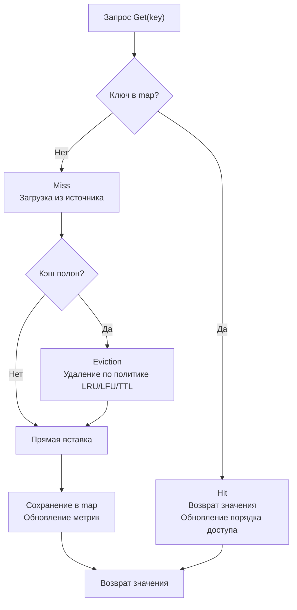
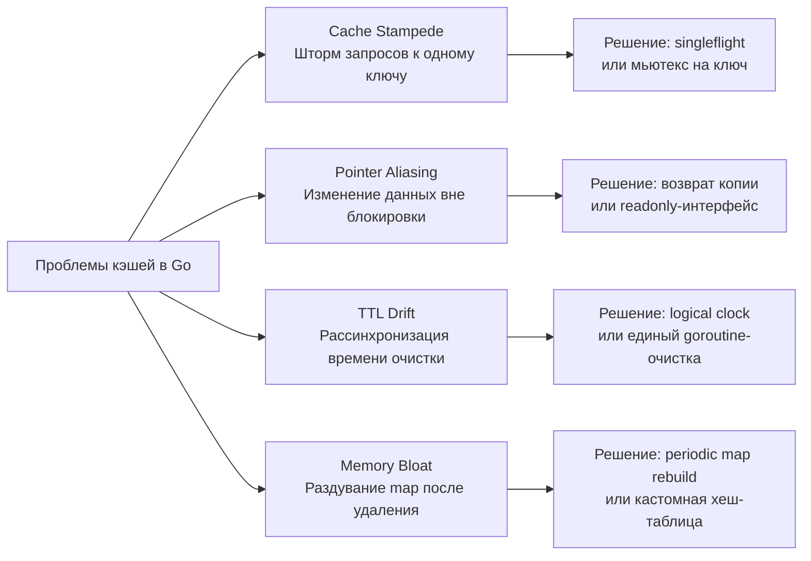

## Кэш структуры: архитектура, политики вытеснения и механика памяти

In-memory кэш — это не просто обёртка над `map`. Это высококонкурентная структура данных с жёсткими ограничениями по памяти, предсказуемой латентностью и детерминированным поведением при утечках или переполнениях. В Go проектирование кэша требует глубокого понимания работы сборщика мусора, распределения памяти, примитивов синхронизации и взаимодействия с планировщиком горутин.



В этой статье мы разберём, как строить production-ready кэш на Go, почему стандартные подходы часто проваливаются под нагрузкой, и как механика CPU и рантайма влияет на выбор структур.

## 1. Фундаментальная архитектура кэша в Go

Кэш состоит из трёх обязательных компонентов:
1. **Индекс** — быстрая структура для поиска по ключу (`map[K]V` или кастомная хеш-таблица).
2. **Хранилище** — данные и метаданные (время создания, TTL, частота доступа).
3. **Политика вытеснения (Eviction Policy)** — алгоритм удаления элементов при достижении лимита.

В отличие от C++ или Java, где кэши часто строятся на основе стандартных контейнеров (`std::unordered_map` + `std::list`, `LinkedHashMap`), в Go `map` является несортированной хеш-таблицей без встроенной информации о порядке доступа. Поэтому кэш всегда реализуется как композиция нескольких структур.

> [!info] Под капотом
> Внутреннее представление `map` в рантайме Go (`hmap`) — это массив бакетов (`buckets`), каждый из которых хранит до 8 ключей и значений. При вставке Go вычисляет хеш, выбирает бакет и сравнивает ключи. **Важно:** `map` не гарантирует порядок итерации, а при достижении `loadFactor` ~6.5 происходит `grow` — аллокация нового массива в 2 раза больше и фоновая миграция элементов. Для кэша это неприемлемо: миграция создаёт непредсказуемые паузы и нарушает детерминизм латентности.

## 2. Структуры для политик вытеснения

### Двусвязный список для LRU
Классический подход для Least Recently Used: `map[key]*Node` + двусвязный список. `Node` содержит `key`, `value`, `prev`, `next`. При `Get` узел перемещается в голову списка. При `Put` с переполнением удаляется хвост.

**Проблема locality:** Каждый узел — отдельная аллокация в куче. При обходе списка CPU совершает случайные переходы по памяти, промахиваясь через кэш-линии L1/L2. На современных процессорах это снижает пропускную способность в 3-5 раз по сравнению с массивными структурами.

**Оптимизация:** Вместо указателей использовать индексы в предварительно выделенном массиве (`[]Node`). Это превращает `pointer chasing` в предсказуемый доступ к смежной памяти, что идеально ложится на аппаратный prefetcher.

```go
// Оптимизированный узел для массивного LRU
type Node struct {
    Key   string
    Value any
    Prev  int // индекс в массиве, а не указатель
    Next  int
}

// Аллокация пула узлов на старте кэша
pool := make([]Node, capacity)
for i := 0; i < capacity; i++ {
    pool[i].Prev = -1
    pool[i].Next = -1
}
```

### Частотные списки для LFU
Least Frequently Used требует отслеживания счётчиков обращений. Наивная реализация с `map[key]int` + сортировка при каждом `Get` имеет сложность `O(log N)` или `O(N)`.

Продвинутый подход — **Double-LinkedList Buckets**: массив списков, где индекс массива соответствует частоте. При каждом обращении узел перемещается в следующий бакет. Это даёт амортизированное `O(1)`, но требует сложного управления памятью и синхронизацией.

> [!warning] Ловушка / Gotcha
> Никогда не используйте `time.After` в цикле для очистки TTL-кэша! Каждый вызов `time.After` создаёт новый таймер и горутину, которые не освобождаются до истечения срока. Это приводит к утечкам горутин и взрывному потреблению памяти. Используйте один `time.Ticker` в отдельной горутине или `time.AfterFunc` с переиспользованием пула таймеров.

## 3. Потокобезопасность и гранулярность блокировок

Большинство кэшей read-heavy. Выбор примитива синхронизации напрямую влияет на throughput под конкурентной нагрузкой.

```go
type Cache struct {
    mu      sync.RWMutex
    items   map[string]*Item
    maxSize int
    // ...
}

func (c *Cache) Get(key string) (*Item, bool) {
    c.mu.RLock()
    defer c.mu.RUnlock()
    item, ok := c.items[key]
    return item, ok
}
```

> [!info] Под капотом
> `sync.RWMutex` реализован через атомарные счётчики читателей и ожидание через `futex` в Linux. При захвате на запись (`Lock()`) все текущие читатели завершают работу, а новые блокируются. Если записи происходят чаще, чем каждые ~10 микросекунд, `RWMutex` деградирует до обычного `Mutex` из-за постоянного ожидания снятия блокировки чтения. В таких сценариях лучше использовать `sync.Mutex` или **шардирование**.

### Шардирование (Sharding)
Разделение `map` на `N` независимых сегментов, каждый со своим мьютексом. Хеш ключа определяет сегмент: `idx := hash(key) % shards`.
- Снижает contention до `1/N`.
- Позволяет распараллелить чтение/запись на разные ядра CPU.
- Увеличивает потребление памяти (N мьютексов + N мап + служебные структуры).

Именно так работают `ristretto`, `freecache` и `groupcache`. Для интервью достаточно описать принцип: `hash(key) → segment → lock → operation`.

## 4. Управление памятью и влияние на GC

Кэш — главный источник давления на Garbage Collector. Каждая вставка — это аллокация. Каждое удаление — кандидат на сборку.

### Стратегии снижения GC-pressure
1. **`sync.Pool` для временных объектов:** Переиспользование структур `*Item` или буферов. Pool не гарантирует сохранность между циклами GC, но значительно снижает частоту аллокаций в hot-path.
2. **Предвыделение (`make(map, cap)`, `make([]T, cap)`):** Резервирование памяти на старте. Избегает фрагментации и множественных системных вызовов `brk`/`mmap`.
3. **Хранение значений vs указателей:** `map[string]Item` увеличивает размер бакета `hmap`, но упаковывает данные в куче компактнее. `map[string]*Item` экономит место в бакете, но создаёт множество мелких объектов. Для структур `< 64 байт` предпочтительнее хранение по значению (меньше указателей, лучше locality). Для `> 128 байт` — указатель.
4. **`GOMEMLIMIT`:** В Go 1.19+ можно ограничить RSS процессора. При достижении лимита GC переходит в агрессивный режим (`GOGC` динамически снижается). Для кэшей это означает более частые паузы, но предотвращает OOM.

> [!tip] Собеседование
> **Вопрос:** Почему возврат `*Item` из кэша опасен для конкурентного кода?
> **Ответ:** Возвращаемый указатель ссылается на внутреннее состояние кэша. Если вызывающая сторона изменит поле `item.Value = "new"`, это создаёт race condition с другими горутинами, читающими кэш. Правильный контракт: либо возвращать глубокую копию, либо документировать, что данные иммутабельны, либо использовать `copy-on-write` при обновлении. В production-кэшах часто возвращают слайс-обёртку или используют `unsafe` для быстрого копирования байтов без рефлексии.

## 5. Ловушки продакшена и edge cases



1. **Cache Stampede (Thundering Herd):** При сбросе популярного ключа сотни горутин одновременно идут в базу. Решение: `golang.org/x/sync/singleflight` или `sync.Map` с блокировкой на уровне ключа (`mu := getLock(key); mu.Lock()`).
2. **Memory Bloat после удаления:** Удаление ключа из `map` не возвращает память ОС. Рантайм помечает бакет как пустой, но он остаётся зарезервированным. При постоянной ротации данных кэш растёт в RSS. Решение: периодически пересоздавать `map` (`newMap := make(...); for k,v := range old { newMap[k]=v }`), либо использовать кастомную хеш-таблицу с открытой адресацией и `free` списком.
3. **Сериализация значений:** Если значение кэша — интерфейс или ссылка на внешние ресурсы, `Gob`/`JSON` сериализация при `Get` убивает производительность. Храните уже сериализованные `[]byte` или используйте `unsafe` для прямого копирования памяти, если архитектура позволяет.

## 6. Вопросы с собеседований: глубина понимания

> [!tip] Собеседование
> **Вопрос:** Как реализовать кэш с жёстким лимитом в байтах, а не в количестве элементов?
> **Ответ:** Хранить метрику `currentSize int` и обновлять её при каждой `Put`/`Delete`. При `Put` проверять `currentSize + newSize > maxSize`. Если превышение — запускать цикл eviction, удаляя элементы по политике (LRU/LFU) до тех пор, пока `currentSize` не станет допустимым. Важно: учитывать оверхед рантайма Go (заголовки объектов, выравнивание, структура `hmap`), добавляя коэффициент `1.2-1.5` к расчётному размеру.

> [!tip] Собеседование
> **Вопрос:** Почему `sync.Map` не подходит для динамического кэша с частыми записями?
> **Ответ:** `sync.Map` оптимизирован под паттерн `write-once, read-many`. Внутри два слоя: `read` (атомарный указатель на `readOnly`, оптимистичный путь) и `dirty` (полный набор ключей). При частых `Store`/`Delete` элементы постоянно мигрируют между слоями, вызывая аллокации и `atomic` операции. Это создаёт contention и деградацию throughput. Для read/write кэшей `map + sync.RWMutex` или шардирование всегда выигрывают.

> [!tip] Собеседование
> **Вопрос:** Как протестировать кэш на корректность вытеснения и конкурентную безопасность?
> **Ответ:** 1. Unit-тесты с `testing.T.Parallel()` на политики eviction. 2. Конкурентный тест: `sync.WaitGroup` с N горутин, выполняющих случайные `Get/Put/Delete`. 3. Запуск с `go test -race -count=10`. 4. Проверка памяти через `pprof -alloc_objects` и `goleak` для поиска утечек горутин/таймеров. 5. Бенчмарк `BenchmarkCache` с разными `GOMAXPROCS`.

## Итог: чек-лист проектирования кэш-структур

1. **Определите паттерн доступа:** read-heavy → `RWMutex`, write-heavy → `Mutex`/шардирование.
2. **Выберите структуру вытеснения:** LRU → массивный список с индексами, LFU → частотные бакеты, TTL → единый cleaner-горутин.
3. **Контролируйте память:** предвыделение, `sync.Pool` для узлов, лимиты в байтах, учёт `GOMEMLIMIT`.
4. **Изолируйте данные:** возвращайте копии, избегайте pointer aliasing, документируйте контракт мутации.
5. **Защищайтесь от штормов:** `singleflight` или per-key locks для предотвращения cache stampede.
6. **Профилируйте:** `-race`, `pprof`, `goleak`, бенчмарки на разных `GOMAXPROCS`.

Кэш — это микросистема внутри процесса. Его проектирование требует баланса между алгоритмической чистотой, аппаратными ограничениями CPU и механикой рантайма Go. Понимание этих компромиссов отличает код, который «работает», от кода, который выдерживает продакшен-нагрузку.

В следующей статье мы детально разберём реализацию LRU-кэша с нуля, оптимизацию под кэш-линии CPU и идиоматичные паттерны конкурентного доступа: [[3. LRU Cache]]