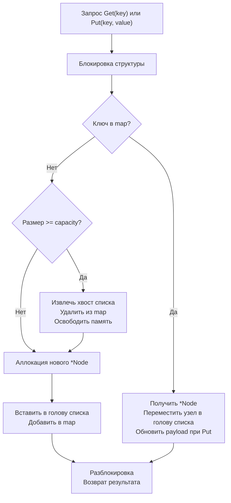

## Архитектура LRU-кэша: композиция структур, конкуренция и механика памяти

Least Recently Used (LRU) кэш — один из самых востребованных паттернов в системном дизайне и алгоритмических собеседованиях. Его задача проста: хранить ограниченный набор элементов и вытеснять те, к которым не было обращений дольше всего. Однако реализация LRU, которая работает предсказуемо под конкурентной нагрузкой, не создаёт memory leaks и минимизирует задержки, требует глубокого понимания рантайма Go, работы с памятью и аппаратных ограничений CPU.



В этом материале мы разберём, почему стандартный подход «map + двусвязный список» не всегда оптимален, как LRU взаимодействует с Garbage Collector, почему `sync.RWMutex` часто вредит производительности в этом паттерне, и как писать production-ready кэш на Go.

## 1. Архитектурный паттерн: почему именно Map + List

LRU требует двух ортогональных операций:
- **Быстрый поиск по ключу** → `O(1)` через хеш-таблицу (`map[string]*Node`).
- **Быстрое перемещение/удаление по порядку доступа** → `O(1)` через двусвязный список.

Массив или slice здесь не подходят: удаление из середины требует сдвига элементов `O(n)`, а вставка в начало при переполнении — аналогично. Хеш-таблица без списка не хранит информацию о порядке доступа. Композиция `map[K]*Node` и двусвязного списка закрывает обе потребности, но ценой увеличения потребления памяти и усложнения инвариантов.

> [!warning] Ловушка / Gotcha
> Многие кандидаты предлагают `container/list` из стандартной библиотеки. Это **антипаттерн для production**. `container/list` хранит `interface{}` значения, что заставляет рантайм упаковывать указатели в кучу, добавляет слой абстракции и требует `sync.Mutex` внутри самого контейнера. Для интервью и продакшена всегда пишите типизированную реализацию вручную: это убирает boxing/unboxing, даёт контроль над аллокациями и упрощает профилирование.

## 2. Идиоматичная реализация на Go

Классическая реализация использует pointer-receiver, фабричную функцию и строгую инкапсуляцию внутренней структуры списка.

```go
package lru

import "sync"

// Node представляет элемент кэша с ссылками на соседей
type Node struct {
	Key   string
	Value any
	Prev  *Node
	Next  *Node
}

// Cache реализует потокобезопасный LRU-кэш фиксированной ёмкости
type Cache struct {
	mu       sync.Mutex
	cap      int
	size     int
	cache    map[string]*Node
	head, tail *Node // Фиктивные узлы для упрощения операций
}

// NewCache создаёт новый кэш. capacity должен быть > 0
func NewCache(capacity int) *Cache {
	if capacity <= 0 {
		panic("lru: capacity must be positive")
	}
	c := &Cache{
		cap:   capacity,
		cache: make(map[string]*Node, capacity),
	}
	// Инициализация двусвязного списка с dummy-узлами
	c.head = &Node{Key: "__head__"}
	c.tail = &Node{Key: "__tail__"}
	c.head.Next = c.tail
	c.tail.Prev = c.head
	return c
}

// Get возвращает значение и статус наличия ключа
func (c *Cache) Get(key string) (any, bool) {
	c.mu.Lock()
	defer c.mu.Unlock()

	node, ok := c.cache[key]
	if !ok {
		return nil, false
	}

	// Ключ найден: перемещаем в начало (LRU-обновление)
	c.moveToHead(node)
	return node.Value, true
}

// Put вставляет или обновляет значение
func (c *Cache) Put(key string, value any) {
	c.mu.Lock()
	defer c.mu.Unlock()

	if node, ok := c.cache[key]; ok {
		// Обновление существующего
		node.Value = value
		c.moveToHead(node)
		return
	}

	// Создание нового узла
	newNode := &Node{Key: key, Value: value}
	c.cache[key] = newNode
	c.addToHead(newNode)
	c.size++

	// Эвикция при переполнении
	if c.size > c.cap {
		tail := c.removeTail()
		delete(c.cache, tail.Key)
		c.size--
	}
}

// Внутренние методы управления списком
func (c *Cache) addToHead(node *Node) {
	node.Next = c.head.Next
	node.Prev = c.head
	c.head.Next.Prev = node
	c.head.Next = node
}

func (c *Cache) removeNode(node *Node) {
	node.Prev.Next = node.Next
	node.Next.Prev = node.Prev
}

func (c *Cache) moveToHead(node *Node) {
	c.removeNode(node)
	c.addToHead(node)
}

func (c *Cache) removeTail() *Node {
	res := c.tail.Prev
	c.removeNode(res)
	return res
}
```

> [!info] Под капотом
> Dummy-узлы (`head`, `tail`) — это классическая техника, исключающая проверки на `nil` в углах списка. Они не хранят данных и не попадают в `map`. При `addToHead` и `removeTail` мы всегда работаем с реальными узлами, что убирает 2 условных перехода на операцию. Компилятор Go эффективно инлайнит эти методы, превращая 4 вызова в ~20 инструкций ассемблера без overhead на `CALL/RET`.

## 3. Под капотом: память, кэш-линии и сборщик мусора

### Pointer Chasing и кэш-промахи
Каждый `*Node` аллоцируется в куче через `runtime.mallocgc`. Адреса узлов распределены случайно по памяти. При последовательном обходе списка или перемещении узла CPU вынужден загружать новые кэш-линии (64 байта) из RAM. Статистически это даёт **~100-150 тактов задержки** на каждый промах L1. В LRU это неизбежно, но мы можем смягчить эффект:
- Предварительная аллокация пула узлов через `sync.Pool`.
- Хранение индексов в массиве вместо указателей (массивный LRU).

### Escape Analysis и GC-pressure
В `Get`/`Put` создаются указатели на `Node`, которые сохраняются в `map`. Компилятор помечает их как `escapes to heap`. При эвикции `tail` узел удаляется из `map`, но остаётся в памяти до следующего цикла GC. Если кэш активно обновляется (высокий churn rate), сборщик мусора работает в фазе `mark` чаще, что увеличивает `STW` паузы.

> [!tip] Собеседование
> **Вопрос:** Как снизить давление на GC при высокой частоте `Put`?
> **Ответ:** 
> 1. Использовать `sync.Pool` для повторного использования `*Node`.
> 2. Хранить значения по значению (`map[string]NodeValue`), если размер < 64 байт, чтобы уменьшить количество указателей.
> 3. Настроить `GOMEMLIMIT` и `GOGC` под конкретный RSS-бюджет.
> 4. В высоконагруженных сценариях переходить на array-based LRU с индексами, что позволяет хранить все узлы в одном contiguous slice.

## 4. Потокобезопасность: парадокс чтения-записи в LRU

В большинстве структур `sync.RWMutex` даёт прирост производительности, так как читатели не блокируют друг друга. **LRU ломает эту модель.**

Метод `Get(key)` не просто читает данные — он вызывает `moveToHead(node)`, который модифицирует указатели `Prev`/`Next`. Это **запись**. Если использовать `RWMutex`, конкурентные `Get` будут падать в `RLock`, но при попытке изменить список возникнет data race или corruption. Поэтому `sync.Mutex` часто предпочтительнее, несмотря на потенциальное contention.

```go
// ❌ НЕВЕРНО для LRU:
func (c *Cache) Get(key string) (any, bool) {
    c.mu.RLock() // Блокировка чтения
    // ...
    c.moveToHead(node) // Модификация состояния! RACE CONDITION
    c.mu.RUnlock()
}
```

### Альтернатива: Read-Copy-Update (RCU) или Atomic Snapshots
Для экстремальных нагрузок применяют copy-on-write: при `Get` читается атомарный указатель на snapshot состояния. При `Put` создаётся новая версия структуры, и указатель обновляется через `atomic.StorePointer`. Это даёт неблокирующее чтение, но удваивает расход памяти и перекладывает нагрузку на GC. На интервью достаточно описать этот trade-off.

## 5. Оптимизации для высоконагруженных систем

1. **Шардирование (Sharding):** Разделение кэша на `N` независимых LRU-сегментов. Хеш ключа определяет шард: `idx := hash(key) % N`. Contention снижается в `N` раз. Именно так работают `ristretto` и `bigcache`.
2. **Массивный LRU (Array-backed):** Вместо `*Node` используем `[]Node` и индексы. Это превращает случайные переходы по памяти в последовательный доступ, идеально ложится на CPU prefetcher и снижает GC-pressure.
3. **Lazy Eviction:** Удаление происходит только при `Put`. Если память критична, добавляют фоновую горутину, очищающую узлы по TTL, но это усложняет синхронизацию и требует аккуратной работы с `sync.Mutex`.


## 6. Ловушки и типичные ошибки

1. **Pointer Aliasing при возврате `any`:** Если вернуть `node.Value` (особенно если это `*Struct`), вызывающий код может изменить данные без блокировки кэша. Решение: возвращать копию или явно документировать readonly-контракт.
2. **Забывание обновить `map` при эвикции:** Удалить узел из списка недостаточно. Обязательно `delete(c.cache, tail.Key)`, иначе произойдёт memory leak и ложные `Get` на удалённые данные.
3. **Использование `container/list`:** Как упоминалось, это убивает типизацию и добавляет hidden allocations. На интервью это минус за системный дизайн.
4. **Паники при capacity <= 0:** В продакшене лучше возвращать `error` или `nil`, но для алгоритмических задач `panic` допустим как контрактное ограничение.

## 7. Вопросы с собеседований: глубина понимания

> [!tip] Собеседование
> **Вопрос:** Какова асимптотика `Get` и `Put`? Какие скрытые константы влияют на реальное время?
> **Ответ:** Формально `O(1)` по времени и памяти. Но на практике: хеширование строки `O(L)` (L — длина ключа), аллокация `*Node` через `mallocgc` (~50-100 нс), промах кэша L1 (~100 нс), блокировка `Mutex` (~20 нс без contention, ~микросекунды при lock-stealing). В production LRU доминируют задержки памяти и GC, а не алгоритмические операции.

> [!tip] Собеседование
> **Вопрос:** Что произойдёт, если в кэш одновременно вставляют 1000 горутин?
> **Ответ:** `sync.Mutex` сериализует доступ. 999 горутин уйдут в syscall `futex` (блокировка ядра), планировщик Go создаст новые треды или переключит горутины. При возврате из syscall возможен thundering herd, но в Linux это смягчено. Итог: линейное падение throughput. Решение: шардирование или lock-free структуры.

> [!tip] Собеседование
> **Вопрос:** Как реализовать LRU без двусвязного списка?
> **Ответ:** Через массив с кольцевым буфером и счётчиками времени доступа, но это даст `O(N)` или `O(log N)` при поиске наименее используемого. Другой вариант — Clock Pro / ARC алгоритмы, которые аппроксимируют LRU через биты доступа в массиве, избегая указателей. Но для интервью классический list + map остаётся стандартом.

## Итог: чек-лист реализации LRU

1. **Композиция структур:** `map` для поиска, двусвязный список для порядка. Избегайте `container/list`.
2. **Инварианты списка:** Используйте dummy-узлы, всегда синхронизируйте `map` и `list` внутри одной критической секции.
3. **Потокобезопасность:** `sync.Mutex` предпочтительнее `RWMutex`, так как `Get` модифицирует состояние.
4. **Управление памятью:** Контролируйте `size`, обязательно удаляйте из `map` при эвикции, учитывайте GC-pressure.
5. **Оптимизации:** Шардирование для конкуренции, `sync.Pool` или массивные индексы для locality.
6. **Контракт API:** Возвращайте `any, bool`, не паникуйте в публичных методах, документируйте поведение при дубликатах.

LRU — это баланс между алгоритмической чистотой и системной инженерией. Умение объяснить, как ваш код взаимодействует с CPU-кэшем, планировщиком горутин и сборщиком мусора, переводит решение из «студенческого» в «архитектурное».

В следующей статье мы разберём более сложный паттерн вытеснения, учитывающий частоту обращений, и построим структуру с двойной приоритизацией: [[4. LFU Cache]]