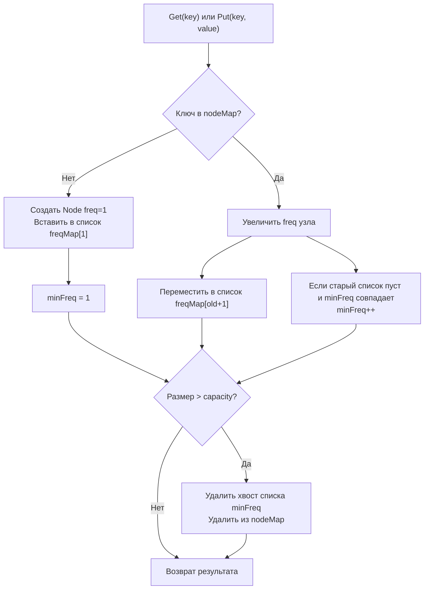

## LFU Cache: архитектура O(1), частотные списки и управление памятью

Least Frequently Used (LFU) кэш решает задачу вытеснения элементов, к которым обращались наименьшее количество раз. В отличие от LRU, который реагирует на временную локальность, LFU ориентирован на частотную локальность. Это делает его идеальным для workloads с стабильным набором «горячих» данных (например, кэширование популярных товаров, часто запрашиваемых конфигураций или метаданных). Реализация LFU с гарантированным `O(1)` требует более сложной композиции структур, чем LRU, и создаёт уникальные вызовы для планировщика Go и сборщика мусора.



В этой статье мы разберём, как достичь `O(1)` при работе с частотами, почему стандартные подходы порождают скрытые аллокации, как LFU взаимодействует с кэш-линиями CPU, и какие архитектурные решения требуются для production-реализации на Go.

## 1. Алгоритмическая механика: почему O(1) требует двух мап

Проблема наивного LFU: при каждом обращении нужно отсортировать или просканировать все элементы по частоте, что даёт `O(N log N)` или `O(N)`. Для гарантированного `O(1)` используется двойная индексация:
- `nodeMap[K]*Node` — быстрый поиск узла по ключу.
- `freqMap[int]*DoubleList` — группировка узлов по частоте обращений.

Переменная `minFreq` хранит текущую минимальную частоту в кэше. Это позволяет мгновенно находить кандидата на эвикцию без обхода всех списков. При вставке нового элемента `minFreq` сбрасывается в `1`. При увеличении частоты узла мы перемещаем его из `freqMap[f]` в `freqMap[f+1]`. Если `freqMap[f]` становится пустым и `f == minFreq`, мы инкрементируем `minFreq`.

> [!info] Под капотом
> В рантайме Go `map[int]*DoubleList` — это та же структура `hmap`, что и для строк, но с целочисленным хешем. Хеширование `int` тривиально (часто тождественное или с простым перемешиванием битов), что делает доступ к бакету быстрее, чем для строк. Однако каждая новая частота создаёт новый бакет и аллоцирует голову/хвост списка. При разбросе частот это приводит к фрагментации кучи. На интервью обязательно упомяните компромисс: если частоты растут медленно, можно заменить `map[int]*DoubleList` на слайс `[]*DoubleList` с динамическим ростом, что улучшит кэш-локальность, но потребует синхронизации при `append`.

## 2. Идиоматичная реализация на Go

Реализация требует строгой синхронизации состояний двух мап и списка. Любое рассинхронизирование приведёт к утечкам памяти или паникам.

```go
package lfu

import "sync"

// Node хранит данные, частоту и ссылки для двусвязного списка
type Node struct {
	Key   string
	Value any
	Freq  int
	Prev  *Node
	Next  *Node
}

// DoubleList — типизированный двусвязный список с dummy-узлами
type DoubleList struct {
	Size int
	Head *Node
	Tail *Node
}

func NewDoubleList() *DoubleList {
	dl := &DoubleList{}
	dl.Head = &Node{}
	dl.Tail = &Node{}
	dl.Head.Next = dl.Tail
	dl.Tail.Prev = dl.Head
	return dl
}

func (dl *DoubleList) Add(node *Node) {
	node.Next = dl.Head.Next
	node.Prev = dl.Head
	dl.Head.Next.Prev = node
	dl.Head.Next = node
	dl.Size++
}

func (dl *DoubleList) Remove(node *Node) {
	node.Prev.Next = node.Next
	node.Next.Prev = node.Prev
	dl.Size--
}

func (dl *DoubleList) RemoveTail() *Node {
	if dl.Size == 0 {
		return nil
	}
	res := dl.Tail.Prev
	dl.Remove(res)
	return res
}

// LFUCache реализует кэш с политикой LFU
type LFUCache struct {
	mu      sync.Mutex
	cap     int
	size    int
	minFreq int
	cache   map[string]*Node
	freqMap map[int]*DoubleList
}

func NewLFUCache(capacity int) *LFUCache {
	if capacity <= 0 {
		return &LFUCache{}
	}
	return &LFUCache{
		cap:     capacity,
		cache:   make(map[string]*Node, capacity),
		freqMap: make(map[int]*DoubleList),
	}
}

func (c *LFUCache) Get(key string) (any, bool) {
	c.mu.Lock()
	defer c.mu.Unlock()

	node, ok := c.cache[key]
	if !ok {
		return nil, false
	}

	c.updateFreq(node)
	return node.Value, true
}

func (c *LFUCache) Put(key string, value any) {
	c.mu.Lock()
	defer c.mu.Unlock()

	if c.cap == 0 {
		return
	}

	if node, ok := c.cache[key]; ok {
		node.Value = value
		c.updateFreq(node)
		return
	}

	if c.size >= c.cap {
		// Эвикция: удаляем наименее часто используемый
		list := c.freqMap[c.minFreq]
		removed := list.RemoveTail()
		delete(c.cache, removed.Key)
		if list.Size == 0 {
			delete(c.freqMap, c.minFreq)
		}
		c.size--
	}

	newNode := &Node{Key: key, Value: value, Freq: 1}
	c.cache[key] = newNode
	c.minFreq = 1

	list, ok := c.freqMap[1]
	if !ok {
		list = NewDoubleList()
		c.freqMap[1] = list
	}
	list.Add(newNode)
	c.size++
}

func (c *LFUCache) updateFreq(node *Node) {
	oldFreq := node.Freq
	list := c.freqMap[oldFreq]
	list.Remove(node)
	if list.Size == 0 {
		delete(c.freqMap, oldFreq)
		if c.minFreq == oldFreq {
			c.minFreq++
		}
	}

	node.Freq++
	nextList, ok := c.freqMap[node.Freq]
	if !ok {
		nextList = NewDoubleList()
		c.freqMap[node.Freq] = nextList
	}
	nextList.Add(node)
}
```

## 3. Под капотом: память, GC и pointer chasing

### Память и аллокации
Каждый `Put` нового ключа создаёт 3 объекта в куче: `*Node`, `*DoubleList` (если частота новая) и запись в `hmap`. Escape Analysis помечает их как `escapes to heap`. При высокой частоте вставок это создаёт давление на Garbage Collector. В отличие от LRU, где частота списков фиксирована, LFU может генерировать новые списки для каждой уникальной частоты, что приводит к `memory bloat`.

### CPU кэш и предсказание ветвлений
`updateFreq` выполняет 2 прохода по указателям: удаление из старого списка и вставка в новый. На современных CPU это означает минимум 4 промаха кэш-линии L1. Ветвление `if c.minFreq == oldFreq` имеет высокую предсказуемость: чаще всего частота увеличивается не от минимальной, поэтому процессор редко ошибается в предсказании, но при работе с «холодными» данными ветвление становится непредсказуемым, вызывая pipeline flush.

> [!warning] Ловушка / Gotcha
> Удаление пустых списков из `freqMap` (`delete(c.freqMap, oldFreq)`) критически важно. Если его забыть, `freqMap` будет накапливать ссылки на `DoubleList` с `Size == 0`. GC не соберёт эти структуры, так как на них ссылается `map`. Это классическая утечка памяти в LFU, которая на больших объёмах данных приводит к OOM через несколько часов работы.

## 4. Потокобезопасность и стратегии конкурентного доступа

Как и в LRU, метод `Get` в LFU **изменяет состояние** (инкрементирует частоту, перемещает узел). Использование `sync.RWMutex` невозможно без сложных copy-on-write механик, которые удваивают память и нагрузку на GC. Поэтому `sync.Mutex` остаётся стандартом.

Для высоконагруженных систем применяется шардирование:
```go
type Shard struct {
	cache *LFUCache
}

type ShardedLFU struct {
	shards []Shard
}

func (s *ShardedLFU) Get(key string) (any, bool) {
	idx := hash(key) % len(s.shards)
	return s.shards[idx].cache.Get(key)
}
```
Это распределяет contention по ядрам CPU. Каждый шард имеет свой `sync.Mutex`, и блокировка затрагивает только `1/N` запросов.

> [!info] Под капотом
> Внутри `sync.Mutex` в Go реализован гибридный алгоритм: сначала несколько попыток захвата через атомарный CAS (`compare-and-swap`). Если поток блокируется, он переходит в `runtime_SemacquireMutex`, который делает системный вызов `futex` и отдаёт тред планировщику. При высокой конкуренции множество горутин будут спать в `futex`, создавая thundering herd при разблокировке. Шардирование снижает вероятность перехода в syscall, удерживая захват в user-space.

## 5. Ловушки и граничные случаи

1. **Связка при одинаковой частоте:** Классический LFU не определяет, какой элемент удалять, если у нескольких узлов одинаковый `minFreq`. В production это решается через fallback на LRU внутри частотного списка (последний добавленный в список удаляется первым).
2. **Переполнение счётчика частоты:** `int` на 64-битных системах имеет макс. `9*10^18`. На практике это недостижимо, но в embedded-системах или 32-битных окружениях стоит использовать `uint32` или сбрасывать частоты при достижении порога (aging).
3. **Ёмкость 0:** Конструктор и методы должны явно обрабатывать `cap == 0`, возвращая сразу без аллокаций и паник.
4. **Повторная вставка существующего ключа:** Должна обновлять значение и частоту, но **не** увеличивать `size` и не запускать эвикцию.

## 6. Вопросы с собеседований: глубина понимания

> [!tip] Собеседование
> **Вопрос:** Почему LFU может страдать от «каменных записей» (cache poisoning)?
> **Ответ:** Если в кэш массово вставляются одноразовые ключи с частотой 1, а затем удаляются, они не влияют на `minFreq`. Но если они быстро набирают частоту 2, они вытесняют старые «горячие» данные. В production это лечится через TTL-эвикцию или weighted LFU, где частота затухает со временем (`freq = freq / 2 + 1`).

> [!tip] Собеседование
> **Вопрос:** Как протестировать корректность O(1) эвикции?
> **Ответ:** Написать unit-тест, который заполняет кэш до `capacity`, затем вызывает `Put` с новым ключом. Проверить, что удалён именно ключ с минимальной частотой (а при равенстве — самый старый). Дополнительно использовать `pprof -trace` для верификации, что время выполнения `Get/Put` не зависит от `N`.

> [!tip] Собеседование
> **Вопрос:** Когда LFU проигрывает LRU в реальной системе?
> **Ответ:** При работе с потоковыми или сезонными данными. LFU «запоминает» старые горячие ключи и медленно адаптируется к смене трендов. LRU быстрее реагирует на изменение паттернов доступа. Выбор зависит от business-домена: кэш новостей → LRU, кэш метаданных товаров → LFU.

## Итог: чек-лист реализации LFU

1. **Двойная индексация:** `map[K]*Node` для поиска + `map[int]*List` для частотной группировки.
2. **Минимальная частота:** Хранить `minFreq` отдельно, обновлять только при опустошении списка и совпадении с минимумом.
3. **Очистка памяти:** Удалять пустые списки из `freqMap`, иначе гарантирован memory leak.
4. **Синхронизация:** Только `sync.Mutex`, так как `Get` изменяет состояние. Для high-throughput применять шардирование.
5. **Кэш-локальность:** Ограничить количество списков или использовать массив-backed структуру, если частоты предсказуемы.
6. **Edge cases:** Явная обработка `cap == 0`, корректное обновление значений без изменения `size`, fallback на LRU при равенстве частот.

LFU — это пример того, как теоретическая асимптотика `O(1)` в реальном Go-коде упирается в механику выделения памяти, поведение GC и предсказуемость процессора. Умение балансировать между чистотой алгоритма и аппаратными ограничениями отличает инженерное решение от академического упражнения.

В следующей статье мы перейдём к проектированию хеш-таблицы с нуля, разберём открытую адресацию, разрешение коллизий и механику рехаширования в рантайме: [[5. Design HashMap]]