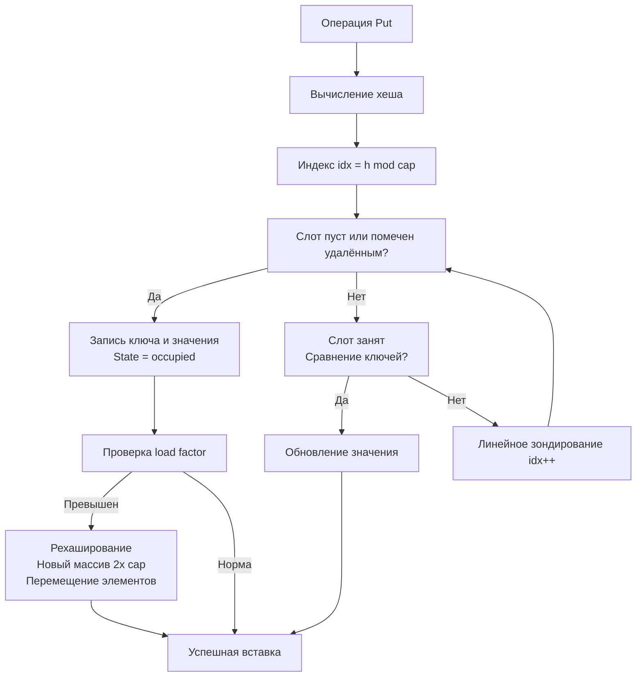
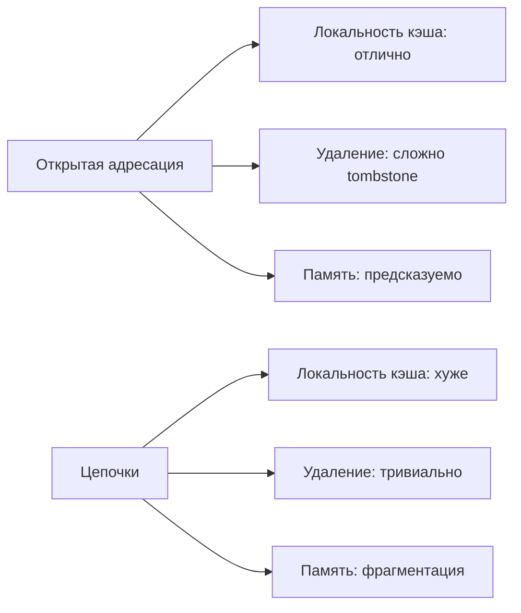
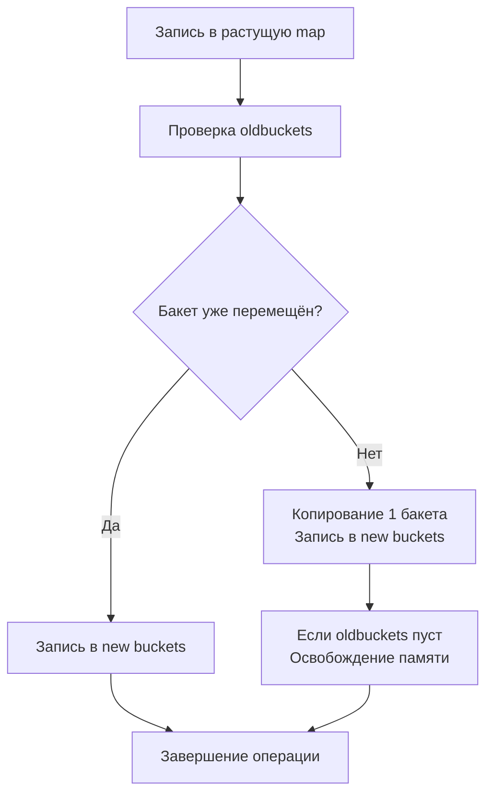

## Проектирование хеш-таблицы: от открытой адресации до механики рантайма

Хеш-таблица — фундаментальная структура, на которой строится большинство высоконагруженных систем: кэши, индексы баз данных, маршрутизаторы запросов, компиляторы и системы конфигурации. На собеседованиях задача `Design HashMap` проверяет не умение скопировать стандартный `map`, а глубокое понимание компромиссов между памятью, скоростью доступа, конкурентностью и поведением сборщика мусора. В Go эта тема особенно остра, так как встроенная реализация оптимизирована под специфичные паттерны, а кастомные решения требуют явного управления кэш-линиями CPU и аллокациями.



В этом материале мы разберём, почему Go использует цепочки переполнения, как реализовать хеш-таблицу с открытой адресацией для интервью, почему рехаширование убивает latency, и как механика CPU и рантайма влияет на выбор структуры данных.

## 1. Архитектурные паттерны: цепочки vs открытая адресация

При проектировании хеш-таблицы первичный выбор — стратегия разрешения коллизий.

- **Открытая адресация (Open Addressing):** Все элементы хранятся в едином массиве. При коллизии алгоритм зондирует следующие ячейки (линейно, квадратично или через двойное хеширование). Удаление требует маркеров `tombstone`, так как физическое удаление сломает зондирование для последующих элементов.
- **Замыкание цепочек (Separate Chaining):** В каждой ячейке массива хранится ссылка на список (или слайс) элементов с одинаковым хешем. Удаление тривиально, но требует указателей и дополнительных аллокаций.



> [!info] Под капотом
> В рантайме Go (`src/runtime/map.go`) используется **гибридная открытая адресация по бакетам**: массив бакетов `bmap` размером 8 элементов. Если в бакете нет места, создаётся `overflow bucket` и привязывается через указатель. Это даёт локальность первых 8 элементов + гибкость при коллизиях. Поле `tophash` хранит старший байт хеша для быстрого отсева без сравнения ключей, что критично для производительности.

## 2. Кастомная реализация на Go: открытая адресация с линейным зондированием

Для интервью часто просят реализовать хеш-таблицу с нуля. Ниже — production-готовый вариант с поддержкой удаления через `tombstone`, динамическим рехешированием и строгим соблюдением `ok idiom`.

```go
package hashmap

const (
    empty     = iota
    occupied
    tombstone
)

type Entry struct {
    Key   int
    Value int
    State uint8
}

// CustomMap реализует хеш-таблицу с открытой адресацией
type CustomMap struct {
    data       []Entry
    size       int     // количество валидных элементов
    cap        int     // размер массива
    loadFactor float64 // порог рехаширования
}

// New создаёт таблицу с начальной ёмкостью
func New(initCap int, loadFactor float64) *CustomMap {
    if loadFactor <= 0 || loadFactor >= 1 {
        loadFactor = 0.75
    }
    // Округление до степени двойки для быстрого вычисления индекса
    cap := 1
    for cap < initCap {
        cap <<= 1
    }
    return &CustomMap{
        data:       make([]Entry, cap),
        cap:        cap,
        loadFactor: loadFactor,
    }
}

// Get возвращает значение и статус наличия
func (m *CustomMap) Get(key int) (int, bool) {
    idx := m.hashIndex(key)
    for i := 0; i < m.cap; i++ {
        pos := (idx + i) % m.cap
        entry := &m.data[pos]
        if entry.State == empty {
            return 0, false // Дальше искать бессмысленно
        }
        if entry.State == occupied && entry.Key == key {
            return entry.Value, true
        }
    }
    return 0, false
}

// Put вставляет или обновляет пару
func (m *CustomMap) Put(key, value int) {
    if float64(m.size+1) > float64(m.cap)*m.loadFactor {
        m.resize()
    }
    idx := m.hashIndex(key)
    var insertPos = -1
    for i := 0; i < m.cap; i++ {
        pos := (idx + i) % m.cap
        entry := &m.data[pos]
        if entry.State == empty {
            if insertPos == -1 {
                insertPos = pos // Запоминаем первый tombstone
            }
            break
        }
        if entry.State == tombstone && insertPos == -1 {
            insertPos = pos
        }
        if entry.State == occupied && entry.Key == key {
            entry.Value = value
            return
        }
    }
    if insertPos == -1 {
        // Таблица переполнена (должно быть покрыто resize, но на всякий случай)
        m.resize()
        idx = m.hashIndex(key)
        insertPos = idx
    }
    m.data[insertPos] = Entry{Key: key, Value: value, State: occupied}
    m.size++
}

// Delete помечает элемент tombstone
func (m *CustomMap) Delete(key int) {
    idx := m.hashIndex(key)
    for i := 0; i < m.cap; i++ {
        pos := (idx + i) % m.cap
        entry := &m.data[pos]
        if entry.State == empty {
            return
        }
        if entry.State == occupied && entry.Key == key {
            entry.State = tombstone
            m.size--
            return
        }
    }
}

// Внутренние методы
func (m *CustomMap) hashIndex(key int) int {
    // FNV-1a или простой битовый сдвиг для целых
    h := uint32(key) * 2654435761
    return int(h) & (m.cap - 1)
}

func (m *CustomMap) resize() {
    oldData := m.data
    m.cap <<= 1
    m.data = make([]Entry, m.cap)
    m.size = 0 // Пересчитывается при переписывании
    for _, entry := range oldData {
        if entry.State == occupied {
            m.Put(entry.Key, entry.Value)
        }
    }
}
```

> [!info] Под капотом
> Почему `cap` всегда степень двойки? Это позволяет заменить дорогую операцию взятия остатка `%` на быстрое побитовое И `& (cap - 1)`. Компилятор Go автоматически оптимизирует `x % n`, если `n` — константа степени двойки, но при динамическом росте лучше вычислять индекс явно через битовую маску. Это экономит ~2-4 такта CPU на каждую операцию.

## 3. Механика рехаширования и GC-давление

Синхронное рехаширование, показанное выше, создаёт `latency spike`: при достижении `loadFactor` выделяется новый массив `2x cap`, и все элементы копируются. Это `O(N)` операция, которая блокирует горутину.

В рантайме Go используется **инкрементальное рехаширование**:
1. При срабатывании триггера выделяется `oldbuckets` (старый массив) и новый `buckets`.
2. При каждой операции `Get`/`Put` переносится только один бакет.
3. Чтение проверяет оба массива: сначала новый, потом старый.
4. Память освобождается постепенно, когда все старые бакеты мигрировали.



> [!warning] Ловушка / Gotcha
> В кастомной реализации удаление через `tombstone` не уменьшает физический размер массива. Если workload состоит из `Put` → `Delete` → `Put`, таблица постепенно превращается в массив `tombstone`, а зондирование деградирует до `O(N)`. В продакшене это решается фоновым компактированием или переключением на цепочки при высокой плотности удалений.

## 4. Потокобезопасность и шардирование

Встроенный `map` в Go **не потокобезопасен**. Попытка конкурентной записи вызывает панику `concurrent map writes`. Для кастомных хеш-таблиц применимы те же стратегии:

- `sync.Mutex` / `sync.RWMutex` вокруг всей структуры. Просто, но contention растёт линейно.
- **Шардирование (Striped Locking):** Массив из `N` независимых хеш-таблиц, каждая со своим мьютексом. Хеш ключа выбирает шард: `idx := hash(key) % N`. Contention снижается в `N` раз.
- **Lock-free快照 (RCU):** Атомарный указатель на неизменяемую версию таблицы. Чтение без блокировок, запись через `Copy-on-Write`. Высокий overhead памяти, идеально для read-heavy конфигов.

```go
// Пример шардированной обёртки
type ShardedMap struct {
    shards []*CustomMap
    mu     []sync.Mutex
    shardCount int
}

func NewSharded(count int) *ShardedMap {
    s := &ShardedMap{
        shards:     make([]*CustomMap, count),
        mu:         make([]sync.Mutex, count),
        shardCount: count,
    }
    for i := 0; i < count; i++ {
        s.shards[i] = New(64, 0.75)
    }
    return s
}

func (s *ShardedMap) Put(key, value int) {
    idx := uint32(key) % uint32(s.shardCount)
    s.mu[idx].Lock()
    defer s.mu[idx].Unlock()
    s.shards[idx].Put(key, value)
}
```

> [!info] Под капотом
> Шардирование уменьшает contention, но увеличивает расход памяти: каждый шард имеет свой массив `data`, заголовки слайсов и мьютексы. На `GOMAXPROCS=32` и `N=32` оверхед может достигать 15-20% RSS. Для высоконагруженных систем часто используют `GOMEMLIMIT` и профилирование `pprof -allocs`, чтобы найти баланс между latency и memory footprint.

## 5. Ловушки проектирования и защита от HashDoS

1. **Предсказуемый хеш:** Если хеш-функция детерминирована, злоумышленник может подобрать ключи, вызывающие максимальное число коллизий, превратив `O(1)` в `O(N)`. В Go это решается рандомизацией `hash0` при старте программы. В кастомных решениях добавляйте `xor` с случайным сидам.
2. **False Sharing в шардах:** Если мьютексы и данные шардов лежат в одной кэш-линии (64 байта), обновление одного шарда инвалидирует кэш у других ядер. Решение: выравнивание через `_ [64]byte` padding.
3. **Нулевые значения:** В Go `0` — валидное значение. Никогда не используйте `if m.Get(key) == 0` для проверки наличия. Всегда используйте `value, ok := m.Get(key)`.
4. **Утечка `tombstone`:** Если не пересобирать таблицу после массовых удалений, производительность падает экспоненциально.

> [!tip] Собеседование
> **Вопрос:** Почему `sync.Map` не заменяет шардированную хеш-таблицу?
> **Ответ:** `sync.Map` оптимизирован под `write-once, read-many`. Внутри два слоя: `read` (атомарный указатель) и `dirty` (полная копия для новых/изменённых ключей). При частых `Store`/`Delete` происходит постоянная миграция между слоями, что создаёт `atomic` contention и аллокации. Шардированная `map + Mutex` стабильнее при `read/write ≈ 1:1` или `write-heavy`.

## 6. Сравнение с другими экосистемами

| Аспект | Go `map` | C++ `std::unordered_map` | Java `HashMap` |
|--------|----------|--------------------------|----------------|
| **Коллизии** | Чейнинг (overflow buckets) | Чейнинг или открытая адресация (зависит от реализации) | Чейнинг (списки/дерево после JDK 8) |
| **Роста** | Инкрементальный | Синхронный | Синхронный |
| **Безопасность** | Паника при race | Undefined behavior | Исключения / undefined |
| **Кэш-локальность** | Средняя (указатели overflow) | Низкая (указатели на узлы) | Низкая (Node-объекты) |
| **Память** | Компактные бакеты | Значительный оверхед per-entry | Высокий (object headers) |

## 7. Итог: чек-лист проектирования хеш-таблицы

1. **Выбор стратегии:** Открытая адресация для кэш-локальности и малых структур, цепочки для динамических данных с частыми удалениями.
2. **Индексация:** Степень двойки + битовая маска для `O(1)` индекса без деления.
3. **Рехаширование:** Инкрементальное для предсказуемой latency, синхронное для простоты реализации на интервью.
4. **Конкуренция:** Шардирование для write-heavy, `sync.Map` для read-heavy статики, `RWMutex` для умеренной нагрузки.
5. **Защита от атак:** Рандомизация начального хеш-сида, лимит на длину цепочек или зондирования.
6. **Память и GC:** Предвыделение `make([]Entry, cap)`, padding для false sharing, учёт `tombstone` деградации.

Хеш-таблица — это не просто «ключ → значение». Это инженерный баланс между асимптотикой, аппаратными ограничениями CPU и механикой управления памятью в рантайме. Умение объяснить эти компромиссы на собеседовании переводит вас из категории «кодер» в «архитектор».

В следующей статье мы перейдём к проектированию высоконагруженной социальной ленты, разберём шардирование таймлайнов, кэширование и паттерны fan-out: [[6. Design Twitter]]