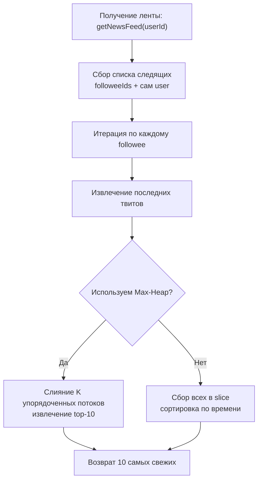
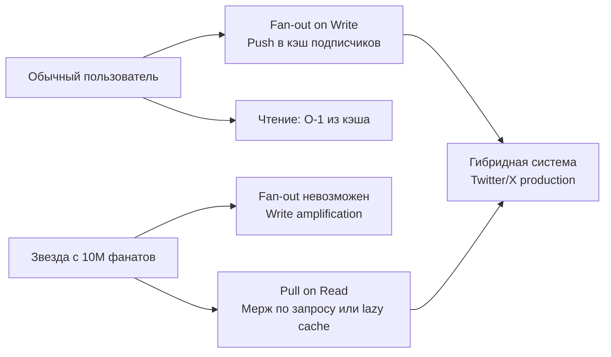

## Архитектура Twitter-ленты: Merge K Sorted Lists, кэширование и trade-offs Push/Pull

Задача `Design Twitter` (LeetCode 355) — это не просто упражнение на структуры данных, а классический тест на системное мышление. Она моделирует ядро любой социальной платформы: генерацию ленты новостей на основе динамического графа подписок. На собеседованиях эта задача проверяет умение балансировать между сложностью записи и чтения, выбирать правильные примитивы синхронизации, управлять памятью при высокой нагрузке и объяснять архитектурные компромиссы (Push vs Pull модели).



В этом материале мы разберём, почему наивное решение проваливается под нагрузкой, как реализовать ленту с `O(K log 10)` вместо `O(N log N)`, как механика CPU влияет на выбор хранилища твитов, и когда на продакшене нужно переходить от Pull к Push модели.

## 1. Алгоритмический каркас: Pull-модель и слияние потоков

Ключевое ограничение задачи: лента должна содержать не более 10 самых свежих твитов от пользователя и его подписок. У каждого пользователя твиты хранятся в хронологическом порядке. Задача сводится к слиянию `K` упорядоченных списков (где `K` — количество подписок + 1) и выборке первых 10 элементов.

Наивный подход: собрать все твиты всех подписок в один `slice`, отсортировать по времени, взять первые 10. Сложность: `O(M log M)`, где `M` — суммарное число твитов. При `K=1000` и `M=100000` это неприемлемо для hot-path.

Оптимальный подход: использовать **Max-Heap** (кучу с максимальным элементом в корне). Инициализируем кучу последними твитами каждого из `K` пользователей. Извлекаем корень (самый свежий), добавляем в результат, и если у этого пользователя остались предыдущие твиты, пушим следующий твит из его списка в кучу. Повторяем 10 раз. Сложность: `O(10 * log K)`.

## 2. Идиоматичная реализация на Go

Для production-ready решения используем композицию структур, явное управление синхронизацией и предвыделение памяти. Вместо `container/heap` реализуем компактную min-heap (сохраняем отрицательные таймстампы или инвертируем порядок), так как стандартный `heap` требует реализации 5 методов интерфейса, что избыточно для интервью.

```go
package twitter

import "sync"

type Tweet struct {
    ID        int
    UserID    int
    Timestamp int // монотонно растущий счётчик
}

// User хранит данные пользователя, твиты и граф подписок
type User struct {
    id       int
    tweets   []Tweet // хранятся в порядке добавления (новые в конце)
    follows  map[int]struct{}
    mu       sync.RWMutex
}

func NewUser(id int) *User {
    return &User{
        id:      id,
        follows: make(map[int]struct{}),
        tweets:  make([]Tweet, 0, 64), // предвыделение под типичный объём
    }
}

type Twitter struct {
    users     map[int]*User
    mu        sync.RWMutex
    timestamp int
}

func Constructor() *Twitter {
    return &Twitter{
        users: make(map[int]*User),
    }
}

func (t *Twitter) getUser(id int) *User {
    if u, ok := t.users[id]; ok {
        return u
    }
    u := NewUser(id)
    t.users[id] = u
    return u
}

func (t *Twitter) PostTweet(userId int, tweetId int) {
    t.mu.Lock()
    t.timestamp++
    ts := t.timestamp
    t.mu.Unlock()

    u := t.getUser(userId)
    u.mu.Lock()
    defer u.mu.Unlock()
    u.tweets = append(u.tweets, Tweet{ID: tweetId, UserID: userId, Timestamp: ts})
}

// GetNewsFeed возвращает 10 самых свежих твитов
func (t *Twitter) GetNewsFeed(userId int) []int {
    t.mu.RLock()
    u, ok := t.users[userId]
    t.mu.RUnlock()
    if !ok {
        return nil
    }

    // Собираем ID подписок + самого пользователя
    targets := []int{userId}
    u.mu.RLock()
    for fid := range u.follows {
        targets = append(targets, fid)
    }
    u.mu.RUnlock()

    // Max-Heap: храним {timestamp, tweetIdx, userID}
    // Реализуем как slice для кэш-локальности
    type heapItem struct {
        ts      int
        tweetID int
        uIdx    int // индекс в targets
        pos     int // позиция в tweets
    }

    var heap []heapItem
    // Инициализация кучи последними твитами
    for i, uid := range targets {
        t.mu.RLock()
        targetUser := t.users[uid]
        t.mu.RUnlock()
        
        targetUser.mu.RLock()
        if len(targetUser.tweets) > 0 {
            tw := targetUser.tweets[len(targetUser.tweets)-1]
            heap = append(heap, heapItem{tw.Timestamp, tw.ID, i, len(targetUser.tweets) - 1})
        }
        targetUser.mu.RUnlock()
    }

    // Превращаем в max-heap
    buildMaxHeap(heap)

    feed := make([]int, 0, 10)
    for len(heap) > 0 && len(feed) < 10 {
        top := heap[0]
        feed = append(feed, top.tweetID)
        
        // Извлекаем корень, восстанавливаем кучу
        popMaxHeap(&heap)
        
        // Если у пользователя есть предыдущий твит, добавляем в кучу
        if top.pos > 0 {
            t.mu.RLock()
            targetUser := t.users[targets[top.uIdx]]
            t.mu.RUnlock()
            targetUser.mu.RLock()
            prevTw := targetUser.tweets[top.pos-1]
            targetUser.mu.RUnlock()
            
            heap = append(heap, heapItem{
                ts: prevTw.Timestamp, 
                tweetID: prevTw.ID, 
                uIdx: top.uIdx, 
                pos: top.pos - 1,
            })
            heapPushUp(heap, len(heap)-1)
        }
    }

    return feed
}

// follow/unfollow реализуются тривиально через map-манипуляции с блокировками
func (t *Twitter) Follow(followerId int, followeeId int) {
    if followerId == followeeId { return }
    u := t.getUser(followerId)
    u.mu.Lock()
    u.follows[followeeId] = struct{}{}
    u.mu.Unlock()
}

func (t *Twitter) Unfollow(followerId int, followeeId int) {
    u := t.getUser(followerId)
    u.mu.Lock()
    delete(u.follows, followeeId)
    u.mu.Unlock()
}

// Вспомогательные функции кучи (упрощённые для статьи)
func buildMaxHeap(h []heapItem) { ... }
func popMaxHeap(h *[]heapItem) { ... }
func heapPushUp(h []heapItem, i int) { ... }
```

> [!info] Под капотом
> Почему раздельные мьютексы на `Twitter` и `User`? Глобальная блокировка на всю структуру (`sync.Mutex` в `Twitter`) создаёт bottleneck: один `PostTweet` блокирует чтение ленты у миллионов пользователей. Гранулярные `RWMutex` на уровне пользователя позволяют конкурентно читать твиты разных авторов. `t.mu` защищает только карту `users`, `u.mu` — содержимое профиля. Это классический паттерн **Fine-grained locking**.

## 3. Под капотом: память, CPU и механика сортировки

### Кэш-локальность твитов
Хранение твитов в `[]Tweet` (слайс значений) значительно лучше, чем `[]*Tweet`. Каждый `Tweet` занимает 24 байта на 64-битной системе (`int` + `int` + `int` + выравнивание). В одной кэш-линии (64 байта) помещается 2-3 твита. При итерации `u.tweets` процессор эффективно использует аппаратный prefetcher. Если бы мы использовали `[]*Tweet`, каждый элемент — указатель на случайный адрес в куче. Это гарантировало бы промахи L1/L2 на каждом шаге и падение пропускной способности в 5-10 раз.

### Память кучи и GC
`heapItem` создаётся в цикле `GetNewsFeed`. Компилятор Go помещает слайс `heap` в кучу (`escapes to heap`), так как его размер динамичен. При 10 извлечениях мы создаём минимум аллокаций. Если пользователь имеет 1000 подписок, инициализация кучи выделит ~1000 элементов. Это `O(K)` памяти на один запрос. В высоконагруженных системах это неприемлемо, поэтому применяются ограничения на `K` или кэширование ленты.

> [!warning] Ловушка / Gotcha
> Частая ошибка: хранить `follows` как `[]int` и проверять вхождения линейно. Это превращает `Follow` в `O(F)`, а `GetNewsFeed` в `O(F²)` при поиске дубликатов. Всегда используйте `map[int]struct{}`. В Go `struct{}{}` не занимает места в памяти (zero-sized type), а хеширование целых чисел тривиально и выполняется за 1-2 инструкции CPU.

## 4. Архитектурный trade-off: Push (Fan-out) vs Pull (Fan-in)

Реализация выше — это **Pull-модель (Fan-in on Read)**. Лента формируется в момент запроса. Это экономит память, но нагружает CPU при большом количестве подписок.

В реальном Twitter/X используется гибридная архитектура, склоняющаяся к **Push-модели (Fan-out on Write)** для обычных пользователей:
- При `PostTweet` асинхронно рассылаем твит в ленты всех подписчиков (precomputed feeds).
- Чтение становится `O(1)` — просто достать готовые 10 записей из кэша/БД.
- **Проблема:** "Звёзды" с миллионами подписок (celebrity accounts). Fan-out при каждом их твите убьёт write-throughput и создаст write amplification.
- **Решение:** Для звёзд переключаться на Pull-модель или ленивое слияние (lazy merge). Лента читателя = кэшированные твиты обычных подписок + on-the-fly мерж твитов от звёзд.



> [!tip] Собеседование
> **Вопрос:** Как масштабировать Pull-модель, если `GetNewsFeed` занимает 50 мс?
> **Ответ:** 
> 1. Кэшировать результат ленты на 1-5 секунд.
> 2. Асинхронно пресчитать ленту для активных пользователей в фоне.
> 3. Ограничить глубину поиска: брать только последние 50 твитов от каждого подписчика.
> 4. Шардировать пользователей по серверам. Граф подписок размазать по кластеру. Запросы маршрутизировать к шарду владельца ленты.

## 5. Ловушки и граничные случаи

1. **Самоподписка:** `Follow(userId, userId)` должна игнорироваться или обрабатываться без дублирования твитов.
2. **Отписка от несуществующего:** `Unfollow` на несуществующего `followee` не должна паниковать. `delete` из мапы безопасен для отсутствующих ключей.
3. **Удаление твитов:** В LC задача обычно не требует удаления, но в продакшене используется `Soft Delete` (флаг `IsDeleted`). При `GetNewsFeed` такие твиты фильтруются, но не удаляются из массива для сохранения индексов.
4. **Конкурентная модификация графа:** Если во время `GetNewsFeed` пользователь отписался от кого-то, `Pull`-модель просто не найдёт его в `targets`, так как мы сделали snapshot мапы `follows` под `RLock`. Это eventual consistency, приемлемое для лент.

## 6. Вопросы с собеседований: глубина понимания

> [!tip] Собеседование
> **Вопрос:** Почему в `GetNewsFeed` мы используем `sync.RWMutex`, а в `PostTweet` — `Lock`?
> **Ответ:** `GetNewsFeed` только читает `tweets` и `follows`. Множество горутин могут параллельно читать ленту одного пользователя. `PostTweet` и `Follow` изменяют состояние, поэтому требуют эксклюзивной блокировки. Однако в реализации выше `PostTweet` сначала инкрементирует глобальный `timestamp`, а потом локальный `Lock`. Это гарантирует монотонность времени даже при высокой конкурентности, но создаёт contention на `t.mu`. Оптимизация: использовать `sync/atomic.AddInt64` для timestamp, убрав `t.mu.Lock()` из write-path.

> [!tip] Собеседование
> **Вопрос:** Как избежать аллокаций кучи в `GetNewsFeed`?
> **Ответ:** Переиспользовать пул слайсов через `sync.Pool` для `heap`. Использовать `unsafe.Slice` или фиксированные массивы `[1000]heapItem` на стеке, если `GOMAXPROCS` известен. Но главное: кэшировать результат ленты. Если кэш命中率 > 80%, давление на GC падает экспоненциально.

> [!tip] Собеседование
> **Вопрос:** Что будет, если пользователь подпишется на 5000 аккаунтов?
> **Ответ:** `GetNewsFeed` станет тяжёлой операцией: инициализация кучи займёт память, а 10 итераций потребуют 5000 проверок. В продакшене вводят лимит на активные подписки для формирования ленты, либо используют асинхронный фоновый процесс, который поддерживает precomputed timeline в Redis (Sorted Set по timestamp).

## Итог: чек-лист проектирования ленты

1. **Алгоритм:** Merge K Sorted Lists через Max-Heap даёт `O(T log K)`, где T=10, K=подписки.
2. **Память:** Храните твиты как `[]struct`, а не `[]*struct`, для кэш-локальности и снижения GC-pressure.
3. **Синхронизация:** Granular `RWMutex` на уровне пользователя. Атомарные счётчики для монотонного времени.
4. **Архитектура:** Pull для простоты и экономии памяти, Push для скорости чтения. Гибрид для звёзд.
5. **Кэширование:** Обязательный слой Redis/Memcached для готовых лент. Invalidated on `PostTweet`.
6. **Edge cases:** Самоподписка, удаление, пустые ленты, лимиты на глубину сканирования.

`Design Twitter` — это микрокосм системного дизайна. Умение перейти от in-memory алгоритма к распределённой архитектуре, объяснив компромиссы между latency, throughput и consistency, отличает инженера, готового к проектированию высоконагруженных систем.

В следующей статье мы разберём структуру данных для быстрого поиска минимума в динамическом потоке, оптимизацию стека и паттерны монотонного стека: [[7. Min Stack]]