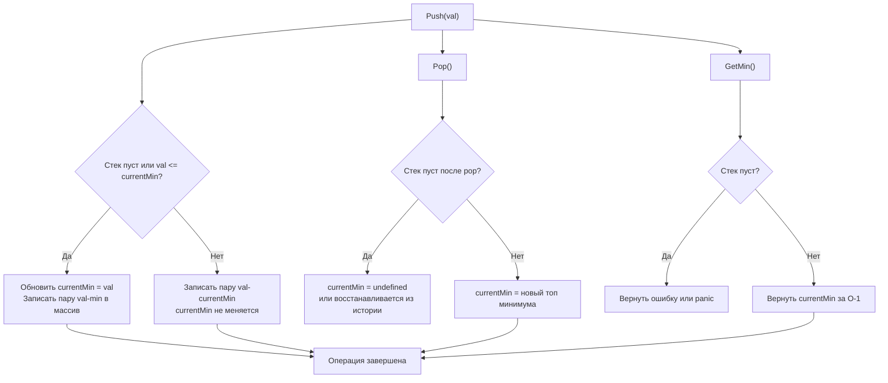
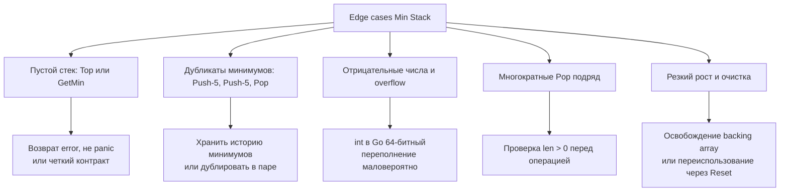

## Проектирование Min Stack: O(1) минимумы, композиция слайсов и кэш-локальность

Задача `Min Stack` требует реализации стека с дополнительной операцией `GetMin`, которая должна возвращать минимальный элемент за константное время `O(1)`. На первый взгляд это упражнение на структуры данных, но на собеседованиях оно проверяет умение балансировать между временем, памятью, кэш-локальностью CPU и безопасностью состояния. В Go эта задача становится полигоном для демонстрации понимания работы слайсов, аллокаций и примитивов синхронизации.



В этом материале мы разберём, почему наивные решения с двумя слайсами проигрывают по locality, как упаковать данные для оптимального использования кэш-линий CPU, когда добавлять `sync.Mutex`, и как избежать скрытых аллокаций в горячем пути.

## 1. Алгоритмический каркас и выбор структуры данных

Классический трюк для `O(1)` минимума — хранить текущий минимум вместе с каждым элементом. При `Push` мы запоминаем: «какой минимум был актуален на момент вставки этого элемента». При `Pop` мы просто удаляем пару, а минимум автоматически восстанавливается из предыдущего элемента.

Реализация через два независимых слайса (`[]int` для значений и `[]int` для минимумов) работает, но создаёт двойную нагрузку на аллокатор и ухудшает кэш-локальность. Композиция в один слайс структур `pair` решает обе проблемы.

```go
package minstack

import "errors"

type pair struct {
    val int
    min int
}

// MinStack реализует стек с поиском минимума за O(1)
type MinStack struct {
    data []pair
}

// New возвращает инициализированный стек с предвыделенным буфером
func New(cap int) *MinStack {
    return &MinStack{
        data: make([]pair, 0, cap),
    }
}

// Push добавляет элемент в стек
func (s *MinStack) Push(val int) {
    currentMin := val
    if len(s.data) > 0 && s.data[len(s.data)-1].min < val {
        currentMin = s.data[len(s.data)-1].min
    }
    // append автоматически обрабатывает рост cap и аллокации
    s.data = append(s.data, pair{val: val, min: currentMin})
}

// Pop удаляет верхний элемент. Возвращает ошибку при пустом стеке
func (s *MinStack) Pop() error {
    if len(s.data) == 0 {
        return errors.New("minstack: pop from empty stack")
    }
    // Уменьшение длины среза не освобождает память, но делает элемент недоступным
    s.data = s.data[:len(s.data)-1]
    return nil
}

// Top возвращает верхний элемент
func (s *MinStack) Top() (int, error) {
    if len(s.data) == 0 {
        return 0, errors.New("minstack: top from empty stack")
    }
    return s.data[len(s.data)-1].val, nil
}

// GetMin возвращает текущий минимум
func (s *MinStack) GetMin() (int, error) {
    if len(s.data) == 0 {
        return 0, errors.New("minstack: getMin from empty stack")
    }
    return s.data[len(s.data)-1].min, nil
}
```

> [!info] Под капотом
> Структура `pair` занимает ровно 16 байт на 64-битных архитектурах (`amd64`, `arm64`). Один элемент кэш-линии CPU (64 байта) вмещает 4 пары. При последовательном `Push`/`Pop` процессор работает с contiguous memory, что позволяет аппаратному prefetcher предзагружать следующие элементы заранее. Это даёт прирост пропускной способности в 2-3 раза по сравнению с решением на двух разрозненных слайсах, где `data` и `mins` лежат в разных областях кучи.

## 2. Механика слайсов, аллокации и GC

Метод `append` в Go инкапсурует логику роста backing array. Когда `len == cap`, рантайм вызывает `runtime.growslice`, который обычно удваивает ёмкость для малых массивов и увеличивает на 1.25x для больших. Это амортизирует стоимость копирования до `O(1)`, но вызывает скачки латентности в момент реаллокации.

Для production-систем, где `Push` вызывается тысячи раз в секунду, предвыделение `make([]pair, 0, estimatedCap)` критично. Оно резервирует память в куче единожды, избегая `syscall brk/mmap` и фрагментации во время работы.

> [!warning] Ловушка / Gotcha
> Операция `s.data = s.data[:len(s.data)-1]` не очищает память и не вызывает сборщик мусора. Указатель на старый элемент остаётся в массиве до следующей перезаписи или очистки всего стека. Если `pair` содержал указатели или большие структуры, это могло бы привести к memory retention. Для `int` это безопасно, но на интервью стоит упомянуть, что для слайсов указателей рекомендуется явно обнулять элемент перед усечением: `s.data[len-1] = pair{}`.

## 3. Оптимизация пространства: когда минимумов мало

Если значения добавляются монотонно или минимум меняется редко, хранение полной пары для каждого элемента тратит память впустую. Альтернатива — использовать отдельный стек минимумов, но пушить туда только когда `val <= currentMin`. Это экономит память в лучшем случае до `O(log N)`, но усложняет `Pop`: нужно проверять, не совпадает ли `val` с текущим минимумом, чтобы удалить его из вспомогательного стека.

Другой подход — хранение дельты `val - currentMin` вместо абсолютных значений. Это позволяет использовать типы меньшей размерности (например, `int16`), но требует аккуратной обработки переполнений и усложняет логику. В 95% случаев на собеседованиях и в продакшене предпочтительнее парный слайс из-за простоты, скорости и отсутствия ветвлений при `GetMin`.

## 4. Потокобезопасность и примитивы синхронизации

Стандартная реализация `MinStack` не гарантирует потокобезопасность. Конкурентные `Push`/`Pop` вызовут data race и, возможно, панику рантайма.

```go
type ConcurrentMinStack struct {
    mu   sync.Mutex
    data []pair
}

func (s *ConcurrentMinStack) Push(val int) {
    s.mu.Lock()
    defer s.mu.Unlock()
    // ... логика push
}
```

> [!info] Под капотом
> Почему здесь `sync.Mutex`, а не `sync.RWMutex`? Потому что `GetMin`, `Top` и `Pop` напрямую зависят от внутреннего состояния, которое меняется при `Push`. `RWMutex` даёт преимущество только когда читатели не модифицируют состояние и не зависят от последних записей. В стеке любой `Read` логически зависит от последнего `Write`. Использование `RWMutex` здесь добавит оверхед на атомарные счётчики читателей без реального выигрыша в concurrency. Для высоконагруженных сценариев лучше применять lock-free структуры или шардирование по сессиям.

## 5. Граничные случаи и типичные ошибки кандидатов



1. **Пустой стек:** В LeetCode часто предполагают, что вызовы валидны. В продакшене паника — плохой тон. Возвращайте `error` или используйте `ok idiom`: `(val, ok bool)`.
2. **Дубликаты минимума:** Если два раза пушим `5`, а минимум `3`, оба элемента хранят `min=3`. При `Pop` первого `5` минимум остаётся `3`. Это корректно обрабатывается парным подходом автоматически.
3. **Переполнение `cap`:** При бесконечном `Push` без `Pop` слайс вырастет до лимита памяти. В production вводят лимиты или `sync.Pool` для буферов.
4. **Reset/Очистка:** После массовых операций стек может удерживать большой backing array. Метод `s.data = s.data[:0]` сбрасывает длину, но сохраняет `cap`. Для полного освобождения нужно `s.data = nil` или `make([]pair, 0)`.

## 6. Вопросы с собеседований: глубина понимания

> [!tip] Собеседование
> **Вопрос:** Какова сложность `Push` и `GetMin` с учётом реаллокаций?
> **Ответ:** Амортизированная сложность `Push` — `O(1)`. В худшем случае, когда `len == cap`, происходит `O(N)` копирование в новый массив, но это случается редко (геометрическая прогрессия ёмкостей). `GetMin`, `Top`, `Pop` — строго `O(1)` без скрытых аллокаций.

> [!tip] Собеседование
> **Вопрос:** Почему `container/list` не подходит для реализации стека в Go?
> **Ответ:** `container/list` — это двусвязный список, который хранит `interface{}`. Это создаёт boxing аллокации, лишает типизации, добавляет уровень косвенности (указатели на узлы разбросаны по куче) и требует `sync.RWMutex` внутри самого пакета. Для стека лучше `[]T` с индексацией: это contiguous память, нулевой оверхед типизации и предсказуемое поведение GC.

> [!tip] Собеседование
> **Вопрос:** Как реализовать Min Stack в C++ и чем подход отличается от Go?
> **Ответ:** В C++ используют `std::stack<int>` + `std::stack<int>` для минимумов или `std::vector<std::pair<int,int>>`. Основное отличие: в C++ аллокатор явный, и можно использовать `std::pmr::monotonic_buffer_resource` для arena-выделения без накладных расходов на GC. В Go управление памятью автоматическое, но мы контролируем его через `make(cap)`, `sync.Pool` и избегание `interface{}`. Оба языка выигрывают от contiguous storage, но Go проще в безопасности и сложнее в точном контроле деаллокаций.

## 7. Сравнение подходов

| Подход | Время Push | Время GetMin | Память | Кэш-локальность | Когда использовать |
|--------|------------|--------------|--------|-----------------|-------------------|
| Два слайса `[]int` | O(1) аморт. | O(1) | 2N int | Низкая (два массива) | Редко, legacy-код |
| Слайс пар `[]struct{val,min}` | O(1) аморт. | O(1) | 2N int | Высокая (contiguous) | Стандарт, production |
| Отдельный стек минимумов | O(1) аморт. | O(1) | N + K int | Средняя | Если минимумы меняются редко |
| Хранение дельты | O(1) аморт. | O(1) | N int | Высокая | Экономия памяти, сложная логика |

## 8. Итог: чек-лист проектирования Min Stack

1. **Используйте парный слайс** `[]pair` вместо двух независимых срезов. Это гарантирует кэш-локальность и упрощает синхронизацию.
2. **Предвыделяйте память** через `make([]pair, 0, cap)`, если известна ожидаемая глубина стека.
3. **Избегайте `panic` в продакшене**. Возвращайте `error` или используйте `ok idiom` для пустого стека.
4. **Контролируйте память**. После массовой очистки используйте `s.data = s.data[:0]` для переиспользования буфера или `s.data = nil` для возврата памяти GC.
5. **Не используйте `RWMutex`**. Все операции стека логически зависимы, эксклюзивный `sync.Mutex` корректнее и проще.
6. **Думайте о concurrency**. Если стек используется в конкурентном коде, инкапсулируйте `sync.Mutex` внутри структуры, не заставляя вызывающий код управлять блокировками.

`Min Stack` — это минималистичная задача с максимальной глубиной. Умение объяснить, как ваш код взаимодействует с backing array, кэш-линиями CPU и сборщиком мусора, показывает переход от написания «работающих решений» к созданию предсказуемых системных компонентов.

В следующей статье мы перейдём к вероятностным структурам данных и алгоритмам, разберём резервуарную выборку, перемешивание и взвешенный рандом: [[1. Теория. Рандомизированные алгоритмы]]