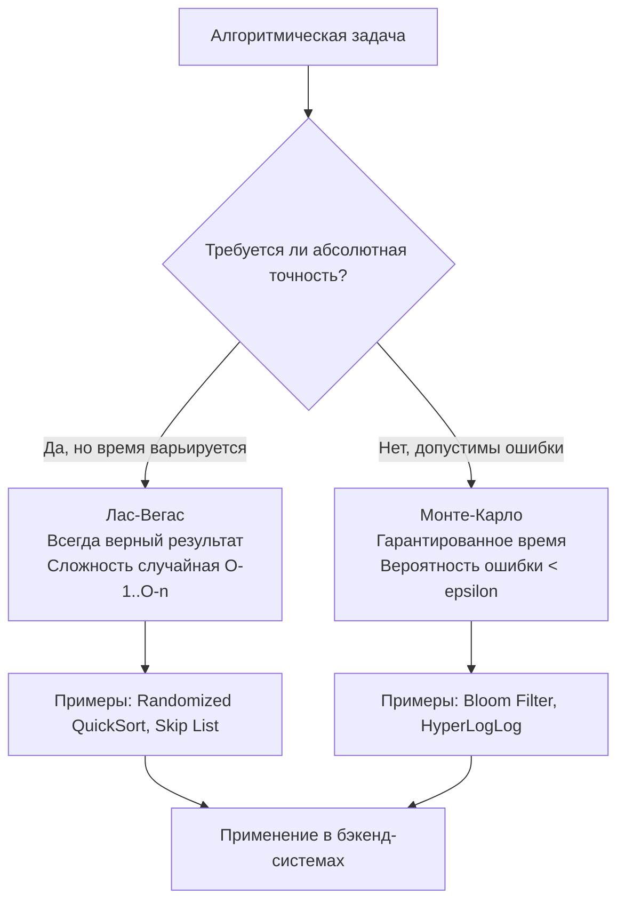
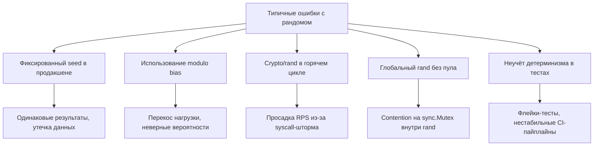

## Философия рандомизации: детерминизм против вероятности в бэкенде

Рандомизированные алгоритмы — это не «случайный код», а строгий математический инструмент для усреднения худших случаев, распределения нагрузки, защиты от атак и создания эффективных вероятностных структур данных. В бэкенд-разработке они встречаются повсеместно: от `QuickSort` и `Consistent Hashing` до `Bloom Filters`, `Rate Limiting` с jitter и A/B-тестирования. Понимание того, как генераторы псевдослучайных чисел (ГПСЧ) работают под капотом, как они влияют на CPU-кэш, системные вызовы и Garbage Collector, отличает инженера, который «вызывает `rand.Int()`», от архитектора, который проектирует предсказуемые системы.



В этой статье мы разберём, почему рандомизация спасает от worst-case сценариев, как устроены ГПСЧ в Go 1.22+, почему `crypto/rand` на порядки медленнее `math/rand/v2`, как избежать модульного смещения, и какие ловушки ждут на собеседованиях.

## 1. Источники энтропии: от аппаратного шума до пользовательского пространства

Истинная случайность в компьютере невозможна. Мы работаем с двумя принципиально разными источниками:
- **Аппаратная энтропия:** Шум резисторов, тайминги прерываний мыши/сети, ядерные процессы (`/dev/random` в Linux, `BCryptGenRandom` в Windows). Используется `crypto/rand`. Гарантирует криптографическую стойкость, но требует syscall на каждую генерацию.
- **Псевдослучайность (PRNG):** Детерминированный алгоритм, преобразующий небольшое начальное состояние (seed) в длинную последовательность. Используется `math/rand` и `math/rand/v2`. Работает полностью в User Space, без syscall, помещается в регистры и L1-кэш CPU.

> [!info] Под капотом
> В Go 1.22+ пакет `math/rand/v2` использует алгоритм **PCG** (Permuted Congruential Generator). Его состояние занимает всего 16 байт (два `uint64`), что идеально ложится на одну кэш-линию CPU. Генерация числа — это 5-10 арифметических инструкций и побитовых сдвигов. В отличие от устаревшего `LCG` (Linear Congruential Generator) из Go 1.0-1.19, PCG имеет период `2^128`, равномерное распределение по младшим битам и устойчив к статистическим атакам. Все операции происходят в регистрах CPU, не вызывая аллокаций и не создавая давления на GC.

## 2. Модульное смещение (Modulo Bias) и механика CPU

Классическая ошибка при реализации рандомизации: `rand.Int() % N`. Если диапазон ГПСЧ не делится на `N` нацело, некоторые числа выпадают чаще других. Например, при диапазоне `[0..3]` и `N=3`, остаток `0` и `1` будут выпадать с вероятностью `33.3%`, а `2` — только `33.3%`. На малых `N` разница незаметна, но в распределённых системах это ведёт к перекосу нагрузки.

Go 1.22+ решает это через **rejection sampling** в `rand.IntN(n)`:
```go
// Упрощённая логика rejection sampling в рантайме Go
func IntN(n int) int {
    v := Uint64()
    if n&(n-1) == 0 { // n - степень двойки
        return int(v) & (n - 1) // Быстрое побитовое AND
    }
    // Иначе: отбрасываем верхний диапазон, чтобы избежать смещения
    threshold := uint64(math.MaxUint64) - uint64(math.MaxUint64)%uint64(n)
    for v >= threshold {
        v = Uint64() // Повторная генерация
    }
    return int(v % n)
}
```

> [!warning] Ловушка / Gotcha
> Цикл `for v >= threshold` теоретически может работать бесконечно, но на практике вероятность повторной итерации мала (<50% для большинства `n`). Branch predictor CPU отлично предсказает выход из цикла после 1-2 итераций. Однако если `n` близко к `MaxUint64`, rejection rate растёт. В таких случаях используют 128-битную арифметику или криптографические ГПСЧ с большим диапазоном.

## 3. Потокобезопасность и управление состоянием ГПСЧ

Глобальный объект `rand` в `math/rand/v2` потокобезопасен с версии Go 1.20 (внутри используется `sync.Mutex` или атомарные операции). Но в горячих путях (обработка миллионов HTTP-запросов) блокировка создаёт contention.

Правильный паттерн для высоконагруженного бэкенда:
```go
import (
	"math/rand/v2"
	"sync"
)

var rngPool = sync.Pool{
	New: func() any {
		// Инициализируем уникальным seed из глобального источника
		return rand.New(rand.NewChaCha8(rand.Uint64(), rand.Uint64()))
	},
}

func GetRandomInt(n int) int {
	rng := rngPool.Get().(*rand.Rand)
	defer rngPool.Put(rng)
	return rng.IntN(n)
}
```

> [!info] Под капотом
> `sync.Pool` здесь критичен. Создание `rand.New(...)` аллоцирует структуру `PCGSource` в куче. Без пула каждая обработка запроса создавала бы мусор для GC. Пул переиспользует память, но важно: `ChaCha8` или `PCG` не криптографически стойки для пула в многопоточной среде без правильной инициализации. В Go 1.22+ `rand.NewChaCha8` требует два `uint64`, которые берутся из глобального источника. Это безопасно, так как глобальный `rand` в Go уже использует атомарные операции для обновления своего внутреннего состояния.

## 4. Криптография vs Производительность: когда что выбирать

`crypto/rand` читает энтропию из ядра ОС. В Linux это `/dev/urandom`. Каждая операция `io.ReadFull` — это syscall `read()`, который проходит через VFS, проверяет буфер пула энтропии ядра и копирует данные в User Space.

```go
import (
	"crypto/rand"
	"encoding/binary"
	"fmt"
)

func CryptoRandUint64() (uint64, error) {
	var b [8]byte
	if _, err := rand.Read(b[:]); err != nil {
		return 0, fmt.Errorf("failed to read crypto rand: %w", err)
	}
	return binary.LittleEndian.Uint64(b[:]), nil
}
```

| Аспект | `math/rand/v2` (PCG/ChaCha) | `crypto/rand` |
|--------|-----------------------------|---------------|
| **Источник** | User Space, детерминированный алгоритм | Kernel Space, аппаратная энтропия |
| **Скорость** | ~2-5 нс/число (в регистрах, 0 syscall) | ~200-500 нс/число (syscall + kernel copy) |
| **Потокобезопасность** | Да (глобальный) или `sync.Pool` (локальный) | Да (внутри `io.Reader`) |
| **Предсказуемость** | Да, при фиксированном seed | Нет, абсолютно непредсказуем |
| **Применение** | Тесты, рандомизация алгоритмов, jitter, балансировка | Токены, пароли, сессии, cryptographic keys |

> [!tip] Собеседование
> **Вопрос:** Можно ли использовать `math/rand` для генерации JWT-секретов или CSRF-токенов?
> **Ответ:** Категорически нет. PRNG детерминирован. Если атакующий узнает seed (например, через timing-атаки или устаревший код с фиксированным seed), он предскажет все будущие токены. Для безопасности используется только `crypto/rand`. Для алгоритмических задач, тестов и распределения нагрузки — `math/rand/v2`.

## 5. Рандомизация в системном дизайне: типичные паттерны

1. **Exponential Backoff + Jitter:** При ретраях HTTP-запросов или подключении к БД чистая экспонента `2^n` создаёт synchronized burst (все клиенты ждут одинаково и одновременно долбят сервер). Jitter: `sleep(time.Duration(rand.IntN(int(backoff))))` размазывает нагрузку во времени.
2. **Load Balancing (Random vs Round-Robin):** Случайный выбор бэкенда проще в реализации, не требует состояния и отлично работает с `consistent hashing` для кеширования.
3. **Probabilistic Data Structures:** `Bloom Filter`, `HyperLogLog`, `Count-Min Sketch` используют несколько хеш-функций, имитирующих случайность, для экономии памяти ценой небольшой вероятности ошибки.
4. **Skip Lists:** Вероятностная альтернатива сбалансированным деревьям. Высота узла определяется броском монетки. Среднее время поиска `O(log n)`, без сложных rebalancing-операций.

## 6. Ловушки, edge cases и вопросы с собеседований



> [!tip] Собеседование
> **Вопрос:** Как тестировать рандомизированные алгоритмы детерминированно?
> **Ответ:** Передавать кастомный `rand.Source` с фиксированным seed в конструктор алгоритма. В Go: `rand.New(rand.NewChaCha8(seed1, seed2))`. Это гарантирует, что последовательность чисел будет одинаковой при каждом запуске теста, позволяя проверять инварианты, покрытие ветвлений и корректность структур данных без flakiness.

> [!tip] Собеседование
> **Вопрос:** Почему `rand.Float64()` возвращает значения в `[0, 1)`, а не `[0, 1]`?
> **Ответ:** IEEE-754 float64 имеет 53 бита мантиссы. `rand.Float64` генерирует 53 случайных бита и делит на `2^53`. Результат никогда не достигает `1.0`, так как для этого потребовалось бы 54 бита или отдельная логика. Это упрощает математику вероятностей и исключает edge-case с `1.0`, который часто ломает инварианты (например, `if x >= 1.0`).

> [!tip] Собеседование
> **Вопрос:** Чем `math/rand/v2` отличается от `math/rand` в Go 1.21?
> **Ответ:** `v2` полностью переписан: удалён глобальный авто-синк (seed теперь нужно задавать явно или использовать глобальный источник), добавлены `IntN`, `UintN`, `Float64` без скрытых смещений, улучшена потокобезопасность, API стал чище (убран `Seed()` для глобального состояния). В Go 1.21+ `v2` рекомендован для нового кода, `v1` помечен как legacy, но не удалён ради обратной совместимости.

## 7. Итог: чек-лист работы с рандомизацией в Go

1. **Используйте `math/rand/v2`** для алгоритмов, тестов, jitter, балансировки. Он быстр, детерминирован и не создаёт syscall.
2. **Используйте `crypto/rand`** строго для безопасности: токены, пароли, сессии, cryptographic keys.
3. **Избегайте `% n`**. Всегда используйте `rand.IntN(n)` или `rand.Int64N(n)` для unbiased выборки.
4. **Контролируйте concurrency**. Для hot-path применяйте `sync.Pool` с локальными `rand.Rand` источниками, чтобы убрать contention на глобальном мьютексе.
5. **Фиксируйте seed в тестах**. Передавайте источник рандомизации явно, чтобы исключить flaky-тесты и обеспечить воспроизводимость.
6. **Помните о железе**. PRNG работает в регистрах, укладывается в L1-кэш, не вызывает аллокаций. `crypto/rand` — это syscall. Разница в латентности 50-100x.

Рандомизация в бэкенде — это не магия, а инженерный инструмент. Понимание её внутреннего устройства позволяет писать системы, которые не только корректны математически, но и предсказуемы под нагрузкой, устойчивы к атакам и эффективны на уровне процессора.

В следующей статье мы применим эти знания на практике и разберём классическую задачу на выборку из неизвестного потока: [[2. Reservoir sampling]]