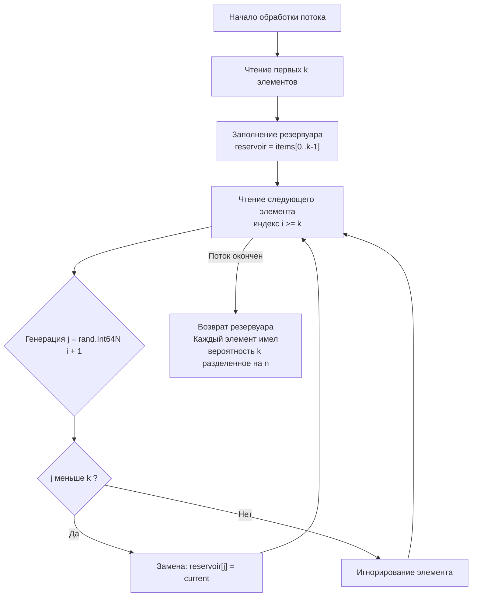
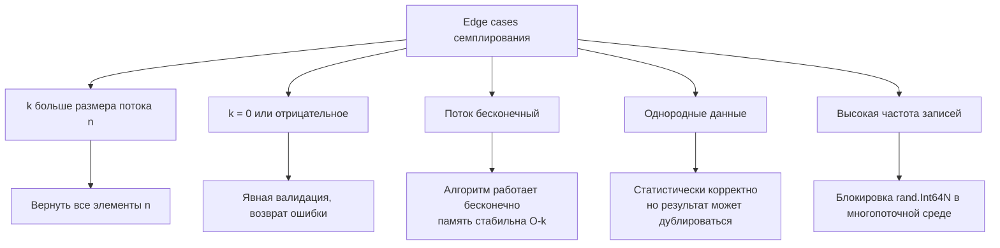

## Проблематика: Случайная выборка из неизвестного потока

Reservoir Sampling (Выборка из резервуара) — это семейство алгоритмов для равномерной случайной выборки `k` элементов из потока данных неизвестной или слишком большой длины `n`, где `n >> k`. Ключевые требования: один проход по данным, `O(k)` дополнительной памяти и гарантия того, что каждый элемент будет выбран с вероятностью ровно `k/n`.

В бэкенд-инженерии этот алгоритм решает реальные задачи: семплирование логов для аналитики, выборка случайных сессий для A/B-тестов, обработка бесконечных потоков событий из Kafka или WebSocket, а также агрегация метрик в условиях строгих лимитов RAM. Понимание внутренней механики алгоритма, работы с генераторами случайных чисел и кэш-локальности отличает разработчика, который «просто копирует код с StackOverflow», от инженера, способного внедрять надёжные вероятностные структуры в production.



## 1. Алгоритм R: Доказательная база и реализация

Классический алгоритм `R` (Algorithm R), предложенный А. Уотерманом, работает по следующему принципу:
1. Заполняем «резервуар» первыми `k` элементами потока.
2. Для каждого последующего элемента с индексом `i` (нумерация с `k`), генерируем случайное число `j` в диапазоне `[0, i]`.
3. Если `j < k`, заменяем `reservoir[j]` на текущий элемент. Иначе игнорируем его.

```go
package sampling

import (
	"fmt"
	"io"
	"math/rand/v2"
)

// ReservoirSampling выбирает k случайных элементов из потока.
// iterFunc возвращает следующий элемент или io.EOF при завершении.
func ReservoirSampling[T any](iterFunc func() (T, error), k int) ([]T, error) {
	if k <= 0 {
		return nil, fmt.Errorf("sampling: k must be positive")
	}

	// Предвыделение backing array снижает давление на GC
	reservoir := make([]T, 0, k)
	var count int64 // Используем int64 для защиты от переполнения

	for {
		val, err := iterFunc()
		if err == io.EOF {
			break
		}
		if err != nil {
			return nil, fmt.Errorf("iterator failed at count %d: %w", count, err)
		}

		count++
		if int64(len(reservoir)) < k {
			reservoir = append(reservoir, val)
			continue
		}

		// Алгоритм R: вероятность замены равна k / count
		// rand.Int64N гарантирует отсутствие модульного смещения
		if j := rand.Int64N(count); j < int64(k) {
			reservoir[j] = val
		}
	}

	return reservoir, nil
}
```

> [!info] Под капотом
> **Математическое обоснование:** Вероятность выбора `i`-го элемента при обработке равна `k/i`. Чтобы он остался в резервуаре до конца потока, он не должен быть заменён на шагах `i+1, i+2, ..., n`. Вероятность «выживания» на шаге `m` равна `1 - k/m`. Итоговая вероятность:
> `P = (k/i) * (1 - k/(i+1)) * (1 - k/(i+2)) * ... * (1 - k/n)`
> `P = (k/i) * ((i)/(i+1)) * ((i+1)/(i+2)) * ... * ((n-1)/n) = k/n`
> Телескопическое сокращение гарантирует равномерное распределение независимо от `n`.

## 2. Механика рантайма: CPU, кэш-линии и ветвление

Наивная реализация часто использует `rand.Intn(int(count)) % k` или `int(rand.Float64() * float64(count)) < k`. Это фундаментально неверно по трём причинам:
1. **Модульное смещение (Modulo Bias):** Если `count` не степень двойки, остаток `%` распределяется неравномерно. Элементы в начале резервуара будут выбираться чаще.
2. **Плавающая точка:** `rand.Float64()` возвращает `float64` с 53 битами мантиссы. При больших `count` (> `2^53`) точность теряется, вероятности искажаются.
3. **Ветвление CPU:** `j < k` имеет вероятность `k/count`. В начале потока она близка к `1`, затем падает к `0`. Современный `Branch Predictor` быстро адаптируется к монотонному изменению вероятности, но использование `rand.Int64N` оставляет предсказатель в стабильном состоянии.

```go
// ❌ НЕВЕРНО: модульное смещение и потеря точности
if rand.Intn(int(count))%k == 0 { ... }

// ✅ ВЕРНО: unbiased выборка в целых числах
if rand.Int64N(count) < int64(k) { ... }
```

> [!info] Под капотом
> `rand.Int64N` в Go 1.22+ использует алгоритм **PCG** с rejection sampling. Он вычисляет верхнюю границу `threshold = MaxUint64 - (MaxUint64 % n)`. Если сгенерированное число превышает `threshold`, оно отбрасывается, и генерируется новое. Вероятность отброса < 0.5, поэтому цикл выполняется 1-2 раза. Все операции происходят в регистрах CPU, не вызывая `syscall` и не создавая `escape to heap`. Это обеспечивает латентность ~5-10 наносекунд на итерацию, что на порядки быстрее криптографических или floating-point аналогов.

## 3. Интеграция с потоками данных: `io.Reader` и нулевые аллокации

В бэкенде потоки редко представлены готовыми слайсами. Обычно это `io.Reader`, `bufio.Scanner`, каналы или итераторы над базами данных. Правильная интеграция требует аккуратной работы с буферизацией и типами.

```go
import "strings"

// Пример: семплирование строк из io.Reader
func SampleLinesFromReader(r io.Reader, k int) ([]string, error) {
	scanner := bufio.NewScanner(r)
	scanner.Buffer(make([]byte, 0, 64*1024), 1024*1024) // Настройка буфера

	iter := func() (string, error) {
		if !scanner.Scan() {
			return "", scanner.Err()
		}
		return scanner.Text(), nil
	}
	
	// Переиспользуем аллокатор строк через strings.Builder если нужно
	return ReservoirSampling(iter, k)
}
```

**Управление памятью:** Слайс `reservoir` аллоцируется в куче один раз. При `append` в пределах `cap` реаллокаций нет. Однако, если `T` содержит указатели (например, `*User` или `[]byte`), резервуар будет удерживать ссылки на объекты, которые иначе могли бы быть собраны GC. Для высоконагруженных систем рекомендуется хранить `[]byte` или примитивы в резервуаре, а сложные структуры восстанавливать по ID/хешу.

> [!warning] Ловушка / Gotcha
> **Переполнение счётчика:** Если поток содержит > `2^31` элементов, использование `int` или `int32` для `count` приведёт к отрицательным значениям и панике `runtime error: index out of range`. Всегда используйте `int64` для индексов в потоковых алгоритмах. На 64-битных системах Go `int` также 64-битный, но явное указание `int64` документирует контракт и защищает при компиляции под 32-битные цели (`GOARCH=386`).

## 4. Распределённое резервуарное сэмплирование

В кластерных системах один поток часто шардирован по `M` нодам. Простое объединение локальных резервуаров нарушает равномерность, так как узлы могут обработать разное количество элементов.

Алгоритм распределённого семплирования:
1. Каждая нода запускает локальный Reservoir Sampling, получая резервуар `R_i` и счётчик `N_i`.
2. Каждая нода вычисляет вероятность отправки своего резервуара в агрегатор: `w_i = N_i / (N_1 + N_2 + ... + N_M)`.
3. Агрегатор собирает все `R_i` и выполняет финальное взвешенное сэмплирование, где каждый элемент из `R_i` имеет вес `1/N_i`.

Это гарантирует `O(k)` памяти на ноду и один раунд коммуникации. В Go это реализуется через `gRPC`-стримы, где каждая нода передаёт свой локальный резервуар + `count`, а координатор запускает финальный `rand.IntN(totalCount)`.

## 5. Ловушки и граничные случаи



1. **`k > n`:** Алгоритм автоматически вернёт все `n` элементов, так как условие `j < k` будет истинным до конца потока, а `append` заполнит резервуар. Это валидное поведение, но на собеседовании стоит явно упомянуть: «результат будет содержать все доступные элементы, что соответствует контракту».
2. **Конкурентность `rand`:** Глобальный `rand` в `math/rand/v2` потокобезопасен, но под высокой нагрузкой создаёт contention. Для многопоточной обработки независимых чанков потока используйте `sync.Pool` с локальными `rand.Rand` или атомарные сида.
3. **Детерминизм в тестах:** Для воспроизводимости заменяйте глобальный `rand` на `rand.New(rand.NewChaCha8(seed1, seed2))` и передавайте его в алгоритм.

## 6. Вопросы с собеседований: глубина понимания

> [!tip] Собеседование
> **Вопрос:** Как доказать, что алгоритм действительно возвращает равномерную выборку?
> **Ответ:** Используйте математическую индукцию или телескопическое произведение вероятностей. Базовый случай: для `n=k` вероятность `1`. Шаг индукции: вероятность остаться в резервуаре на шаге `i` равна `k/i`, вероятность не быть вытесненным до конца `∏(1 - k/m)`. Произведение сокращается до `k/n`. Это строгое доказательство, которое ожидает Senior-интервьюер.

> [!tip] Собеседование
> **Вопрос:** Что если нужно выбрать элементы с весами (weighted reservoir sampling)?
> **Ответ:** Классический алгоритм R не подходит. Нужно использовать алгоритм `A-Res` или `Efraimidis-Spirakis`. Для каждого элемента генерируется ключ `k_i = u^(1/w_i)`, где `u ~ Uniform(0,1)`, `w_i` — вес. В резервуар попадают `k` элементов с наибольшими ключами. Это требует `O(k log k)` или `O(k)` с min-heap. На практике часто используется `rand.ExpFloat64() / weight`.

> [!tip] Собеседование
> **Вопрос:** Почему не просто загрузить всё в `map` или `slice` и использовать `rand.Shuffle`?
> **Ответ:** Требование `O(k)` памяти против `O(n)` потока. При `n = 10^9` и размере элемента 1 КБ, загрузка потребует ~1 ТБ RAM, что вызовет OOM. Кроме того, `rand.Shuffle` требует двух проходов или полной загрузки, что нарушает условие однопроходности. Reservoir Sampling решает задачу в `O(n)` времени и `O(k)` памяти, работая в режиме streaming.

## 7. Итог: чек-лист для production-семплирования

1. **Один проход, `O(k)` память:** Алгоритм R идеально подходит для потоков с неизвестным `n`.
2. **Без смещения:** Всегда используйте `rand.Int64N(count) < int64(k)`, избегайте `%` и `float64`.
3. **Типы и переполнение:** `count` должен быть `int64`. Храните в резервуаре примитивы или ID, а не тяжёлые объекты, чтобы не блокировать GC.
4. **Потокобезопасность:** Для параллельной обработки чанков используйте локальные источники рандомизации или `sync.Pool`.
5. **Распределённость:** При шардировании потока объединяйте локальные резервуары с учётом весов `N_i / N_total`.
6. **Тестирование:** Фиксируйте seed через `rand.NewChaCha8` для детерминированных прогонов и проверки инвариантов.

Reservoir Sampling — это элегантный пример того, как строгая вероятностная математика решает инженерные ограничения памяти и latency. Понимание его механики, от телескопических произведений до rejection sampling в PCG, закладывает фундамент для работы с более сложными вероятностными структурами и распределёнными системами.

В следующей статье мы перейдём к взвешенному выбору элементов, разберём алгоритмы Efraimidis-Spirakis, работу с экспоненциальным распределением и паттерны для балансировки нагрузки: [[3. Random Pick with Weight]]