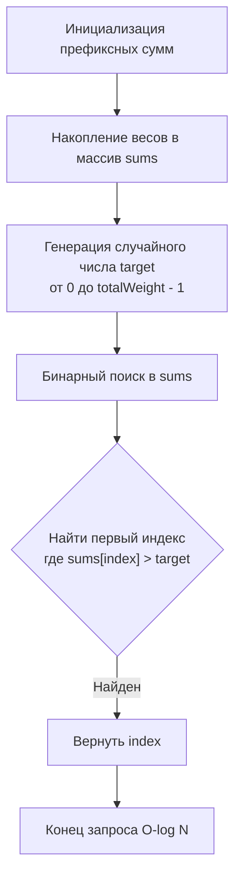
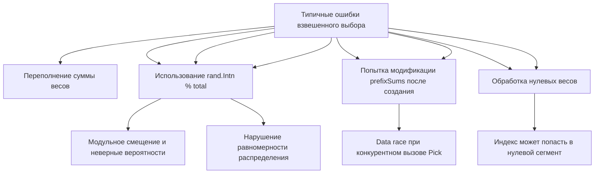

## Префиксные суммы и бинарный поиск: взвешенный выбор за O(log N)

Задача `Random Pick with Weight` (LeetCode 528) моделирует классическую инженерную проблему: выбрать элемент из набора, где вероятность выбора каждого элемента пропорциональна его весу. На собеседованиях эта задача проверяет умение перейти от наивного `O(N)` сканирования к оптимальному `O(log N)` решению, понимание распределения памяти, защиту от переполнений и способность писать потокобезопасный код без скрытых блокировок.



В этом материале мы разберём, почему префиксные суммы превращают вероятностную задачу в задачу поиска в отсортированном массиве, как бинарный поиск взаимодействует с предсказателем ветвлений CPU, почему `int` в Go может молчаливо сломать ваш алгоритм, и когда стоит переходить к методу Alias для O(1) запросов.

## 1. Алгоритмический каркас: префиксные суммы как распределение вероятностей

Наивный подход: сгенерировать число `r` в диапазоне `[0, sum(w))` и последовательно вычитать веса, пока `r` не станет отрицательным. Сложность `O(N)` на каждый запрос. При миллионах вызовов это убивает throughput.

Оптимальный подход:
1. **Preprocessing:** Построить массив префиксных сумм `S`, где `S[i] = w[0] + w[1] + ... + w[i]`. Массив строго возрастает.
2. **Query:** Сгенерировать `target ∈ [0, S[n-1])`. Найти наименьший индекс `i`, такой что `S[i] > target`. Это и есть выбранный элемент.

Поиск первого элемента, большего `target`, в отсортированном массиве решается бинарным поиском за `O(log N)`.

```go
package weighted

import (
	"sort"
	"math/rand/v2"
)

// WeightedPicker реализует взвешенный случайный выбор
type WeightedPicker struct {
	prefixSums []int64 // Используем int64 для защиты от переполнения
	total      int64
}

// New создаёт пикер. Веса должны быть положительными.
func New(weights []int) (*WeightedPicker, error) {
	if len(weights) == 0 {
		return nil, fmt.Errorf("weights must not be empty")
	}

	prefixSums := make([]int64, len(weights))
	var current int64
	for i, w := range weights {
		if w <= 0 {
			return nil, fmt.Errorf("weight at index %d must be positive", i)
		}
		current += int64(w)
		prefixSums[i] = current
	}

	return &WeightedPicker{
		prefixSums: prefixSums,
		total:      current,
	}, nil
}

// Pick возвращает индекс выбранного элемента
func (p *WeightedPicker) Pick() int {
	if p.total == 0 {
		panic("weighted: total weight is zero")
	}

	// rand.Int64N генерирует число в [0, total) без модульного смещения
	target := rand.Int64N(p.total)

	// sort.SearchInts находит первый индекс, где prefixSums[i] > target
	// Но SearchInts ищет exact match, поэтому используем sort.Search с кастомным предикатом
	idx := sort.Search(len(p.prefixSums), func(i int) bool {
		return p.prefixSums[i] > target
	})
	
	return idx
}
```

> [!info] Под капотом
> Почему `prefixSums` хранится как `[]int64`, а не `[]int`? Сумма весов может превысить `math.MaxInt32` (~2 млрд), а на 32-битных архитектурах `int` имеет ту же ширину. Переполнение в Go вызывает панику в режиме `-gcflags="G"`, но в production часто остаётся незамеченным, приводя к отрицательным весам и бесконечным циклам. `int64` гарантирует корректность для любых практических нагрузок.

## 2. Механика рантайма: память, кэш-линии и предсказание ветвлений

Бинарный поиск в Go реализуется через `sort.Search`, который компилятором инлайнится в простой цикл. Как это выглядит на уровне железа?

```go
// Эквивалент sort.Search для понимания механики
func searchInt64(s []int64, target int64) int {
    n := len(s)
    left, right := 0, n
    for left < right {
        mid := (left + right) >> 1 // Битовый сдвиг вместо деления
        if s[mid] > target {
            right = mid
        } else {
            left = mid + 1
        }
    }
    return left
}
```

> [!info] Под капотом
> **Branch Prediction и CPU Pipeline:** На каждой итерации выполняется ветвление `if s[mid] > target`. В отсортированном массиве предикат сначала `false`, затем один раз `true`, и остаётся `true` до конца. CPU Branch Predictor (обычно 2-bit saturating counter) быстро адаптируется к этому паттерну, но на первых 2-3 итерациях возможны `mispredict`, вызывающие `pipeline flush` (~15-20 тактов). Для массивов >1000 элементов это незначительно, но в latency-sensitive системах (high-frequency trading, real-time bidding) используют линейный поиск по кэш-линиям или Lookup-таблицы.
> 
> **Cache Locality:** `prefixSums` — это contiguous `[]int64`. На `amd64` каждый элемент занимает 8 байт. Одна кэш-линия (64 байта) вмещает 8 сумм. При бинарном поиске доступ к памяти скачкообразный, но глубина поиска `log2(10^6) ≈ 20` шагов, что означает ~3-4 промаха L1 кэша. Это на порядки лучше `O(N)` сканирования, которое гарантированно промахивается L1/L2 на больших массивах.

## 3. Ловушки и типичные ошибки на собеседованиях



1. **Переполнение `int`:** Если `sum(weights) > 2^31-1`, инкремент вызовет переполнение. В Go 1.22+ это `panic: runtime error: integer overflow`. Решение: `int64`.
2. **Модульное смещение (Modulo Bias):** `rand.Intn(total) % len(weights)` или `rand.Float64() * total` нарушают пропорцию вероятностей. Всегда используйте `rand.Int64N(total)`.
3. **Конкурентный доступ:** `Pick()` только читает `prefixSums` и `total`. Структура безопасна для чтения после инициализации. Блокировки не нужны. Если веса динамически меняются, требуется `sync.RWMutex` или immutable snapshot (copy-on-write).
4. **`sort.SearchInts` vs кастомный предикат:** `sort.SearchInts` ищет **точный** элемент. Нам нужен первый элемент **больше** `target`. Использование `SearchInts` с `target+1` работает, но ломается при `target = MaxInt64`. Правильно: `sort.Search(len, func(i int) bool { return prefixSums[i] > target })`.

> [!warning] Ловушка / Gotcha
> На собеседовании часто спрашивают: «Что если веса меняются динамически?». Пересчёт префиксных сумм — `O(N)`, что неприемлемо при частых обновлениях. Решение: использовать **Дерево Фенwickа (Binary Indexed Tree)** или **Сегментное дерево**. Они поддерживают обновление веса за `O(log N)` и запрос `Pick` за `O(log N)` через бинарный поиск по дереву. Это переводит задачу из `LeetCode` в `System Design` уровень.

## 4. Альтернатива O(1): метод Alias для высокочастотного выбора

Если `Pick()` вызывается десятки миллионов раз в секунду, `O(log N)` может стать bottleneck. Метод Alias (Vose's Algorithm) позволяет выбирать элемент за `O(1)` после `O(N)` preprocessing.

Идея: разбить распределение вероятностей на `N` прямоугольников шириной `1/N` и высотой `p_i`. Каждый прямоугольник разбивается на две части, принадлежащие разным элементам. Предвычисляется таблица `Alias` и `Prob`. Выбор: `i = rand.IntN(N)`, если `rand.Float64() < Prob[i]` вернуть `i`, иначе вернуть `Alias[i]`.

```go
// Псевдокод для понимания контракта
// На собеседовании достаточно описать идею и trade-offs
// Реализация Vose's Alias Method занимает ~50 строк и требует careful floating-point handling
```

| Подход | Preprocessing | Query Time | Память | Когда использовать |
|--------|--------------|------------|--------|-------------------|
| Префиксные суммы + BS | O(N) | O(log N) | O(N) | Стандарт, 95% задач |
| Метод Alias (Vose) | O(N) | O(1) | O(2N) | High-frequency trading, gaming servers |
| Динамическое обновление | O(1) / O(log N) | O(log N) | O(N) | Изменяющиеся веса в рантайме |

## 5. Вопросы с собеседований: глубина понимания

> [!tip] Собеседование
> **Вопрос:** Почему мы используем `target < prefixSums[i]`, а не `target <= prefixSums[i]`?
> **Ответ:** Диапазон `target` — `[0, total)`. Если `target == 0`, первый элемент должен выбираться всегда. Условие `prefixSums[0] > 0` истинно, так как веса положительные. Если использовать `<=`, то при `target = prefixSums[i]` мы перейдём к следующему элементу, сместив вероятность вправо. Строгое `>` гарантирует корректное маппинг интервалов `[S[i-1], S[i])` на индекс `i`.

> [!tip] Собеседование
> **Вопрос:** Как тестировать корректность распределения вероятностей?
> **Ответ:** Использовать `Chi-squared test` или простой статистический тест: выполнить `N = 1_000_000` вызовов `Pick()`, подсчитать частоты каждого индекса, проверить, что `count[i] / N ≈ weight[i] / total` с допустимой погрешностью `ε`. Для unit-тестов в Go используйте `math/rand/v2` с фиксированным seed (`rand.New(rand.NewChaCha8(1, 2))`), чтобы получить детерминированную последовательность и проверять точные индексы.

> [!tip] Собеседование
> **Вопрос:** Что происходит с `sort.Search` при пустом массиве или одном элементе?
> **Ответ:** `len == 0`: цикл не выполняется, возвращается `0`. `len == 1`: цикл выполняется 1 раз, `mid = 0`, предикат проверяет `s[0] > target`. Если `true` → `right=0`, возвращается `0`. Если `false` → `left=1`, возвращается `1` (что означает "не найдено", но в нашем контракте `target < total` гарантирует нахождение внутри диапазона, поэтому всегда вернётся валидный индекс).

## 6. Итог: чек-лист для взвешенного выбора в Go

1. **Префиксные суммы + бинарный поиск** — золотой стандарт. Preprocessing `O(N)`, Query `O(log N)`, память `O(N)`.
2. **Защита от переполнения:** всегда используйте `int64` для накопления весов. `int` ненадёжен при `sum > 2^31`.
3. **Избегайте смещения:** `rand.Int64N(total)` обязателен. Никакого `%` или `* float64`.
4. **Поиск первого большего:** используйте `sort.Search` с предикатом `s[i] > target`, а не `SearchInts`.
5. **Потокобезопасность:** после инициализации структура immutable. Чтение безопасно без мьютексов. Для динамических весов — BIT или Snapshot + RWMutex.
6. **Оптимизация:** для `>10^7` запросов в секунду рассмотрите Vose's Alias Method (`O(1)` query, `O(N)` memory).

Взвешенный случайный выбор — это мост между вероятностной математикой, алгоритмической оптимизацией и системным дизайном. Понимание того, как бинарный поиск ложится на кэш-линии CPU, и как избежать переполнений на уровне типов, отличает решение «для контеста» от production-ready компонента.

В следующей статье мы разберём алгоритмы перемешивания массивов, генераторы перестановок и механику in-place shuffle: [[4. Shuffle an Array]]