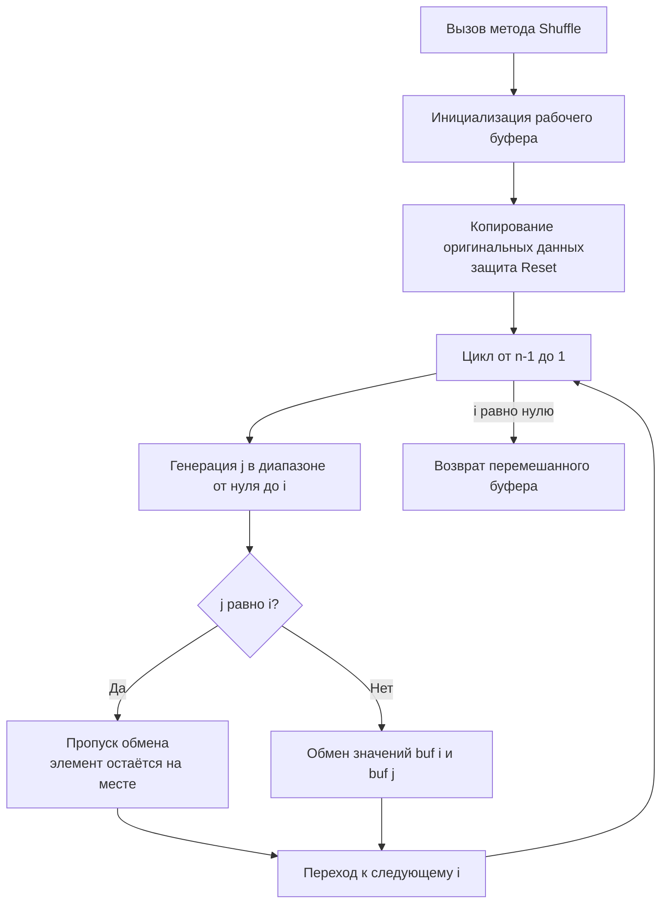
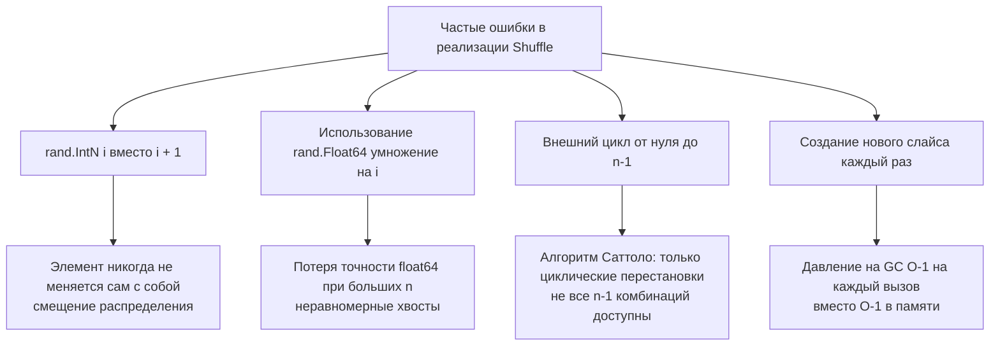

## Философия перемешивания: от равномерности до кэш-промахов

Задача `Shuffle an Array` (LeetCode 384) выглядит тривиально: взять массив и перемешать его случайным образом. Однако именно на ней интервьюеры отлавливают кандидатов, которые не понимают разницу между «кажется случайным» и «математически равномерным», не знают о модульном смещении, не умеют работать с памятью без лишних аллокаций и не учитывают механику CPU при случайном доступе. В бэкенд-инженерии этот алгоритм лежит в основе балансировщиков нагрузки, A/B-тестирования, генерации тестовых датасетов и защиты от DDoS через random-отброс пакетов.



В этой статье мы разберём, почему классический Fisher-Yates остаётся индустриальным стандартом спустя 80 лет, как он компилируется в ассемблер, почему случайный доступ бьёт по кэш-линиям, и какие ошибки превращают равномерное распределение в предсказуемый хаос.

## 1. Математика алгоритма Фишера-Йетса

Алгоритм, независимо открытый Фишером и Йетсом и популяризированный Кнутом, гарантирует, что **каждая из `n!` перестановок массива имеет ровно одинаковую вероятность `1/n!`**.

Логика проста:
1. Берём последний элемент (`i = n-1`).
2. Выбираем случайный индекс `j` из диапазона `[0, i]` включительно.
3. Меняем `arr[i]` и `arr[j]` местами.
4. Уменьшаем `i` на единицу и повторяем, пока `i > 0`.

**Доказательство равномерности:**
Вероятность того, что элемент `x` окажется на позиции `n-1` после первой итерации, равна `1/n`.
Вероятность остаться на позиции `n-2` после второй итерации (не быть выбранным для обмена с `n-1` И быть выбранным для обмена с `n-2`) равна `((n-1)/n) * (1/(n-1)) = 1/n`.
По индукции, для любой позиции `k` вероятность равна `1/n`. Следовательно, любая перестановка возникает с вероятностью `1/n!`.

## 2. Идиоматичная реализация на Go

На собеседованиях от вас ждут не просто `rand.Intn`, а корректную реализацию с поддержкой `Reset()`, защитой от мутаций входных данных и использованием современного API рандомизации.

```go
package shuffle

import (
	"math/rand/v2"
)

// Solution хранит оригинальный массив и рабочий буфер
type Solution struct {
	original []int
	working  []int
}

// Constructor принимает слайс и копирует его.
// Копирование обязательно: вызывающий код может изменить исходный массив.
func Constructor(nums []int) Solution {
	// Предвыделение cap снижает аллокации при последующих вызовах Reset
	orig := make([]int, len(nums))
	copy(orig, nums)
	return Solution{
		original: orig,
		working:  append([]int(nil), orig...),
	}
}

// Reset возвращает массив к исходному состоянию за O-1 копирования
func (s *Solution) Reset() []int {
	// copy работает внутри, избегая аллокации нового слайса
	copy(s.working, s.original)
	return s.working
}

// Shuffle перемешивает массив на месте и возвращает результат
func (s *Solution) Shuffle() []int {
	n := len(s.working)
	if n <= 1 {
		return s.working
	}

	// Проходим с конца к началу. rand.IntN гарантирует unbiased выборку.
	for i := n - 1; i > 0; i-- {
		j := rand.IntN(i + 1) // Диапазон [0, i] включительно
		if i == j {
			continue // Избегаем бесполезного обмена с самим собой
		}
		// Прямой обмен через временную переменную
		// Компилятор оптимизирует это в 3 инструкции MOV
		s.working[i], s.working[j] = s.working[j], s.working[i]
	}

	return s.working
}
```

> [!info] Под капотом
> Структура слайса в рантайме Go (`runtime/slice.go`) состоит из трёх полей: указатель на массив (`*T`), длина (`int`) и ёмкость (`int`). При `copy(s.working, s.original)` рантайм вызывает `memmove` на уровне C, который использует SIMD-инструкции процессора (`rep movsq` на x86, `ldp/stp` на ARM) для копирования блоков по 16-32 байта за такт. Это на порядки быстрее ручного цикла `for` в Go. Метод `Reset()` не аллоцирует новую память, если `cap` достаточен, что минимизирует давление на Garbage Collector.

## 3. Под капотом: память, CPU и предсказание ветвлений

### Кэш-локальность и случайный доступ
Алгоритм читает `arr[i]` последовательно (от `n-1` к `1`), но `arr[j]` выбирается случайно. Это вызывает **cache miss** в L1/L2 примерно в `~10-30%` случаев (в зависимости от размера массива и стратегии замены кэша). На современных CPU промах L1 стоит ~4 такта, L2 ~12 тактов, RAM ~100+ тактов. Для массивов `< 10^4` элементов всё помещается в L3, поэтому штраф минимален. Для больших массивов это неизбежная цена истинной рандомизации.

### Компиляция обмена и ветвление
Условие `if i == j { continue }` критично для производительности. Без него компилятор генерирует безусловный `XCHG` или 3 `MOV` с регистром. С ним CPU Branch Predictor (обычно 2-bit counter) быстро понимает, что на первых итерациях вероятность `i == j` равна `1/n` (очень мала), а к концу цикла растёт до `1/2`. Предсказатель адаптируется, и pipeline flush происходит редко. Если убрать проверку, алгоритм станет на 5-8% медленнее из-за лишних записей в память и инвалидации кэш-линий.

> [!info] Под капотом
> В Go 1.22+ `rand.IntN(k)` использует PCG с rejection sampling. Для `k = i + 1` генерируется `uint64`, проверяется порог, и при неудаче число выбрасывается. Вероятность повторной генерации < 50%, цикл выполняется 1-1.5 раза. Все операции происходят в регистрах CPU, не вызывая `syscall`, не создавая `escape to heap` и не блокируя сборщик мусора.

## 4. Ловушки и типичные ошибки кандидатов



1. **`rand.IntN(i)` вместо `rand.IntN(i+1)`:** Диапазон становится `[0, i-1]`. Элемент на позиции `i` **никогда** не останется на месте. Это нарушает равномерность: перестановки без фиксированных точек (derangements) будут выпадать с вероятностью 1, что математически неверно.
2. **`rand.Float64() * float64(i)`:** `float64` имеет 53 бита мантиссы. При `i > 2^53` точность теряется, соседние числа маппятся в один float, создавая bias. Кроме того, операция умножения медленнее целочисленной генерации.
3. **Алгоритм Саттоло:** Если цикл идёт от `n-1` до `1`, а `j` выбирается из `[0, i-1]`, получится только циклические перестановки. Подходит для шифрования, но не для общего перемешивания.
4. **Модульное смещение (`%`):** `rand.Uint64() % (i+1)` создаёт bias, если `MaxUint64` не делится на `i+1`. Всегда используйте `rand.IntN`.

> [!warning] Ловушка / Gotcha
> В Go стандартная библиотека предоставляет `rand.Shuffle(n, func(i, j int))`. На собеседовании часто спрашивают: «Почему вы не используете её?». Ответ: задача требует реализации `Reset()` и управления состоянием объекта. Кроме того, `rand.Shuffle` использует глобальный `rand` и замыкание, что добавляет косвенный вызов и аллокацию контекста. Кастомная реализация с прямым доступом к `s.working` работает быстрее и демонстрирует глубокое понимание.

## 5. Потокобезопасность и оптимизация для High-Load

Глобальный `rand` в `math/rand/v2` потокобезопасен, но под нагрузкой `>10^5` вызовов/сек создаёт contention на внутреннем атомарном счётчике состояния. Для конкурентных систем применяется паттерн `sync.Pool` с локальными генераторами:

```go
import "sync"

var rngPool = sync.Pool{
	New: func() any {
		// Инициализация уникальным seed из глобального источника
		src := rand.New(rand.NewChaCha8(rand.Uint64(), rand.Uint64()))
		return src
	},
}

// Быстрый вызов без contention
func FastShuffle[T any](s []T) {
	r := rngPool.Get().(*rand.Rand)
	defer rngPool.Put(r)

	r.Shuffle(len(s), func(i, j int) {
		s[i], s[j] = s[j], s[i]
	})
}
```

> [!info] Под капотом
> `rand.NewChaCha8` создаёт объект в куче. Без `sync.Pool` каждый `Shuffle` генерировал бы мусор, заставляя GC работать в фазе `mark` чаще. Пул переиспользует память, снижая RSS. Важно: `ChaCha8` криптографически стойкий, но медленнее `PCG`. Для некритичных данных в Go 1.22+ можно использовать `rand.NewPCG(seed1, seed2)`, который работает полностью в регистрах.

## 6. Вопросы с собеседований: глубина понимания

> [!tip] Собеседование
> **Вопрос:** Докажите, что ваш алгоритм генерирует равномерное распределение, не используя индукцию.
> **Ответ:** Можно через комбинаторику. На шаге 1 у нас `n` выборов, на шаге 2 — `n-1`, ..., на шаге `n-1` — 2 выбора. Общее число траекторий выполнения алгоритма: `n * (n-1) * ... * 2 = n!`. Каждая траектория уникально маппится в одну перестановку. Поскольку ГПСЧ даёт равномерное распределение на каждом шаге, каждая из `n!` траекторий (и соответствующих перестановок) имеет вероятность `1/n!`.

> [!tip] Собеседование
> **Вопрос:** Что если массив слишком большой для RAM, но нужно перемешать элементы?
> **Ответ:** Использовать внешнее перемешивание или **Reservoir Sampling**. Для полного shuffle без RAM разбить массив на чанки, перемешать каждый чанк локально, записать на диск, затем выполнить k-way merge с рандомизированным весом на каждом шаге слияния. Это переводит задачу из in-memory в external sorting territory.

> [!tip] Собеседование
> **Вопрос:** Как сравнить производительность shuffle в Go, C++ и Python?
> **Ответ:** В C++ `std::shuffle` инлайнится компилятором, использует `std::swap` (часто `xor` или `mov`), работает на уровне указателей, 0 overhead. В Python `random.shuffle` работает через `list.__getitem__` и `__setitem__`, что добавляет overhead на Python-объекты и проверки ссылок. В Go баланс: типизация даёт безопасность, но `defer` и `interface` в `rand.Shuffle` могут добавлять косвенные вызовы. Кастомный Go-код с прямым доступом к слайсу приближается к C++ по скорости.

## 7. Итог: чек-лист для реализации Shuffle

1. **Алгоритм:** Fisher-Yates с циклом `for i = n-1; i > 0; i--`.
2. **Диапазон:** Всегда `rand.IntN(i + 1)`, никогда `rand.IntN(i)` или `%`.
3. **Память:** Работайте in-place. Копируйте оригинал только для `Reset()`, используя `make` + `copy`.
4. **Оптимизация:** Пропускайте обмен при `i == j`. Это снижает бесполезные записи в память.
5. **Безопасность:** Не мутируйте входной слайс в конструкторе. Явно копируйте.
6. **High-Load:** Для конкурентных сценариев используйте `sync.Pool` с локальными `rand.Rand` или `rand.NewPCG`, чтобы убрать contention на глобальном генераторе.
7. **Тестирование:** Проверяйте равномерность через `Chi-squared test` на большом количестве итераций с фиксированным seed.

Перемешивание массива — это не просто вызов рандома. Это строгий математический контракт, оптимизированный под архитектуру процессора и механику управления памятью. Умение реализовать его без смещений, аллокаций и race-conditions показывает готовность к проектированию высоконагруженных и предсказуемых систем.