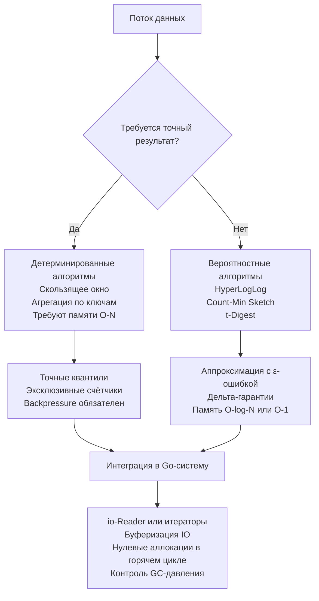

## Введение: Что такое потоковые алгоритмы

Потоковые алгоритмы (Streaming Algorithms) решают задачи обработки данных, которые поступают непрерывно, имеют неизвестный или экстремально большой размер `N`, и не помещаются в оперативную память. Ключевое ограничение: один или несколько проходов по данным, строгий лимит памяти `O(polylog(N))` или `O(ε⁻¹)`, и минимальная задержка на элемент. В бэкенд-инженерии это ядро мониторинга метрик, анализа логов в реальном времени, детекции аномалий, A/B-тестирования и балансировки трафика.



В этой статье мы разберём математические основы потоковой обработки, классификацию алгоритмов, их механику на уровне CPU и сборщика мусора Go, а также архитектурные компромиссы, которые отличают production-решения от академических упражнений.

## 1. Классификация и математические основы

Потоковые алгоритмы делятся на две фундаментальные категории по гарантии результата:

1. **Детерминированные (точные)**: Дают гарантированно правильный ответ. Требуют памяти, пропорциональной размеру окна или количеству уникальных ключей. Примеры: точный подсчёт частот в фиксированном окне, скользящее среднее.
2. **Вероятностные (аппроксимативные)**: Гарантируют ответ с заданной вероятностью или ограниченной ошибкой `ε`. Потребляют `O(log N)` или `O(1)` памяти. Примеры: HyperLogLog для уникальных посетителей, Count-Min Sketch для оценки частот, t-Digest для квантилей задержек.

> [!info] Под капотом
> Почему вероятностные алгоритмы быстрее и экономнее? Они используют **хеширование с контролируемым коллизированием** или **битовые массивы**. В Go это означает работу с примитивными типами (`[]byte`, `[]uint64`), которые не создают указателей в куче. Сборщик мусора не сканирует битовые маски, CPU кэширует их целиком, а ветвление минимизировано за счёт побитовых операций (`|`, `&`, `^`).

## 2. Ключевые паттерны потоковой обработки

### Частотная оценка и Heavy Hitters
Задача: найти элементы, встречающиеся чаще порога `φ · N`. Наивный `map[K]int` растёт до `O(N)`. Решение: **Misra-Gries** или **Count-Min Sketch**. Первый хранит `k` кандидатов и декрементирует все при переполнении, второй использует 2D-массив хешей и берёт минимум по строкам.

### Подсчёт уникальных элементов
Задача: `CARDINALITY` потока. Точное решение требует `set` всех элементов. Приближённое: **HyperLogLog**. Алгоритм хеширует элемент, ищет позицию первого единичного бита в хеше и использует её как оценку. Объединение множеств происходит через `max` регистров, что идеально для шардирования и распределённых агрегаций.

### Квантили и перцентили
Задача: найти `p95` задержки HTTP-запросов. Сортировка `O(N log N)` невозможна в потоке. Решение: **t-Digest** или **GK-алгоритм**. Они хранят сжатые кластеры данных с весами, позволяя оценивать квантили с ошибкой `ε`, которая растёт ближе к медиане и минимальна на хвостах распределения (что критично для SLO).

### Скользящее окно (Sliding Window)
Ограничение обработки фиксированным интервалом времени или количеством элементов. Реализуется через кольцевой буфер (`[]T` с индексом `i % cap`) или дека. При вытеснении старых элементов агрегаты обновляются инкрементально, без пересчёта всего окна.

## 3. Под капотом в Go: IO, аллокации и планировщик

Потоковая обработка в Go упирается не в математику, а в механику рантайма и взаимодействие с ОС.

### Буферизация IO и syscalls
Чтение по одному байту вызывает системный вызов `read` на каждый элемент. Это тысячи переключений Ring 3 → Ring 0, очистка TLB и промахи кэша. В Go используется `bufio.Reader`, который выделяет буфер в куче (обычно 4-32 КБ) и заполняет его за один `syscall`. Внутренний цикл читает из `[]byte` в User Space, что в 50-100 раз быстрее.

```go
import (
	"bufio"
	"io"
)

// ProcessStream обрабатывает поток строк без аллокаций на элемент
func ProcessStream(r io.Reader) error {
	scanner := bufio.NewScanner(r)
	// Увеличиваем буфер для длинных строк, чтобы избежать runtime panic
	buf := make([]byte, 0, 1024*1024) // 1 МБ
	scanner.Buffer(buf, 1024*1024)

	scanner.Split(bufio.ScanLines)
	for scanner.Scan() {
		line := scanner.Bytes() // []byte, а не string! Без копирования
		// Обработка в горячем цикле...
		if err := processLine(line); err != nil {
			return err
		}
	}
	return scanner.Err()
}
```

> [!warning] Ловушка / Gotcha
> `scanner.Text()` возвращает `string`, что вызывает **копирование байтов в кучу** на каждой итерации. В потоке из 10⁶ строк это создаёт миллион аллокаций и мгновенно запускает `GC mark phase`. Всегда используйте `scanner.Bytes()` для обработки, если не требуется сохранение строк после итерации.

### Escape Analysis и GC-давление
В потоковых алгоритмах часто создаются временные структуры для агрегации. Если компилятор помечает их как `escapes to heap`, каждая итерация генерирует мусор. Решение:
- Хранить агрегаты в значениях (`struct`), а не указателях.
- Использовать `sync.Pool` для переиспользования буферов.
- Избегать `interface{}` в горячем пути (динамическая диспетчеризация + упаковка в кучу).

### Каналы vs Итераторы (Go 1.23+)
Каналы удобны для декоулинга компонентов, но каждый `send/receive` проходит через `runtime chansend/chanrecv`, использует внутренние мьютексы и может парковать горутины. Для CPU-bound потоков это оверхед. В Go 1.23+ рекомендуется использовать `iter.Seq[V]` (pull-итераторы):

```go
// Идиоматичный потоковый генератор без goroutine-overhead
func ReadChunks(r io.Reader) iter.Seq[[]byte] {
	return func(yield func([]byte) bool) {
		buf := make([]byte, 4096)
		for {
			n, err := r.Read(buf)
			if n > 0 && !yield(buf[:n]) {
				return // Прерывание по контексту
			}
			if err == io.EOF {
				return
			}
			if err != nil {
				// Логирование или возврат ошибки
				return
			}
		}
	}
}
```
Это устраняет аллокации для горутин, убирает блокировки и даёт предсказуемую латентность.

## 4. Архитектурные компромиссы в распределённых потоках

1. **Backpressure (Обратное давление)**: Если потребитель медленнее продюсера, поток нужно тормозить. В Go это делается через буферизованные каналы с блокировкой, `context.Context` с таймаутами или явные `ACK/NACK` протоколы. Без backpressure потребление RAM растёт линейно → OOM.
2. **Порядок событий (Ordering)**: Сети доставляют пакеты с задержками и в разном порядке. Потоковые системы используют **Watermarks** и **Buffering**. В Go это требует сортировки по timestamp в окне, что добавляет задержку и память.
3. **Exactly-Once vs At-Least-Once**: Точная однократная обработка в распределённом потоке требует идемпотентности + checkpointing + distributed consensus (например, Kafka transactions). На практике 99% систем выбирают At-Least-Once с дедупликацией на приёмнике, так как Exactly-Once добавляет 3-5x latency.

## 5. Ловушки и вопросы с собеседований

> [!tip] Собеседование
> **Вопрос:** Как посчитать количество уникальных пользователей в потоке из 10⁹ записей, имея только 10 МБ RAM?
> **Ответ:** Использовать HyperLogLog. Для `ε = 2%` требуется ~16 КБ памяти. Алгоритм хеширует ID, берёт старшие биты для выбора регистра, младшие для позиции первого `1`. Объединение результатов с других шардов происходит через `MAX` по регистрам. Точное решение потребовало бы `Bloom Filter` + точный счётчик или внешнюю БД, что нарушает лимит RAM.

> [!tip] Собеседование
> **Вопрос:** Почему Count-Min Sketch даёт завышенную оценку частот, но никогда заниженную?
> **Ответ:** Из-за коллизий хешей. Несколько ключей могут маппиться в одну ячейку массива, суммируя счётчики. При запросе берётся `min` по всем хеш-строкам, что минимизирует влияние коллизий. `min` гарантирует, что мы не вернём значение меньше реального, так как настоящий счётчик всегда участвует в выборке минимума.

> [!tip] Собеседование
> **Вопрос:** Как обрабатывать задержанные (late) события в потоке с агрегацией по окнам?
> **Ответ:** Внедрить механизм Watermark: маркер времени, гарантирующий, что все события с timestamp < Watermark уже поступили. События, пришедшие позже Watermark, либо отбрасываются, либо помещаются в отдельный side-output для корректировки агрегатов. В Go это реализуется через `time.Ticker` для генерации Watermark и `map[windowKey][]Event` для буферизации.

## 6. Итог: чек-лист для потоковых алгоритмов

1. **Ограничьте память**: `O(1)` или `O(log N)` относительно размера потока. Точные решения масштабируются плохо.
2. **Выбирайте аппроксимацию осознанно**: HyperLogLog для уникальности, Count-Min Sketch для частот, t-Digest для квантилей. Документируйте `ε` и `δ`.
3. **Контролируйте IO**: `bufio.Reader`, `scanner.Bytes()`, один `syscall` на буфер. Никаких `scanner.Text()` в горячих циклах.
4. **Минимизируйте GC**: Значения вместо указателей, `sync.Pool` для буферов, избегайте `interface{}` и аллокаций на элемент.
5. **Реализуйте Backpressure**: Блокировка, буферизация или дроп. Потоки без контроля давления приводят к OOM.
6. **Выбирайте примитив передачи**: Для CPU-bound — `iter.Seq` или callback, для decoupled IO — буферизованные каналы с `context`.

Потоковые алгоритмы — это баланс между математической строгостью, ограничениями железа и предсказуемостью рантайма. Умение проектировать системы, которые обрабатывают терабайты данных с мегабайтами RAM и стабильной латентностью, напрямую коррелирует с готовностью к роли Senior/Lead.

В следующей статье мы детально разберём задачу поиска наиболее частых элементов в потоке, реализуем алгоритм Misra-Gries и Count-Min Sketch на Go, и сравним их по памяти, скорости и точности: [[2. Heavy hitters]]