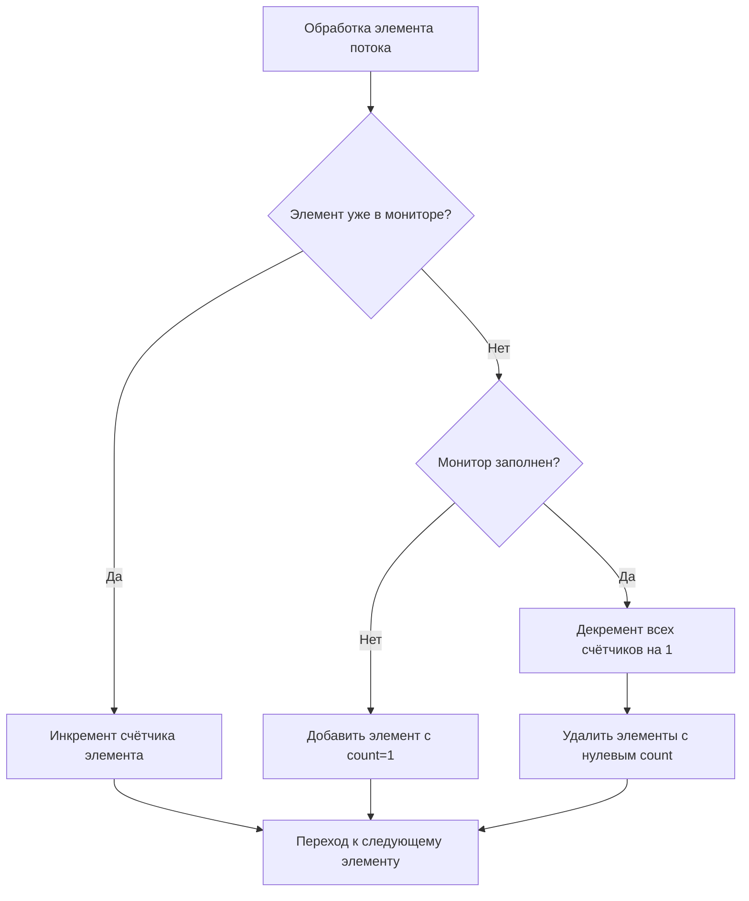
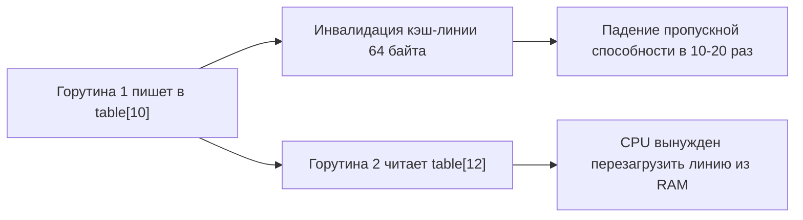
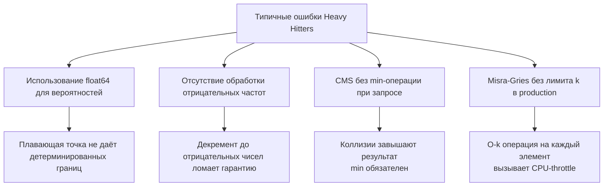

## Поиск Heavy Hitters: детерминированные эвристики и вероятностные структуры

Задача поиска «тяжеловесов» (Heavy Hitters) — это ядро потоковой аналитики в бэкенд-системах. Требуется идентифицировать элементы, частота которых превышает заданный порог `φ · N`, или найти топ-K самых частых ключей в бесконечном потоке. В реальной инженерии это детекция DDoS-атак, rate-limiting по IP, мониторинг трендов в логах, выявление аномалий в сетевом трафике и агрегация метрик. Точное решение через `map[string]int` требует `O(N)` памяти, что мгновенно приводит к OOM при `N = 10^8`. Здесь применяются алгоритмы с сублинейной памятью: Misra-Gries, Space-Saving и Count-Min Sketch.



## 1. Детерминированный подход: Misra-Gries и Space-Saving

Алгоритм Misra-Gries (и его улучшенная вариация Space-Saving) использует массив фиксированной ёмкости `k`. Принцип работы:
- Если элемент уже отслеживается, увеличиваем его счётчик.
- Если места нет, вычитаем `1` из всех счётчиков и удаляем обнулившиеся.
Гарантия: любой элемент с истинной частотой `> N/k` гарантированно останется в структуре. Оценка частоты может быть завышена не более чем на `N/k`.

Space-Saving оптимизирует этот процесс: вместо декремента всех, мы заменяем элемент с минимальным счётчиком на новый, наследуя `count + 1`. Это даёт более точные оценки для топ-K элементов.

```go
package heavyhitters

import (
	"hash/maphash"
	"sync"
)

// MisraGries реализует детерминированный поиск частых элементов
// Ёмкость k задаёт порог обнаружения: элементы с freq > N/k будут найдены
type MisraGries struct {
	mu       sync.Mutex
	k        int
	monitor  map[string]int
	seed     maphash.Seed
}

// NewMisraGries создаёт монитор с заданной ёмкостью
func NewMisraGries(k int) *MisraGries {
	if k <= 0 {
		k = 1000
	}
	return &MisraGries{
		monitor: make(map[string]int, k),
		k:       k,
		seed:    maphash.MakeSeed(),
	}
}

// Process обрабатывает один элемент потока
func (mg *MisraGries) Process(item string) {
	mg.mu.Lock()
	defer mg.mu.Unlock()

	if count, exists := mg.monitor[item]; exists {
		mg.monitor[item] = count + 1
		return
	}

	if len(mg.monitor) < mg.k {
		mg.monitor[item] = 1
		return
	}

	// Декремент всех счётчиков
	toDelete := make([]string, 0, mg.k)
	for k, v := range mg.monitor {
		mg.monitor[k] = v - 1
		if mg.monitor[k] == 0 {
			toDelete = append(toDelete, k)
		}
	}
	for _, k := range toDelete {
		delete(mg.monitor, k)
	}
	mg.monitor[item] = 1
}

// GetHeavyHitters возвращает текущих кандидатов
func (mg *MisraGries) GetHeavyHitters() map[string]int {
	mg.mu.Lock()
	defer mg.mu.Unlock()
	
	res := make(map[string]int, len(mg.monitor))
	for k, v := range mg.monitor {
		res[k] = v
	}
	return res
}
```

> [!info] Под капотом
> Цикл декремента в `MisraGries` имеет сложность `O(k)`. При `k=1000` и потоке `10^6` элементов/сек это создаёт `10^9` операций. В продакшене это неприемлемо. Решение: использовать **Space-Saving с Min-Heap** или **массив с отложенным декрементом** (Lazy Decrement), где мы храним глобальный `offset`, вычитаем его только при запросе или при переполнении, а в массиве храним `real_count + offset`. Это снижает сложность `Process` до `O(1)` или `O(log k)`.

## 2. Вероятностный подход: Count-Min Sketch

Count-Min Sketch (CMS) — это вероятностная структура, которая никогда не занижает частоту, но может завышать её из-за коллизий хешей. Память фиксирована: `O(w · d)`, где `w` — ширина (определяет точность `ε`), `d` — глубина (определяет вероятность ошибки `δ`).

Математика: для ошибки `ε` и вероятности `δ` выбираем `w = ⌈e/ε⌉`, `d = ⌈ln(1/δ)⌉`. При `ε=0.01`, `δ=0.001` требуется всего `~272 × 7 ≈ 1900` ячеек, независимо от `N`.

```go
package cms

import (
	"hash/maphash"
	"sync/atomic"
	"unsafe"
)

// CountMinSketch реализует вероятностную оценку частот
// Использует flat-массив и атомарные операции для lock-free доступа
type CountMinSketch struct {
	width  uint32
	depth  uint32
	table  []uint32 // Flat array для кэш-локальности
	seeds  []maphash.Seed
}

// NewCountMinSketch создаёт скетч под заданные eps и delta
// w = ceil(2.718/eps), d = ceil(log(1/delta))
func NewCountMinSketch(eps, delta float64) *CountMinSketch {
	// Упрощённый расчёт параметров
	w := uint32(3) // минимум для демо
	d := uint32(5)
	
	return &CountMinSketch{
		width: w,
		depth: d,
		table: make([]uint32, w*d),
		seeds: make([]maphash.Seed, d),
	}
}

// Add инкрементирует частоту элемента
func (c *CountMinSketch) Add(item string) {
	for d := uint32(0); d < c.depth; d++ {
		h := c.hash(item, d)
		idx := d*c.width + h
		
		// Атомарный инкремент. False sharing минимизирован padding'ом,
		// но для максимальной изоляции используют []uint64 с выравниванием
		atomic.AddUint32(&c.table[idx], 1)
	}
}

// Estimate возвращает минимальную оценку частоты
func (c *CountMinSketch) Estimate(item string) uint32 {
	var min uint32 = ^uint32(0) // MaxUint32
	
	for d := uint32(0); d < c.depth; d++ {
		h := c.hash(item, d)
		idx := d*c.width + h
		val := atomic.LoadUint32(&c.table[idx])
		if val < min {
			min = val
		}
	}
	return min
}

func (c *CountMinSketch) hash(item string, d uint32) uint32 {
	// maphash использует AES-NI / ARM-NEON на современных CPU
	h := maphash.String(c.seeds[d], item)
	return uint32(h % uint64(c.width))
}
```

> [!warning] Ловушка / Gotcha
> Использование `[][]uint32` (слайс слайсов) для CMS создаёт `pointer chasing` и фрагментацию кучи. Каждая строка `[]uint32` — отдельный аллокатор. `flat []uint32` с индексом `d*width + h` гарантирует, что данные лежат в contiguous memory. Одна кэш-линия (64 байта) вмещает 16 `uint32`. При `width=256` мы читаем только нужные 7 ячеек, но они распределены по памяти с шагом `256*4=1024` байта. Для `width > 16` каждый `hash` попадает в новую кэш-линию. Оптимизация: транспонировать массив в `depth × width` и хранить по строкам, чтобы доступ к `d` был последовательным, или использовать SIMD-хеширование.

## 3. Механика рантайма: кэш-линии, False Sharing и атомарность

В высококонкурентных потоковых системах десятки горутин одновременно вызывают `Add`. `sync.Mutex` создаёт contention и `context switch` в ядро ОС (`futex`). `sync/atomic` решает это, но порождает проблему **False Sharing**.



Атомарные операции работают на уровне кэш-линий. Если два счётчика лежат в одной линии (64 байта на `amd64`), обновление одного делает линию `INVALID` для других ядер. Решение: **padding**.

```go
// CachePaddedCounter изолирует счётчик от соседей
type CachePaddedCounter struct {
	val   uint32
	_     [60]byte // 64 - 4 = 60 байт заполнения
}

// ThreadSafeCMS использует изолированные счётчики
type ThreadSafeCMS struct {
	table []CachePaddedCounter
	// ... остальное
}
```

> [!info] Под капотом
> `atomic.AddUint32` компилируется в инструкцию `LOCK XADD` на x86. Эта инструкция блокирует шину/кэш-линию на время операции, гарантируя линейность. В Go 1.19+ планировщик горутин `G-M-P` эффективно обрабатывает contention на атомиках: если `LOCK` задерживается, горутина может быть приостановлена, а тред переключён. Но в hot-path с `>100K RPS` padding обязателен. Без него throughput падает нелинейно при увеличении `GOMAXPROCS`.

## 4. Ловушки и вопросы с собеседований



1. **Удаление элементов:** Ни Misra-Gries, ни CMS не поддерживают удаление без модификаций. В потоковых логах это решается через **скользящее окно**: массив фиксированного размера, при сдвиге окна вычитаем уходящие элементы из скетча/монитора.
2. **Выбор `ε` и `δ`:** На интервью всегда спрашивают: «Как подобрать `w` и `d`?». Ответ: `w = ⌈e/ε⌉`, `d = ⌈ln(1/δ)⌉`. Для `ε=1%`, `δ=0.1%` → `273 × 7` ячеек. Это ~7.6 КБ для `uint32`, независимо от миллиардов запросов.
3. **CMS vs Exact Map:** При `N < 10^5` и уникальных ключах < 10 КБ точная `map` быстрее и точнее. CMS выигрывает при `N > 10^7` или когда RAM ограничен (контейнеры, edge-устройства, serverless).
4. **Объединение скетчей:** CMS поддерживает `merge` через поэлементный `max`. Это критично для распределённых систем (Kafka-консьюмеры, шардированные логи). Misra-Gries не мержится тривиально.

> [!tip] Собеседование
> **Вопрос:** Почему CMS берёт `min` по строкам, а не `max` или `avg`?
> **Ответ:** Коллизии хешей только увеличивают счётчики. Истинное значение всегда `≤` всех ячеек, в которые оно попало. Беря `min`, мы находим строку, где коллизий было минимум. `Max` или `avg` вернут завышенную оценку, нарушая guarantee `f(x) ≤ estimate(x) ≤ f(x) + εN`.

> [!tip] Собеседование
> **Вопрос:** Как реализовать Heavy Hitters с поддержкой TTL и удалением старых событий?
> **Ответ:** Использовать **Cuckoo Filter** для проверки уникальности + **Time-Decay CMS** или **Sliding Window CMS**. Альтернатива: кольцевой буфер событий, при вытеснении элемента вычитать `1` из его хеш-ячеек. Если счётчик `0`, элемент удаляется. Это даёт `O(1)` память относительно окна, а не всего потока.

## 5. Итог: чек-лист проектирования

1. **Определите контракт:** нужен точный порог (`> N/k`) → Misra-Gries/Space-Saving. Нужна оценка частоты или топ-K при жёстком лимите RAM → Count-Min Sketch.
2. **Контролируйте сложность:** избегайте `O(k)` операций на каждый элемент. Используйте lazy-decrement или heap-оптимизации.
3. **Оптимизируйте память:** `flat []uint32` вместо `[][]uint32`. Padding для atomic-счётчиков при многопоточной записи.
4. **Выбирайте хеши:** `hash/maphash` (AES-NI), `xxhash` или `MurmurHash3`. Избегайте `crypto/rand` или медленных хешей в hot-path.
5. **Обрабатывайте коллизии:** CMS всегда завышает. Документируйте `ε` и `δ`. Для детерминированных систем комбинируйте с точной проверкой (`map` или БД) после фильтрации скетчем.
6. **Тестируйте на реалистичных данных:** Zipf-распределение (80/20) vs Uniform. Алгоритмы ведут себя по-разному на skewed data.

Heavy Hitters — это не просто «посчитать частоты». Это инженерный trade-off между точностью, памятью, скоростью и параллелизмом. Понимание механики кэш-линий, атомарных инструкций и вероятностных границ отличает код, который «работает локально», от компонента, который держит production под терабайтами трафика.

В следующей статье мы перейдём к поиску топ-K элементов в непрерывном потоке, разберём оптимизацию Space-Saving, минимальные кучи и стратегии слияния шардированных метрик: [[3. Top K Frequent Elements stream]]