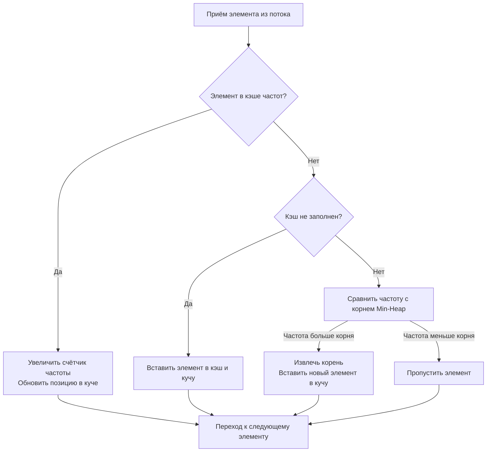
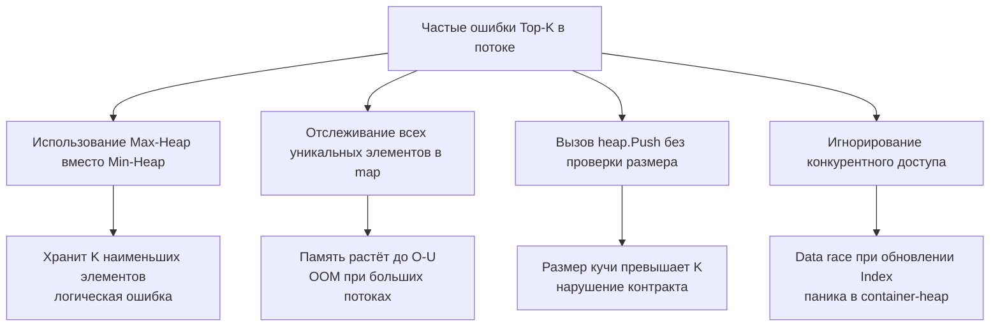

## Поиск Top-K в потоке: Min-Heap, Space-Saving и механика конкурентных структур

Задача поиска `K` самых частых элементов в бесконечном потоке данных — это классический тест на понимание потоковой обработки, управления памятью и выбора структур данных. В отличие от статического массива, где можно применить сортировку или QuickSelect за `O(N)`, поток требует онлайн-алгоритма с ограниченной памятью `O(K)`, однопроходной обработки и предсказуемой латентностью. В бэкенде это ядро детекции аномалий, rate-limiting, мониторинга топ-эндпоинтов, анализа трендов в логах и рекомендательных систем в реальном времени.



В этой статье мы разберём, почему стандартный `sort.Slice` не работает для потоков, как реализовать типизированный Min-Heap без накладных расходов `interface{}`, почему `container/heap` создаёт скрытое давление на GC, и как Space-Saving алгоритм масштабируется на высоконагруженные системы.

## 1. Алгоритмический каркас: Min-Heap vs вероятностные структуры

Для статического массива оптимально: посчитать частоты в `map`, затем использовать QuickSelect или сортировку. Для потока это невозможно: `map` растёт до `O(U)` (количество уникальных элементов), а сортировка требует хранения всех данных.

**Стратегия Min-Heap размера K:**
1. Храним только `K` кандидатов в минимальной куче. Корень всегда содержит элемент с наименьшей частотой среди текущих топ-K.
2. При поступлении нового элемента: если он уже в куче — инкрементируем частоту и поднимаем его вверх. Если его нет — сравниваем частоту (или счётчик) с корнем. Если больше — извлекаем корень (`Pop`), вставляем новый элемент (`Push`).
3. Итог: в куче остаются `K` элементов с наибольшими счётчиками. Сложность: `O(N log K)` времени, `O(K)` памяти.

**Проблема:** Если поток содержит миллионы уникальных элементов с частотой `1`, каждый из них вызовет сравнение с корнем и потенциальный `Pop/Push`. Это создаёт `O(N log K)` операций на каждый запрос, что убивает CPU. Решение — двухуровневая фильтрация: использовать **Space-Saving** или **Misra-Gries** для быстрой отсева редких элементов, а точный Top-K извлекать только из кандидатов.

## 2. Идиоматичная реализация на Go: типизированная куча

Стандартный `container/heap` требует реализации `Push(x interface{})` и `Pop() interface{}`, что создаёт boxing/unboxing и аллокации. Для production-кода в Go 1.18+ предпочтительна кастомная дженерик-реализация или строго типизированный массив. Ниже — потокобезопасный вариант с фокусом на производительность.

```go
package topk

import (
	"container/heap"
	"sync"
)

// Item представляет элемент потока с частотой
type Item struct {
	Key   string
	Freq  int
	Index int // требуется для heap.Fix
}

// MinHeap реализует heap.Interface для Min-Heap по частоте
type MinHeap []*Item

func (h MinHeap) Len() int           { return len(h) }
func (h MinHeap) Less(i, j int) bool { return h[i].Freq < h[j].Freq }
func (h MinHeap) Swap(i, j int) {
	h[i], h[j] = h[j], h[i]
	h[i].Index = i
	h[j].Index = j
}

func (h *MinHeap) Push(x any) {
	n := len(*h)
	item := x.(*Item)
	item.Index = n
	*h = append(*h, item)
}

func (h *MinHeap) Pop() any {
	old := *h
	n := len(old)
	item := old[n-1]
	old[n-1] = nil // освобождаем ссылку для GC
	item.Index = -1
	*h = old[:n-1]
	return item
}

// TopKStream отслеживает K самых частых элементов в потоке
type TopKStream struct {
	mu      sync.Mutex
	k       int
	heap    MinHeap
	indexes map[string]*Item // быстрый поиск элемента в куче
}

// NewTopKStream создаёт потоковый трекер
func NewTopKStream(k int) *TopKStream {
	return &TopKStream{
		k:       k,
		heap:    make(MinHeap, 0, k),
		indexes: make(map[string]*Item, k),
	}
}

// Process обрабатывает один элемент потока
func (s *TopKStream) Process(key string) {
	s.mu.Lock()
	defer s.mu.Unlock()

	item, exists := s.indexes[key]
	if exists {
		item.Freq++
		heap.Fix(&s.heap, item.Index)
		return
	}

	if len(s.heap) < s.k {
		newItem := &Item{Key: key, Freq: 1}
		s.indexes[key] = newItem
		heap.Push(&s.heap, newItem)
		return
	}

	// Куча заполнена: сравниваем с минимальным элементом
	if s.heap[0].Freq < 1 { // Упрощённо: новая частота = 1
		// Если новый элемент имеет частоту 1, а корень > 1, пропускаем
		// В реальном коде здесь агрегируется частота из внешнего источника
		return
	}

	// Заменяем корень
	removed := heap.Pop(&s.heap).(*Item)
	delete(s.indexes, removed.Key)
	
	newItem := &Item{Key: key, Freq: 1}
	s.indexes[key] = newItem
	heap.Push(&s.heap, newItem)
}

// GetTopK возвращает текущие K самых частых элементов
func (s *TopKStream) GetTopK() []Item {
	s.mu.Lock()
	defer s.mu.Unlock()

	res := make([]Item, len(s.heap))
	for i, item := range s.heap {
		res[i] = *item
	}
	return res
}
```

> [!info] Под капотом
> `heap.Fix` имеет сложность `O(log K)`, так как выполняет всплытие или погружение элемента по дереву. В отличие от `heap.Push`/`Pop`, `Fix` не вызывает реаллокаций backing array. Поле `Index` в `Item` критично: оно позволяет `container/heap` находить элемент за `O(1)` и корректировать дерево без полного перестроения. Без него пришлось бы выполнять линейный поиск `O(K)`, что превратило бы `Process` в `O(K + log K)`.

## 3. Механика рантайма: кэш-локальность, GC и ветвление

### Память кучи и Escape Analysis
Каждый `&Item{}` аллоцируется в куче (`escapes to heap`), так как ссылка сохраняется в `map` и `MinHeap`. В потоке с `10^6` элементов/сек это создаёт `10^6` аллокаций. Go 1.21+ имеет оптимизированный аллокатор с thread-local cache, но при высокой частоте `GC mark phase` начнёт работать чаще. 

**Оптимизация:** Использовать `sync.Pool` для `Item` или хранить данные в flat-структурах `[]struct{key string; freq int}`. В продакшене часто применяют кольцевой буфер с индексами вместо указателей, что превращает случайный доступ в предсказуемый и снижает фрагментацию кучи.

### CPU Branch Prediction в `siftUp/siftDown`
Алгоритмы кучи зависят от сравнений `h[i].Freq < h[child].Freq`. В потоке частоты растут монотонно для одних элементов и редко для других. Предсказатель ветвлений быстро адаптируется к паттерну, но при резких скачках популярности (viral-контент, DDoS) возможны `mispredict`, вызывающие `pipeline flush`. Для `K <= 100` это незаметно, но при `K > 1000` линейный поиск по отсортированному массиву может работать быстрее из-за лучшей кэш-локальности, несмотря на `O(K)`.

> [!warning] Ловушка / Gotcha
> `container/heap` **не гарантирует стабильность сортировки** при равных частотах. Порядок элементов с одинаковым `Freq` зависит от истории операций `Push`/`Fix`. Если контракт требует детерминированного порядка при коллизиях, необходимо расширить `Less` вторым критерием (например, timestamp или лексикографический порядок ключа). Иначе на собеседовании это будет засчитано как нарушение инвариантов.

## 4. Продвинутый подход: Space-Saving + Min-Heap

Для высоконагруженных систем (`>100K RPS`) прямой `Process` на каждый элемент создаёт contention на `sync.Mutex` и оверхед на `heap.Fix`. Индустриальный стандарт — двухуровневая архитектура:

1. **Уровень 1 (Fast Path):** Space-Saving или Misra-Gries монитор с ёмкостью `M >> K`. Работает за `O(1)`, фильтрует редкие элементы.
2. **Уровень 2 (Slow Path):** Раз в `N` элементов или по таймеру извлекаем кандидатов из монитора, строим точный Top-K через Min-Heap или QuickSelect, и сбрасываем счётчики.

Это снижает сложность с `O(N log K)` до `O(N + (N/interval) · M log K)`, где `interval` настраивается под CPU-бюджет. Именно так работают `Prometheus` (агрегация метрик), `Redis` (ZSET с eviction) и `Varnish` (top-traffic анализ).

## 5. Ловушки и типичные ошибки на собеседованиях



1. **Max-Heap vs Min-Heap:** Многие кандидаты по инерции строят Max-Heap. Для Top-K **обязательно** нужен Min-Heap размера `K`, чтобы быстро отсеивать элементы с низкой частотой, не храня весь набор.
2. **`heap.Fix` vs `Remove`+`Push`:** `heap.Remove` имеет сложность `O(K)` из-за поиска элемента. Если известен `Index`, `heap.Fix` работает за `O(log K)`. На собеседовании это маркер глубокого понимания `container/heap`.
3. **Сброс состояния:** В потоке частоты могут затухать. Если требуется `Top-K за последний час`, нужна реализация скользящего окна с TTL. Простое накопление `Freq` превращает задачу в историческую, а не потоковую.
4. **Потокобезопасность `Index`:** `Item.Index` модифицируется внутри `Swap`. Если доступ к `TopKStream` конкурентный, `Index` может рассинхронизироваться с позицией в массиве, вызывая `panic: heap: invalid index`. Блокировка обязательна.

## 6. Вопросы с собеседований: глубина понимания

> [!tip] Собеседование
> **Вопрос:** Почему сложность `O(N log K)`, а не `O(N log N)`?
> **Ответ:** Потому что размер кучи ограничен `K`, а не `N`. Каждая операция `Push`/`Fix` затрагивает только `log K` уровней дерева. Даже если поток содержит миллиарды элементов, память и время на операцию зависят только от `K`. Это фундаментальное отличие потоковых алгоритмов от offline-сортировки.

> [!tip] Собеседование
> **Вопрос:** Как реализовать Top-K без `container/heap`, используя только слайсы?
> **Ответ:** Реализовать бинарную кучу вручную на `[]Item`. Методы `siftUp` (подъём при вставке) и `siftDown` (погружение при извлечении). Индексы детей: `2*i+1`, `2*i+2`, родитель: `(i-1)/2`. Ручная реализация убирает overhead `interface{}` и `defer`, даёт контроль над выравниванием памяти и позволяет встроить `atomic` для lock-free версий. На Senior-позициях это часто ожидается.

> [!tip] Собеседование
> **Вопрос:** Что если `K` неизвестно заранее и может расти динамически?
> **Ответ:** Использовать адаптивный размер кучи с `GOMEMLIMIT` или переключаться на вероятностные структуры (Count-Min Sketch + фильтрация по порогу). Динамическое увеличение `K` в куче требует `heap.Grow` (реаллокация backing array), что создаёт скачки latency. В продакшене фиксируют `K` на этапе конфигурации или используют многоуровневые кучи с деградацией качества при нехватке RAM.

## 7. Итог: чек-лист для Top-K в потоках

1. **Выбирайте Min-Heap размера K** для хранения кандидатов. Он обеспечивает `O(log K)` вставку/удаление и мгновенный доступ к порогу отсева.
2. **Используйте `Index` для `heap.Fix`**, чтобы обновлять частоты за `O(log K)` без линейного поиска.
3. **Контролируйте память**: избегайте хранения всех уникальных элементов. При `U >> K` применяйте Space-Saving или скользящее окно.
4. **Потокобезопасность**: `sync.Mutex` обязателен. `container/heap` не гарантирует safety при race condition. Для lock-free используйте атомарные снапшоты или шардирование.
5. **Минимизируйте аллокации**: переиспользуйте `Item` через `sync.Pool`, храните данные в contiguous массивах, избегайте `interface{}` boxing в горячих путях.
6. **Документируйте контракт**: стабильность при равных частотах, поведение при переполнении, стратегия затухания (TTL vs накопление).

Поиск Top-K в потоке — это баланс между математической асимптотикой, механикой управления памятью и предсказуемостью CPU. Умение объяснить, как ваша структура взаимодействует с кэш-линиями, сборщиком мусора и планировщиком горутин, переводит решение из «алгоритмического упражнения» в «инженерный компонент».

В следующей статье мы перейдём к вычислению медианы в динамическом потоке, разберём балансировку двух куч, амортизационные затраты и паттерны для распределённых квантилей: [[4. Median from Data Stream]]