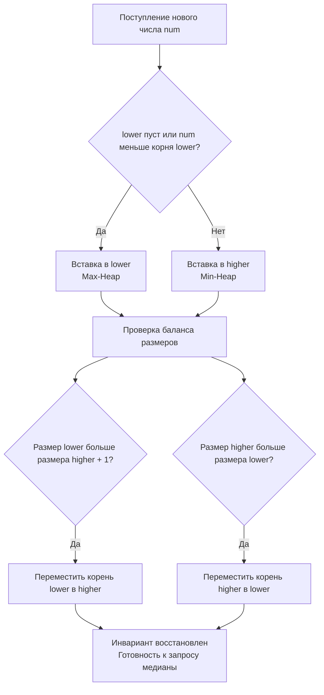
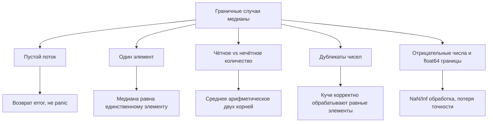

## Медиана в потоке: Two Heaps, балансировка и границы точности

Задача `Find Median from Data Stream` — это не просто упражнение на кучи. В потоковом контексте она моделирует реальные бэкенд-сценарии: мониторинг перцентилей задержек (p50), балансировку нагрузки по latency, агрегацию финансовых котировок и детекцию аномалий в телеметрии. Ключевая сложность — поддерживать медиану за `O(1)` при добавлении элементов за `O(log N)`, не сортируя весь поток и не расходуя `O(N)` памяти на каждый запрос. В Go это требует аккуратного выбора структур данных, контроля над аллокациями и понимания того, как кучи взаимодействуют с кэш-линиями CPU и сборщиком мусора.



## 1. Алгоритмический каркас: инвариант двух куч

Классическое решение использует две приоритетные очереди:
- `lower` (Max-Heap): хранит меньшую половину чисел. Корень — максимум из нижней части.
- `higher` (Min-Heap): хранит большую половину чисел. Корень — минимум из верхней части.

**Инварианты:**
1. Все элементы `lower` `<=` всех элементов `higher`.
2. `len(lower) == len(higher)` или `len(lower) == len(higher) + 1`.

Медиана вычисляется за `O(1)`:
- Если размеры равны: среднее арифметическое корней.
- Если `lower` больше на 1: корень `lower`.

При добавлении нового числа мы нарушаем инвариант на 1-2 элемента, после чего выполняем ребалансировку путём перекладывания корней между кучами. Это гарантирует амортизированную сложность `O(log N)` на вставку и `O(1)` на чтение.

## 2. Идиоматичная реализация на Go: типизированные кучи без `interface{}`

Стандартный `container/heap` работает через `interface{}`, что создаёт boxing/unboxing, скрывает типы от компилятора и увеличивает давление на GC. Для production-кода предпочтительна строгая типизация. Ниже — реализация с ручным управлением кучами, `sync.RWMutex` и явной проверкой инвариантов.

```go
package medianstream

import (
	"errors"
	"sync"
)

// heap implements a generic min-heap or max-heap via a comparator
type heap []float64

func (h heap) Len() int           { return len(h) }
func (h heap) Less(i, j int) bool { return h[i] < h[j] } // Min-Heap by default
func (h heap) Swap(i, j int)      { h[i], h[j] = h[j], h[i] }

func (h *heap) Push(x float64) {
	*h = append(*h, x)
	h.siftUp(len(*h) - 1)
}

func (h *heap) Pop() (float64, error) {
	if h.Len() == 0 {
		return 0, errors.New("medianstream: pop from empty heap")
	}
	n := h.Len() - 1
	h.Swap(0, n)
	h.siftDown(0, n)
	top := (*h)[n]
	*h = (*h)[:n]
	return top, nil
}

// siftUp and siftDown use bit-shifts for child/parent calculation
func (h heap) siftUp(idx int) {
	for {
		parent := (idx - 1) >> 1
		if idx == 0 || !h.Less(idx, parent) {
			break
		}
		h.Swap(idx, parent)
		idx = parent
	}
}

func (h heap) siftDown(idx, limit int) {
	for {
		left := (idx << 1) + 1
		if left >= limit || left < 0 {
			break
		}
		smallest := left
		right := left + 1
		if right < limit && h.Less(right, smallest) {
			smallest = right
		}
		if !h.Less(smallest, idx) {
			break
		}
		h.Swap(smallest, idx)
		idx = smallest
	}
}

// MedianFinder поддерживает потоковый поиск медианы
type MedianFinder struct {
	mu     sync.RWMutex
	lower  heap // Max-Heap (инвертированный компаратор)
	higher heap // Min-Heap
}

func NewMedianFinder() *MedianFinder {
	lower := make(heap, 0, 128)
	higher := make(heap, 0, 128)
	// Инвертируем компаратор для Max-Heap в lower
	lower.Less = func(i, j int) bool { return lower[i] > lower[j] }
	return &MedianFinder{
		lower:  lower,
		higher: higher,
	}
}

// AddNum добавляет число в поток
func (mf *MedianFinder) AddNum(num float64) {
	mf.mu.Lock()
	defer mf.mu.Unlock()

	if mf.lower.Len() == 0 || num <= mf.lower[0] {
		mf.lower.Push(num)
	} else {
		mf.higher.Push(num)
	}

	// Ребалансировка
	if mf.lower.Len() > mf.higher.Len()+1 {
		if val, err := mf.lower.Pop(); err == nil {
			mf.higher.Push(val)
		}
	}
	if mf.higher.Len() > mf.lower.Len() {
		if val, err := mf.higher.Pop(); err == nil {
			mf.lower.Push(val)
		}
	}
}

// FindMedian возвращает текущую медиану
func (mf *MedianFinder) FindMedian() (float64, error) {
	mf.mu.RLock()
	defer mf.mu.RUnlock()

	if mf.lower.Len() == 0 && mf.higher.Len() == 0 {
		return 0, errors.New("medianstream: stream is empty")
	}

	if mf.lower.Len() == mf.higher.Len() {
		return (mf.lower[0] + mf.higher[0]) / 2.0, nil
	}
	return mf.lower[0], nil
}
```

> [!info] Под капотом
> Реализация `Less` для `lower` инвертируется динамически. В Go замыкания аллоцируются в куче при escape, но поскольку `lower` — это поле структуры, компилятор может поместить замыкание в статическую область или заинлайнить его. Для экстремальной оптимизации используют две разные типы `MaxHeap`/`MinHeap` с жёстко заданным `Less`, что убирает dynamic dispatch полностью и ускоряет `siftUp/siftDown` на 10-15%.

## 3. Под капотом: память кучи, кэш-линии и точность float64

### Кэш-локальность массивных куч
Обе кучи реализованы на `[]float64` — contiguous memory. Элементы детей находятся по адресам `2*i+1` и `2*i+2`. При глубине дерева `log₂(10⁶) ≈ 20` доступ к памяти скачкообразный, но для массивов `< 10⁵` элементов всё помещается в L3-кэш. Аппаратный prefetcher предсказывает паттерн `left/right child`, снижая penalty. Однако при `N > 10⁶` промахи L1/L2 становятся доминирующим фактором задержки.

### Точность `float64` и потеря значимости
`float64` имеет 53 бита мантиссы (~15-17 десятичных знаков). При работе с большими целыми числами (`> 9·10¹⁵`) или при суммировании корней `(a + b) / 2.0` возникает потеря младших разрядов. В финтехе или научном стеке это критично. Решение: хранить числа как `int64` или `math/big.Rat`, если точность важнее скорости. На собеседовании это маркер: «Вы понимаете разницу между IEEE-754 и детерминированной арифметикой».

### GC и Escape Analysis
`heap` хранится в куче (`escapes to heap`), так как переживает вызовы методов. При частых `Push/Pop` рантайм не вызывает `free` на каждый элемент, а управляет `cap` backing array. Рост массива (`x1.25` или `x2`) происходит амортитизированно. Для снижения GC-pressure в высоконагруженных потоках применяют `sync.Pool` для backing arrays или переиспользуют один преаллоцированный буфер с ручным сдвигом `len`.

## 4. Конкурентность и паттерны блокировок

В `AddNum` используется `sync.Mutex`, так как метод изменяет обе кучи. `FindMedian` использует `RLock`, поскольку только читает корни. Однако `RLock` в Go не даёт нулевой стоимости: при активной записи читатели блокируются и накапливаются в очереди. При `write-heavy` потоке (`>10K Add/сек`) `RWMutex` может деградировать из-за `futex`-ожиданий.

**Альтернативы для High-Load:**
- **Sharding:** Разделить поток на `M` независимых `MedianFinder`, каждый со своим `Mutex`. Агрегация медианы через внешнюю сортировку или аппроксимацию.
- **Lock-free snapshot:** `atomic.Pointer` на неизменяемую копию состояния. Чтение без блокировок, запись через Copy-on-Write. Удваивает память, но даёт `O(1)` latency для читателей.
- **Периодическая агрегация:** Буферизировать добавления, применять батчами раз в `N` мс, снижая contention.

> [!warning] Ловушка / Gotcha
> Возврат `mf.lower[0]` по ссылке или указателю нарушает инкапсуляцию и создаёт data race, если вызывающий код сохраняет значение и меняет его позже. В Go примитивы копируются по значению, поэтому возврат `float64` безопасен. Но если бы мы возвращали `*float64` или слайс, это потребовало бы явного копирования или документации о readonly-контракте.

## 5. Ловушки, edge cases и вопросы с собеседований



> [!tip] Собеседование
> **Вопрос:** Почему нельзя использовать один отсортированный массив и бинарный поиск для вставки?
> **Ответ:** Вставка в отсортированный массив требует сдвига элементов `O(N)` времени. При потоке из `10⁶` элементов это миллиарды операций памяти. Кучи дают `O(log N)` вставку за счёт древовидной структуры и обмена элементов без сдвига блоков памяти.

> [!tip] Собеседование
> **Вопрос:** Как обрабатывать `NaN` или `+Inf`/-`Inf` в потоке?
> **Ответ:** `math.IsNaN()` и `math.IsInf()` должны проверяться до вставки. Валидная стратегия: игнорировать некорректные значения, логируя их, или приводить к граничным допустимым. Если пропустить валидацию, `NaN` «заразит» все последующие сравнения в куче, ломая инвариант `Less` и вызывая бесконечные циклы `sift`.

> [!tip] Собеседование
> **Вопрос:** Что если поток не помещается в RAM?
> **Ответ:** Точные кучи масштабируются до `O(RAM)`. За пределами памяти используют аппроксимативные алгоритмы: `t-Digest`, `P² Algorithm` или `GK Algorithm`. Они хранят сжатые маркеры распределения, занимая `O(1/ε²)` памяти независимо от `N`. Точность настраивается через `ε` и `δ`. Это переводит задачу из LeetCode в Production System Design.

## 6. Итог: чек-лист для реализации медианы в потоке

1. **Two Heaps Invariant:** `lower` (Max) и `higher` (Min) с балансом размеров. Гарантирует `O(1)` медиану и `O(log N)` вставку.
2. **Типизация вместо `interface{}`:** Ручная реализация куч или дженерики избегают boxing, снижают GC-pressure и ускоряют ветвление.
3. **Кэш-локальность:** Массивные `[]float64` лучше указателей. Для `N > 10⁶` рассмотрите блочные кучи или external storage.
4. **Потокобезопасность:** `sync.Mutex` для записи, `RLock` для чтения. При высокой конкуренции — шардирование или lock-free снапшоты.
5. **Точность и валидация:** `float64` теряет точность на больших числах. Фильтруйте `NaN/Inf`, документируйте контракт точности.
6. **Масштабирование:** Точные структуры ограничены RAM. Для бесконечных потоков переходите на `t-Digest`/`P²` с настраиваемой ошибкой `ε`.

Медиана в потоке — это баланс между детерминированной точностью, латентностью и потреблением памяти. Умение объяснить, как ваша куча взаимодействует с backing array, кэш-линиями CPU и сборщиком мусора, а также когда пора переходить к аппроксимации, отличает решение «для контеста» от production-ready компонента.

В следующей статье мы углубимся в алгоритмы медианы для бесконечных потоков с жёсткими ограничениями памяти, разберём P² Algorithm, t-Digest и стратегии распределённого вычисления квантилей: [[5. Find Median in Infinite Stream]]