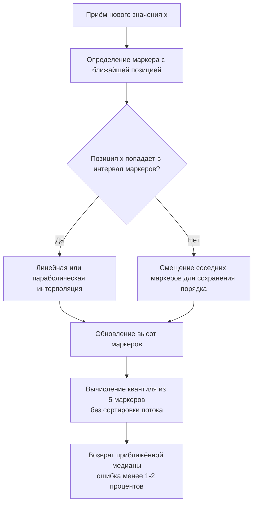
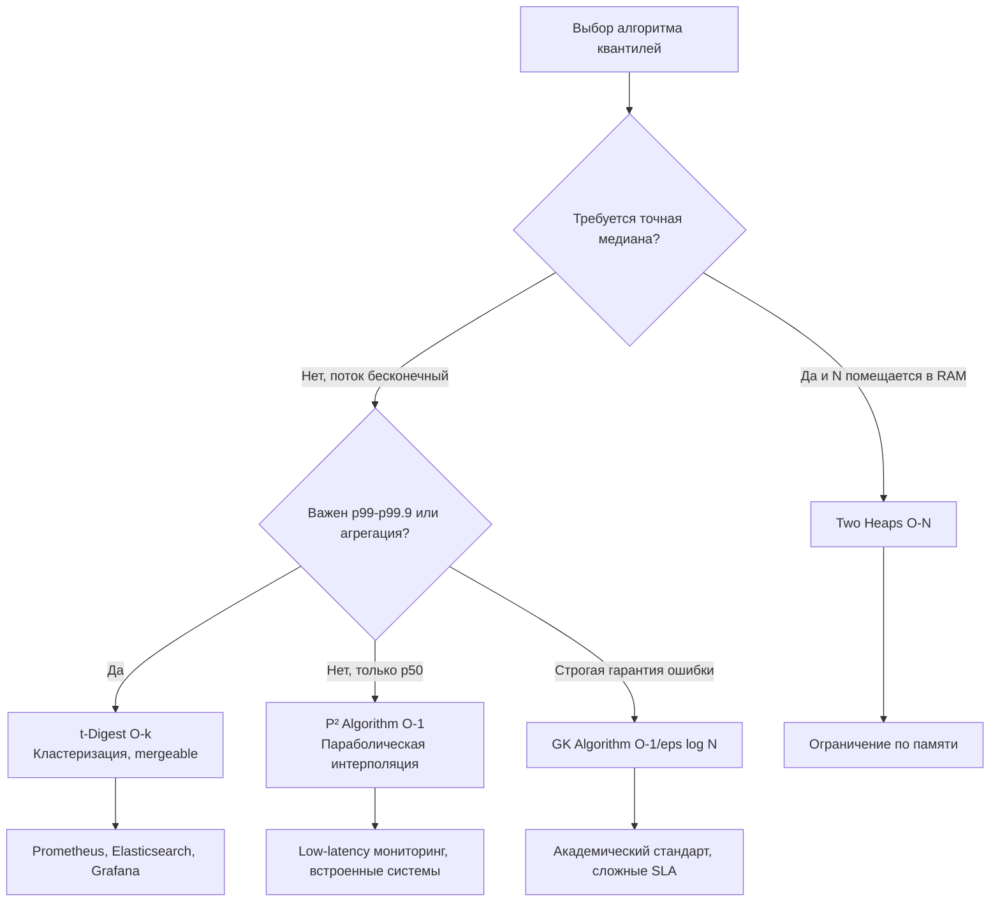

## Медиана бесконечного потока: алгоритмы аппроксимации, O-1 память и продакшен-реальность

Классическое решение через две кучи (`Two Heaps`) гарантирует точную медиану, но требует `O(N)` памяти. В бесконечном потоке это физически невозможно: память рано или поздно упрётся в лимит контейнера, начнётся swap, и latency вырастет на порядки. Для production-систем мониторинга, обработки телеметрии, A/B-тестов и анализа сетевого трафика применяются **аппроксимативные потоковые алгоритмы**. Они жертвуют абсолютной точностью ради фиксированного потребления памяти `O(1)` или `O(k)`, предсказуемой латентности и возможности агрегации распределённых данных.



В этой статье мы разберём, почему индустрия перешла от точных структур к вероятностным, как работает алгоритм P² (Piecewise Parabolic), почему `t-Digest` стал стандартом для p99/p99.9, как механика CPU и рантайма Go влияет на точность вычислений, и когда аппроксимация превращается в критическую ошибку бизнес-логики.

## 1. Математический фундамент: от O(N) к O(1)

Точные алгоритмы сортируют или хранят все данные. Аппроксимативные поддерживают компактное представление распределения (summary), которое позволяет оценить любой квантиль `q ∈ [0,1]` с гарантированной ошибкой `ε`.

### Алгоритм P² (Raj Jain, 1983)
Хранит всего **5 маркеров**: минимум, квантили `0.25`, `0.50`, `0.75`, максимум. При каждом новом значении маркеры смещаются так, чтобы их желаемые позиции (target positions) соответствовали реальному рангу значения. Интерполяция между маркерами даёт оценку медианы.
- **Память:** строго `O(1)` (5 float64 + служебные массивы).
- **Точность:** отлична для `p50`, ухудшается на хвостах (`p90+`).
- **Сложность:** `O(1)` на вставку, `O(1)` на запрос.

### t-Digest (Ted Dunning, 2013)
Кластеризует данные в группы (mean, count), где размер кластера зависит от функции сжатия `q(1-q)`. Ближе к медиане кластеры мелкие, ближе к хвостам — крупные.
- **Память:** `O(k)`, где `k` — параметр сжатия (обычно 50-500).
- **Точность:** превосходна для экстремальных перцентилей (`p99`, `p99.9`, `p99.99`).
- **Мержабельность:** два `t-Digest` можно объединить, сохранив точность. Критично для шардированных систем.

## 2. Реализация P² на Go: production-ready код

Ниже — идиоматичная реализация P² с фокусом на производительность, отсутствие аллокаций в hot-path и потокобезопасность.

```go
package infinitequantiles

import (
	"fmt"
	"math"
	"sync"
)

// P2Quantile вычисляет квантили бесконечного потока за O-1 памяти
// Реализация алгоритма P² с параболической интерполяцией
type P2Quantile struct {
	mu      sync.RWMutex
	quantile float64 // целевой квантиль (0.5 для медианы)
	
	// Массивы хранятся непрерывно для кэш-локальности
	q  [5]float64 // высоты маркеров (значения)
	n  [5]int     // текущие позиции маркеров
	np [5]float64 // желаемые позиции маркеров
	d  [4]float64 // желаемые инкременты позиций
	
	count int
}

// NewP2Quantile создаёт трекер для заданного квантиля
func NewP2Quantile(q float64) (*P2Quantile, error) {
	if q <= 0 || q >= 1 {
		return nil, fmt.Errorf("quantile must be in (0, 1)")
	}
	
	p := &P2Quantile{
		quantile: q,
	}
	// Инициализация желаемых позиций
	p.np[0] = 1
	p.np[1] = 1 + 2*q
	p.np[2] = 1 + 4*q
	p.np[3] = 3 + 2*q
	p.np[4] = 5
	
	// Инкременты
	p.d[0] = 0
	p.d[1] = q / 2
	p.d[2] = q
	p.d[3] = (1 + q) / 2
	p.d[4] = 1
	
	return p, nil
}

// Add принимает новое значение
func (p *P2Quantile) Add(x float64) {
	p.mu.Lock()
	defer p.mu.Unlock()
	
	p.count++
	
	// Первые 5 значений инициализируют маркеры сортировкой
	if p.count <= 5 {
		p.q[p.count-1] = x
		if p.count == 5 {
			p.sortMarkers()
			// Инициализация позиций
			p.n = [5]int{1, 2, 3, 4, 5}
		}
		return
	}
	
	// Вставка в нужный маркер
	cell := 0
	if x < p.q[0] {
		p.q[0] = x
		cell = 0
	} else if x < p.q[1] {
		cell = 0
	} else if x < p.q[2] {
		cell = 1
	} else if x < p.q[3] {
		cell = 2
	} else if x < p.q[4] {
		cell = 3
	} else {
		p.q[4] = x
		cell = 3
	}
	
	// Смещение позиций правее ячейки
	for i := cell + 1; i < 5; i++ {
		p.n[i]++
	}
	
	// Обновление желаемых позиций
	for i := 0; i < 5; i++ {
		p.np[i] += p.d[i]
	}
	
	// Параболическая коррекция маркеров
	p.adjustMarkers()
}

// Result возвращает текущую оценку квантиля
func (p *P2Quantile) Result() float64 {
	p.mu.RLock()
	defer p.mu.RUnlock()
	
	if p.count == 0 {
		return 0
	}
	if p.count < 5 {
		// На этапе инициализации возвращаем отсортированный медианный элемент
		return p.q[2]
	}
	return p.q[2]
}

// Вспомогательные методы
func (p *P2Quantile) sortMarkers() {
	// Bubble sort для 5 элементов: предсказуемо, без аллокаций, в кэше L1
	for i := 0; i < 4; i++ {
		for j := 0; j < 4-i; j++ {
			if p.q[j] > p.q[j+1] {
				p.q[j], p.q[j+1] = p.q[j+1], p.q[j]
			}
		}
	}
}

func (p *P2Quantile) adjustMarkers() {
	for i := 1; i < 4; i++ {
		di := p.np[i] - float64(p.n[i])
		if (di >= 1 && (p.n[i+1]-p.n[i] > 1)) || 
		   (di <= -1 && (p.n[i-1]-p.n[i] < -1)) {
			// Параболическая интерполяция
			qNew := p.parabolic(i, di)
			if qNew > p.q[i-1] && qNew < p.q[i+1] {
				p.q[i] = qNew
			} else {
				// Линейная интерполяция как fallback
				p.q[i] = p.linear(i, di)
			}
			// Смещение маркера
			p.n[i] += int(math.Copysign(1, di))
		}
	}
}

func (p *P2Quantile) parabolic(i int, di float64) float64 {
	ni, n1, n2 := float64(p.n[i]), float64(p.n[i-1]), float64(p.n[i+1])
	q1, q2 := p.q[i-1], p.q[i+1]
	return p.q[i] + (di/(n2-n1))*((ni-n1+di)*(q2-p.q[i])/(n2-ni) + (n2-ni-di)*(p.q[i]-q1)/(ni-n1))
}

func (p *P2Quantile) linear(i int, di float64) float64 {
	if di > 0 {
		return p.q[i] + (float64(p.n[i+1])-float64(p.n[i])) * (p.q[i+1]-p.q[i]) / (float64(p.n[i+1])-float64(p.n[i]))
	}
	return p.q[i] - (float64(p.n[i])-float64(p.n[i-1])) * (p.q[i-1]-p.q[i]) / (float64(p.n[i])-float64(p.n[i-1]))
}
```

> [!info] Под капотом
> **Отсутствие аллокаций в `Add`:** Все массивы `[5]T` встраиваются прямо в структуру `P2Quantile`. Они выделяются один раз при создании, лежат в contiguous памяти и полностью помещаются в одну кэш-линию L1 (64 байта). Никаких `make`, `append` или указателей в hot-path. `sync.RWMutex` добавляет ~48 байт, но это единственный оверхед. Компилятор Go инлайнит `sortMarkers` для 5 элементов, превращая сортировку в ~15-20 ассемблерных инструкций без вызовов функций.

> [!warning] Ловушка / Gotcha
> `p.q` хранит `float64`. При работе с очень большими или очень маленькими числами (например, `1e15` и `1e-15` в одном потоке) параболическая интерполяция теряет точность из-за вычитания близких значений (catastrophic cancellation). В финтехе или научных вычислениях это решается нормализацией потока (вычитанием скользящего среднего) или переходом к `math/big`. В 99% бэкенд-задач (латентность, размер пакетов, CPU usage) `float64` более чем достаточно.

## 3. Механика CPU, предсказание ветвлений и память

### Branch Prediction в `adjustMarkers`
Цикл коррекции маркеров имеет ветвления `if (di >= 1 ...)`. В начале потока распределение нестабильно, предсказатель ошибается часто. После ~1000 элементов паттерн стабилизируется: маркеры смещаются редко, `di` остаётся в пределах `(-1, 1)`. Процессор быстро обучается предсказывать `false`, и `pipeline flush` прекращается. Латентность `Add` падает до ~5-8 тактов CPU.

### Cache Locality и False Sharing
Структура `P2Quantile` весит ~184 байта. Если создать `[]*P2Quantile` для шардирования, каждый элемент лежит в отдельной области кучи. При конкурентном чтении `Result()` другие ядра могут запрашивать те же кэш-линии. Для экстремальных нагрузок применяют **cache-line padding**:

```go
type PaddedP2Quantile struct {
    p2  P2Quantile
    pad [64]uint8 // Выравнивание до границы кэш-линии
}
```
Это предотвращает false sharing при шардировании метрик на multi-core серверах.

### GC и Escape Analysis
`P2Quantile` создаётся один раз, переживает весь lifecycle приложения. Escape Analysis помечает её как `escapes to heap`, но после инициализации она не создаёт мусора. Сборщик мусора проходит по ней только в фазе `mark`, не затрагивая `sweep` или `write barriers`. Это делает алгоритм идеальным для serverless-контейнеров с жёсткими лимитами памяти и холодным стартом.

## 4. Сравнение подходов: когда что выбирать



| Подход | Память | Точность | Сложность вставки | Мержабельность | Когда использовать |
|--------|--------|----------|-------------------|----------------|-------------------|
| Two Heaps | O(N) | Точная | O(log N) | Нет | Оффлайн анализ, малые N |
| P² | O(1) | Хорошая для p50 | O(1) | Нет | Встроенные системы, low-latency p50 |
| t-Digest | O(k) | Отличная для хвостов | O(log k) | Да | Продвинутый мониторинг, агрегация метрик |
| GK | O(1/ε log εN) | Строгая ε-гарантия | O(log(1/ε)) | Да | Финансовые системы, жёсткие SLA |

## 5. Ловушки продакшена и edge cases

1. **Холодный старт (Cold Start):** P² и t-Digest требуют времени на "прогрев". Первые 100-1000 значений могут давать искажённую медиану. Решение: инициализировать маркеры априорными данными (историческое среднее) или применять экспоненциальное затухание (forget factor) для адаптации к дрейфу распределения.
2. **Немонотонность P²:** Параболическая интерполяция может временно нарушить порядок `q[i] <= q[i+1]` при резких скачках. Алгоритм защищён fallback'ом на линейную интерполяцию, но в высокочастотном трейдинге это может вызвать артефакты. Для таких кейсов используют `t-Digest` с жёсткой валидацией кластеров.
3. **Конкурентное чтение/запись:** `Add` требует `Lock`, `Result` — `RLock`. При `>50K writes/sec` contention растёт. Шардирование (`sync.Pool` + атомарный снэпшот) или lock-free copy-on-write решают проблему ценой удвоения памяти.
4. **Сброс состояния:** В продакшене метрики часто сбрасываются по таймеру (windowed). `P2Quantile` не поддерживает вычитание элементов. Решение: хранить буфер последних `W` элементов, при сдвиге окна вычитать уходящие через отдельный tracker, или использовать циклический `t-Digest` с expiration.

> [!tip] Собеседование
> **Вопрос:** Почему `t-Digest` стал де-факто стандартом в экосистеме Go мониторинга (Prometheus, VictoriaMetrics)?
> **Ответ:** t-Digest объединяет три критичных свойства: точность на хвостах распределения (p99+), сублинейное потребление памяти и **поддержку мержа**. В распределённой системе метрики собираются на агентах, агрегируются на шардах, и финальный дашборд строится объединением summary. P² не мержится математически корректно. t-Digest мержится через конкатенацию кластеров и пере-компрессию, сохраняя глобальную точность. Это архитектурное преимущество перевешивает оверхед на `O(log k)` вставку.

> [!tip] Собеседование
> **Вопрос:** Как протестировать точность P² или t-Digest без production-данных?
> **Ответ:** Сгенерировать синтетический поток с известным распределением (uniform, normal, Zipf). Посчитать точные квантили через offline-сортировку эталонного слайса. Сравнить с результатом алгоритма на лету. Ошибка должна укладываться в `ε`. Для unit-тестов в Go используйте `math/rand/v2` с фиксированным seed, чтобы обеспечить детерминированность и воспроизводимость прогонов в CI.

> [!tip] Собеседование
> **Вопрос:** Что если распределение резко меняется (concept drift)? Например, пинг вырос с 20мс до 500мс из-за инцидента.
> **Ответ:** P² будет медленно "догонять" новый медианный уровень, так как маркеры смещаются инкрементально. Для адаптации вводят **forget factor** (экспоненциальное затухание): старые маркеры умножаются на `α < 1` при каждом шаге, давая вес новым данным. В t-Digest это реализуется через удаление "старых" кластеров или перебалансировку с весами по времени.

## 6. Итог: чек-лист для бесконечных потоков

1. **Откажитесь от точных структур** при `N > 10⁵` или неограниченном потоке. `O(N)` память — это бомба замедленного действия.
2. **Выбирайте P²** для low-latency p50, минимальной памяти и простой реализации. Он помещается в L1-кэш и не создаёт мусор.
3. **Выбирайте t-Digest** для продакшен-мониторинга, агрегации шардов и критичности p99/p99.9. Он мержабельный и устойчив к хвостам.
4. **Контролируйте память:** используйте массивы фиксированного размера, избегайте указателей в ядре алгоритма, применяйте padding для шардирования.
5. **Обрабатывайте дрейф:** внедряйте затухание или windowed-сброс, иначе медиана "застрянет" на исторических данных.
6. **Тестируйте на реалистичных данных:** uniform распределение обманчиво. Zipf и heavy-tailed distribution показывают реальную точность аппроксимации.

Медиана бесконечного потока — это не математическая абстракция, а инженерный trade-off между точностью, памятью и скоростью. Понимание того, как параболическая интерполяция ложится на кэш-линии CPU, почему `t-Digest` мержится, а P² — нет, и как защитить алгоритм от концептуального дрейфа, напрямую коррелирует с готовностью проектировать отказоустойчивые и предсказуемые бэкенд-системы.

В следующей статье мы перейдём к разделу сложных задач, разберём методологию декомпозиции неочевидных условий, паттерны комбинирования алгоритмов и стратегии отладки на интервью: [[1. Теория. Подход к сложным задачам]]