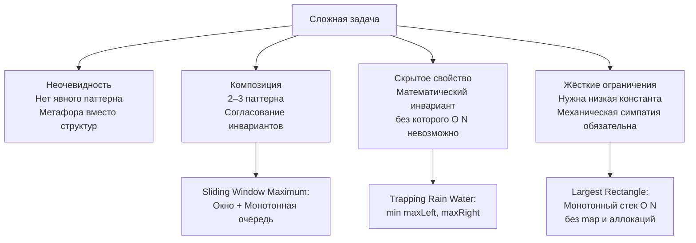
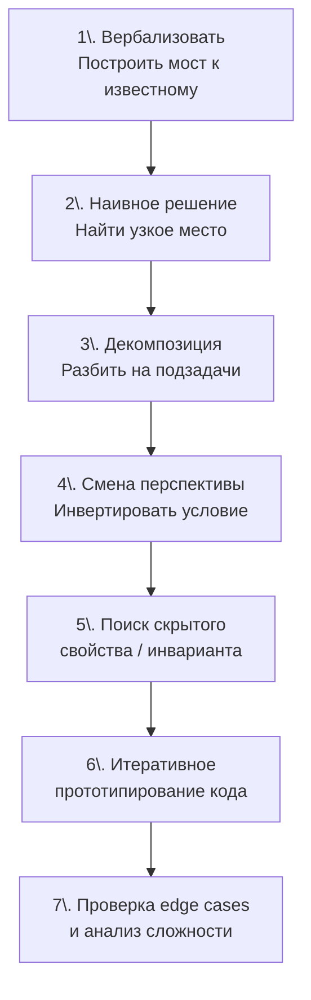

Вы прошли через всё: массивы, строки, два указателя, скользящее окно, префиксные суммы, деревья, графы, кучи, DP. Вы научились распознавать паттерны ([[4. Как распознавать паттерн в задаче]]), комбинировать их ([[12. Как комбинировать алгоритмические паттерны]]) и даже выходить из тупика, когда решение не приходит ([[13. Когда решение задачи не очевидно]]). Но есть задачи, которые всё равно заставляют сердце биться чаще, а ум — замирать в растерянности. Задачи, где условие короче твита, а решение требует двухэтапной композиции, нестандартного инварианта и филигранной работы с памятью. Это и есть **сложные задачи**.

В этом кластере собраны именно они: Trapping Rain Water, Merge K Sorted Lists, Largest Rectangle in Histogram, Sliding Window Maximum, Serialize and Deserialize Binary Tree. Каждая — вершина своего жанра. Каждая — частый гость на собеседованиях уровня Senior и Lead. И каждая требует **не просто знаний, а методологии**.

В этой статье мы сформируем эту методологию. Не набор разрозненных трюков, а целостный подход к штурму незнакомой Hard-задачи, который вы сможете применить и на собеседовании, и в production-коде, когда очередная архитектурная проблема покажется неприступной. Мы разберём, что именно делает задачу сложной, какой ментальный алгоритм применять для её декомпозиции, как механическая симпатия Go-разработчика помогает находить оптимальное решение, и проиллюстрируем это на классике — Trapping Rain Water.

### Что именно делает задачу «сложной»

Сложность не бинарна. Она многомерна. Задача классифицируется как Hard не потому, что её никто не может решить, а потому, что для её решения требуется совместить несколько навыков, которые редко тренируются вместе.

**1. Неочевидность первого шага.**
Вы читаете условие и не видите ни одного знакомого паттерна. Нет ни сортировки, ни явного дерева, ни запроса на поиск пары. Классический пример: Trapping Rain Water. При чём здесь массивы? Где тут окно? Как вообще формализовать «воду»? Первый барьер — перевод физической метафоры на язык структур данных и инвариантов.

**2. Обязательная композиция паттернов.**
Простые задачи решаются одним паттерном (два указателя, скользящее окно). Сложные требуют собрать решение из нескольких кирпичиков, согласовав их инварианты. Merge K Sorted Lists — это одновременно «куча» и «слияние отсортированных списков». Sliding Window Maximum — «скользящее окно» и «монотонная очередь». Ошибка в одном кирпичике рушит всё здание.

**3. Скрытое свойство, без которого задача не решается оптимально.**
Иногда ключ к O(N) лежит в математическом факте, который нужно увидеть. В Largest Rectangle in Histogram — это свойство монотонного стека «ограничивать прямоугольник ближайшим меньшим элементом». В Trapping Rain Water — «уровень воды над столбцом определяется минимумом из максимумов слева и справа». Пока вы не осознали это свойство, вы обречены на брутфорс.

**4. Жёсткие ограничения, требующие асимптотически оптимального решения с низкой константой.**
O(N²) не проходит, O(N log N) может быть на грани, нужно O(N) с O(1) памяти. Именно здесь механическая симпатия ([[10. Связь структур данных и алгоритмов]]) превращается из теоретического бонуса в необходимость: не просто «выбрать map или массив», а понять, что массив `[26]int` на стеке сэкономит и такты, и память, и предотвратит GC-паузу, которая добьёт ваш Accepted.

### Системный подход: алгоритм штурма сложной задачи

Когда вы сталкиваетесь с Hard-задачей на собеседовании, ваша главная цель — не выдать готовое решение за 30 секунд, а **показать, как вы к нему идёте**. Следующий алгоритм — расширение базового из [[5. Алгоритм решения задачи на интервью]] — специально адаптирован для задач высокой сложности.

**Шаг 1. Вербализуйте непонимание и постройте мост к известному.**
Не молчите. Скажите: «Задача выглядит как работа с массивом, но я пока не вижу, можно ли здесь применить скользящее окно или два указателя. Давайте я начну с формулировки того, что именно нужно вычислить, на простом примере». Нарисуйте пример на доске (мысленно или реально). Для Trapping Rain Water: нарисуйте столбцы, покажите, где вода. Это запустит процесс анализа.

**Шаг 2. Напишите или проговорите наивное решение.**
Брутфорс — не враг, а фундамент ([[15. Наивное решение и его анализ]]). «Для каждого столбца я могу найти максимум слева и справа, уровень воды будет `min(maxLeft, maxRight) - height[i]`. Это O(N²). Что здесь самое медленное? Повторный поиск максимумов». Именно из этого анализа родятся оптимизации: предподсчёт, два указателя, стек.

**Шаг 3. Декомпозируйте задачу на подзадачи.**
Спросите себя: из каких этапов состоит решение? Могу ли я сначала сделать что-то одно, а потом другое?
- *Merge K Sorted Lists:* сначала слить два списка, потом применить «разделяй и властвуй» или кучу.
- *Serialize and Deserialize Binary Tree:* сериализация — это обход дерева; десериализация — восстановление по строке. Два отдельных действия, каждое из которых ложится на известный паттерн (BFS/DFS).

**Шаг 4. Попробуйте сменить перспективу.**
Если «в лоб» не идёт, инвертируйте:
- Вместо «сколько воды над каждым столбцом» → «чем ограничена вода?» (максимумы слева и справа).
- Вместо «найти максимальный прямоугольник» → «для каждого столбца найти первый меньший слева и справа».
- Вместо «сложить все элементы» → «посмотреть, как результат выражается через результат меньшего массива» (Divide and Conquer).
Смена угла атаки — признак гибкого ума ([[13. Когда решение задачи не очевидно]]).

**Шаг 5. Ищите скрытый инвариант или свойство.**
Задайте себе вопросы:
- Есть ли здесь **монотонность**? (Если есть — стек, очередь, два указателя).
- Можно ли что-то **предподсчитать**? (Префиксные/суффиксные максимумы, суммы).
- Есть ли **симметрия**? (Проверка с двух концов, зеркальные структуры).
- Можно ли задачу свести к задаче **меньшего размера**? (DP, Divide and Conquer, рекурсивное сведение kSum к 2Sum).

**Шаг 6. Прототипируйте в коде итеративно.**
Напишите сначала каркас: основную функцию с комментариями «здесь будет поиск максимумов», «здесь — слияние». Затем заполняйте деталями, проверяя инварианты на каждом этапе. Не пытайтесь сразу написать финальный идеальный код.

**Шаг 7. Пройдите ручную трассировку на edge cases.**
Сложные задачи славятся крайними случаями: пустой ввод, один элемент, все элементы одинаковые, максимальные значения, отрицательные числа. Проверьте их до того, как объявить «Готово» ([[19. Edge cases и corner cases]]).

### Иллюстрация: Trapping Rain Water как модель сложной задачи

Разберём кратко, как эта методология применяется к классике — Trapping Rain Water (полный разбор будет в [[3. Trapping Rain Water]]).

**Условие:** массив высот столбцов. Сколько воды задержится после дождя?

**Шаг 1.** Не вижу паттерна. Вода — это пространство между столбцами. Формализую: вода над столбцом `i` существует, если есть более высокие столбцы слева и справа. Уровень воды = `min(макс_слева, макс_справа) - height[i]`.

**Шаг 2.** Брутфорс: для каждого `i` найти `maxLeft` и `maxRight` линейным проходом. O(N²). Узкое место — повторный поиск.

**Шаг 3.** Декомпозиция: могу ли я предподсчитать все `maxLeft` и `maxRight`? Да, массивы `leftMax` и `rightMax` за O(N). Память O(N). Решение уже работает.

**Шаг 4.** Смена перспективы: можно ли без дополнительных массивов? Да, если идти двумя указателями с краёв, поддерживая текущий `leftMax` и `rightMax`. Инвариант: если `leftMax < rightMax`, то уровень воды для левого указателя гарантированно определяется `leftMax`, потому что где-то справа есть столб выше `leftMax`. O(1) память!

**Шаг 5.** Скрытое свойство: высота воды не может превысить `min(leftMax, rightMax)`. Это геометрический факт.

**Шаг 6.** Пишем каркас: `for left < right`, `if leftMax < rightMax ... else ...`. Добавляем арифметику объёма воды.

**Шаг 7.** Проверяем: пустой массив (0), один столбец (0), все столбцы равны (0), лесенка вверх-вниз — считаем мысленно.

Вот так незнакомая Hard-задача раскладывается на знакомые этапы.

### Механическая симпатия в сложных задачах: когда Big O недостаточно

В сложных задачах выбор структуры данных — это не деталь, а ключ к успеху. Senior Go-разработчик понимает:

- **Массив против map.** В Largest Rectangle in Histogram стек хранит индексы. Это слайс `[]int` — непрерывная память, никаких указателей. Если бы вы использовали связный список или map для хранения границ, вы бы добавили pointer chasing и потенциально убили производительность.
- **Слайс как deque.** В Sliding Window Maximum мы используем `deque := make([]int, 0, k)` — единственная аллокация, никакого `container/list`, который аллоцирует элементы по одному и возвращает `interface{}`.
- **Рекурсия против итерации.** В Serialize and Deserialize Binary Tree рекурсивный DFS может быть элегантен, но для очень глубокого дерева стек горутины начнёт расти и копироваться. Итеративный BFS/DFS с собственным стеком на слайсе даёт полный контроль.
- **Преаллокация слайсов.** В Merge K Sorted Lists вы не знаете точного размера результирующего списка, но если вы используете слайс для хранения указателей на узлы, предвыделите `make([]*ListNode, 0, totalNodes)`, чтобы избежать переаллокаций.

> [!info] Под капотом
> Когда вы используете `container/heap` для Merge K Sorted Lists, куча работает поверх слайса `[]*ListNode`. Операции sift-up и sift-down — это перестановки в непрерывном массиве указателей, что дружественно кэшу. Если бы вы реализовали кучу на указателях (как в C `struct heap_node *left, *right`), каждое просеивание превратилось бы в pointer chasing с массой cache miss. В Go даже структуры данных «из коробки» спроектированы с оглядкой на производительность.

### Go-специфичные приёмы для сложных задач

1. **Использование `sort.Search` для бинарного поиска.** В задачах, где нужно найти границу по предикату, `sort.Search` — идиоматичный и быстрый выбор.
2. **Слайс как универсальный строительный блок.** Стек, очередь, дек, куча, даже временный буфер для строк — всё это слайсы. Не изобретайте велосипед, используйте `make` и `append`.
3. **Переиспользование слайсов.** В сложных циклах, где вы многократно создаёте временные слайсы (например, при обходе уровней дерева), можно вынести слайс наружу и сбрасывать длину до нуля (`s = s[:0]`), избегая аллокаций.
4. **Осторожное копирование больших структур.** При работе со слайсами структур используйте индексный доступ вместо `range`, чтобы избежать копирования значений на каждой итерации.
5. **Уточнение nil и пустого слайса.** Возвращая результат из функции, Senior всегда осознаёт разницу между `nil` и `[]int{}`. В сложных задачах это часто проверяется.

### Заключение

Сложные задачи — это не врождённый талант, а навык, воспитываемый методологией. Системный подход, декомпозиция, смена перспективы и механическая симпатия превращают гору из «непонятно» в последовательность преодолимых шагов. Каждая задача в этом кластере — тренажёр для этого навыка. Освоив их, вы не только сдадите любое алгоритмическое собеседование, но и разовьёте инженерное мышление, которое останется с вами на всю карьеру.

Теперь переходим к первой вершине — **Trapping Rain Water**, где два указателя и скрытый геометрический инвариант покажут, как O(N²) превращается в O(N) с O(1) памяти. [[3. Trapping Rain Water]]