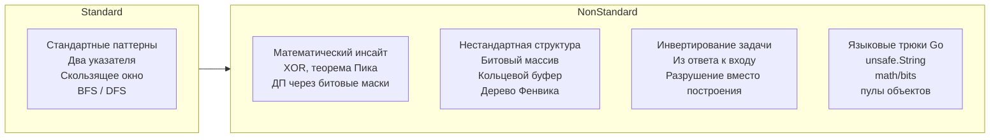

В предыдущей статье [[1. Теория. Подход к сложным задачам]] мы вооружились системной методологией штурма Hard-задач: декомпозиция, смена перспективы, поиск скрытого инварианта. Но есть класс задач, где даже эта методология буксует — или, точнее, приводит к решению, которое работает, но не оптимально, или выглядит громоздко. Именно здесь в игру вступают **нестандартные решения** — те самые ходы, которые на code review вызывают возглас «как ты до этого додумался?».

Нестандартное решение — это не магия и не врождённая гениальность. Это **умение выйти за пределы изученных паттернов**, применив математический инсайт, неожиданную структуру данных или специфичную возможность языка. На собеседовании Senior-уровня такое решение отделяет кандидата, который «натаскан на задачи», от инженера, который действительно понимает, как работает код на всех уровнях — от Big O до кэш-линий процессора.

В этой статье мы разберём, что делает решение нестандартным, какие универсальные техники помогают их находить, как Go-специфика открывает возможности, недоступные в других языках, и как тренировать этот навык, не превращаясь в коллекционера трюков.

### Что такое «нестандартное решение» и почему оно нужно

**Нестандартное решение** — это такой подход к задаче, который:
1. Не укладывается в один из 15 базовых алгоритмических паттернов ([[3. Паттерны вместо запоминания решений]]);
2. Использует неочевидное свойство данных, математическую теорему или низкоуровневую оптимизацию;
3. Часто работает за асимптотически оптимальное время, но с неожиданно малой константой или памятью.

Зачем они нужны на собеседовании? Интервьюер, задавая Hard-задачу, часто ожидает не просто «работающий Accepted», а **демонстрацию глубины**. Если вы решаете Trapping Rain Water через предподсчёт максимумов O(N) с O(N) памяти — это Middle. Если вы предлагаете решение с двумя указателями и O(1) памяти, объясняя геометрический инвариант — это Senior. Если вы вдобавок упоминаете, как работает branch predictor в этом цикле — это Staff.



### Тип 1: Математический инсайт — когда формула заменяет алгоритм

Иногда задача, выглядящая как переборная, сводится к математической формуле, известной теореме или алгебраическому свойству.

**Пример 1: Single Number (LeetCode 136).** Задача: найти единственный элемент в массиве, встречающийся один раз, когда все остальные встречаются дважды. Стандартное решение — map за O(N) памяти. Нестандартное — XOR. Свойство `a ^ a = 0`, `a ^ 0 = a`, коммутативность и ассоциативность XOR позволяют за O(N) времени и O(1) памяти получить ответ.

```go
func singleNumber(nums []int) int {
    result := 0
    for _, v := range nums {
        result ^= v
    }
    return result
}
```

**Пример 2: Missing Number (LeetCode 268).** Найти пропущенное число в диапазоне 0..N. Стандартно — сумма арифметической прогрессии минус сумма массива (O(N), O(1)). Нестандартно — XOR всех индексов и всех элементов: `0..N ^ nums[0] ^ nums[1]...`. Двойное применение свойства XOR.

**Пример 3: Trapping Rain Water.** Геометрический инсайт: «уровень воды над столбцом равен `min(maxLeft, maxRight) - height[i]`» не очевиден, если вы не нарисовали картинку. Без этого инсайта задача не решается оптимально.

Математические инсайты тренируются чтением разборов и самостоятельным выведением формул. Senior-разработчик, столкнувшись с задачей, спрашивает себя: «Есть ли здесь алгебраическое свойство, которое я могу эксплуатировать?» и проверяет на маленьких примерах.

### Тип 2: Нестандартная структура данных — когда стандартной библиотеки недостаточно

В стандартной библиотеке Go нет красно-чёрных деревьев, нет встроенной PriorityQueue (только `container/heap`), нет битовых массивов. Но иногда именно такая структура даёт оптимальное решение, и Senior способен её спроектировать за 10 минут.

**Пример: LRU Cache (LeetCode 146).** Стандартный подход — `container/list` + `map`. Нестандартный — собственный двусвязный список на `*Node`, избегающий `interface{}` и аллокаций боксинга.

```go
type Node struct {
    key, value int
    prev, next *Node
}
```

Такой подход не просто быстрее — он демонстрирует понимание того, как работает память и GC в Go.

**Пример: Median Finder (LeetCode 295).** Стандартно — две кучи (`container/heap`). Нестандартно — можно поддерживать отсортированный слайс и вставлять бинарным поиском (O(log N) на поиск + O(N) на вставку). Но Senior предложит сбалансированное дерево поиска, если бы оно было в stdlib, и объяснит trade-off.

**Пример: Sliding Window Maximum.** Монотонная очередь на слайсе — фактически ручная реализация дека с инвариантом. Использование слайса для этого — нестандартный для новичков, но стандартный для Senior ход, потому что он обеспечивает непрерывность памяти и отсутствие аллокаций.

### Тип 3: Инвертирование задачи — «от ответа к входу»

Некоторые задачи становятся проще, если попытаться идти не от входа к выходу, а наоборот.

**Пример: Merge Sorted Array (LeetCode 88).** Вместо слияния с начала (требующего сдвигов) — слияние **с конца**. Это инвертирование порядка заполнения позволяет выполнить слияние in-place без дополнительной памяти.

**Пример: Serialize and Deserialize Binary Tree (LeetCode 297).** Вместо того чтобы пытаться восстановить дерево по неоднозначному inorder-обходу, используют preorder с маркерами null, что делает десериализацию рекурсивной и однозначной. Инвертирование: не «как хранить структуру», а «как передать достаточно информации для однозначного восстановления».

**Пример: 3Sum.** Вместо поиска троек «в лоб» — фиксируем один элемент и сводим к 2Sum с двумя указателями. Это инвертирование размерности задачи: из трёхмерного пространства в два прохода по одномерному.

Техника инвертирования универсальна: спросите себя, «могу ли я построить ответ, начиная с конца?», «могу ли я свести задачу поиска X к задаче проверки X на валидность?» (бинарый поиск по ответу).

### Тип 4: Языковые трюки Go — когда знание рантайма даёт преимущество

В отличие от Python или Java, Go предоставляет уникальные низкоуровневые возможности, которые в умелых руках превращают O(N) в O(N) с микроскопической константой.

**1. `math/bits` для битовых операций.**
Пакет `math/bits` предоставляет аппаратно-ускоренные операции: `bits.OnesCount`, `bits.TrailingZeros`, `bits.Len`. В задачах на битовые маски, подсчёт единичных битов, операции с флагами — их использование не только сокращает код, но и делает его быстрее самописных циклов.

```go
import "math/bits"
count := bits.OnesCount(uint(x))
```

**2. `unsafe.String` и `unsafe.Slice` для zero-copy операций.**
В задачах на строки, где требуется максимальная производительность, Senior может упомянуть (и применить с осторожностью) `unsafe.String` для создания строки из `[]byte` без копирования, или `unsafe.Slice` для получения слайса из указателя. На собеседовании это нужно делать с явным обоснованием: «Здесь я избегаю аллокации, потому что исходный буфер гарантированно не изменится».

**3. Пулы объектов (`sync.Pool`).**
В задачах с интенсивным созданием и удалением временных объектов (например, при построении дерева разбора, сериализации) можно использовать `sync.Pool` для переиспользования буферов, снижая давление на GC. На LeetCode это редко нужно, но упоминание показывает Senior-уровень.

**4. Массивы фиксированного размера вместо map.**
Этот трюк мы неоднократно разбирали ([[10. Связь структур данных и алгоритмов]]), но он остаётся краеугольным камнем Go-оптимизации. `[26]int` или `[128]int` на стеке — это не просто «чуть быстрее», а на порядки быстрее map в горячих циклах.

**5. Срезы с ёмкостью для избежания аллокаций.**
`deque := make([]int, 0, k)` в Sliding Window Maximum — это не просто идиома, а осознанное проектирование: мы знаем максимальную вместимость, исключаем переаллокации и получаем предсказуемую производительность.

> [!warning] Ловушка / Gotcha
> Использование `unsafe` на собеседовании без запроса интервьюера может быть воспринято как overkill. Senior подаст это так: «В production-коде я бы рассмотрел `unsafe.String` для исключения копирования, но здесь, для читаемости, оставлю стандартное преобразование». Это показывает знание без фанатизма.

### Система поиска нестандартного решения

Когда стандартные паттерны исчерпаны, а задача не поддаётся, запустите этот процесс:

1. **Сформулируйте узкое место.** Что именно медленно или занимает много памяти? «Я слишком много раз пробегаю по массиву для поиска максимумов», «Я аллоцирую новый слайс на каждой итерации».

2. **Спросите: «Можно ли это посчитать за O(1) или O(log N)?»** Часто ответ — предподсчитать, использовать другую структуру или математический трюк.

3. **Проверьте «коллекцию нестандартных идей».** Держите в голове список: XOR для чётности, бинарный поиск по ответу, два указателя с конца, монотонный стек, переиспользование слайса (`s = s[:0]`), замена map на массив, кольцевой буфер, битовые маски вместо множества.

4. **Нарисуйте данные.** Визуализация массива, дерева или графа на доске часто открывает геометрические или структурные свойства, невидные в коде.

5. **Попробуйте решить задачу для N=5 вручную.** Выписывая промежуточные значения, можно заметить закономерность, которая станет ключом к алгоритму.

6. **Спросите: «А что если я буду строить ответ неправильно, а потом исправлю?»** Иногда жадный алгоритм с последующей корректировкой даёт нестандартное, но работающее решение.

### Нестандартное решение как сигнал Senior-уровня

На собеседовании нестандартное решение должно быть подано правильно. Алгоритм:
1. Предложите стандартное решение, покажите, что вы его знаете.
2. Укажите его ограничения (память, время, константа).
3. Предложите нестандартную оптимизацию, объяснив, **почему** она работает (инвариант, математическое свойство).
4. Обсудите trade-off: часто нестандартное решение менее читаемо, и Senior обязан взвесить производительность против поддерживаемости.

> [!tip] Собеседование
> Вопрос: «Можно ли решить задачу поиска дубликатов за O(N) без дополнительной памяти, если разрешено изменять массив?»
> Ответ: «Да, используя знак элемента как флаг: для каждого `x` я перехожу по индексу `abs(x)` и меняю знак. Это нестандартно, экономит память, но разрушает исходные данные. В production я бы обсудил с командой допустимость модификации входа».

### Тренировка нестандартного мышления

Невозможно выучить все трюки. Но можно развить чутьё:
- **Решайте задачи без тегов.** Отключите темы на LeetCode, чтобы не знать, какой паттерн применить.
- **Ищите несколько решений для одной задачи.** Для каждой задачи, которую вы решили, найдите ещё минимум два подхода (в том числе неоптимальных).
- **Читайте разборы, обращая внимание на «почему».** Не копируйте код, а пересказывайте идею своими словами.
- **Экспериментируйте с Go.** Попробуйте заменить map на массив, слайс на кольцевой буфер, рекурсию на итерацию — и замерьте время бенчмарком.

### Заключение

Нестандартные решения — это вершина инженерного мастерства, где алгоритмы встречаются с математикой, структурами данных и знанием рантайма. Они не возникают из ниоткуда; они — результат системного анализа, коллекции идей и готовности выйти за рамки заученного. В Go-экосистеме, с её минимализмом и производительностью, нестандартные ходы часто оказываются наиболее элегантными и естественными.

Теперь мы готовы к штурму самих задач. Первая — **Trapping Rain Water** — яркий пример того, как геометрический инсайт и два указателя превращают O(N²) в O(N) с O(1) памяти. [[3. Trapping Rain Water]]