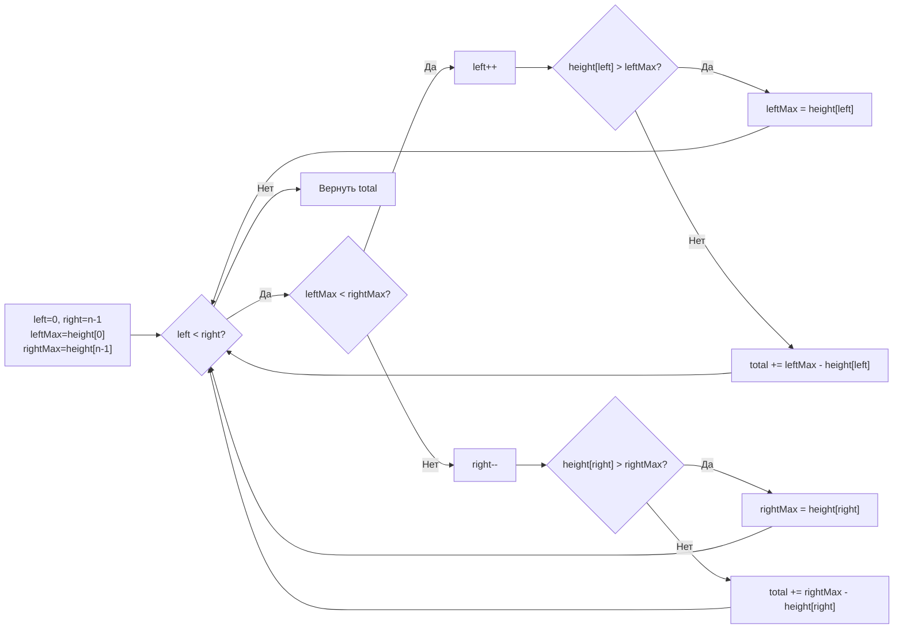

**LeetCode 42. Trapping Rain Water.** Дан массив `height` неотрицательных целых чисел, представляющих высоту столбцов гистограммы. Требуется вычислить, сколько воды может задержаться между столбцами после дождя. Каждый блок воды над отдельным столбцом ограничен сверху минимумом из высочайших столбцов слева и справа от него, а снизу — самим столбцом.

Эта задача — одна из визитных карточек сложного алгоритмического интервью. Она не решается «в лоб» применением знакомого паттерна, но раскрывается через геометрический инсайт: вода над каждым столбцом определяется двумя границами — левым и правым максимумами. Истинная глубина задачи открывается, когда вы демонстрируете эволюцию от наивного O(N²) через предподсчёт за O(N) к эталонному решению с двумя указателями и O(1) памяти, попутно объясняя инварианты и влияние на кэш процессора.

### Формулировка и уточнения

**Условие:** функция `trap(height []int) int` возвращает суммарный объём задержанной воды.
- Длина `n` может быть от 0 до 2×10⁴, значения высот от 0 до 10⁵.
- Вода не может выливаться за границы массива (столбцы по краям не удерживают воду сверху, но служат стенками).

**Вопросы интервьюеру (Senior-стиль):**
- *Может ли массив быть пустым?* Да, `n = 0` → 0 воды.
- *Все ли элементы неотрицательные?* Да, высоты ≥ 0.
- *Что с водой у краёв?* Крайние столбцы не удерживают воду, они лишь ограничивают её.
- *Можно ли изменять входной слайс?* Мы не модифицируем его.
- *Какая точность?* Только целые числа, объём всегда целый.

### Наивное решение: для каждого столбца искать максимумы слева и справа

Для каждого индекса `i` находим максимальный столбец слева (`maxLeft`) и справа (`maxRight`). Уровень воды над `i` равен `max(0, min(maxLeft, maxRight) - height[i])`. Поиск максимумов пробегает по всему массиву за O(N) для каждого `i`, что даёт O(N²) времени. При N=2×10⁴ это 4×10⁸ операций, что может быть близко к TLE или неприемлемо на собеседовании. Нам нужно оптимизировать поиск этих максимумов.

```go
func trapNaive(height []int) int {
    n := len(height)
    total := 0
    for i := 0; i < n; i++ {
        maxLeft, maxRight := 0, 0
        for j := 0; j <= i; j++ {
            if height[j] > maxLeft {
                maxLeft = height[j]
            }
        }
        for j := i; j < n; j++ {
            if height[j] > maxRight {
                maxRight = height[j]
            }
        }
        if min(maxLeft, maxRight) > height[i] {
            total += min(maxLeft, maxRight) - height[i]
        }
    }
    return total
}
```

Узкое место — повторные вычисления `maxLeft` и `maxRight` для соседних индексов. Мы можем предподсчитать их за O(N).

### Решение с предподсчётом: динамическое программирование по максимумам

Построим два слайса: `leftMax[i]` — максимальная высота от 0 до `i`, `rightMax[i]` — от `i` до `n-1`. Тогда для каждого `i` вода вычисляется за O(1), общая сложность O(N) времени и O(N) памяти.

```go
func trapDP(height []int) int {
    n := len(height)
    if n == 0 {
        return 0
    }
    leftMax := make([]int, n)
    rightMax := make([]int, n)

    leftMax[0] = height[0]
    for i := 1; i < n; i++ {
        leftMax[i] = max(leftMax[i-1], height[i])
    }
    rightMax[n-1] = height[n-1]
    for i := n - 2; i >= 0; i-- {
        rightMax[i] = max(rightMax[i+1], height[i])
    }

    total := 0
    for i := 0; i < n; i++ {
        water := min(leftMax[i], rightMax[i]) - height[i]
        if water > 0 {
            total += water
        }
    }
    return total
}
```

Это решение уже достойно уровня Middle, но Senior понимает, что от O(N) памяти можно избавиться.

### Оптимальное решение: два указателя с O(1) памяти

**Идея.** Вместо предподсчёта всех максимумов, мы идём двумя указателями `left` и `right` с краёв к центру, поддерживая текущие максимумы `leftMax` и `rightMax`. Если `leftMax < rightMax`, то уровень воды на позиции `left` гарантированно ограничен `leftMax`, потому что где-то справа есть столбец не ниже `rightMax` (который выше `leftMax`). Аналогично для правого указателя. Таким образом, мы обрабатываем каждый столбец ровно один раз и не храним слайсы.

**Инвариант цикла:** Для любого `i < left` вода уже подсчитана корректно (её уровень определялся известным `leftMax` или `rightMax`). Для `i > right` аналогично. Текущие `leftMax` и `rightMax` представляют максимумы на отрезках `[0, left]` и `[right, n-1]` соответственно.

```go
func trap(height []int) int {
    if len(height) == 0 {
        return 0
    }
    left, right := 0, len(height)-1
    leftMax, rightMax := height[left], height[right]
    total := 0

    for left < right {
        if leftMax < rightMax {
            left++
            if height[left] > leftMax {
                leftMax = height[left]
            } else {
                total += leftMax - height[left]
            }
        } else {
            right--
            if height[right] > rightMax {
                rightMax = height[right]
            } else {
                total += rightMax - height[right]
            }
        }
    }
    return total
}
```

**Go-идиомы:**
- Имена `left`, `right`, `leftMax`, `rightMax` чётки.
- Проверка `len(height) == 0` — ранний возврат.
- Ветвление `if leftMax < rightMax` убирает вложенность, оставляя линейную логику.
- Цикл `for left < right` выполняется N раз, внутри — простые сравнения и сложения.



### Почему это работает: геометрический инвариант

Ключевое прозрение: чтобы понять, сколько воды удерживается над столбцом `i`, не обязательно знать оба максимума одновременно. Достаточно знать, что с одной из сторон гарантированно существует столб не ниже текущего известного максимума.

Если `leftMax < rightMax`, то для позиции `left` правая граница не ниже `rightMax`, следовательно, не ниже `leftMax`. Уровень воды над `left` определяется именно `leftMax`. Более того, даже если между `left` и `right` есть более высокие столбцы, они не изменят этого факта — `leftMax` по-прежнему будет лимитировать воду на текущем левом указателе. Аналогично для правого. Доказательство через exchange argument, но Senior на собеседовании может просто нарисовать график и показать пальцами.

### Edge Cases

- **Пустой массив:** `len(height) == 0` → 0.
- **Один или два столбца:** физически не могут удержать воду между собой, если только нет третьего, образующего впадину. Для `[1, 0]` вода невозможна, так как справа нет стенки, `leftMax=1, rightMax=0`, цикл быстро завершится, total=0. На самом деле? Проверим: `left=0, right=1`, leftMax=1, rightMax=0, условие `leftMax < rightMax` ложно, идём в else, right--, right становится 0, rightMax обновляется? сразу после декремента `right` становится 0, `height[0]=1`, `rightMax` становится 1. Потом `left < right` (0<0) — ложь, выход. total=0. Корректно.
- **Все столбцы одинаковые:** вода не задерживается (поверхность ровная). Все `leftMax == rightMax`, сдвиг происходит, но `height[left] == leftMax`, так что ничего не добавляется.
- **Строго возрастающий массив:** вода = 0. Всегда `leftMax` обновляется, не добавляя воды.
- **Строго убывающий:** аналогично, вода = 0.
- **Гора:** `[0,1,0,2,1,0,1,3,2,1,2,1]` — классический пример, ответ 6.

> [!warning] Ловушка / Gotcha
> Указатели `left` и `right` должны сначала сдвигаться, а потом обновляться `leftMax`/`rightMax`. Если сделать наоборот (сначала обновить, потом сдвинуть), можно учесть текущий столбец дважды или неправильно ограничить воду. Порядок в коде выверен: сдвинули указатель → проверили/добавили → обновили максимум если нужно.

### Анализ сложности

- **Время:** O(N). Указатели `left` и `right` сходятся, каждый сдвигается не более N раз. Тело цикла выполняет O(1) операций.
- **Память:** O(1). Четыре целочисленные переменные (`left`, `right`, `leftMax`, `rightMax`, `total`). Никаких дополнительных слайсов или map.

### Mechanical Sympathy: как двухуказательное решение дружит с железом

- **Доступ к памяти:** `height[left]` и `height[right]` читаются последовательно с двух концов. Аппаратный prefetcher хорошо предсказывает оба потока. Кэш-промахи минимальны, особенно если массив помещается в L2/L3.
- **Отсутствие аллокаций:** В отличие от DP-решения, где выделяются два слайса размером N, это решение живёт исключительно на стеке. Никакого давления на GC.
- **Простота цикла:** Внутри цикла — два условия, пара сложений/сравнений. Branch predictor может ошибаться на чередующихся условиях, но типичный случай (одно из направлений преобладает) предсказывается хорошо.
- **Никаких указателей и map:** Доступ к элементам — прямая адресация по индексу, без pointer chasing.

> [!info] Под капотом
> DP-решение требует O(2N) дополнительной памяти = 16 байт на элемент * 2 * 10^5 = примерно 3.2 МБ на слайсы int. Хотя укладывается в лимиты, это создаёт работу для GC и вытесняет данные из кэша. Решение с двумя указателями полностью лишено этих проблем и может работать с массивами, не вмещающимися в кэш, но всё равно быстро за счёт линейного чтения.

### Альтернативные подходы и их место

- **Монотонный стек:** Альтернативное решение за O(N) с O(N) памяти. Проходим слева направо, если текущая высота больше высоты на вершине стека, извлекаем элементы и считаем воду слоями. Полезно продемонстрировать знание монотонного стека, но двухуказательное решение выигрывает по памяти.
- **Префиксные максимумы (DP):** Хороши как подготовка, но не являются конечной целью.
- **Градиентный спуск?** Не применимо.

> [!tip] Собеседование
> Спросите себя: «Какое решение вы бы выбрали для встроенной системы с 1 МБ памяти?» Ответ, очевидно, двухуказательное. Senior всегда готов обосновать выбор памятью и кэш-локальностью.

### Итог

Trapping Rain Water — это элегантная демонстрация того, как геометрический инсайт и два указателя превращают квадратичное решение в линейное с константной памятью. В Go оно пишется в несколько строк, не требует аллокаций и предельно дружественно кэшу. Для Senior-разработчика это также повод поговорить об инвариантах, механической симпатии и сравнении с DP-подходом.

Следующая задача — **Merge K Sorted Lists** — сменит жанр с массивов на связные списки и покажет, как куча и попарное слияние решают задачу, в которой скользящее окно бессильно. [[4. Merge K Sorted Lists]]